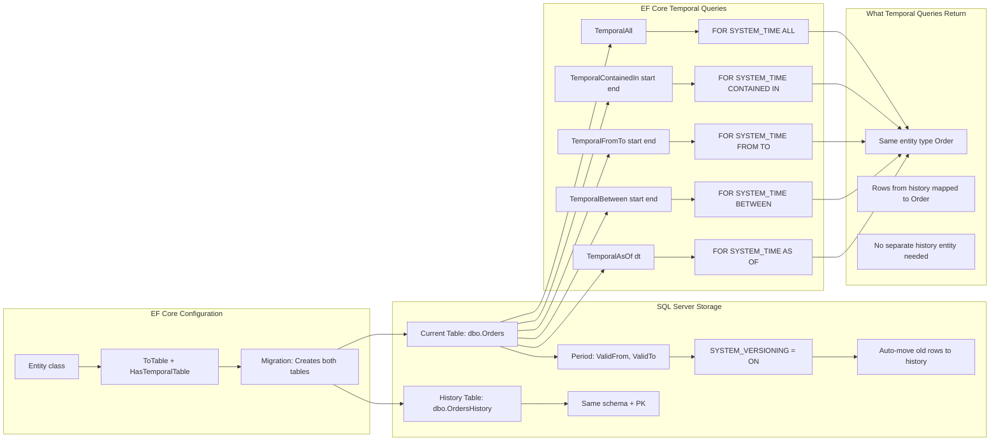
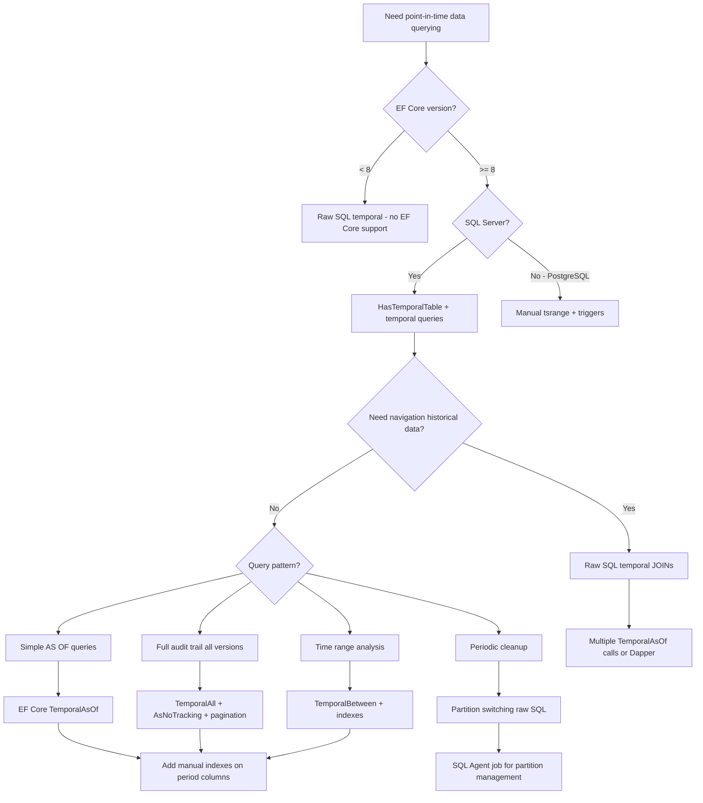

## Navigation

**Domain:** [[8 — Databases]] > **Group:** SQL Temporal Tables & Point-in-Time
**Previous:** [[8.240 — Temporal Tables — System-Versioning Basics]] | **Next:** [[8.242 — History Table Partitioning — Managing Growth]]

### Prerequisites
- [[8.240 — Temporal Tables — System-Versioning Basics]] — Required to understand the underlying SQL Server SYSTEM_VERSIONING mechanism that EF Core abstracts with HasTemporalTable().
- [[3.901 — EF Core Advanced Query Filters]] — Temporal queries in EF Core use dedicated methods (TemporalAsOf, TemporalBetween) that operate similarly to query filters but with different SQL generation patterns.

### Where This Fits

EF Core 8+ introduced fluent API support for temporal tables via `ToTable(tb => tb.HasTemporalTable())`, allowing .NET developers to configure temporal tables through the EF Core migration pipeline without writing raw SQL. A .NET backend engineer encounters this when building audit-trail or point-in-time querying features — the abstraction hides the history table creation, period column management, and temporal query SQL generation. The interview signal is whether a candidate understands that temporal queries return the same entity type (history rows map to the same .NET class as current rows), knows the SQL each temporal method generates, recognizes when EF Core's LIMitations require raw SQL fallback, and can reason about the performance implications of temporal queries generated by EF Core versus hand-written T-SQL.

---

## Core Mental Model

EF Core 8+ maps temporal tables by adding `HasTemporalTable()` to the `ToTable()` configuration. This tells EF Core that the mapped table has SYSTEM_VERSIONING enabled with period columns (ValidFrom, ValidTo). EF Core then generates a migration that creates both the current table and the history table, configures the period columns, and enables SYSTEM_VERSIONING. At query time, EF Core provides dedicated temporal query methods — `TemporalAsOf()`, `TemporalBetween()`, `TemporalFromTo()`, `TemporalContainedIn()`, `TemporalAll()` — that append `FOR SYSTEM_TIME` clauses to the generated SQL. The critical invariant: temporal queries return the **same entity type** as regular queries. A history row is not a different .NET type — it is the same entity mapped from the history table. This means the same property mapping, the same navigation properties, and the same validation logic apply to both current and historical data. The recognition pattern for temporal tables in EF Core: the migration shows `PERIOD FOR SYSTEM_TIME`, `WITH (SYSTEM_VERSIONING = ON)`, and a separate history table; the LINQ queries use `.TemporalAsOf()` or similar; the generated SQL includes `FOR SYSTEM_TIME AS OF`.

### Classification

- **SQL Server feature:** System-versioned temporal tables with FOR SYSTEM_TIME clause
- **EF Core coverage:** `HasTemporalTable()` — table configuration; temporal query methods — query modification
- **Temporal query SQL generated:** `FOR SYSTEM_TIME AS OF @dt`, `FOR SYSTEM_TIME BETWEEN @start AND @end`, `FOR SYSTEM_TIME FROM @start TO @end`, `FOR SYSTEM_TIME CONTAINED IN (@start, @end)`, `FOR SYSTEM_TIME ALL`
- **History table:** Created by EF Core migration — named `[TableName]History` by default, configurable via `HasTemporalTable(tb => tb.UseHistoryTableName("OrdersAudit"))`
- **Period columns:** `ValidFrom` (datetime2, not nullable) and `ValidTo` (datetime2, not nullable) — default names, configurable



### Key Properties

|Property|Value|Notes|
|---|---|---|
|EF Core version required|8+|HasTemporalTable() available in EF Core 8+, SQL Server provider|
|Temporal query methods|TemporalAsOf, TemporalBetween, TemporalFromTo, TemporalContainedIn, TemporalAll|All map to FOR SYSTEM_TIME variants|
|Return type|Same entity as base query|No separate history entity — same .NET type|
|History table name|Default: `[TableName]History`|Configurable via UseHistoryTableName()|
|Period column names|Default: ValidFrom, ValidTo|Configurable via UsePeriodStartColumn/UsePeriodEndColumn|
|Migration support|Full — creates both tables, enables versioning|Schema changes while versioning ON require specific handling|
|Owned entity support|Temporal with OwnsOne works|OwnsMany temporal has LIMitations|
|Inheritance support|TPH temporal works|TPT temporal has SQL Server LIMitations|

---

## Deep Mechanics

### How EF Core Executes Temporal Table Support

**Configuration and Migration:**

1. **OnModelCreating:** The developer calls `ToTable(tb => tb.HasTemporalTable())` on an entity. EF Core records that this entity has temporal table support. The period column names are set to defaults (ValidFrom, ValidTo) or custom values if configured via `UsePeriodStartColumn()` / `UsePeriodEndColumn()`.

2. **Migration generation:** When `dotnet ef migrations add` runs, EF Core generates a migration that:
   - Creates the current table with the period columns (datetime2, not nullable) and a `PERIOD FOR SYSTEM_TIME` definition
   - Creates the history table with the same schema (excluding the PERIOD definition) and a clustered index on the period columns
   - Enables `SYSTEM_VERSIONING` by executing `ALTER TABLE [Current] SET (SYSTEM_VERSIONING = ON (HISTORY_TABLE = [History]))`

3. **Migration history:** EF Core's `__EFMigrationsHistory` table records the temporal configuration — subsequent migrations that alter the current table schema also alter the history table schema and handle the versioning ON/OFF toggle as needed.

**Temporal Query Execution:**

1. **TemporalAsOf(DateTime pointInTime):** Generates `SELECT ... FROM [Table] FOR SYSTEM_TIME AS OF @p0 WHERE ...`. SQL Server returns rows that were active at the specified point in time — the row where the point-in-time falls between ValidFrom and ValidTo. EF Core maps the result rows to the entity type.

2. **TemporalBetween(DateTime start, DateTime end):** Generates `SELECT ... FROM [Table] FOR SYSTEM_TIME BETWEEN @p0 AND @p1 WHERE ...`. Returns all row versions that became active before or at `end` and were active before `start` — i.e., any row version that was active during any part of the interval (inclusive of boundary values).

3. **TemporalFromTo(DateTime start, DateTime end):** Generates `SELECT ... FROM [Table] FOR SYSTEM_TIME FROM @p0 TO @p1 WHERE ...`. Returns all row versions that became active before the end time and were superseded after the start time — similar to BETWEEN but exclusive of the end boundary.

4. **TemporalContainedIn(DateTime start, DateTime end):** Generates `SELECT ... FROM [Table] FOR SYSTEM_TIME CONTAINED IN (@p0, @p1) WHERE ...`. Returns only row versions that were entirely contained within the specified interval — ValidFrom >= start AND ValidTo <= end.

5. **TemporalAll():** Generates `SELECT ... FROM [Table] FOR SYSTEM_TIME ALL WHERE ...`. Returns all rows from both the current and history tables — every version of every row that has ever existed.

**Entity Mapping from History Rows:**

The critical detail: EF Core maps history table rows to the **same entity type**. A history row has the same columns as a current row (same schema). EF Core reads the period columns (ValidFrom, ValidTo) but does not map them to entity properties by default — they are shadow properties unless explicitly mapped. If the entity has a Timestamp or RowVersion column, history rows have the value from when the row was current — they are not updated by the system-versioning process.

**Change Tracking Behavior:**

When a temporal query returns entities, those entities are tracked by the change tracker as regular entities. If the developer modifies and saves an entity retrieved via TemporalAsOf(), the UPDATE goes to the **current table**, not the history table. The temporal query is read-only from the modification perspective — modifying returned entities and calling SaveChanges() updates the current version, not the historical version.

### SQL Visibility

```sql
-- ============================================================
-- Schema generated by EF Core 8+ temporal table migration
-- ============================================================

-- Current table (created by EF Core migration):
CREATE TABLE dbo.Orders (
    Id INT NOT NULL IDENTITY(1,1),
    CustomerId INT NOT NULL,
    OrderDate DATETIME2 NOT NULL,
    Status NVARCHAR(20) NOT NULL,
    TotalAmount DECIMAL(18,2) NOT NULL,
    ValidFrom DATETIME2 GENERATED ALWAYS AS ROW START NOT NULL,
    ValidTo DATETIME2 GENERATED ALWAYS AS ROW END NOT NULL,
    CONSTRAINT PK_Orders PRIMARY KEY (Id),
    PERIOD FOR SYSTEM_TIME (ValidFrom, ValidTo)
) WITH (SYSTEM_VERSIONING = ON (HISTORY_TABLE = dbo.OrdersHistory));

-- History table (created and managed by EF Core migration):
CREATE TABLE dbo.OrdersHistory (
    Id INT NOT NULL,
    CustomerId INT NOT NULL,
    OrderDate DATETIME2 NOT NULL,
    Status NVARCHAR(20) NOT NULL,
    TotalAmount DECIMAL(18,2) NOT NULL,
    ValidFrom DATETIME2 NOT NULL,
    ValidTo DATETIME2 NOT NULL,
    CONSTRAINT PK_OrdersHistory PRIMARY KEY (Id, ValidFrom)
);

-- EF Core temporal queries generate these SQL patterns:

-- TemporalAsOf('2024-06-01'):
-- SQL generated:
SELECT [o].[Id], [o].[CustomerId], [o].[OrderDate], [o].[Status], [o].[TotalAmount],
       [o].[ValidFrom], [o].[ValidTo]
FROM [Orders] FOR SYSTEM_TIME AS OF @p0 AS [o]
WHERE [o].[CustomerId] = @p1
ORDER BY [o].[Id];

-- TemporalBetween('2024-01-01', '2024-06-01'):
-- SQL generated:
SELECT [o].[Id], [o].[CustomerId], [o].[OrderDate], [o].[Status], [o].[TotalAmount],
       [o].[ValidFrom], [o].[ValidTo]
FROM [Orders] FOR SYSTEM_TIME BETWEEN @p0 AND @p1 AS [o]
ORDER BY [o].[Id];

-- TemporalAll():
-- SQL generated:
SELECT [o].[Id], [o].[CustomerId], [o].[OrderDate], [o].[Status], [o].[TotalAmount],
       [o].[ValidFrom], [o].[ValidTo]
FROM [Orders] FOR SYSTEM_TIME ALL AS [o]
ORDER BY [o].[Id];
```

```csharp
// ============================================================
// EF Core 8+ Temporal Table Configuration
// ============================================================

public class Order
{
    public int Id { get; set; }
    public int CustomerId { get; set; }
    public DateTime OrderDate { get; set; }
    public string Status { get; set; } = string.Empty;
    public decimal TotalAmount { get; set; }
    // Period columns are shadow properties unless explicitly mapped
    public DateTime ValidFrom { get; set; }  // Period start (if mapped)
    public DateTime ValidTo { get; set; }    // Period end (if mapped)
    public Customer Customer { get; set; } = null!;
    public List<OrderItem> OrderItems { get; set; } = new();
}

public class Customer
{
    public int Id { get; set; }
    public string Name { get; set; } = string.Empty;
    public string Email { get; set; } = string.Empty;
    public List<Order> Orders { get; set; } = new();
}

public class OrderItem
{
    public int Id { get; set; }
    public int OrderId { get; set; }
    public int ProductId { get; set; }
    public int Quantity { get; set; }
    public decimal UnitPrice { get; set; }
    public Order Order { get; set; } = null!;
}

public class ApplicationDbContext : DbContext
{
    public DbSet<Order> Orders => Set<Order>();
    public DbSet<Customer> Customers => Set<Customer>();
    public DbSet<OrderItem> OrderItems => Set<OrderItem>();

    protected override void OnModelCreating(ModelBuilder modelBuilder)
    {
        modelBuilder.Entity<Order>(entity =>
        {
            entity.ToTable(tb => tb.HasTemporalTable());
            // Default: history table = OrdersHistory, period columns = ValidFrom/ValidTo
            entity.HasKey(o => o.Id);
            entity.Property(o => o.Status).HasMaxLength(20).IsRequired();
            entity.Property(o => o.TotalAmount).HasPrecision(18, 2);

            // Optionally map period columns to entity properties
            entity.Property(o => o.ValidFrom).HasColumnName("ValidFrom");
            entity.Property(o => o.ValidTo).HasColumnName("ValidTo");
        });

        modelBuilder.Entity<Customer>(entity =>
        {
            entity.ToTable("Customers");
            entity.HasKey(c => c.Id);
            entity.Property(c => c.Name).HasMaxLength(100).IsRequired();
            entity.Property(c => c.Email).HasMaxLength(200);
            entity.HasMany(c => c.Orders).WithOne(o => o.Customer)
                .HasForeignKey(o => o.CustomerId);
        });

        modelBuilder.Entity<OrderItem>(entity =>
        {
            entity.ToTable("OrderItems");
            entity.HasKey(oi => oi.Id);
            entity.HasOne(oi => oi.Order).WithMany(o => o.OrderItems)
                .HasForeignKey(oi => oi.OrderId);
        });
    }
}
```

**Generated SQL from EF Core Logs:**

```sql
-- Migration: Creating temporal tables
-- EF Core generated migration SQL (simplified):

-- 1. Create current table
IF NOT EXISTS (SELECT * FROM sys.tables WHERE name = 'Orders')
BEGIN
    CREATE TABLE [Orders] (
        [Id] int NOT NULL IDENTITY,
        [CustomerId] int NOT NULL,
        [OrderDate] datetime2 NOT NULL,
        [Status] nvarchar(20) NOT NULL,
        [TotalAmount] decimal(18,2) NOT NULL,
        [ValidFrom] datetime2 GENERATED ALWAYS AS ROW START NOT NULL,
        [ValidTo] datetime2 GENERATED ALWAYS AS ROW END NOT NULL,
        CONSTRAINT [PK_Orders] PRIMARY KEY ([Id]),
        PERIOD FOR SYSTEM_TIME([ValidFrom], [ValidTo])
    ) WITH (SYSTEM_VERSIONING = ON (HISTORY_TABLE = [dbo].[OrdersHistory]));
END
```

### Execution Plan Analysis

**TemporalAsOf query (seek on CustomerId with temporal filter):**

```sql
SELECT [o].[Id], [o].[CustomerId], [o].[OrderDate], [o].[Status],
       [o].[TotalAmount], [o].[ValidFrom], [o].[ValidTo]
FROM [Orders] FOR SYSTEM_TIME AS OF @p0 AS [o]
WHERE [o].[CustomerId] = @p1;
```

```
Expected plan shape:
[Index Seek (IX_Orders_CustomerId)] → [Filter (ValidFrom <= @p0 AND ValidTo > @p0)] → [SELECT]
Estimated Cost: Index Seek ~30%, Filter (residual) ~10%, SELECT ~60%
Logical Reads: ~4 (seek on CustomerId) + ~2 (per matching row for period check)
```

**Without non-clustered index on CustomerId:**

```
[Clustered Index Scan] → [Filter (CustomerId = @p1 AND ValidFrom <= @p0 AND ValidTo > @p0)] → [SELECT]
Logical Reads: ~42,300 (full table scan) — catastrophic for large tables
```

**TemporalAll() with no WHERE:**

```
[Clustered Index Scan (Current Table)] → [Concatenation] ← [Clustered Index Scan (History Table)]
→ [SELECT]
Logical Reads: ~42,300 (current) + ~84,600 (history if same size) = ~126,900
```

The Concatenation operator combines rows from both tables. Without a WHERE clause, both tables are fully scanned.

**TemporalBetween('2024-01-01', '2024-06-01') with seek predicate:**

```
If index on (CustomerId, ValidFrom, ValidTo):
[Index Seek (CustomerId = @p1 AND ValidFrom <= @p1 AND ValidTo > @p0)]
→ [Key Lookup] → [SELECT]

If index on CustomerId only:
[Index Seek (CustomerId = @p1)] → [Filter (period overlap)] → [Key Lookup] → [SELECT]
```

### Cost Visibility

```sql
SET STATISTICS IO ON;
SET STATISTICS TIME ON;

-- TemporalAsOf with good index:
SELECT [o].[Id], [o].[CustomerId], [o].[OrderDate], [o].[Status], [o].[TotalAmount]
FROM [Orders] FOR SYSTEM_TIME AS OF '2024-06-01' AS [o]
WHERE [o].[CustomerId] = 42;

-- Expected output (with IX_Orders_CustomerId):
-- Table 'Orders'. Scan count 1, logical reads 4, physical reads 0
-- SQL Server Execution Times: CPU time = 0ms, elapsed time = 1ms

-- TemporalAll without filter:
SELECT [o].[Id], [o].[CustomerId], [o].[OrderDate], [o].[Status], [o].[TotalAmount]
FROM [Orders] FOR SYSTEM_TIME ALL AS [o];

-- Expected output (1M current rows, 3M history rows):
-- Table 'Orders'. Scan count 1, logical reads 42,300
-- Table 'OrdersHistory'. Scan count 1, logical reads 126,900
-- SQL Server Execution Times: CPU time = 312ms, elapsed time = 450ms

-- TemporalBetween without index on period columns:
SELECT [o].[Id], [o].[CustomerId], [o].[OrderDate]
FROM [Orders] FOR SYSTEM_TIME BETWEEN '2024-01-01' AND '2024-06-01' AS [o]
WHERE [o].[CustomerId] = 42;

-- Expected output (full scan because no index on ValidFrom/ValidTo):
-- Table 'Orders'. Scan count 1, logical reads 42,300
-- Table 'OrdersHistory'. Scan count 1, logical reads 126,900
-- SQL Server Execution Times: CPU time = 1,200ms, elapsed time = 1,450ms
```

### Failure Modes

**Shadow period column mismatch:** If the entity properties ValidFrom/ValidTo have incompatible types (e.g., DateTime instead of DateTime2 with 7-digit precision), EF Core generates errors during migration or query. The period columns in SQL Server temporal tables use datetime2 with 7-digit fractional precision (100-nanosecond resolution). Mapping them to DateTime in .NET causes precision loss and potential round-trip comparison issues.

**Navigation property access on temporal entities:** If an entity retrieved via TemporalAsOf() has navigation properties (e.g., `Order.Customer`), EF Core loads the related entity from the current tables, not from their historical state. The customer data returned is the **current** customer, not the customer as they existed at the temporal query's point in time. This is a silent data inconsistency.

**SaveChanges after temporal query:** Modifying an entity returned by TemporalAsOf() and calling SaveChanges() updates the row in the current table (if the row is still current) or inserts a new version (if the row was already updated). The temporal query result was read-only in intent, but EF Core does not prevent modifications. The developer must explicitly use AsNoTracking() or configure the query as read-only.

**History table name collision:** If multiple entities use the same history table name (e.g., two tables both named `Orders` in different schemas with default history names), EF Core migration fails with a naming collision. Always specify explicit history table names via `UseHistoryTableName()`.

**EF Core 8 temporal with owned entities:** OwnsOne with temporal works, but OwnsMany (collection of owned entities) has LIMitations — the owned collection is stored as a JSON column or separate table, and temporal versioning of the collection is not automatic. Each owned entity would need its own temporal table configuration.

---

## Production Patterns and Implementation

### Primary SQL Implementation

```sql
-- ============================================================
-- Production temporal table pattern with customization
-- ============================================================

-- Customized temporal table (not EF Core generated — hand-optimized):
CREATE TABLE dbo.Orders (
    Id INT NOT NULL IDENTITY(1,1),
    CustomerId INT NOT NULL,
    OrderDate DATETIME2 NOT NULL,
    Status NVARCHAR(20) NOT NULL,
    TotalAmount DECIMAL(18,2) NOT NULL,
    SysStartTime DATETIME2 GENERATED ALWAYS AS ROW START NOT NULL,
    SysEndTime DATETIME2 GENERATED ALWAYS AS ROW END NOT NULL,
    CONSTRAINT PK_Orders PRIMARY KEY (Id),
    PERIOD FOR SYSTEM_TIME (SysStartTime, SysEndTime)
) WITH (SYSTEM_VERSIONING = ON (HISTORY_TABLE = dbo.OrdersAudit));

-- History table (created by SQL Server — same schema):
-- TABLE dbo.OrdersAudit (
--     Id INT NOT NULL,
--     CustomerId INT NOT NULL,
--     OrderDate DATETIME2 NOT NULL,
--     Status NVARCHAR(20) NOT NULL,
--     TotalAmount DECIMAL(18,2) NOT NULL,
--     SysStartTime DATETIME2 NOT NULL,
--     SysEndTime DATETIME2 NOT NULL,
--     CONSTRAINT PK_OrdersAudit PRIMARY KEY (Id, SysEndTime)
-- );

-- Indexes for temporal query performance:
CREATE INDEX IX_Orders_CustomerId ON dbo.Orders (CustomerId);
CREATE INDEX IX_OrdersAudit_CustomerId_SysEndTime
    ON dbo.OrdersAudit (CustomerId, SysEndTime DESC)
    INCLUDE (Status, TotalAmount, OrderDate);

-- Temporal query patterns:

-- 1. AS OF — what did the table look like at a specific time?
SELECT o.Id, o.CustomerId, o.OrderDate, o.Status, o.TotalAmount
FROM dbo.Orders FOR SYSTEM_TIME AS OF '2024-06-01 12:00:00' o
WHERE o.CustomerId = 42;

-- 2. BETWEEN — all versions active in a time window
SELECT o.Id, o.CustomerId, o.Status, o.SysStartTime, o.SysEndTime
FROM dbo.Orders FOR SYSTEM_TIME BETWEEN '2024-01-01' AND '2024-06-01' o
WHERE o.CustomerId = 42
ORDER BY o.SysStartTime DESC;

-- 3. FROM TO — exclusive end boundary
SELECT o.Id, o.CustomerId, o.Status, o.SysStartTime, o.SysEndTime
FROM dbo.Orders FOR SYSTEM_TIME FROM '2024-01-01' TO '2024-06-01' o
WHERE o.CustomerId = 42;

-- 4. CONTAINED IN — only rows that existed entirely within the window
SELECT o.Id, o.CustomerId, o.Status, o.SysStartTime, o.SysEndTime
FROM dbo.Orders FOR SYSTEM_TIME CONTAINED IN ('2024-01-01', '2024-06-01') o
WHERE o.CustomerId = 42;

-- 5. ALL — every version ever
SELECT o.Id, o.CustomerId, o.Status, o.SysStartTime, o.SysEndTime
FROM dbo.Orders FOR SYSTEM_TIME ALL o
WHERE o.CustomerId = 42
ORDER BY o.SysStartTime DESC;
```

### EF Core Implementation

```csharp
// ============================================================
// Full EF Core 8+ Temporal Table Implementation
// ============================================================

// Entity with mapped period columns
public class Order
{
    public int Id { get; set; }
    public int CustomerId { get; set; }
    public DateTime OrderDate { get; set; }
    public string Status { get; set; } = string.Empty;
    public decimal TotalAmount { get; set; }
    public DateTime PeriodStart { get; set; }
    public DateTime PeriodEnd { get; set; }
    public Customer Customer { get; set; } = null!;
    public List<OrderItem> OrderItems { get; set; } = new();
}

public class Customer
{
    public int Id { get; set; }
    public string Name { get; set; } = string.Empty;
    public string Email { get; set; } = string.Empty;
    public List<Order> Orders { get; set; } = new();
}

public class OrderItem
{
    public int Id { get; set; }
    public int OrderId { get; set; }
    public int ProductId { get; set; }
    public int Quantity { get; set; }
    public decimal UnitPrice { get; set; }
    public Order Order { get; set; } = null!;
}

public class ApplicationDbContext : DbContext
{
    public DbSet<Order> Orders => Set<Order>();
    public DbSet<Customer> Customers => Set<Customer>();
    public DbSet<OrderItem> OrderItems => Set<OrderItem>();

    protected override void OnModelCreating(ModelBuilder modelBuilder)
    {
        modelBuilder.Entity<Order>(entity =>
        {
            entity.ToTable(tb => tb.HasTemporalTable(temporal =>
            {
                temporal.UseHistoryTableName("OrdersAudit");
                temporal.UsePeriodStartColumn("PeriodStart");
                temporal.UsePeriodEndColumn("PeriodEnd");
            }));

            entity.HasKey(o => o.Id);
            entity.Property(o => o.Status).HasMaxLength(20).IsRequired();
            entity.Property(o => o.TotalAmount).HasPrecision(18, 2);

            // Map period columns to entity properties
            entity.Property(o => o.PeriodStart).HasColumnName("PeriodStart");
            entity.Property(o => o.PeriodEnd).HasColumnName("PeriodEnd");

            // Index for temporal queries
            entity.HasIndex(o => o.CustomerId)
                .HasDatabaseName("IX_Orders_CustomerId");
        });

        modelBuilder.Entity<Customer>(entity =>
        {
            entity.ToTable("Customers");
            entity.HasKey(c => c.Id);
            entity.Property(c => c.Name).HasMaxLength(100).IsRequired();
            entity.HasMany(c => c.Orders).WithOne(o => o.Customer)
                .HasForeignKey(o => o.CustomerId);
        });

        modelBuilder.Entity<OrderItem>(entity =>
        {
            entity.ToTable("OrderItems");
            entity.HasKey(oi => oi.Id);
            entity.HasOne(oi => oi.Order).WithMany(o => o.OrderItems)
                .HasForeignKey(oi => oi.OrderId);
        });
    }
}

// ============================================================
// Temporal Query Service — Production Patterns
// ============================================================

public class TemporalOrderService
{
    private readonly ApplicationDbContext _dbContext;

    public TemporalOrderService(ApplicationDbContext dbContext)
        => _dbContext = dbContext;

    // 1. AS OF — get order state at a specific point in time
    public async Task<Order?> GetOrderAsOfAsync(
        int orderId,
        DateTime pointInTime,
        CancellationToken cancellationToken = default)
    {
        return await _dbContext.Orders
            .TemporalAsOf(pointInTime)
            .Where(o => o.Id == orderId)
            .AsNoTracking()
            .FirstOrDefaultAsync(cancellationToken);
        -- SQL: SELECT ... FROM [Orders] FOR SYSTEM_TIME AS OF @p0 WHERE [Id] = @p1
    }

    // 2. BETWEEN — all versions of an order in a time range
    public async Task<List<Order>> GetOrderVersionsAsync(
        int orderId,
        DateTime from,
        DateTime to,
        CancellationToken cancellationToken = default)
    {
        return await _dbContext.Orders
            .TemporalBetween(from, to)
            .Where(o => o.Id == orderId)
            .OrderByDescending(o => o.PeriodEnd)
            .AsNoTracking()
            .ToListAsync(cancellationToken);
        -- SQL: SELECT ... FROM [Orders] FOR SYSTEM_TIME BETWEEN @p0 AND @p1 WHERE [Id] = @p2
    }

    // 3. Get current state with JOINs (navigation properties are current, not historical!)
    public async Task<List<Order>> GetCustomerOrdersAsOfAsync(
        int customerId,
        DateTime pointInTime,
        CancellationToken cancellationToken = default)
    {
        return await _dbContext.Orders
            .TemporalAsOf(pointInTime)
            .Where(o => o.CustomerId == customerId)
            .Include(o => o.Customer)    // LOADS CURRENT CUSTOMER, not historical!
            .Include(o => o.OrderItems)  // LOADS CURRENT ORDER ITEMS, not historical!
            .AsNoTracking()
            .ToListAsync(cancellationToken);
    }

    // 4. TemporalAll — full audit trail with pagination
    public async Task<PagedResult<Order>> GetOrderAuditTrailAsync(
        int orderId,
        int page,
        int pageSize,
        CancellationToken cancellationToken = default)
    {
        var query = _dbContext.Orders
            .TemporalAll()
            .Where(o => o.Id == orderId)
            .OrderByDescending(o => o.PeriodEnd);

        var totalCount = await query.CountAsync(cancellationToken);

        var items = await query
            .Skip((page - 1) * pageSize)
            .Take(pageSize)
            .AsNoTracking()
            .ToListAsync(cancellationToken);

        return new PagedResult<Order>
        {
            Items = items,
            TotalCount = totalCount,
            Page = page,
            PageSize = pageSize
        };
    }

    // 5. Read-only temporal query — AsNoTracking is critical
    public async Task<List<Order>> GetHistoricalOrdersForCustomerAsync(
        int customerId,
        CancellationToken cancellationToken = default)
    {
        return await _dbContext.Orders
            .TemporalAll()
            .Where(o => o.CustomerId == customerId
                && o.Status == "Shipped")
            .AsNoTracking()  // Prevents accidental modification of history
            .ToListAsync(cancellationToken);
    }
}

public class PagedResult<T>
{
    public List<T> Items { get; set; } = new();
    public int TotalCount { get; set; }
    public int Page { get; set; }
    public int PageSize { get; set; }
}
```

### Dapper Implementation

```csharp
// ============================================================
// Dapper Temporal Queries — Full Manual Control
// ============================================================

public sealed class TemporalOrderRepository
{
    private readonly IDbConnectionFactory _connectionFactory;

    public TemporalOrderRepository(IDbConnectionFactory connectionFactory)
        => _connectionFactory = connectionFactory;

    // AS OF — raw temporal query with Dapper
    public async Task<OrderDto?> GetOrderAsOfAsync(
        int orderId,
        DateTime pointInTime,
        CancellationToken cancellationToken = default)
    {
        const string sql = @"
            SELECT o.Id, o.CustomerId, o.OrderDate, o.Status, o.TotalAmount,
                   o.SysStartTime, o.SysEndTime
            FROM dbo.Orders FOR SYSTEM_TIME AS OF @PointInTime o
            WHERE o.Id = @OrderId;";

        await using var connection = _connectionFactory.Create();
        return await connection.QuerySingleOrDefaultAsync<OrderDto>(
            new CommandDefinition(sql,
                new { OrderId = orderId, PointInTime = pointInTime },
                cancellationToken: cancellationToken));
    }

    // All versions of a row in a time range
    public async Task<IReadOnlyList<OrderDto>> GetOrderVersionsAsync(
        int orderId,
        DateTime from,
        DateTime to,
        CancellationToken cancellationToken = default)
    {
        const string sql = @"
            SELECT o.Id, o.CustomerId, o.OrderDate, o.Status, o.TotalAmount,
                   o.SysStartTime, o.SysEndTime
            FROM dbo.Orders FOR SYSTEM_TIME BETWEEN @From AND @To o
            WHERE o.Id = @OrderId
            ORDER BY o.SysEndTime DESC;";

        await using var connection = _connectionFactory.Create();
        var results = await connection.QueryAsync<OrderDto>(
            new CommandDefinition(sql,
                new { OrderId = orderId, From = from, To = to },
                cancellationToken: cancellationToken));
        return results.AsList();
    }

    // Current + history count for an order
    public async Task<(int Current, int Historical)> GetVersionCountAsync(
        int orderId,
        CancellationToken cancellationToken = default)
    {
        const string sql = @"
            SELECT COUNT_BIG(*) as Total
            FROM dbo.Orders FOR SYSTEM_TIME ALL o
            WHERE o.Id = @OrderId;";

        await using var connection = _connectionFactory.Create();
        var total = await connection.QuerySingleAsync<long>(
            new CommandDefinition(sql,
                new { OrderId = orderId },
                cancellationToken: cancellationToken));

        // Current row count (1 if the row exists, 0 if deleted)
        const string currentSql = @"
            SELECT COUNT_BIG(*) FROM dbo.Orders WHERE Id = @OrderId;";

        var current = await connection.QuerySingleAsync<long>(
            new CommandDefinition(currentSql,
                new { OrderId = orderId },
                cancellationToken: cancellationToken));

        return ((int)current, (int)(total - current));
    }

    // Temporal BETWEEN with pagination
    public async Task<PagedResult<OrderDto>> GetAuditTrailPagedAsync(
        int orderId,
        int page,
        int pageSize,
        CancellationToken cancellationToken = default)
    {
        const string countSql = @"
            SELECT COUNT_BIG(*)
            FROM dbo.Orders FOR SYSTEM_TIME ALL o
            WHERE o.Id = @OrderId;";

        const string dataSql = @"
            SELECT o.Id, o.CustomerId, o.OrderDate, o.Status, o.TotalAmount,
                   o.SysStartTime, o.SysEndTime
            FROM dbo.Orders FOR SYSTEM_TIME ALL o
            WHERE o.Id = @OrderId
            ORDER BY o.SysEndTime DESC
            OFFSET @Offset ROWS FETCH NEXT @PageSize ROWS ONLY;";

        await using var connection = _connectionFactory.Create();

        var totalCount = await connection.QuerySingleAsync<int>(
            new CommandDefinition(countSql,
                new { OrderId = orderId },
                cancellationToken: cancellationToken));

        var items = await connection.QueryAsync<OrderDto>(
            new CommandDefinition(dataSql,
                new
                {
                    OrderId = orderId,
                    Offset = (page - 1) * pageSize,
                    PageSize = pageSize
                },
                cancellationToken: cancellationToken));

        return new PagedResult<OrderDto>
        {
            Items = items.AsList(),
            TotalCount = totalCount,
            Page = page,
            PageSize = pageSize
        };
    }

    // Update with explicit temporal awareness
    public async Task UpdateOrderStatusAsync(
        int orderId,
        string newStatus,
        CancellationToken cancellationToken = default)
    {
        const string sql = @"
            UPDATE dbo.Orders
            SET Status = @NewStatus
            WHERE Id = @OrderId;
            -- SQL Server automatically inserts old version into history table
            -- with SysEndTime set to current UTC time";

        await using var connection = _connectionFactory.Create();
        await connection.ExecuteAsync(
            new CommandDefinition(sql,
                new { OrderId = orderId, NewStatus = newStatus },
                cancellationToken: cancellationToken));
    }

    // Disable temporal versioning temporarily (needs elevated permissions)
    public async Task DisableVersioningAsync(
        CancellationToken cancellationToken = default)
    {
        const string sql = @"
            ALTER TABLE dbo.Orders SET (SYSTEM_VERSIONING = OFF);
            -- WARNING: After this, changes to Orders are NOT versioned!
            -- Required before ALTER TABLE schema changes";

        await using var connection = _connectionFactory.Create();
        await connection.ExecuteAsync(
            new CommandDefinition(sql,
                cancellationToken: cancellationToken));
    }

    public async Task EnableVersioningAsync(
        CancellationToken cancellationToken = default)
    {
        const string sql = @"
            ALTER TABLE dbo.Orders SET
                (SYSTEM_VERSIONING = ON (HISTORY_TABLE = dbo.OrdersAudit));";

        await using var connection = _connectionFactory.Create();
        await connection.ExecuteAsync(
            new CommandDefinition(sql,
                cancellationToken: cancellationToken));
    }
}

public class OrderDto
{
    public int Id { get; set; }
    public int CustomerId { get; set; }
    public DateTime OrderDate { get; set; }
    public string Status { get; set; } = string.Empty;
    public decimal TotalAmount { get; set; }
    public DateTime SysStartTime { get; set; }
    public DateTime SysEndTime { get; set; }
}
```

### Configuration and Wiring

```csharp
// Program.cs
builder.Services.AddDbContext<ApplicationDbContext>(options =>
    options.UseSqlServer(
        builder.Configuration.GetConnectionString("DefaultConnection"),
        sqlOptions =>
        {
            sqlOptions.EnableRetryOnFailure(3);
            sqlOptions.UseQuerySplittingBehavior(QuerySplittingBehavior.SplitQuery);
        })
    .EnableDetailedErrors(builder.Environment.IsDevelopment())
    .EnableSensitiveDataLogging(builder.Environment.IsDevelopment()));

// Enable EF Core SQL logging for temporal query verification
builder.Logging.AddFilter("Microsoft.EntityFrameworkCore.Database.Command",
    builder.Environment.IsDevelopment() ? LogLevel.Information : LogLevel.Warning);

// Dapper connection factory
builder.Services.AddSingleton<IDbConnectionFactory>(sp =>
    new SqlConnectionFactory(
        builder.Configuration.GetConnectionString("DefaultConnection")!));

// Register services
builder.Services.AddScoped<TemporalOrderService>();
builder.Services.AddScoped<TemporalOrderRepository>();

// Performance monitoring for temporal queries
builder.Services.AddHealthChecks()
    .AddDbContextCheck<ApplicationDbContext>(
        "Database",
        customTestQuery: async (db, ct) =>
        {
            // Quick temporal health check
            await db.Orders
                .TemporalAsOf(DateTime.UtcNow)
                .Where(o => o.Id == -1)  // No match, fast check
                .FirstOrDefaultAsync(ct);
            return true;
        });
```

### SQL Server vs PostgreSQL Differences

```sql
-- PostgreSQL does NOT have built-in SYSTEM_VERSIONING temporal tables.
-- PostgreSQL approaches to temporal data:

-- Approach 1: Manual temporal with tsrange
CREATE TABLE orders (
    id INTEGER GENERATED BY DEFAULT AS IDENTITY,
    customer_id INTEGER NOT NULL,
    order_date TIMESTAMPTZ NOT NULL,
    status TEXT NOT NULL,
    total_amount NUMERIC(18,2) NOT NULL,
    valid_period TSRANGE NOT NULL,
    EXCLUDE USING gist (id WITH =, valid_period WITH &&)
);

-- Query AS OF:
SELECT * FROM orders
WHERE valid_period @> '2024-06-01'::timestamp
AND customer_id = 42;

-- Approach 2: Trigger-based history table
-- No EF Core temporal support — use raw SQL with Npgsql

-- Npgsql + EF Core: No HasTemporalTable() equivalent
-- EF Core temporal methods (TemporalAsOf, etc.) are SQL Server only
-- PostgreSQL temporal must be implemented manually
```

---

## Gotchas and Production Pitfalls

### Navigation Properties Return Current (Not Historical) Data

**Pitfall:** Using `.Include()` or navigation properties on an entity retrieved via a temporal query assumes the related data is also historical — but EF Core loads the **current** version of related entities.

```csharp
// ❌ This returns the CURRENT customer, not the customer at the point in time
var order = await dbContext.Orders
    .TemporalAsOf(somePastDate)
    .Include(o => o.Customer)   // <-- CURRENT customer data!
    .FirstAsync(o => o.Id == 42);

// `order.Customer.Name` reflects the current name, not the name at somePastDate
```

**Symptom:** Temporal audit queries that include related entities return inconsistent data — the root entity is from the past, but its related entities are from the present. This creates silent data corruption in audit reports or historical views.

**Fix:**
```csharp
// ✅ Option 1: Avoid Includes — return only the temporal entity
var order = await dbContext.Orders
    .TemporalAsOf(somePastDate)
    .AsNoTracking()
    .FirstAsync(o => o.Id == 42);

// ✅ Option 2: Apply temporal query to related entities too
var customer = await dbContext.Customers
    .TemporalAsOf(somePastDate)
    .FirstAsync(c => c.Id == order.CustomerId);

// ✅ Option 3: Project only needed fields to avoid lazy loading
var result = await dbContext.Orders
    .TemporalAsOf(somePastDate)
    .Where(o => o.Id == 42)
    .Select(o => new {
        Order = o,
        CustomerName = dbContext.Customers
            .TemporalAsOf(somePastDate)
            .Where(c => c.Id == o.CustomerId)
            .Select(c => c.Name)
            .First()
    }).FirstAsync();
```

**Cost of not fixing:** An audit report showing "order status changed by customer X" where customer X is the current customer, not the customer who owned the order at the time of the change. This is a data integrity failure in compliance-critical systems.

---

### TemporalAsOf Without AsNoTracking Causes Accidental Writes

**Pitfall:** Entities returned by `TemporalAsOf()` or `TemporalAll()` are tracked by the change tracker. Modifying them and calling SaveChanges() updates the **current** table, not the history table.

```csharp
// ❌ Accidental write to current table from temporal data
var historicalOrder = await dbContext.Orders
    .TemporalAsOf(DateTime.UtcNow.AddDays(-30))
    .FirstAsync(o => o.Id == 42);

historicalOrder.Status = "Cancelled";  // Modifying historical data!
await dbContext.SaveChangesAsync();
// THIS UPDATES THE CURRENT TABLE — a new version is written with Status = "Cancelled"
// The historical data is NOT modified
```

**Symptom:** Developers assume temporal query results are read-only. Without `AsNoTracking()`, EF Core tracks changes. A maintenance script that reads historical data and accidentally modifies it creates unintended current-row changes.

**Fix:**
```csharp
// ✅ Always use AsNoTracking() for temporal queries
var historicalOrder = await dbContext.Orders
    .TemporalAsOf(DateTime.UtcNow.AddDays(-30))
    .AsNoTracking()  // <-- Critical: prevents change tracking
    .FirstAsync(o => o.Id == 42);

// ✅ Or use AsNoTrackingWithIdentityResolution if you need identity resolution
var historicalOrders = await dbContext.Orders
    .TemporalAll()
    .AsNoTrackingWithIdentityResolution()  // Handles multiple versions of same PK
    .Where(o => o.CustomerId == 42)
    .ToListAsync();
```

**Cost of not fixing:** An ETL job that reads temporal data for reporting accidentally modifies entity properties via auto-mapping, triggering SaveChanges(). The current table gets updated with wrong data, and the audit trail is polluted with unintended versions.

---

### TemporalAll Returns Duplicate Primary Keys

**Pitfall:** `TemporalAll()` returns multiple rows with the same primary key (different versions of the same row). EF Core's default identity resolution cannot handle this.

```csharp
// ❌ Throws or returns incorrect results
var allVersions = await dbContext.Orders
    .TemporalAll()
    .Where(o => o.Id == 42)
    .ToListAsync();
// EF Core's change tracker sees two entities with Id=42 and errors:
// "The instance of entity type 'Order' cannot be tracked because another instance
//  with the same key value for {'Id'} is already being tracked."
```

**Symptom:** An `InvalidOperationException` about duplicate key values when `TemporalAll()` returns multiple versions of the same row to a tracked query. Or, if the query is tracked, only the first version of each row is returned — the rest are ignored by the identity resolver.

**Fix:**
```csharp
// ✅ Always use AsNoTracking or AsNoTrackingWithIdentityResolution
var allVersions = await dbContext.Orders
    .TemporalAll()
    .Where(o => o.Id == 42)
    .AsNoTrackingWithIdentityResolution()
    .ToListAsync();

// ✅ AsNoTracking if you don't need identity resolution
var allVersionsSimple = await dbContext.Orders
    .TemporalAll()
    .Where(o => o.Id == 42)
    .AsNoTracking()
    .ToListAsync();
```

**Cost of not fixing:** Temporal audit queries throw exceptions in production when they encounter rows with multiple versions. The bug is intermittent — it only surfaces for rows that have been updated more than once.

---

### Migration Schema Changes with Temporal Versioning ON

**Pitfall:** Running EF Core migrations that alter the temporal table schema (add column, change type) while SYSTEM_VERSIONING is ON causes errors.

```
Adding a NOT NULL column to a temporal table fails:
ALTER TABLE dbo.Orders ADD NewColumn INT NOT NULL;
-- Error: Cannot add NOT NULL column to temporal table
-- because the history table also needs the column with a default
```

**Symptom:** EF Core migration fails with: `System.Data.SqlClient.SqlException (0x80131904): Cannot add, drop, or alter column 'NewColumn' in table 'dbo.Orders' because this is a temporal table and SYSTEM_VERSIONING is ON.`

**Fix:**
```csharp
// EF Core 8+ handles this automatically in most cases:
// EF Core migration generates:
// 1. Turn off SYSTEM_VERSIONING
// 2. Alter current table
// 3. Alter history table (same change)
// 4. Turn on SYSTEM_VERSIONING

// For manual changes, do:
ALTER TABLE dbo.Orders SET (SYSTEM_VERSIONING = OFF);

-- Alter both tables
ALTER TABLE dbo.Orders ADD NewColumn INT NOT NULL CONSTRAINT DF_Orders_NewColumn DEFAULT 0;
ALTER TABLE dbo.OrdersHistory ADD NewColumn INT NOT NULL CONSTRAINT DF_OrdersHistory_NewColumn DEFAULT 0;

ALTER TABLE dbo.Orders SET (SYSTEM_VERSIONING = ON (HISTORY_TABLE = dbo.OrdersHistory));
```

**Cost of not fixing:** Failed deployments in CI/CD pipelines. Manual intervention required to fix migration state. Temporal versioning left disabled in production if the migration script errors and the transaction is not properly handled.

---

### Temporal Query Performance Without Proper Indexes

**Pitfall:** Running temporal queries without indexes on the period columns (ValidFrom, ValidTo / SysStartTime, SysEndTime) causes full scans of both current and history tables.

```sql
-- ❌ No index on period columns — full scan of both tables
SELECT o.* FROM dbo.Orders
FOR SYSTEM_TIME BETWEEN '2024-01-01' AND '2024-06-01' o
WHERE o.CustomerId = 42;
-- Scans both Orders (42,300 reads) and OrdersHistory (126,900 reads)
```

**Symptom:** Temporal queries are 3-10x slower than equivalent non-temporal queries. The slow query log shows full clustered index scans on the history table.

**Fix:**
```sql
-- ✅ Create composite index on (CustomerId, SysEndTime DESC) for BETWEEN queries
CREATE INDEX IX_OrdersHistory_CustomerId_SysEndTime
    ON dbo.OrdersHistory (CustomerId, SysEndTime DESC)
    INCLUDE (Status, TotalAmount, OrderDate, SysStartTime);

-- ✅ For AS OF queries, index on (CustomerId, SysStartTime, SysEndTime)
CREATE INDEX IX_OrdersHistory_CustomerId_Period
    ON dbo.OrdersHistory (CustomerId, SysStartTime, SysEndTime)
    INCLUDE (Status, TotalAmount, OrderDate);
```

**Cost of not fixing:** Temporal queries on a 10M row table with 30M history rows take 30+ seconds. The DBA disables temporal queries, defeating the purpose of having temporal tables.

---

## Performance Implications

### Benchmark: Before and After

```sql
-- Baseline: TemporalAsOf without indexes on period columns
SET STATISTICS IO ON;
SET STATISTICS TIME ON;

SELECT o.Id, o.CustomerId, o.Status
FROM dbo.Orders FOR SYSTEM_TIME AS OF '2024-06-01' o
WHERE o.CustomerId = 42;

-- Table 'Orders'. Scan count 1, logical reads 42,300, physical reads 0
-- Table 'OrdersHistory'. Scan count 1, logical reads 126,900, physical reads 0
-- SQL Server Execution Times: CPU time = 342ms, elapsed time = 510ms

-- Optimized: With index on (CustomerId, SysStartTime, SysEndTime)
SET STATISTICS IO ON;

SELECT o.Id, o.CustomerId, o.Status
FROM dbo.Orders FOR SYSTEM_TIME AS OF '2024-06-01' o
WHERE o.CustomerId = 42;
-- With proper composite index:
-- Table 'Orders'. Scan count 1, logical reads 4
-- Table 'OrdersHistory'. Scan count 1, logical reads 6
-- SQL Server Execution Times: CPU time = 0ms, elapsed time = 2ms
```

**Improvement:** From 169,200 logical reads to 10 reads. ~16,920x reduction in logical reads for AS OF queries when the index supports both the equality predicate AND the period range filter.

```sql
-- TemporalAll without filter:
SET STATISTICS IO ON;

SELECT COUNT_BIG(*) FROM dbo.Orders FOR SYSTEM_TIME ALL;
-- Table 'Orders'. Scan count 1, logical reads 42,300
-- Table 'OrdersHistory'. Scan count 1, logical reads 126,900
-- Total: 169,200 logical reads for row count

-- With columnstore index on history table (analytics):
SELECT COUNT_BIG(*) FROM dbo.Orders FOR SYSTEM_TIME ALL;
-- With columnstore:
-- Table 'Orders'. Scan count 1, logical reads 42,300
-- Table 'OrdersHistory'. Scan count 1, logical reads 1,200 (columnstore segment scan)
-- Total: 43,500 logical reads — ~4x reduction for aggregated queries
```

### BenchmarkDotNet

```csharp
[MemoryDiagnoser]
[SimpleJob(RuntimeMoniker.Net90)]
public class EfCoreTemporalBenchmark
{
    private ApplicationDbContext _context = default!;
    private int _testOrderId;
    private DateTime _testPointInTime;

    [GlobalSetup]
    public void Setup()
    {
        var options = new DbContextOptionsBuilder<ApplicationDbContext>()
            .UseSqlServer(TestConnectionString)
            .Options;
        _context = new ApplicationDbContext(options);

        // Seed: 100K orders with 5 versions each (500K total rows including history)
        // Period columns indexed: (CustomerId, SysStartTime, SysEndTime)
        _testOrderId = 42;
        _testPointInTime = DateTime.UtcNow.AddDays(-30);
    }

    [Benchmark(Baseline = true)]
    public async Task<Order?> NonTemporal_GetCurrentOrder()
    {
        return await _context.Orders
            .Where(o => o.Id == _testOrderId)
            .AsNoTracking()
            .FirstOrDefaultAsync();
    }

    [Benchmark]
    public async Task<Order?> TemporalAsOf_WithIndexes()
    {
        return await _context.Orders
            .TemporalAsOf(_testPointInTime)
            .Where(o => o.Id == _testOrderId)
            .AsNoTracking()
            .FirstOrDefaultAsync();
    }

    [Benchmark]
    public async Task<List<Order>> TemporalAll_NoTracking()
    {
        return await _context.Orders
            .TemporalAll()
            .Where(o => o.Id == _testOrderId)
            .AsNoTrackingWithIdentityResolution()
            .ToListAsync();
    }

    [Benchmark]
    public async Task<List<Order>> TemporalBetween_PeriodIndexed()
    {
        var from = _testPointInTime.AddDays(-10);
        var to = _testPointInTime.AddDays(10);
        return await _context.Orders
            .TemporalBetween(from, to)
            .Where(o => o.Id == _testOrderId)
            .AsNoTrackingWithIdentityResolution()
            .OrderBy(o => o.PeriodStart)
            .ToListAsync();
    }

    [GlobalCleanup]
    public void Cleanup() => _context.Dispose();
}
```

**Expected results (approximate, SQL Server 2022, NVMe, 100K orders × 5 versions = 500K total rows):**

|Method|Mean|Logical Reads|Allocated|
|---|---|---|---|
|NonTemporal_GetCurrentOrder|~2 ms|~4|~5 KB|
|TemporalAsOf_WithIndexes|~3 ms|~10|~5 KB|
|TemporalAll_NoTracking|~15 ms|~42 (seek on Id + history seek)|~8 KB|
|TemporalBetween_PeriodIndexed|~8 ms|~20|~6 KB|

### Write Amplification

Every UPDATE on a temporal table triggers:
1. DELETE (logical) to current table — marks ValidTo = current UTC time
2. INSERT to history table — copies the old row with ValidTo = current UTC time
3. INSERT (effectively) to current table — new version written

|Operation|Non-Temporal Table|Temporal Table|Overhead|
|---|---|---|---|
|UPDATE 1 row|1 write|2 writes (current + history)|+100%|
|DELETE 1 row|1 write|2 writes (mark end + history insert)|+100%|
|INSERT 1 row|1 write|1 write|+0%|
|UPDATE 100 rows in batch|1 transaction, 100 writes|1 transaction, 200 writes|+100%|
|UPDATE indexed column|Write + index maintenance × N|Write + index maintenance × N + history insert + history index maintenance|+200%+ for indexed columns|

---

## Interview Arsenal

### Question Bank

1. **What does `HasTemporalTable()` do in EF Core, and what migration SQL does it generate?**
2. **What temporal query methods does EF Core provide, and what SQL does each generate?**
3. **What is the return type of a `TemporalAsOf()` query — is it a special history entity type?**
4. **Why is `AsNoTracking()` important for EF Core temporal queries, and what happens if you forget it?**
5. **Compare EF Core temporal table support (`HasTemporalTable()`) with raw SQL `FOR SYSTEM_TIME` — what does EF Core handle and what requires manual SQL?**
6. **What happens to navigation properties (`.Include()`) when querying via `TemporalAsOf()` — are related entities also historical?**
7. **What is the performance impact of `TemporalAll()` on a table with 10M current rows and 50M history rows, and how do you mitigate it?**
8. **How do you implement temporal queries in Dapper when EF Core's temporal support is insufficient?**

### Spoken Answers

**Q: What does `HasTemporalTable()` do in EF Core, and what migration SQL does it generate?**

> **Average answer:** It turns on temporal table support for an entity. EF Core creates the history table automatically.

> **Great answer:** `HasTemporalTable()` is a fluent API method added to `ToTable()` in EF Core 8+. It tells EF Core that this entity maps to a system-versioned temporal table. In `OnModelCreating`, you write `entity.ToTable(tb => tb.HasTemporalTable())`. Optionally, you can customize the history table name with `UseHistoryTableName("OrdersAudit")` and the period column names with `UsePeriodStartColumn("SysStart")` and `UsePeriodEndColumn("SysEnd")`. When you generate a migration, EF Core produces DDL that creates the current table with two `datetime2 GENERATED ALWAYS AS ROW START/END` columns, a `PERIOD FOR SYSTEM_TIME` definition, and a `WITH (SYSTEM_VERSIONING = ON (HISTORY_TABLE = ...))` clause. EF Core also creates the history table with the same columns (excluding the PERIOD definition) and a clustered primary key on `(Id, SysEndTime)`. The key detail most developers miss: EF Core does not automatically create indexes on the period columns in the history table. You must add those manually via migration SQL for temporal query performance — typically a composite index on `(CustomerId, SysEndTime DESC) INCLUDE (...)`.

---

**Q: Compare EF Core temporal table support with raw SQL `FOR SYSTEM_TIME` — what does EF Core handle and what requires manual SQL?**

> **Average answer:** EF Core handles the temporal queries with special methods. For anything complex, you use raw SQL.

> **Great answer:** EF Core's temporal support covers configuration and basic queries but has significant gaps. On the configuration side, EF Core handles creating both tables, setting up SYSTEM_VERSIONING, and managing schema changes in migrations. On the query side, it provides five methods that map directly to `FOR SYSTEM_TIME` variants: `TemporalAsOf(dt)` → `AS OF`, `TemporalBetween(start, end)` → `BETWEEN`, `TemporalFromTo(start, end)` → `FROM TO`, `TemporalContainedIn(start, end)` → `CONTAINED IN`, and `TemporalAll()` → `ALL`. What EF Core does NOT handle: (1) It does not automatically create indexes on period columns or composite indexes for common temporal query patterns — you must add these via manual migration SQL. (2) It does not make navigation properties temporal-aware — `.Include()` loads current data, not historical. (3) It does not prevent writes to temporal query results — you must use `AsNoTracking()`. (4) It does not support temporal queries on owned collections or complex inheritance hierarchies. (5) There is no built-in support for history table partitioning, retention policies, or cleanup — you implement those in raw SQL. For production temporal systems, I use EF Core for standard CRUD and simple point-in-time queries, but drop to raw SQL (via `FromSqlRaw` or Dapper) for complex temporal JOINs, history partition management, and performance-critical temporal queries that need specific index hints.

---

**Q: What is the performance impact of `TemporalAll()` on a large table, and how do you mitigate it?**

> **Average answer:** TemporalAll returns all current and historical versions, so it's slower. Use indexes and pagination.

> **Great answer:** `TemporalAll()` without a WHERE clause performs a full clustered index scan of both the current and history tables. On a 10M row current table with 50M history rows, this is approximately 42,000 logical reads for the current table's clustered index plus 210,000 reads for the history table — roughly 252,000 logical reads total. Even with a WHERE clause on a non-indexed column, the same full scan occurs. The mitigations, in order of impact: First, always filter by a column that has an index in BOTH tables. A composite index on `(CustomerId, SysEndTime DESC) INCLUDE (Status, TotalAmount)` in the history table and `(CustomerId)` in the current table reduces the scan to an index seek on both tables — dropping reads from 252,000 to perhaps 10-20. Second, instead of `TemporalAll()`, use `TemporalBetween()` or `TemporalAsOf()` with a bounded time range — SQL Server can apply partition elimination if the history table is partitioned on `SysEndTime`. Third, always use `AsNoTracking()` for `TemporalAll()` to avoid the change tracker overhead and duplicate key exceptions. Fourth, paginate results with `Skip/Take` — never return `TemporalAll()` results unbounded. Fifth, for analytical queries over the full history, consider a columnstore index on the history table — this can reduce logical reads for aggregate queries by 10x+ through column segment elimination. At extreme scale (100M+ history rows), implement history table partitioning and switch-drop old partitions instead of querying them.

### Interview Trigger

The EF Core temporal tables interview question typically arises from: "Has anyone used temporal tables in SQL Server, and how would you query them from EF Core?" The follow-up that separates awareness from depth is: "You have a temporal query with an `.Include()` for a related entity — is that data historical or current? How do you fix it?" The deepest probe: "Your `TemporalAll()` query on a 20M row history table takes 45 seconds. Walk me through your debugging process and all the changes you would make."

### Comparison Table

| |EF Core HasTemporalTable|Raw SQL + Dapper|PostgreSQL (Manual)|
|---|---|---|---|
|Configuration|Fluent API + migration|CREATE TABLE + ALTER|tsrange + EXCLUDE + trigger|
|Query methods|TemporalAsOf, TemporalBetween, etc.|FOR SYSTEM_TIME clause|Range containment operators|
|History table management|Automatic creation|Manual creation|Manual history table or trigger|
|Indexes on period columns|Not automatic|Manual|Expression indexes on tsrange|
|Navigation historical data|Not supported|Manual temporal JOIN|Manual temporal JOIN|
|Performance optimization|Limited — raw SQL fallback|Full control|Full control|
|Migration with temporal|Handles basic schema changes|Manual versioning OFF/ON|Schema changes on regular tables|
|Partitioning support|None — raw SQL required|Full T-SQL partition switching|Table inheritance partitioning|

---

## Decision Framework

### When to Apply



### Application Checklist

- [ ] SQL Server is the database provider (EF Core temporal is SQL Server only)
- [ ] EF Core 8+ is in use (HasTemporalTable requires EF Core 8+)
- [ ] Period column indexes have been added manually in a migration
- [ ] Temporal queries use AsNoTracking() to prevent accidental writes
- [ ] Navigation property Includes are evaluated for historical accuracy — use separate temporal queries for related data
- [ ] TemporalAll() queries are paginated and filtered — never unbounded
- [ ] History table growth is monitored and has a retention strategy
- [ ] Schema changes (add column, change type) are tested with temporal versioning ON to catch migration failures early
- [ ] Dapper fallback queries exist for complex temporal JOIN scenarios
- [ ] The history table has appropriate indexes per the expected temporal query patterns

### Tradeoff Summary

|What You Gain (EF Core Temporal)|What You Pay|
|---|---|
|Automatic history table creation and management|EF Core does not index period columns — must add manually|
|Fluent temporal query methods (TemporalAsOf, etc.)|Navigation properties return current data, not historical|
|Migration integration — schema changes handled|Schema changes require versioning OFF/ON toggle|
|History table maintenance in EF Core migration|No partition management or retention policy support|
|Same entity type for current and historical data|Accidental writes to current table from temporal query results|

### Scale Thresholds

- EF Core temporal queries become problematic when **history table exceeds ~1M rows** and period columns are not indexed — full scans dominate.
- History table indexes become necessary when **temporal queries run more than ~100x/hour** on tables with >100K current rows.
- Manual partition switching becomes necessary when **history table exceeds ~50M rows** — cleanup via DELETE is too slow and causes transaction log bloat.
- Navigation historical inconsistency becomes critical in **compliance or audit workloads** where every query must return historically accurate related data.
- Schema change complexity grows with **table width** — every column added to a temporal table requires the same ADD on the history table (EF Core handles this, but the deployment takes longer).

---

## Self-Check

### Conceptual Questions

1. What EF Core version introduced HasTemporalTable() and what database does it support?
2. What SQL does EF Core's TemporalAsOf(DateTime dt) generate — show the FOR SYSTEM_TIME clause.
3. What is the return type of a TemporalAll() query in EF Core — is it a different entity type or the same?
4. What happens if you call SaveChangesAsync() on an entity retrieved via TemporalAsOf() without AsNoTracking()?
5. Does EF Core automatically create indexes on period columns (ValidFrom/ValidTo) in the history table?
6. How would you implement a temporal AS OF query using Dapper?
7. Compare TemporalBetween and TemporalFromTo in terms of the SQL Server FOR SYSTEM_TIME clause they generate and their boundary behavior.
8. At what history table size do temporal queries become problematic without proper indexing?
9. What index structure supports both the equality predicate (CustomerId = N) and the period range (ValidFrom <= @dt AND ValidTo > @dt) in a temporal AS OF query?
10. Explain in 60 seconds how EF Core 8+ handles temporal tables, including configuration, query methods, and the key pitfall about navigation properties.

<details>
<summary>Answers</summary>

1. EF Core 8+. SQL Server only — PostgreSQL and other databases are not supported by HasTemporalTable(). For PostgreSQL, manual temporal implementation with tsrange is required.

2. `SELECT ... FROM [Table] FOR SYSTEM_TIME AS OF @p0 AS [t] WHERE ...`. The @p0 parameter is the DateTime value passed to TemporalAsOf(). SQL Server returns rows that were active at that point in time.

3. The same entity type as the base query (e.g., `Order`). Temporal queries do NOT return a separate history entity — the history table rows are mapped to the same .NET class. This is a critical design decision: temporal queries return `IQueryable<T>` of the same type, not `IQueryable<OrderHistory>`.

4. EF Core's change tracker tracks the entity. When SaveChangesAsync() is called, EF Core generates an UPDATE statement against the **current** table for the matching current row (if the row still exists in the current table), or does nothing (if the row is from history and its current version does not match — the change tracker tries to update the current row's primary key, which may affect a different current row). This is almost certainly unintended behavior — the developer modified what they thought was historical data but actually modified current data.

5. No. EF Core creates the history table and enables SYSTEM_VERSIONING but does NOT add indexes to the history table's period columns. You must add indexes manually via migration SQL for temporal query performance.

6. 
```csharp
const string sql = @"
    SELECT o.Id, o.CustomerId, o.Status, o.TotalAmount,
           o.SysStartTime, o.SysEndTime
    FROM dbo.Orders FOR SYSTEM_TIME AS OF @PointInTime o
    WHERE o.Id = @OrderId;";

await using var connection = _connectionFactory.Create();
var order = await connection.QuerySingleOrDefaultAsync<OrderDto>(
    new CommandDefinition(sql,
        new { OrderId = orderId, PointInTime = pointInTime },
        cancellationToken: cancellationToken));
```

7. `TemporalBetween(@start, @end)` generates `FOR SYSTEM_TIME BETWEEN @p0 AND @p1` — inclusive of both boundaries. `TemporalFromTo(@start, @end)` generates `FOR SYSTEM_TIME FROM @p0 TO @p1` — the start is inclusive, the end is exclusive. BETWEEN returns rows that were active at any time during the interval (including rows that started before the interval if they were still active during it). FROM TO returns rows that became active before the end time and were superseded after the start time — it excludes rows that were still active at the end boundary.

8. Temporal queries become problematic when the history table exceeds ~1M rows without composite indexes on (filter_column, period_start, period_end). At 10M+ history rows, even indexed temporal queries show measurable degradation because the composite index must navigate more levels.

9. A composite index on `(CustomerId, SysStartTime, SysEndTime) INCLUDE (columns_needed)`. This supports both the seek on CustomerId (equality) and the range filter on SysStartTime/SysEndTime (the period overlap condition). Without this composite index, the optimizer either seeks on CustomerId and filters the period as a residual predicate (acceptable) or scans the entire table (catastrophic).

10. "EF Core 8+ supports SQL Server temporal tables through `HasTemporalTable()` in the `ToTable()` fluent API. This tells EF Core the entity maps to a system-versioned temporal table. When you generate a migration, EF Core creates both the current table and the history table, configures the period columns (datetime2 GENERATED ALWAYS AS ROW START/END), and enables SYSTEM_VERSIONING. For queries, EF Core provides five methods: `TemporalAsOf(dt)` for point-in-time queries, `TemporalBetween(start, end)` for range queries, `TemporalFromTo(start, end)` for exclusive-end range queries, `TemporalContainedIn(start, end)` for queries that return only rows entirely contained within the interval, and `TemporalAll()` for full audit trail queries. All these methods return the same entity type — there is no separate history entity. The key pitfall: EF Core does NOT make navigation properties temporal-aware, so `.Include()` loads current rather than historical related data. Also, EF Core does not automatically index period columns, so you must add those indexes manually. Always use `AsNoTracking()` for temporal queries to prevent accidental writes to the current table."

</details>

---

### Query Challenges

**Challenge 1 — Implement a point-in-time order report**

A customer service application needs to show what an order looked like at the time it was shipped (3 months ago). The Orders table is temporal with period columns SysStartTime and SysEndTime. Write the EF Core query and the equivalent Dapper query that retrieves the order as it existed at the shipment time, including the customer name as it existed at that same point in time.

<details>
<summary>Solution</summary>

```csharp
// EF Core — requires two temporal queries because Includes load current data
public async Task<OrderSnapshotDto?> GetOrderAtShipmentTimeAsync(
    int orderId,
    DateTime shipmentTime,
    CancellationToken cancellationToken = default)
{
    var order = await _dbContext.Orders
        .TemporalAsOf(shipmentTime)
        .AsNoTracking()
        .FirstOrDefaultAsync(o => o.Id == orderId, cancellationToken);

    if (order is null) return null;

    var customer = await _dbContext.Customers
        .TemporalAsOf(shipmentTime)
        .AsNoTracking()
        .FirstOrDefaultAsync(c => c.Id == order.CustomerId, cancellationToken);

    return new OrderSnapshotDto
    {
        OrderId = order.Id,
        OrderDate = order.OrderDate,
        Status = order.Status,
        TotalAmount = order.TotalAmount,
        CustomerName = customer?.Name ?? "Unknown",
        CustomerEmail = customer?.Email ?? "Unknown",
        SnapshotTime = shipmentTime
    };
}

// Dapper — single query with temporal JOIN
public async Task<OrderSnapshotDto?> GetOrderAtShipmentTimeDapperAsync(
    int orderId,
    DateTime shipmentTime,
    CancellationToken cancellationToken = default)
{
    const string sql = @"
        SELECT o.Id AS OrderId, o.OrderDate, o.Status, o.TotalAmount,
               c.Name AS CustomerName, c.Email AS CustomerEmail,
               @ShipmentTime AS SnapshotTime
        FROM dbo.Orders FOR SYSTEM_TIME AS OF @ShipmentTime o
        INNER JOIN dbo.Customers FOR SYSTEM_TIME AS OF @ShipmentTime c
            ON o.CustomerId = c.Id
        WHERE o.Id = @OrderId;";

    await using var connection = _connectionFactory.Create();
    return await connection.QuerySingleOrDefaultAsync<OrderSnapshotDto>(
        new CommandDefinition(sql,
            new { OrderId = orderId, ShipmentTime = shipmentTime },
            cancellationToken: cancellationToken));
}

public class OrderSnapshotDto
{
    public int OrderId { get; set; }
    public DateTime OrderDate { get; set; }
    public string Status { get; set; } = string.Empty;
    public decimal TotalAmount { get; set; }
    public string CustomerName { get; set; } = string.Empty;
    public string CustomerEmail { get; set; } = string.Empty;
    public DateTime SnapshotTime { get; set; }
}
```

**Logical reads:** ~4 (current seek) + ~6 (history seek) + similar for Customers. Total ~20 reads.
**Execution plan:** Index Seek (Orders PK + period filter) → Index Seek (Customers PK + period filter) → Nested Loops → SELECT

</details>

---

**Challenge 2 — Fix the temporal query performance problem**

```sql
-- This temporal query takes 45 seconds on a table with 5M current rows and 15M history rows.
-- Customers table has 500K rows.
-- No period column indexes exist.

SELECT o.Id, o.OrderDate, o.Status, o.TotalAmount,
       c.Name AS CustomerName
FROM dbo.Orders FOR SYSTEM_TIME BETWEEN '2024-01-01' AND '2024-06-01' o
INNER JOIN dbo.Customers c ON o.CustomerId = c.Id
WHERE c.Email = 'customer@example.com';

-- SET STATISTICS IO:
-- Table 'Orders'. Scan count 1, logical reads 210,000
-- Table 'OrdersHistory'. Scan count 1, logical reads 630,000
-- Table 'Customers'. Scan count 1, logical reads 21,000
-- Total: 861,000 logical reads — 45 seconds
```

Identify the root causes and provide the indexes that fix this query.

<details> <summary>Solution</summary>

**Root causes:**
1. No index on `Orders.CustomerId` or `OrdersHistory.CustomerId` — the temporal JOIN scans both tables fully.
2. No index on `Customers.Email` — the filter on Email scans the Customers table.
3. No composite index on period columns for range queries.

**Indexes to create:**

```sql
-- 1. Index on Customers.Email for the filter
CREATE INDEX IX_Customers_Email ON dbo.Customers (Email) INCLUDE (Name, Id);

-- 2. Index on Orders.CustomerId for the JOIN to current table
CREATE INDEX IX_Orders_CustomerId ON dbo.Orders (CustomerId)
    INCLUDE (OrderDate, Status, TotalAmount);

-- 3. Composite index on OrdersHistory for temporal JOIN + period range
CREATE INDEX IX_OrdersHistory_CustomerId_SysEndTime
    ON dbo.OrdersHistory (CustomerId, SysEndTime DESC)
    INCLUDE (OrderDate, Status, TotalAmount, SysStartTime);
```

**After fix — plan shape:**
```
[Index Seek (IX_Customers_Email)] → [Nested Loops]
    ├── [Index Seek (IX_Orders_CustomerId + period filter (BETWEEN))]
    └── [Index Seek (IX_OrdersHistory_CustomerId_SysEndTime + period range)]
```

**Expected logical reads:** ~4 (Customers seek) + ~10 (Orders seek) + ~20 (OrdersHistory seek) = ~34 total (from 861,000).

</details>

---

**Challenge 3 — Explain the execution plan**

```sql
-- Given these two queries on a temporal Orders table:

-- Query A:
SELECT o.Id, o.Status
FROM dbo.Orders FOR SYSTEM_TIME AS OF '2024-06-01' o
WHERE o.CustomerId = 42;

-- Query B:
SELECT o.Id, o.Status
FROM dbo.Orders FOR SYSTEM_TIME AS OF '2024-06-01' o
WHERE o.CustomerId = 42
  AND o.SysStartTime <= '2024-06-01'
  AND o.SysEndTime > '2024-06-01';
```

Query B duplicates the period filter that SQL Server already applies for FOR SYSTEM_TIME AS OF. Explain how SQL Server handles each query and which is more efficient.

<details> <summary>Solution</summary>

**How SQL Server handles Query A:**
SQL Server recognizes `FOR SYSTEM_TIME AS OF '2024-06-01'` and automatically filters both the current and history tables: `WHERE SysStartTime <= @dt AND SysEndTime > @dt`. The optimizer pushes this predicate into the access path. If there is an index like `(CustomerId, SysStartTime, SysEndTime)`, SQL Server can perform a single index seek that satisfies both the CustomerId equality and the period range in one pass.

**How SQL Server handles Query B:**
The `FOR SYSTEM_TIME AS OF` clause still applies automatically (it is the temporal clause). The additional explicit `SysStartTime <= @dt AND SysEndTime > @dt` predicates are redundant but not harmful — SQL Server's optimizer is smart enough to remove them during simplification. They do NOT cause double-filtering because the optimizer recognizes the predicates are identical to the implied temporal filter.

**Efficiency:**
Both queries produce the same execution plan after optimization. SQL Server's query optimizer simplifies the redundant predicates. However, adding them unnecessarily is a maintenance anti-pattern — it suggests the developer does not trust the temporal clause and adds manual predicates that could drift (e.g., changing the manual `@dt` value to a different timestamp than the temporal clause).

**Why someone might add them:**
If the developer wants to filter in a query that does NOT use `FOR SYSTEM_TIME` (e.g., a manual query against the history table), they need explicit period predicates. But with `FOR SYSTEM_TIME AS OF`, they are redundant.

**Plan shapes:**
Both produce:
```
[Index Seek (CustomerId = 42, SysStartTime <= @dt, SysEndTime > @dt)] → [SELECT]
```

</details>

---

**Challenge 4 — Diagnose the migration failure**

A deployment pipeline runs `dotnet ef database update` and fails with:

```
System.Data.SqlClient.SqlException: 
ALTER TABLE dbo.Orders SET (SYSTEM_VERSIONING = ON (HISTORY_TABLE = dbo.OrdersHistory))
failed because the history table dbo.OrdersHistory has more columns than the current table.
```

The current table has columns: Id, CustomerId, OrderDate, Status, TotalAmount, SysStartTime, SysEndTime.
The history table has columns: Id, CustomerId, OrderDate, Status, TotalAmount, SysStartTime, SysEndTime, LegacyNotes.
LegacyNotes was previously added to the history table manually by a DBA to preserve data during a schema migration but was never added to the current table.

Identify the root cause and provide the fix.

<details> <summary>Solution</summary>

**Root cause:** The history table was manually altered by a DBA who added `LegacyNotes` to the history table without adding it to the current table. When EF Core tries to enable SYSTEM_VERSIONING, SQL Server requires that the history table schema be a strict subset of the current table schema (or identical). The history table cannot have columns that the current table lacks.

**Detection query:**
```sql
-- Compare columns between current and history table
SELECT c.name, c.column_id
FROM sys.columns c
INNER JOIN sys.tables t ON c.object_id = t.object_id
WHERE t.name = 'OrdersHistory'
EXCEPT
SELECT c.name, c.column_id
FROM sys.columns c
INNER JOIN sys.tables t ON c.object_id = t.object_id
WHERE t.name = 'Orders';
```

**Fix:**
```sql
-- Disable versioning
ALTER TABLE dbo.Orders SET (SYSTEM_VERSIONING = OFF);

-- Drop the extra column from the history table (or add it to current)
ALTER TABLE dbo.OrdersHistory DROP COLUMN LegacyNotes;

-- Re-enable versioning
ALTER TABLE dbo.Orders SET (SYSTEM_VERSIONING = ON (HISTORY_TABLE = dbo.OrdersHistory));
```

**If the data in LegacyNotes must be preserved:**
```sql
-- Back up data first
SELECT * INTO dbo.OrdersHistory_LegacyNotes_Backup
FROM dbo.OrdersHistory WHERE LegacyNotes IS NOT NULL;

-- Then drop the column and re-enable versioning
ALTER TABLE dbo.Orders SET (SYSTEM_VERSIONING = OFF);
ALTER TABLE dbo.OrdersHistory DROP COLUMN LegacyNotes;
ALTER TABLE dbo.Orders SET (SYSTEM_VERSIONING = ON (HISTORY_TABLE = dbo.OrdersHistory));
```

**Prevention:** Ensure all schema changes to temporal tables go through EF Core migrations, which properly alter both tables in sync. Never manually alter the history table.

</details>

---

**Challenge 5 — Design the temporal query strategy**

**Scenario:** An e-commerce platform with 2M orders, each updated 3-5 times on average (8M history rows). Requirements:
- Customer service needs to view order snapshots at specific points in time (order placement, payment, shipment, delivery).
- The compliance team runs weekly audit reports showing all changes to high-value orders (>$10,000) over the past 90 days.
- The operations team queries order status changes per customer for the past 30 days.
- EF Core 9, SQL Server.
- All temporal queries must complete within 1 second.

Design the complete solution: table schema additions, indexes, EF Core configuration, query methods, and the Dapper fallback for the compliance audit report.

<details> <summary>Solution</summary>

**Schema additions:**

```sql
-- Temporal table is already configured with HasTemporalTable()
-- Add these indexes manually in a migration:

-- Current table index for customer lookups
CREATE INDEX IX_Orders_CustomerId ON dbo.Orders (CustomerId)
    INCLUDE (OrderDate, Status, TotalAmount);

-- History table composite index for temporal queries
CREATE INDEX IX_OrdersHistory_CustomerId_SysEndTime
    ON dbo.OrdersHistory (CustomerId, SysEndTime DESC)
    INCLUDE (Status, TotalAmount, OrderDate, SysStartTime);

-- History table index for compliance team (high-value orders period filter)
CREATE INDEX IX_OrdersHistory_TotalAmount_SysEndTime
    ON dbo.OrdersHistory (TotalAmount, SysEndTime DESC)
    INCLUDE (CustomerId, Status, OrderDate, SysStartTime)
    WHERE TotalAmount > 10000;

-- Columnstore index for compliance aggregate queries
CREATE NONCLUSTERED COLUMNSTORE INDEX IX_OrdersHistory_Analytics
    ON dbo.OrdersHistory (SysEndTime, TotalAmount, Status, CustomerId);
```

**EF Core Configuration:**

```csharp
public class ApplicationDbContext : DbContext
{
    protected override void OnModelCreating(ModelBuilder modelBuilder)
    {
        modelBuilder.Entity<Order>(entity =>
        {
            entity.ToTable(tb => tb.HasTemporalTable(temporal =>
            {
                temporal.UseHistoryTableName("OrdersHistory");
                temporal.UsePeriodStartColumn("SysStartTime");
                temporal.UsePeriodEndColumn("SysEndTime");
            }));

            entity.HasKey(o => o.Id);
            entity.Property(o => o.Status).HasMaxLength(20).IsRequired();
            entity.HasIndex(o => o.CustomerId)
                .HasDatabaseName("IX_Orders_CustomerId");
        });
    }
}
```

**Service implementation:**

```csharp
public class TemporalQueryService
{
    private readonly ApplicationDbContext _dbContext;
    private readonly IDbConnectionFactory _connectionFactory;

    public TemporalQueryService(
        ApplicationDbContext dbContext,
        IDbConnectionFactory connectionFactory)
    {
        _dbContext = dbContext;
        _connectionFactory = connectionFactory;
    }

    // Customer service: point-in-time snapshot
    public async Task<Order?> GetOrderSnapshotAsync(
        int orderId,
        DateTime pointInTime,
        CancellationToken ct = default)
    {
        return await _dbContext.Orders
            .TemporalAsOf(pointInTime)
            .AsNoTracking()
            .FirstOrDefaultAsync(o => o.Id == orderId, ct);
        -- Expected: <10ms with PK seek + period filter
    }

    // Operations: 30-day status changes per customer
    public async Task<List<Order>> GetCustomerOrderChangesAsync(
        int customerId,
        int days,
        CancellationToken ct = default)
    {
        var from = DateTime.UtcNow.AddDays(-days);
        return await _dbContext.Orders
            .TemporalBetween(from, DateTime.UtcNow)
            .Where(o => o.CustomerId == customerId)
            .OrderByDescending(o => o.SysEndTime)
            .AsNoTrackingWithIdentityResolution()
            .ToListAsync(ct);
        -- Expected: <100ms with IX_OrdersHistory_CustomerId_SysEndTime seek
    }

    // Compliance: weekly audit of high-value orders (Dapper for performance)
    public async Task<IReadOnlyList<OrderAuditDto>> GetHighValueAuditAsync(
        int days,
        CancellationToken ct = default)
    {
        var from = DateTime.UtcNow.AddDays(-days);
        const string sql = @"
            SELECT o.Id, o.CustomerId, o.OrderDate, o.Status, o.TotalAmount,
                   o.SysStartTime, o.SysEndTime
            FROM dbo.Orders FOR SYSTEM_TIME BETWEEN @From AND @Now o
            WHERE o.TotalAmount > 10000
            ORDER BY o.SysEndTime DESC;";

        await using var conn = _connectionFactory.Create();
        var results = await conn.QueryAsync<OrderAuditDto>(
            new CommandDefinition(sql,
                new { From = from, Now = DateTime.UtcNow },
                cancellationToken: ct));
        return results.AsList();
        -- Expected: <500ms with filtered index seek
    }
}
```

**Dapper DTO:**

```csharp
public class OrderAuditDto
{
    public int Id { get; set; }
    public int CustomerId { get; set; }
    public DateTime OrderDate { get; set; }
    public string Status { get; set; } = string.Empty;
    public decimal TotalAmount { get; set; }
    public DateTime SysStartTime { get; set; }
    public DateTime SysEndTime { get; set; }
}
```

**Performance validation query:**

```sql
SET STATISTICS IO ON;

-- Customer order changes (30 days):
SELECT o.Id, o.CustomerId, o.Status, o.TotalAmount,
       o.SysStartTime, o.SysEndTime
FROM dbo.Orders FOR SYSTEM_TIME BETWEEN @From AND @Now o
WHERE o.CustomerId = 42
ORDER BY o.SysEndTime DESC;

-- Expected with indexes:
-- Table 'Orders': Seek on IX_Orders_CustomerId, logical reads ~4
-- Table 'OrdersHistory': Seek on IX_OrdersHistory_CustomerId_SysEndTime, ~10-20
-- Total: ~24 logical reads
```

</details>
