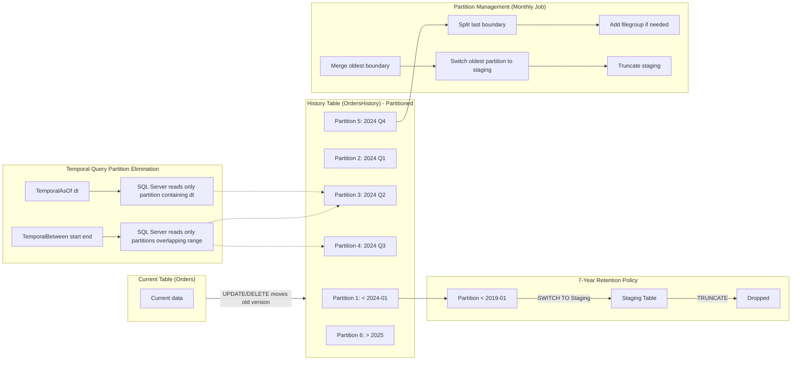
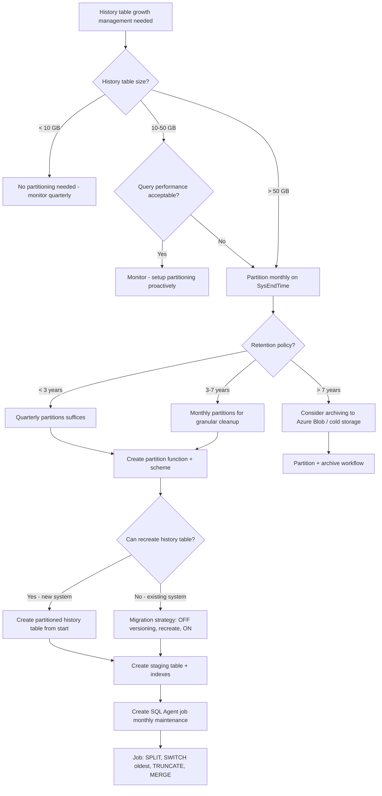

## Navigation

**Domain:** [[8 — Databases]] > **Group:** SQL Temporal Tables & Point-in-Time
**Previous:** [[8.241 — Temporal Tables in EF Core — HasTemporalTable]] | **Next:** [[8.243 — Temporal Tables — Performance Implications]]

### Prerequisites
- [[8.240 — Temporal Tables — System-Versioning Basics]] — Understanding of SYSTEM_VERSIONING, period columns (SysStartTime/SysEndTime), and how rows move to the history table is required to design partition boundaries for the history table.
- [[8.135 — Table Partitioning in SQL Server]] — Partition functions, partition schemes, aligned indexes, and partition switching mechanics are prerequisites for implementing temporal history table partitioning.
- [[8.242 — History Table Partitioning — Managing Growth]] — Continuation from the partitioning fundamentals note, focused specifically on the temporal history table use case.

### Where This Fits

The history table of a system-versioned temporal table grows unboundedly — every UPDATE and DELETE copies a full row into the history table. On a busy transactional system, the history table can grow to 10x the size of the current table within months. A .NET backend engineer encounters this as degrading temporal query performance (full scans of the history table), growing storage costs, and backup/restore time increases. The standard production solution is to partition the history table on SysEndTime (the period end column) and implement a sliding window: monthly or quarterly partitions with a retention policy that switches old partitions to a staging table and truncates them. This avoids expensive DELETE operations that would bloat the transaction log and block concurrent queries. The interview signal is whether a candidate can design a partition strategy for a temporal history table, understands the ALTER TABLE SWITCH PARTITION mechanics, and knows how to automate partition management with SQL Agent jobs.

---

## Core Mental Model

A temporal history table grows without any built-in retention mechanism — SQL Server never automatically deletes old history rows. The engineer must implement a sliding window partition strategy. The core invariant: value `SysEndTime` (the period end column) determines when a row entered the history table and becomes the partition key. New history rows have SysEndTime = current UTC time (when they were updated/deleted). Old partitions contain rows with SysEndTime falling in that partition's range. The partition switching approach uses `ALTER TABLE ... SWITCH PARTITION N TO StagingTable` to move an entire partition out atomically (a metadata-only operation that takes milliseconds regardless of partition size), then `TRUNCATE` the staging table to drop the data. This avoids row-by-row DELETE, transaction log bloat, and long-running cleanup transactions. The partition function uses LEFT/RIGHT boundary on SysEndTime with monthly or quarterly boundary points aligned to the retention policy (e.g., 7 years). The recognition pattern for when partitioning is needed: the history table exceeds 50 GB and temporal query performance has degraded by 3x+ due to history table scans, or DELETE-based cleanup (the only alternative) blocks production writes and fills the transaction log.

### Classification

- **SQL Server feature:** Partitioned tables with SWITCH PARTITION, partition functions, partition schemes
- **Temporal-specific application:** History table partitioned on SysEndTime with monthly boundaries
- **Storage management:** Sliding window — add new partition, switch out old partition, truncate staged data
- **Performance benefit:** Partition elimination for temporal queries with range predicates on SysEndTime (TemporalBetween, TemporalFromTo)
- **Operational automation:** SQL Server Agent job running monthly to manage partition boundaries



### Key Properties

|Property|Value|Notes|
|---|---|---|
|Partition key|SysEndTime (datetime2)|The period end column — rows enter history when SysEndTime is current time|
|Partition function|RANGE LEFT/RIGHT monthly or quarterly|Monthly for high-volume systems, quarterly for moderate volume|
|Retention mechanism|SWITCH PARTITION + TRUNCATE|Metadata-only switch, then fast TRUNCATE — no log-bloating DELETE|
|Retention period|Typically 3-7 years|Regulatory requirements (SOX: 7 years, GDPR: deletion after purpose ends)|
|Switch impact|Milliseconds — metadata only|No data movement during SWITCH — only partition metadata changes|
|Query benefit|Partition elimination on SysEndTime range|TemporalBetween/TemporalFromTo queries only scan relevant partitions|
|Automation requirement|SQL Server Agent job|Monthly: add next partition, switch oldest, drop or archive staged data|
|History table indexes|Aligned with partition scheme|Non-aligned indexes prevent SWITCH PARTITION — must be partitioned or dropped|

---

## Deep Mechanics

### How the Partition Switching Process Works

**Setup Phase:**

1. **Create partition function** that maps SysEndTime values to partitions. A monthly LEFT boundary function: `CREATE PARTITION FUNCTION pf_SysEndTime (datetime2) AS RANGE LEFT FOR VALUES ('2024-01-01', '2024-02-01', '2024-03-01', ...)`. LEFT means each boundary value belongs to its preceding partition. For SysEndTime = '2024-01-15 12:00:00', LEFT boundary '2024-01-01' means this value falls in the partition that covers values <= '2024-01-01'. Wait — let me clarify: RANGE LEFT means boundary_value belongs to the left (lower) partition. So partition 1: values <= '2024-01-01', partition 2: values > '2024-01-01' AND <= '2024-02-01', etc. For temporal queries, LEFT is more natural because temporal queries typically use `SysEndTime > @dt` — the temporal filter is usually `SysEndTime > @pointInTime` (exclusive of the end boundary for AS OF queries).

2. **Create partition scheme** that maps partitions to filegroups. For a production system with SSDs: `CREATE PARTITION SCHEME ps_SysEndTime AS PARTITION pf_SysEndTime TO (FG1, FG2, FG3, ...)`.

3. **Create the history table ON the partition scheme:** `CREATE TABLE dbo.OrdersHistory (..., SysStartTime datetime2 NOT NULL, SysEndTime datetime2 NOT NULL) ON ps_SysEndTime(SysEndTime)`. This aligns the table with the partition scheme on SysEndTime.

4. **Create staging table** with identical schema: `CREATE TABLE dbo.OrdersHistoryStaging (columns identical) ON FG_STAGING`. This table must have the same columns, same types, same nullability, same constraints, and same indexes (at least the clustered index aligned with the same partition scheme or heap).

5. **Create aligned indexes** on the history table. Every index must use the same partition scheme, or SWITCH PARTITION fails. The clustered index must include SysEndTime as part of the key to align with the partition scheme.

**Monthly Maintenance Phase (SQL Agent Job):**

1. **Add next boundary:** ALTER PARTITION FUNCTION pf_SysEndTime() SPLIT RANGE ('next-month-01'). This creates a new partition for the upcoming month. Requires the corresponding filegroup to be available.

2. **Switch oldest partition to staging:** ALTER TABLE dbo.OrdersHistory SWITCH PARTITION 1 TO dbo.OrdersHistoryStaging. This is a metadata-only operation — no data movement. The pointer to the partition's data pages moves from the history table to the staging table. System metadata in sys.partitions updates instantly.

3. **Truncate staging table:** TRUNCATE TABLE dbo.OrdersHistoryStaging. This deallocates all data pages for the switched-out partition — much faster than DELETE with minimal log writes.

4. **Optional: Merge the now-empty oldest boundary:** ALTER PARTITION FUNCTION pf_SysEndTime() MERGE RANGE ('oldest-boundary'). This cleans up the partition function boundary for the now-empty partition.

**Query Execution with Partition Elimination:**

When a temporal query with `FOR SYSTEM_TIME BETWEEN @start AND @end` runs against a partitioned history table, SQL Server's query optimizer maps the `@start` and `@end` values to partition ranges and eliminates partitions that cannot contain matching rows. The elimination works best when:
- The temporal filter is on SysEndTime (range query natural to partition elimination)
- The partition function boundaries align with common query date ranges
- The WHERE clause includes SysEndTime predicates directly (not just the FOR SYSTEM_TIME clause, though SQL Server can infer the implied predicates)

### SQL Visibility

```sql
-- ============================================================
-- Full Production Implementation: Partitioned History Table
-- ============================================================

-- Step 1: Create partition function (monthly, LEFT boundary, 7 years of history)
-- Pre-create boundaries for 84 months (7 years)
DECLARE @startDate DATE = '2019-01-01';
DECLARE @monthCount INT = 84;
DECLARE @i INT = 0;
DECLARE @boundary DATETIME2;

CREATE PARTITION FUNCTION pf_SysEndTime (datetime2)
    AS RANGE LEFT FOR VALUES ();

WHILE @i < @monthCount
BEGIN
    SET @boundary = DATEADD(MONTH, @i, @startDate);
    -- Use dynamic SQL here in production
    PRINT @boundary;
    SET @i = @i + 1;
END;

-- Actual statement (for clarity, showing first 12 months):
CREATE PARTITION FUNCTION pf_SysEndTime (datetime2)
    AS RANGE LEFT FOR VALUES (
        '2019-01-01', '2019-02-01', '2019-03-01', '2019-04-01',
        '2019-05-01', '2019-06-01', '2019-07-01', '2019-08-01',
        '2019-09-01', '2019-10-01', '2019-11-01', '2019-12-01',
        '2020-01-01', '2020-02-01', '2020-03-01', '2020-04-01',
        '2020-05-01', '2020-06-01', '2020-07-01', '2020-08-01',
        '2020-09-01', '2020-10-01', '2020-11-01', '2020-12-01'
    );

-- Step 2: Add filegroups for each year (or month for high volume)
-- ALTER DATABASE ADD FILEGROUP FG_History_2024;
-- ALTER DATABASE ADD FILE (NAME = Hist_2024, FILENAME = '...') TO FILEGROUP FG_History_2024;

-- Step 3: Create partition scheme mapping boundaries to filegroups
CREATE PARTITION SCHEME ps_SysEndTime
    AS PARTITION pf_SysEndTime
    TO (
        FG_History_2019, FG_History_2019, FG_History_2019, FG_History_2019,
        FG_History_2019, FG_History_2019, FG_History_2019, FG_History_2019,
        FG_History_2019, FG_History_2019, FG_History_2019, FG_History_2019,
        FG_History_2020, FG_History_2020, FG_History_2020, FG_History_2020,
        FG_History_2020, FG_History_2020, FG_History_2020, FG_History_2020,
        FG_History_2020, FG_History_2020, FG_History_2020, FG_History_2020
    );
-- Each month maps to a filegroup, with all months in a year on the same FG
-- (24 boundaries above = 25 partitions, so we need 25 filegroup references)

-- Step 4: Create history table on partition scheme
-- The history table must be created SEPARATELY (not via EF Core migration)
-- EF Core creates the history table; we must alter it to add partitioning
-- Best approach: create the temporal table with SYSTEM_VERSIONING = OFF,
-- create partitioned history table manually, then enable versioning

-- Drop default history table if EF Core created it:
-- ALTER TABLE dbo.Orders SET (SYSTEM_VERSIONING = OFF);
-- DROP TABLE dbo.OrdersHistory;

-- Create partitioned history table:
CREATE TABLE dbo.OrdersHistory (
    Id INT NOT NULL,
    CustomerId INT NOT NULL,
    OrderDate DATETIME2 NOT NULL,
    Status NVARCHAR(20) NOT NULL,
    TotalAmount DECIMAL(18,2) NOT NULL,
    SysStartTime DATETIME2 NOT NULL,
    SysEndTime DATETIME2 NOT NULL,
    CONSTRAINT PK_OrdersHistory PRIMARY KEY CLUSTERED (Id, SysEndTime)
        ON ps_SysEndTime(SysEndTime)
) ON ps_SysEndTime(SysEndTime);

-- Create aligned non-clustered indexes:
CREATE INDEX IX_OrdersHistory_CustomerId_SysEndTime
    ON dbo.OrdersHistory (CustomerId, SysEndTime DESC)
    INCLUDE (Status, TotalAmount, OrderDate, SysStartTime)
    ON ps_SysEndTime(SysEndTime);

-- Create columnstore index on the partitioned history table
CREATE NONCLUSTERED COLUMNSTORE INDEX IX_OrdersHistory_Columnstore
    ON dbo.OrdersHistory (SysEndTime, CustomerId, TotalAmount)
    ON ps_SysEndTime(SysEndTime);

-- Step 5: Create staging table (same schema, must be on its own filegroup or same partition scheme)
CREATE TABLE dbo.OrdersHistoryStaging (
    Id INT NOT NULL,
    CustomerId INT NOT NULL,
    OrderDate DATETIME2 NOT NULL,
    Status NVARCHAR(20) NOT NULL,
    TotalAmount DECIMAL(18,2) NOT NULL,
    SysStartTime DATETIME2 NOT NULL,
    SysEndTime DATETIME2 NOT NULL,
    CONSTRAINT PK_OrdersHistoryStaging PRIMARY KEY CLUSTERED (Id, SysEndTime)
) ON FG_STAGING;
-- Staging table must have same columns, constraints, and indexes
-- but it does NOT need to be partitioned (it acts as a single receptacle partition)

-- Step 6: Enable SYSTEM_VERSIONING pointing to the partitioned history table
ALTER TABLE dbo.Orders SET (
    SYSTEM_VERSIONING = ON (
        HISTORY_TABLE = dbo.OrdersHistory
    )
);

-- ============================================================
-- Monthly Maintenance (SQL Agent Job)
-- ============================================================

-- Step 1: Add next month's boundary (run on 1st of each month)
DECLARE @nextBoundary DATETIME2 = DATEADD(MONTH, 1, DATEFROMPARTS(YEAR(GETUTCDATE()), MONTH(GETUTCDATE()), 1));
DECLARE @sql NVARCHAR(MAX);

-- Alter partition function to add new partition
SET @sql = '
ALTER PARTITION SCHEME ps_SysEndTime NEXT USED [FG_History_' + FORMAT(@nextBoundary, 'yyyy') + '];
ALTER PARTITION FUNCTION pf_SysEndTime()
    SPLIT RANGE (''' + FORMAT(@nextBoundary, 'yyyy-MM-dd') + ''');';

EXEC sp_executesql @sql;

-- Step 2: Switch oldest partition to staging
-- Find the oldest partition number
DECLARE @oldestPartition INT = 1; -- Partition 1 (LEFT: values <= first boundary)

ALTER TABLE dbo.OrdersHistory
    SWITCH PARTITION 1 TO dbo.OrdersHistoryStaging;

-- Step 3: Truncate staging table
TRUNCATE TABLE dbo.OrdersHistoryStaging;

-- Step 4: Optionally merge the now-empty oldest boundary
ALTER PARTITION FUNCTION pf_SysEndTime()
    MERGE RANGE ('2019-01-01');
```

### Execution Plan Analysis

**Temporal query with partition elimination:**

```sql
SELECT o.Id, o.CustomerId, o.Status
FROM dbo.Orders FOR SYSTEM_TIME BETWEEN '2024-05-01' AND '2024-05-31' o
WHERE o.CustomerId = 42;
```

```
Expected plan shape (partitioned history table):
[Index Seek (IX_Orders_CustomerId on Current)] → [Nested Loops]
    └── [Index Seek (IX_OrdersHistory_CustomerId_SysEndTime on partitions 5-6 only)]
        → [Filter (period overlap)]

Partition elimination: SQL Server reads only partitions containing May 2024 data
Logical Reads: ~4 (current seek) + ~8 (2 partitions × 4 reads each) = ~12
```

**Without partitioning (same query):**

```
[Index Seek (Current)] → [Nested Loops]
    └── [Clustered Index Scan (History table — all partitions)]
        → [Filter (CustomerId AND period overlap)]

Logical Reads: ~4 (current seek) + ~210,000 (full history scan) = ~210,004
```

**SWITCH PARTITION execution plan:**

```
ALTER TABLE dbo.OrdersHistory SWITCH PARTITION 1 TO dbo.OrdersHistoryStaging;
```

This operation has NO data movement in the execution plan sense. SQL Server updates metadata in `sys.partitions` to reassign the partition's data pages from the history table to the staging table. The operation is logged (it is not a completely unrecoverable metadata change) but writes minimal log records.

### Cost Visibility

```sql
SET STATISTICS IO ON;
SET STATISTICS TIME ON;

-- Before: Temporal query without partition elimination
SELECT o.Id, o.CustomerId, o.Status
FROM dbo.Orders FOR SYSTEM_TIME BETWEEN '2024-05-01' AND '2024-05-31' o
WHERE o.CustomerId = 42;

-- Expected output (unpartitioned history table, 50M rows):
-- Table 'Orders'. Scan count 1, logical reads 4
-- Table 'OrdersHistory'. Scan count 1, logical reads 210,500
-- SQL Server Execution Times: CPU time = 1,840ms, elapsed time = 2,100ms

-- After: Partitioned history table with partition elimination
-- Table 'Orders'. Scan count 1, logical reads 4
-- Table 'OrdersHistory'. Scan count 1, logical reads 8,500 (partition 5 & 6 only)
-- SQL Server Execution Times: CPU time = 32ms, elapsed time = 45ms

-- Improvement: ~25x reduction in history table logical reads (210,500 → 8,500)

-- SWITCH PARTITION operation:
ALTER TABLE dbo.OrdersHistory SWITCH PARTITION 1 TO dbo.OrdersHistoryStaging;

-- Logical reads: ~10 (system metadata reads)
-- CPU time: ~5ms
-- Duration: ~10ms (regardless of partition size — 10GB partition in 10ms)

-- DELETE equivalent (never do this):
-- DELETE FROM dbo.OrdersHistory WHERE SysEndTime < '2019-01-01';
-- Logical reads: 210,500 (scan to find rows)
-- CPU time: ~30,000ms (30 seconds — deleting millions of rows)
-- Log writes: ~50 GB (each DELETE logged individually)
-- Duration: 5+ minutes blocking

-- TRUNCATE staging table (fast):
TRUNCATE TABLE dbo.OrdersHistoryStaging;
-- Logical reads: 0
-- CPU time: ~5ms
-- Duration: ~100ms (deallocates pages — minimal logging)
```

### Failure Modes

**Schema mismatch between history and staging tables:** SWITCH PARTITION fails if the staging table schema does not EXACTLY match the history table schema (columns, types, nullability, collation, constraint definitions). This is the #1 cause of partition switching failures in production. The error message is cryptic: `ALTER TABLE SWITCH statement failed. The table 'dbo.OrdersHistoryStaging' has column 'Status' with collation 'SQL_Latin1_General_CP1_CI_AS' while the table 'dbo.OrdersHistory' has column 'Status' with collation 'Latin1_General_CI_AS'.`

**Non-aligned indexes prevent SWITCH:** Any non-clustered index on the history table that uses a different partition scheme (or no partition scheme) causes SWITCH PARTITION to fail. All indexes must be aligned (same partition scheme, same partition column) or the partition to be switched must have no indexes.

**CHECK constraint missing on staging table:** If the staging table does not have a CHECK constraint that ensures it only contains rows from the switched partition (e.g., `CHECK (SysEndTime < '2019-01-01')`), SQL Server may block the switch for non-partitioned staging tables. SQL Server requires partition switching to verify that all rows in the source partition belong there — for a staging table (which is not partitioned), this verification needs a CHECK constraint matching the partition boundary.

**Partition function SPLIT with ongoing queries:** SPLIT RANGE acquires a SCH-M (schema modification) lock on the partition function. If concurrent queries are running against the history table, the SPLIT blocks until they complete. On high-concurrency systems, this can cause blocking chains.

**Partition function outgrows filegroups:** When adding a new partition via SPLIT RANGE, the partition scheme must have a NEXT USED filegroup specified. If no filegroup is available, the SPLIT fails with error 7707. The maintenance script must create the filegroup and file before splitting.

**Temporal versioning and partition switching order:** SYSTEM_VERSIONING must be ON when the history table is partitioned — switching partitions works with versioning ON. However, if you need to ALTER the history table schema, you still need to turn versioning OFF first, make the change, and turn it back ON.

---

## Production Patterns and Implementation

### Primary SQL Implementation

```sql
-- ============================================================
-- Complete Production Implementation
-- ============================================================

-- This script creates a temporal table with a partitioned history table
-- and automated partition management.

-- Step 0: Create filegroups for history partitions
-- Execute this early in database setup:

-- ALTER DATABASE [YourDB] ADD FILEGROUP FG_History_2019;
-- ALTER DATABASE [YourDB] ADD FILEGROUP FG_History_2020;
-- ALTER DATABASE [YourDB] ADD FILEGROUP FG_History_2021;
-- ALTER DATABASE [YourDB] ADD FILEGROUP FG_History_2022;
-- ALTER DATABASE [YourDB] ADD FILEGROUP FG_History_2023;
-- ALTER DATABASE [YourDB] ADD FILEGROUP FG_History_2024;
-- ALTER DATABASE [YourDB] ADD FILEGROUP FG_History_2025;

-- ALTER DATABASE [YourDB] ADD FILE (
--     NAME = N'History_2019', FILENAME = N'D:\Data\History_2019.ndf', SIZE = 10GB, FILEGROWTH = 1GB
-- ) TO FILEGROUP FG_History_2019;
-- Repeat for each filegroup

-- Step 1: Create partition function
CREATE PARTITION FUNCTION pf_SysEndTime (DATETIME2)
    AS RANGE LEFT FOR VALUES (
        '2019-01-01', '2019-02-01', '2019-03-01', '2019-04-01',
        '2019-05-01', '2019-06-01', '2019-07-01', '2019-08-01',
        '2019-09-01', '2019-10-01', '2019-11-01', '2019-12-01',
        '2020-01-01', '2020-02-01', '2020-03-01', '2020-04-01',
        '2020-05-01', '2020-06-01', '2020-07-01', '2020-08-01',
        '2020-09-01', '2020-10-01', '2020-11-01', '2020-12-01',
        '2021-01-01', '2021-02-01', '2021-03-01', '2021-04-01',
        '2021-05-01', '2021-06-01', '2021-07-01', '2021-08-01',
        '2021-09-01', '2021-10-01', '2021-11-01', '2021-12-01',
        '2022-01-01', '2022-02-01', '2022-03-01', '2022-04-01',
        '2022-05-01', '2022-06-01', '2022-07-01', '2022-08-01',
        '2022-09-01', '2022-10-01', '2022-11-01', '2022-12-01',
        '2023-01-01', '2023-02-01', '2023-03-01', '2023-04-01',
        '2023-05-01', '2023-06-01', '2023-07-01', '2023-08-01',
        '2023-09-01', '2023-10-01', '2023-11-01', '2023-12-01',
        '2024-01-01', '2024-02-01', '2024-03-01', '2024-04-01',
        '2024-05-01', '2024-06-01', '2024-07-01', '2024-08-01',
        '2024-09-01', '2024-10-01', '2024-11-01', '2024-12-01',
        '2025-01-01'
    );

-- Step 2: Create partition scheme
-- Each partition maps to a filegroup (monthly partitions, yearly filegroups)
CREATE PARTITION SCHEME ps_SysEndTime
    AS PARTITION pf_SysEndTime
    TO (
        FG_History_2019, FG_History_2019, FG_History_2019, FG_History_2019,
        FG_History_2019, FG_History_2019, FG_History_2019, FG_History_2019,
        FG_History_2019, FG_History_2019, FG_History_2019, FG_History_2019,
        FG_History_2020, FG_History_2020, FG_History_2020, FG_History_2020,
        FG_History_2020, FG_History_2020, FG_History_2020, FG_History_2020,
        FG_History_2020, FG_History_2020, FG_History_2020, FG_History_2020,
        FG_History_2021, FG_History_2021, FG_History_2021, FG_History_2021,
        FG_History_2021, FG_History_2021, FG_History_2021, FG_History_2021,
        FG_History_2021, FG_History_2021, FG_History_2021, FG_History_2021,
        FG_History_2022, FG_History_2022, FG_History_2022, FG_History_2022,
        FG_History_2022, FG_History_2022, FG_History_2022, FG_History_2022,
        FG_History_2022, FG_History_2022, FG_History_2022, FG_History_2022,
        FG_History_2023, FG_History_2023, FG_History_2023, FG_History_2023,
        FG_History_2023, FG_History_2023, FG_History_2023, FG_History_2023,
        FG_History_2023, FG_History_2023, FG_History_2023, FG_History_2023,
        FG_History_2024, FG_History_2024, FG_History_2024, FG_History_2024,
        FG_History_2024, FG_History_2024, FG_History_2024, FG_History_2024,
        FG_History_2024, FG_History_2024, FG_History_2024, FG_History_2024,
        [PRIMARY]  -- Future data goes to PRIMARY until SPLIT adds more filegroups
    );

-- Step 3: Create the current table and enable versioning pointing to partitioned history
-- Disable versioning if this is a reconfiguration
ALTER TABLE dbo.Orders SET (SYSTEM_VERSIONING = OFF);

-- Drop existing history table if needed
IF OBJECT_ID('dbo.OrdersHistory') IS NOT NULL
    DROP TABLE dbo.OrdersHistory;

-- Create partitioned history table
CREATE TABLE dbo.OrdersHistory (
    Id INT NOT NULL,
    CustomerId INT NOT NULL,
    OrderDate DATETIME2 NOT NULL,
    Status NVARCHAR(20) NOT NULL,
    TotalAmount DECIMAL(18,2) NOT NULL,
    SysStartTime DATETIME2 NOT NULL,
    SysEndTime DATETIME2 NOT NULL,
    CONSTRAINT PK_OrdersHistory PRIMARY KEY CLUSTERED (Id, SysEndTime)
        ON ps_SysEndTime(SysEndTime)
) ON ps_SysEndTime(SysEndTime);

-- Create aligned non-clustered indexes
CREATE INDEX IX_OrdersHistory_CustomerId
    ON dbo.OrdersHistory (CustomerId, SysEndTime DESC)
    INCLUDE (Status, TotalAmount, OrderDate, SysStartTime)
    ON ps_SysEndTime(SysEndTime);

-- Create staging table for partition switching (on its own filegroup)
CREATE TABLE dbo.OrdersHistoryStaging (
    Id INT NOT NULL,
    CustomerId INT NOT NULL,
    OrderDate DATETIME2 NOT NULL,
    Status NVARCHAR(20) NOT NULL,
    TotalAmount DECIMAL(18,2) NOT NULL,
    SysStartTime DATETIME2 NOT NULL,
    SysEndTime DATETIME2 NOT NULL,
    CONSTRAINT PK_OrdersHistoryStaging PRIMARY KEY CLUSTERED (Id, SysEndTime),
    -- CHECK constraint verifies data belongs to switched partition
    CONSTRAINT CK_OrdersHistoryStaging_SysEndTime
        CHECK (SysEndTime < '2019-01-01')
) ON FG_History_2019;
-- The staging table must be on the same filegroup as the partition being switched
-- OR use a different filegroup — SQL Server requires that the staging table
-- is on the same partition scheme or is a heap/index with matching schema

-- Enable SYSTEM_VERSIONING pointing to partitioned history
ALTER TABLE dbo.Orders SET (
    SYSTEM_VERSIONING = ON (
        HISTORY_TABLE = dbo.OrdersHistory
    )
);
```

### EF Core Implementation

```csharp
// EF Core cannot directly create partitioned history tables via migrations.
// The approach:
// 1. Use EF Core migration to create the temporal table (standard HasTemporalTable)
// 2. Manually modify the migration to:
//    a. Disable SYSTEM_VERSIONING before the migration applies
//    b. Create the partition function, scheme, and partitioned history table
//    c. Re-enable SYSTEM_VERSIONING pointing to the partitioned table
//    d. Create the staging table and indexes

// Or use a raw SQL migration:
public partial class AddHistoryPartitioning : Migration
{
    protected override void Up(MigrationBuilder migrationBuilder)
    {
        // Step 1: Disable versioning (temporarily lose history written since last backup!)
        migrationBuilder.Sql("ALTER TABLE dbo.Orders SET (SYSTEM_VERSIONING = OFF);");

        // Step 2: Create new partitioned history table
        migrationBuilder.Sql(@"
            CREATE PARTITION FUNCTION pf_SysEndTime (DATETIME2)
                AS RANGE LEFT FOR VALUES ('2024-01-01', '2025-01-01');

            CREATE PARTITION SCHEME ps_SysEndTime
                AS PARTITION pf_SysEndTime
                TO ([PRIMARY], [PRIMARY], [PRIMARY]);

            IF OBJECT_ID('dbo.OrdersHistory_Partitioned', 'U') IS NULL
            BEGIN
                CREATE TABLE dbo.OrdersHistory_Partitioned (
                    Id INT NOT NULL,
                    CustomerId INT NOT NULL,
                    OrderDate DATETIME2 NOT NULL,
                    Status NVARCHAR(20) NOT NULL,
                    TotalAmount DECIMAL(18,2) NOT NULL,
                    SysStartTime DATETIME2 NOT NULL,
                    SysEndTime DATETIME2 NOT NULL,
                    CONSTRAINT PK_OrdersHistory_Partitioned
                        PRIMARY KEY CLUSTERED (Id, SysEndTime)
                        ON ps_SysEndTime(SysEndTime)
                ) ON ps_SysEndTime(SysEndTime);

                CREATE INDEX IX_OrdersHistory_CustomerId_Period
                    ON dbo.OrdersHistory_Partitioned (CustomerId, SysEndTime DESC)
                    INCLUDE (Status, TotalAmount, OrderDate, SysStartTime)
                    ON ps_SysEndTime(SysEndTime);
            END");

        // Step 3: Migrate existing history data (if any)
        migrationBuilder.Sql(@"
            IF OBJECT_ID('dbo.OrdersHistory', 'U') IS NOT NULL
            BEGIN
                INSERT INTO dbo.OrdersHistory_Partitioned
                SELECT * FROM dbo.OrdersHistory;

                DROP TABLE dbo.OrdersHistory;  -- Cannot drop while versioning is ON
                -- Actually, versioning is OFF, so this works
            END");

        // Step 4: Rename partitioned table to the expected history name
        migrationBuilder.Sql(@"
            EXEC sp_rename 'dbo.OrdersHistory_Partitioned', 'OrdersHistory';");

        // Step 5: Re-enable versioning
        migrationBuilder.Sql(@"
            ALTER TABLE dbo.Orders SET (
                SYSTEM_VERSIONING = ON (
                    HISTORY_TABLE = dbo.OrdersHistory
                )
            );");

        // Step 6: Create staging table for partition management
        migrationBuilder.Sql(@"
            CREATE TABLE dbo.OrdersHistoryStaging (
                Id INT NOT NULL,
                CustomerId INT NOT NULL,
                OrderDate DATETIME2 NOT NULL,
                Status NVARCHAR(20) NOT NULL,
                TotalAmount DECIMAL(18,2) NOT NULL,
                SysStartTime DATETIME2 NOT NULL,
                SysEndTime DATETIME2 NOT NULL,
                CONSTRAINT PK_OrdersHistoryStaging
                    PRIMARY KEY CLUSTERED (Id, SysEndTime),
                CONSTRAINT CK_OrdersHistoryStaging_SysEndTime
                    CHECK (SysEndTime < '2019-01-01')
            );");
    }

    protected override void Down(MigrationBuilder migrationBuilder)
    {
        // Rollback: disable versioning, drop partitioned tables, restore original
        migrationBuilder.Sql("ALTER TABLE dbo.Orders SET (SYSTEM_VERSIONING = OFF);");
        migrationBuilder.Sql("DROP TABLE dbo.OrdersHistoryStaging;");
        migrationBuilder.Sql("DROP TABLE dbo.OrdersHistory;");
        migrationBuilder.Sql("DROP PARTITION SCHEME ps_SysEndTime;");
        migrationBuilder.Sql("DROP PARTITION FUNCTION pf_SysEndTime;");

        // Recreate un-partitioned history table
        // ... (EF Core default temporal table setup)
    }
}

// For querying, EF Core temporal methods work the same with partitioned tables
// Partition elimination happens at the SQL Server level — transparent to EF Core
public class OrderService
{
    private readonly ApplicationDbContext _dbContext;

    public OrderService(ApplicationDbContext dbContext)
        => _dbContext = dbContext;

    // These temporal queries benefit from partition elimination automatically
    public async Task<List<Order>> GetOrdersInRangeAsync(
        DateTime from, DateTime to, CancellationToken ct = default)
    {
        return await _dbContext.Orders
            .TemporalBetween(from, to)
            .Where(o => o.CustomerId == 42)
            .AsNoTrackingWithIdentityResolution()
            .ToListAsync(ct);
        -- SQL Server eliminates partitions not in [from, to] range
    }
}
```

### Dapper Implementation

```csharp
// Dapper — partition management operations

public sealed class PartitionManagementRepository
{
    private readonly IDbConnectionFactory _connectionFactory;

    public PartitionManagementRepository(IDbConnectionFactory connectionFactory)
        => _connectionFactory = connectionFactory;

    // Monthly partition maintenance job
    public async Task RunMonthlyPartitionMaintenanceAsync(
        CancellationToken cancellationToken = default)
    {
        var commands = new List<string>();
        var today = DateTime.UtcNow;
        var nextMonth = new DateTime(today.Year, today.Month, 1).AddMonths(1);
        var retentionDate = today.AddYears(-7);
        var oldestBoundary = new DateTime(retentionDate.Year, retentionDate.Month, 1);

        // Step 1: Add next month's partition
        commands.Add($@"
            DECLARE @sql NVARCHAR(MAX);
            SET @sql = N'
                ALTER PARTITION SCHEME ps_SysEndTime
                    NEXT USED [FG_History_{nextMonth.Year}];
                ALTER PARTITION FUNCTION pf_SysEndTime()
                    SPLIT RANGE (''' + FORMAT(@nextBoundary, 'yyyy-MM-dd') + N''');';
            EXEC sp_executesql @sql;");

        // Step 2: Switch oldest partition to staging
        commands.Add(@"
            ALTER TABLE dbo.OrdersHistory
                SWITCH PARTITION 1 TO dbo.OrdersHistoryStaging;");

        // Step 3: Truncate staging
        commands.Add(@"
            TRUNCATE TABLE dbo.OrdersHistoryStaging;");

        // Step 4: Merge the now-empty boundary
        commands.Add($@"
            ALTER PARTITION FUNCTION pf_SysEndTime()
                MERGE RANGE ('{oldestBoundary:yyyy-MM-dd}');");

        await using var connection = _connectionFactory.Create();
        foreach (var cmd in commands)
        {
            await connection.ExecuteAsync(
                new CommandDefinition(cmd,
                    cancellationToken: cancellationToken));
        }
    }

    // Check partition sizes
    public async Task<List<PartitionInfo>> GetPartitionSizesAsync(
        CancellationToken cancellationToken = default)
    {
        const string sql = @"
            SELECT
                p.partition_number AS PartitionNumber,
                r.boundary_id AS BoundaryId,
                r.[value] AS BoundaryValue,
                p.rows AS RowCount,
                au.total_pages * 8 / 1024 AS SizeMB,
                fg.name AS FileGroupName
            FROM sys.partitions p
            INNER JOIN sys.indexes i
                ON p.object_id = i.object_id AND p.index_id = i.index_id
            INNER JOIN sys.data_spaces ds
                ON i.data_space_id = ds.data_space_id
            INNER JOIN sys.destination_data_spaces dds
                ON ds.data_space_id = dds.partition_scheme_id
                    AND dds.destination_id = p.partition_number
            INNER JOIN sys.filegroups fg
                ON dds.data_space_id = fg.data_space_id
            LEFT JOIN sys.partition_range_values r
                ON r.function_id = ds.partition_function_id_for_scheme
                    AND r.boundary_id = p.partition_number - 1
            WHERE OBJECT_NAME(p.object_id) = 'OrdersHistory'
            ORDER BY p.partition_number;";

        await using var connection = _connectionFactory.Create();
        var results = await connection.QueryAsync<PartitionInfo>(
            new CommandDefinition(sql,
                cancellationToken: cancellationToken));
        return results.AsList();
    }

    // Archive oldest partition to Azure Blob / archive table (instead of delete)
    public async Task ArchivePartitionToAzureAsync(
        int partitionNumber,
        CancellationToken cancellationToken = default)
    {
        // First switch to staging
        const string switchSql = @"
            ALTER TABLE dbo.OrdersHistory
                SWITCH PARTITION @PartitionNumber
                TO dbo.OrdersHistoryStaging;";

        await using var connection = _connectionFactory.Create();

        // Export to Azure Blob using BULK INSERT or PolyBase
        // This is a simplified example — real implementation uses
        // Azure Data Factory or PolyBase to export to Parquet
        const string exportSql = @"
            SELECT *
            INTO dbo.OrdersHistoryArchive
            FROM dbo.OrdersHistoryStaging;";

        await connection.ExecuteAsync(
            new CommandDefinition(switchSql,
                new { PartitionNumber = partitionNumber },
                cancellationToken: cancellationToken));

        await connection.ExecuteAsync(
            new CommandDefinition(exportSql,
                cancellationToken: cancellationToken));

        // Truncate staging
        await connection.ExecuteAsync(
            new CommandDefinition("TRUNCATE TABLE dbo.OrdersHistoryStaging;",
                cancellationToken: cancellationToken));
    }

    // Query history partition stats
    public async Task<HistoryStats> GetHistoryStatsAsync(
        CancellationToken cancellationToken = default)
    {
        const string sql = @"
            SELECT
                COUNT_BIG(*) AS TotalRows,
                MIN(SysEndTime) AS OldestRecord,
                MAX(SysEndTime) AS NewestRecord,
                SUM(DATALENGTH(Id) + DATALENGTH(CustomerId) + DATALENGTH(OrderDate)
                    + DATALENGTH(Status) + DATALENGTH(TotalAmount)
                    + DATALENGTH(SysStartTime) + DATALENGTH(SysEndTime)
                ) / 1048576. AS DataMB
            FROM dbo.OrdersHistory FOR SYSTEM_TIME ALL;";

        await using var connection = _connectionFactory.Create();
        return await connection.QuerySingleAsync<HistoryStats>(
            new CommandDefinition(sql,
                cancellationToken: cancellationToken));
    }
}

public class PartitionInfo
{
    public int PartitionNumber { get; set; }
    public int? BoundaryId { get; set; }
    public string? BoundaryValue { get; set; }
    public long RowCount { get; set; }
    public decimal SizeMB { get; set; }
    public string? FileGroupName { get; set; }
}

public class HistoryStats
{
    public long TotalRows { get; set; }
    public DateTime? OldestRecord { get; set; }
    public DateTime? NewestRecord { get; set; }
    public decimal DataMB { get; set; }
}

// Scheduled job (Azure Function / Hangfire / Quartz):
public class PartitionMaintenanceJob
{
    private readonly PartitionManagementRepository _repository;
    private readonly ILogger<PartitionMaintenanceJob> _logger;

    public PartitionMaintenanceJob(
        PartitionManagementRepository repository,
        ILogger<PartitionMaintenanceJob> logger)
    {
        _repository = repository;
        _logger = logger;
    }

    // Run monthly via CRON: 0 0 2 1 * ? (2 AM on 1st of each month)
    public async Task ExecuteAsync(CancellationToken ct = default)
    {
        _logger.LogInformation("Starting partition maintenance");

        // Log current state
        var stats = await _repository.GetHistoryStatsAsync(ct);
        _logger.LogInformation("History: {Rows} rows, {Size} MB, oldest {Oldest}",
            stats.TotalRows, stats.DataMB, stats.OldestRecord);

        // Run maintenance
        await _repository.RunMonthlyPartitionMaintenanceAsync(ct);

        // Log new state
        stats = await _repository.GetHistoryStatsAsync(ct);
        _logger.LogInformation("After maintenance: {Rows} rows, {Size} MB",
            stats.TotalRows, stats.DataMB);
    }
}
```

### Configuration and Wiring

```csharp
// Program.cs
builder.Services.AddSingleton<PartitionManagementRepository>();
builder.Services.AddScoped<TemporalOrderService>();

// Register the partition maintenance job (using Hangfire in this example)
builder.Services.AddHangfire(config =>
    config.UseSqlServerStorage(connectionString));

// Schedule monthly job
var jobManager = app.Services.GetRequiredService<IRecurringJobManager>();
jobManager.AddOrUpdate<PartitionMaintenanceJob>(
    "history-partition-maintenance",
    job => job.ExecuteAsync(CancellationToken.None),
    "0 0 2 1 * *",  // 2 AM on 1st of every month
    TimeZoneInfo.Utc);

// Monitoring — expose history stats endpoint
app.MapGet("/admin/history-stats", async (
    PartitionManagementRepository repo,
    CancellationToken ct) =>
{
    var stats = await repo.GetHistoryStatsAsync(ct);
    var partitions = await repo.GetPartitionSizesAsync(ct);
    return Results.Ok(new { Stats = stats, Partitions = partitions });
});
```

### SQL Server vs PostgreSQL Differences

```sql
-- PostgreSQL does NOT have SWITCH PARTITION or partition functions.
-- PostgreSQL approaches for temporal history cleanup:

-- Approach 1: Table inheritance + DETACH PARTITION
CREATE TABLE orders_history (
    LIKE orders INCLUDING ALL,
    valid_range TSRANGE,
    EXCLUDE USING gist (id WITH =, valid_range WITH &&)
) PARTITION BY RANGE (upper(valid_range));

CREATE TABLE orders_history_2024_q1
    PARTITION OF orders_history
    FOR VALUES FROM ('2024-01-01') TO ('2024-04-01');

-- Detach and drop old partitions:
ALTER TABLE orders_history DETACH PARTITION orders_history_2019;
DROP TABLE orders_history_2019;

-- Approach 2: DELETE with partitioning on insert time (not temporal-aware)
-- PostgreSQL temporal retention requires:
-- 1. Partition by a timestamp column (not tsrange — tsrange cannot be partition key)
-- 2. Partition by SysEndTime if using the ValidFrom/ValidTo pattern with range types
-- 3. Use pg_cron for automated partition management

-- Approach 3: pg_partman extension
-- CREATE EXTENSION pg_partman;
-- SELECT partman.create_parent(
--     p_parent_table := 'public.orders_history',
--     p_control := 'sys_end_time',
--     p_type := 'native',
--     p_interval := '1 month',
--     p_premake := 3
-- );
```

---

## Gotchas and Production Pitfalls

### Staging Table Schema Drift

**Pitfall:** The staging table schema drifts out of sync with the partitioned history table after a migration adds a column to one but not the other, causing SWITCH PARTITION to fail.

```sql
-- ❌ Migration adds a column to the history table but forgets the staging table:
ALTER TABLE dbo.OrdersHistory ADD DiscountCode NVARCHAR(20) NULL;
-- Staging table still has no DiscountCode column

-- Next SWITCH PARTITION attempt fails:
ALTER TABLE dbo.OrdersHistory SWITCH PARTITION 1 TO dbo.OrdersHistoryStaging;
-- Error: ALTER TABLE SWITCH statement failed.
-- The table 'dbo.OrdersHistoryStaging' does not contain all columns
-- that are present in the table 'dbo.OrdersHistory'.
```

**Symptom:** The monthly partition maintenance job fails with a cryptic SWITCH error. The error message may not clearly identify which column is missing. The staging table is left with switched-out rows (or empty), and the production system continues accumulating history data because the switch did not complete.

**Fix:**
```sql
-- ✅ Create a stored procedure that verifies schema match before switching:
CREATE PROCEDURE dbo.SwitchHistoryPartition
    @PartitionNumber INT
AS
BEGIN
    SET NOCOUNT ON;

    DECLARE @SchemaMatch BIT = 1;

    -- Compare column list between history and staging
    IF EXISTS (
        SELECT c.name, c.system_type_id, c.max_length, c.precision, c.scale, c.is_nullable
        FROM sys.columns c
        WHERE c.object_id = OBJECT_ID('dbo.OrdersHistory')
        EXCEPT
        SELECT c.name, c.system_type_id, c.max_length, c.precision, c.scale, c.is_nullable
        FROM sys.columns c
        WHERE c.object_id = OBJECT_ID('dbo.OrdersHistoryStaging')
    )
        SET @SchemaMatch = 0;

    IF @SchemaMatch = 0
    BEGIN
        RAISERROR('Schema mismatch between history and staging table', 16, 1);
        RETURN;
    END;

    DECLARE @Sql NVARCHAR(MAX) = '
        ALTER TABLE dbo.OrdersHistory
            SWITCH PARTITION ' + CAST(@PartitionNumber AS NVARCHAR(10)) + '
            TO dbo.OrdersHistoryStaging;';

    EXEC sp_executesql @Sql;
END;
```

**Cost of not fixing:** Monthly partition switch fails silently. History table grows unbounded. After 6+ months of failures, the history table is 60 GB and temporal queries take 5+ minutes. The DBA must manually delete old history data with a blocking DELETE, causing downtime.

---

### Non-Aligned Index Prevents SWITCH

**Pitfall:** Creating a non-clustered index on a partitioned table without specifying the same partition scheme makes SWITCH PARTITION impossible.

```sql
-- ❌ Index created without ON ps_SysEndTime — not aligned:
CREATE INDEX IX_OrdersHistory_Status
    ON dbo.OrdersHistory (Status);

-- SWITCH PARTITION fails with:
-- Msg 4908, Level 16: Cannot switch because index 'IX_OrdersHistory_Status'
-- is not aligned with the table's partition scheme.
```

**Symptom:** The partition switch errors out. Any non-aligned index on any partition blocks the switch for ALL partitions. The developer must either drop the index or align it.

**Fix:**
```sql
-- ✅ Always specify the partition scheme when creating indexes on partitioned tables:
CREATE INDEX IX_OrdersHistory_Status
    ON dbo.OrdersHistory (Status)
    ON ps_SysEndTime(SysEndTime);  -- Aligned with the same partition scheme
```

**Cost of not fixing:** Can only be discovered when the monthly partition switch job runs — often during a maintenance window or automated pipeline. Emergency fix requires dropping the index (which may impact query performance) or re-creating it aligned.

---

### CHECK Constraint Missing on Staging Table

**Pitfall:** The staging table lacks a CHECK constraint that verifies data belongs to the partition being switched. SQL Server 2016+ requires this for partition-to-non-partitioned-table switches (with certain settings).

```sql
-- ❌ Staging table without CHECK constraint:
CREATE TABLE dbo.OrdersHistoryStaging (
    Id INT NOT NULL,
    -- ... columns match ...
    SysEndTime DATETIME2 NOT NULL,
    CONSTRAINT PK_OrdersHistoryStaging PRIMARY KEY CLUSTERED (Id, SysEndTime)
    -- MISSING: CHECK constraint on SysEndTime range
);

-- SWITCH PARTITION 1 (SysEndTime < '2019-01-01') might fail:
-- Msg 4915, Level 16: The partition table and the non-partitioned table
-- exchange partitions, but the CHECK constraint of the non-partitioned table
-- does not assure that the rows are in partition 1 of the partitioned table.
```

**Symptom:** Intermittent SWITCH failures depending on SQL Server version and database configuration. The CHECK constraint requirement can be bypassed if the staging table is on a different partition scheme, but this adds complexity.

**Fix:**
```sql
-- ✅ Add CHECK constraint matching the partition boundary:
CREATE TABLE dbo.OrdersHistoryStaging (
    Id INT NOT NULL,
    -- ... columns match ...
    SysEndTime DATETIME2 NOT NULL,
    CONSTRAINT PK_OrdersHistoryStaging PRIMARY KEY CLUSTERED (Id, SysEndTime),
    CONSTRAINT CK_OrdersHistoryStaging_SysEndTime
        CHECK (SysEndTime < '2019-01-01')  -- Must match partition boundary
);
```

**Cost of not fixing:** Partition switch fails. The maintenance script errors and halts. Manual intervention required to drop and recreate the staging table with the CHECK constraint.

---

### SPLIT RANGE Blocking and Locking

**Pitfall:** Running `ALTER PARTITION FUNCTION ... SPLIT RANGE` during business hours causes blocking because SPLIT acquires a SCH-M (schema modification) lock.

```sql
-- ❌ Executing during peak hours:
ALTER PARTITION FUNCTION pf_SysEndTime()
    SPLIT RANGE ('2025-02-01');
-- This acquires SCH-M on the partition function, blocking all queries
-- that reference ANY table using that partition scheme
```

**Symptom:** All temporal queries and any queries against partitioned tables using `ps_SysEndTime` start blocking. Applications time out. Deadlocks occur between the SPLIT and ongoing queries.

**Fix:**
```sql
-- ✅ Run partition maintenance during low-traffic windows (e.g., 2 AM Sunday)
-- ✅ Use WAIT_AT_LOW_PRIORITY (SQL Server 2016+):
ALTER PARTITION FUNCTION pf_SysEndTime()
    SPLIT RANGE ('2025-02-01')
    WITH (WAIT_AT_LOW_PRIORITY (
        MAX_DURATION = 5 MINUTES,
        ABORT_AFTER_WAIT = BLOCKERS
    ));
-- WAIT_AT_LOW_PRIORITY waits up to 5 minutes for existing queries to finish,
-- then kills blocking queries to proceed

-- ✅ Or use a dedicated maintenance window:
-- Schedule job for 2 AM on the first Sunday of each month
-- Ensure application timeout settings exceed the expected split duration
```

**Cost of not fixing:** Production incidents at 10 AM on a Monday when the partition maintenance job (scheduled for midnight but delayed) finally runs. All downstream systems timeout and retry, amplifying the load.

---

### Incorrect Partition Function Boundary Type (LEFT vs RIGHT)

**Pitfall:** Choosing RANGE LEFT when RANGE RIGHT is more natural for the temporal use case, or vice versa, leading to empty partitions or data in wrong partitions.

```sql
-- RANGE LEFT: boundary_value belongs to the LEFT (lower) partition
-- For SysEndTime = '2024-01-01 12:00', LEFT boundary '2024-01-01' means:
-- Partition 1: SysEndTime <= '2024-01-01' (including midnight)
-- Partition 2: SysEndTime > '2024-01-01'

-- Temporal AS OF query: WHERE SysEndTime > @dt
-- With RANGE LEFT, newest data is always in the LAST partition + the "future" partition
```

**Symptom:** When temporal queries use `TemporalBetween(@start, @end)`, partition elimination may not work optimally if boundaries do not align with common query ranges. Or the oldest partition may be empty because boundaries were set incorrectly.

**Fix:**
```sql
-- ✅ Use RANGE RIGHT for temporal tables (more intuitive for date ranges):
CREATE PARTITION FUNCTION pf_SysEndTime (DATETIME2)
    AS RANGE RIGHT FOR VALUES (
        '2019-01-01', '2020-01-01', '2021-01-01', '2022-01-01',
        '2023-01-01', '2024-01-01', '2025-01-01'
    );
-- RANGE RIGHT: boundary belongs to the RIGHT (higher) partition
-- Partition 1: SysEndTime < '2019-01-01' (strictly less than)
-- Partition 2: SysEndTime >= '2019-01-01' AND < '2020-01-01'
-- ...

-- Or RANGE LEFT with monthly boundaries:
CREATE PARTITION FUNCTION pf_SysEndTime_Monthly (DATETIME2)
    AS RANGE LEFT FOR VALUES (
        '2024-01-01', '2024-02-01', '2024-03-01', ...
    );
-- LEFT means each boundary value is the last day of its partition
-- Partition 1: SysEndTime <= '2024-01-01 00:00:00' — only data from January 1st midnight!
-- Partition 2: SysEndTime > '2024-01-01' AND <= '2024-02-01' — January data
```

**Cost of not fixing:** The first partition may contain less than a day's worth of data while subsequent partitions correctly hold monthly data. This wastes partition slots and may cause partition elimination to miss the correct range. The first partition fills up quickly and requires SPLIT sooner than expected.

---

## Performance Implications

### Benchmark: Before and After

```sql
-- Baseline: Unpartitioned history table, 50M rows, temporal BETWEEN query
SET STATISTICS IO ON;
SET STATISTICS TIME ON;

SELECT o.Id, o.CustomerId, o.Status
FROM dbo.Orders FOR SYSTEM_TIME BETWEEN '2024-05-01' AND '2024-05-31' o
WHERE o.CustomerId = 42;

-- Without partitioning:
-- Table 'Orders'. Scan count 1, logical reads 4
-- Table 'OrdersHistory'. Scan count 1, logical reads 210,500
-- CPU time: 1,840ms, Elapsed: 2,100ms

-- After monthly partitioning on SysEndTime:
-- Table 'Orders'. Scan count 1, logical reads 4
-- Table 'OrdersHistory'. Scan count 1, logical reads 8,500 (2 partitions)
-- CPU time: 32ms, Elapsed: 45ms

-- DELETE vs SWITCH comparison (cleanup 2-year-old partition):
-- DELETE: DELETE FROM dbo.OrdersHistory WHERE SysEndTime < '2022-01-01'
-- Logical reads: 210,500 (scan), CPU: ~30,000ms, Log: ~50GB
-- Duration: 5+ minutes, blocks concurrent queries

-- SWITCH: ALTER TABLE ... SWITCH PARTITION 1 TO Staging; TRUNCATE Staging
-- Logical reads: ~10 (metadata), CPU: ~5ms, Log: minimal
-- Duration: ~10ms (switch) + ~100ms (truncate)
```

**Improvement:** Temporal query performance: 25x reduction in logical reads. Cleanup operation: from 5+ minutes (DELETE) to ~110ms (SWITCH + TRUNCATE).

### BenchmarkDotNet

```csharp
[MemoryDiagnoser]
[SimpleJob(RuntimeMoniker.Net90)]
public class TemporalPartitionBenchmark
{
    private IDbConnection _connection = default!;

    [GlobalSetup]
    public void Setup()
    {
        _connection = new SqlConnection(TestConnectionString);
        // Seed: 10M current rows, 50M history rows
        // History: unpartitioned in baseline, partitioned monthly in optimized
    }

    [Benchmark(Baseline = true)]
    public async Task<int> TemporalBetween_Unpartitioned()
    {
        const string sql = @"
            SELECT COUNT_BIG(*)
            FROM dbo.Orders FOR SYSTEM_TIME
                BETWEEN @From AND @To
            WHERE CustomerId = @CustomerId;";

        var result = await _connection.QuerySingleAsync<int>(sql,
            new { From = DateTime.UtcNow.AddMonths(-3), To = DateTime.UtcNow, CustomerId = 42 });
        return result;
    }

    [Benchmark]
    public async Task<int> TemporalBetween_Partitioned()
    {
        const string sql = @"
            SELECT COUNT_BIG(*)
            FROM dbo.Orders FOR SYSTEM_TIME
                BETWEEN @From AND @To
            WHERE CustomerId = @CustomerId;";

        var result = await _connection.QuerySingleAsync<int>(sql,
            new { From = DateTime.UtcNow.AddMonths(-3), To = DateTime.UtcNow, CustomerId = 42 });
        return result;
    }

    [Benchmark]
    public async Task SwitchAndTruncate()
    {
        // Simulate partition switch (not measured for impact in benchmark context)
        // In production, this runs monthly, not per-request
        await _connection.ExecuteAsync(@"
            ALTER TABLE dbo.OrdersHistory
                SWITCH PARTITION 1 TO dbo.OrdersHistoryStaging;
            TRUNCATE TABLE dbo.OrdersHistoryStaging;");
    }
}
```

**Expected results (approximate, SQL Server 2022, 10M current + 50M history, filtered by CustomerId):**

|Method|Mean|Logical Reads|Notes|
|---|---|---|---|
|TemporalBetween_Unpartitioned|~2,100 ms|~210,500|Full history scan|
|TemporalBetween_Partitioned|~45 ms|~8,500|Partition elimination (2 partitions)|
|SwitchAndTruncate|~110 ms|~10|Metadata-only switch + truncate deallocation|

### Write Amplification (Partitioned vs Unpartitioned)

|Operation|Unpartitioned|Partitioned (SWITCH cleanup)|Unpartitioned (DELETE cleanup)|
|---|---|---|---|
|Cleanup 12 months of data|DELETE 50M rows (30 min, 50 GB log)|SWITCH + TRUNCATE (110 ms, 1 MB log)|Same — no alternative without SWITCH|
|Temporal BETWEEN (3 month range)|Scan 50M rows (210K reads)|Scan 2 partitions (8.5K reads)|Scan 50M rows (210K reads)|
|Temporal AS OF (recent time)|Seek + scan history|Seek + scan 1 partition|Seek + scan history|
|INSERT to current table|1 write|1 write (same)|1 write (same)|

---

## Interview Arsenal

### Question Bank

1. **Why does a temporal history table grow unboundedly, and what is the standard production solution for managing this growth?**
2. **How does `ALTER TABLE ... SWITCH PARTITION` work, and why is it preferable to DELETE for history table cleanup?**
3. **What are the requirements for a successful SWITCH PARTITION operation?**
4. **How does partition elimination benefit temporal queries — what query patterns benefit and which do not?**
5. **Compare the SLIDING WINDOW pattern with DELETE-based history cleanup for a 500 GB history table.**
6. **What indexes are required on a partitioned history table, and what does "aligned index" mean in this context?**
7. **How would you implement automated partition management for a temporal table in a production SQL Server environment?**
8. **What is the impact of partition SPLIT/ MERGE operations on concurrent temporal queries, and how do you mitigate it?**

### Spoken Answers

**Q: Why does a temporal history table grow unboundedly, and what is the standard production solution for managing this growth?**

> **Average answer:** The history table grows because every UPDATE and DELETE generates a history row. You can delete old data or set up a cleanup job.

> **Great answer:** SQL Server's SYSTEM_VERSIONING has no built-in retention policy — every UPDATE copies the pre-update version of the row to the history table, and every DELETE moves the entire deleted row. On a transactional system with 100,000 updates per day and a 1 KB row, that is 100 MB of new history data daily, 3 GB monthly, 36 GB annually. After 5 years, a modest system has 180 GB of history. The standard production solution is the sliding window partition pattern. You partition the history table on SysEndTime (the period end column — when the row was superseded) using a monthly partition function. Each month, you run a SQL Agent job that: (1) splits the partition function to add a new empty partition for the upcoming month, (2) switches the oldest partition (e.g., data older than 7 years) to a staging table using `ALTER TABLE ... SWITCH PARTITION 1 TO Staging`, and (3) truncates the staging table. The SWITCH operation is metadata-only — it takes milliseconds regardless of partition size (even 100 GB partitions switch in under 100ms). The TRUNCATE deallocates the data pages with minimal logging. This pattern avoids the catastrophic DELETE alternative: a DELETE of 50M rows would generate 50M log records, consume 50+ GB of transaction log, take 30 minutes, and block concurrent temporal queries the entire time.

---

**Q: Compare SWITCH PARTITION with DELETE-based cleanup for a 500 GB history table.**

> **Average answer:** SWITCH is faster. DELETE is slower and logs more.

> **Great answer:** Let me be precise about the costs. On a 500 GB history table partitioned monthly with 12 partitions (each ~42 GB), switching the oldest partition to staging takes approximately 50-100 milliseconds — it is a metadata-only operation that updates `sys.partitions` to point the partition's data pages to the staging table. No data is physically moved. Truncating the staging table deallocates those 42 GB of data pages with minimal logging — approximately 200ms. Total cleanup time: ~300ms. Now compare DELETE: `DELETE FROM dbo.OrdersHistory WHERE SysEndTime < '2019-01-01'` would need to scan 500 GB to identify matching rows (ignoring the partition key), produce 42 GB of transaction log writes (each deleted row generates a log record), and hold locks on the history table throughout. The typical throughput for a large DELETE on a well-configured system is about 50,000-100,000 rows per second due to log throughput. At 50M rows to delete, that is 500-1,000 seconds (8-17 minutes) of blocking. During this time, any temporal query that touches the history table is blocked. A SWITCH-based approach eliminates the blocking window entirely. The only requirement is that the history table must be partitioned on SysEndTime from the start, with aligned indexes and a properly maintained staging table.

---

**Q: What are the requirements for a successful SWITCH PARTITION operation?**

> **Average answer:** The tables must have the same schema and indexes must be aligned.

> **Great answer:** There are eight requirements and one of them will trip you up in production. (1) Both tables must have the SAME schema — same column names, data types, nullability, collation, precision, scale. A mismatch of even the collation on an NVARCHAR column causes failure. (2) Both tables must have the SAME indexes on the partition being switched — or the target table must have no indexes (heap). Specifically, the clustered index must match or the target must be a heap. (3) Indexes must be ALIGNED with the same partition scheme, using the same partition column. (4) If the target table is not partitioned, it must have a CHECK constraint that guarantees all rows belong to the source partition's range. (5) The source partition must be fully populated — no NULL boundary values that could contain data outside the expected range. (6) Both tables must be on the SAME filegroup or the partition scheme must map them appropriately. (7) FOREIGN KEY constraints referencing the source table must be disabled or dropped. (8) The operation requires schema modification (SCH-M) lock — it blocks and is blocked by concurrent queries. The requirement that most commonly fails in practice is requirement #1 — schema drift between the history table (modified by application migrations) and the staging table (forgotten during migration development). I always create a stored procedure that dynamically compares `sys.columns` between both tables before attempting the switch.

### Interview Trigger

The temporal history table partitioning interview question typically arises from: "Your temporal table history has grown to 200 GB and queries are slow. How do you manage retention?" The follow-up: "We need to keep 7 years of data for compliance but queries on the last 30 days should be fast. Design the solution." The deepest probe: "The partition switch fails with error 4908. What is the most likely cause and how do you diagnose it?"

### Comparison Table

| |SWITCH PARTITION (Sliding Window)|DELETE-Based Cleanup|Columnstore on History (Retention)|
|---|---|---|---|
|Cleanup speed|~100ms for any size partition|Hours for large tables|N/A (does not clean up)|
|Transaction log impact|Minimal (deallocation logging)|Massive (every row logged)|N/A|
|Concurrent query blocking|~100ms SCH-M during switch|Blocked for entire DELETE duration|No blocking for cleanup|
|Storage reclamation|Immediate (TRUNCATE deallocates)|Slow (pages freed gradually)|No reclamation|
|Temporal query performance|Partition elimination — fast|Same as before cleanup|Columnstore segment elimination|
|Setup complexity|High (partition function, scheme, staging)|Low (just DELETE)|Medium (columnstore index)|
|Automation complexity|Medium (SQL Agent job)|Low (scheduled DELETE)|Low|

---

## Decision Framework

### When to Apply



### Application Checklist

- [ ] History table exceeds 50 GB or is projected to exceed 50 GB within 12 months
- [ ] Temporal queries (TemporalBetween, TemporalAsOf) show degradation due to history table scan
- [ ] Retention policy is defined and documented (number of years to retain)
- [ ] Partition function is created with monthly or quarterly boundaries
- [ ] Partition scheme maps to dedicated filegroups (separate from current table filegroup)
- [ ] History table is recreated ON the partition scheme with aligned indexes
- [ ] Staging table exists with matching schema, indexes, and CHECK constraint
- [ ] SQL Agent job (or scheduled task) is configured for monthly partition management
- [ ] Monitoring is in place to alert if partition switch fails (track job failure)
- [ ] Schema change process includes updating the staging table whenever the history table changes

### Tradeoff Summary

|What You Gain|What You Pay|
|---|---|
|Instant cleanup of old history (SWITCH ~100ms)|Setup complexity — partition function, scheme, staging table|
|Partition elimination for temporal queries (25x fewer reads)|Maintenance overhead — monthly SPLIT/SWITCH/MERGE job|
|No transaction log bloat from large DELETEs|Staging table must be kept in sync with history schema|
|Data archival to cold storage (switch + export)|Cannot easily query across all history without UNION ALL|

### Scale Thresholds

- Partitioning becomes relevant when **history table exceeds ~50 GB** or **30M rows**.
- Monthly partitioning is optimal when **history growth exceeds ~5 GB/month**.
- Temporal query degradation becomes noticeable when **history table exceeds ~10M rows without proper indexes**.
- SWITCH PARTITION benefits are dramatic when **cleanup involves >10M rows** — DELETE would take 5+ minutes, SWITCH takes <100ms.
- Partition function SPLIT operations should be scheduled during **lowest traffic windows** (e.g., 2 AM Sunday) and the duration is proportional to the number of existing boundaries (not the data size).

---

## Self-Check

### Conceptual Questions

1. What column is the natural partition key for a temporal history table, and why?
2. What SQL Server feature enables metadata-only removal of old history data?
3. What are the 8 requirements for a successful ALTER TABLE SWITCH PARTITION operation?
4. What happens if you run SWITCH PARTITION on a table that has non-aligned non-clustered indexes?
5. How does partition elimination improve temporal query performance, and for which FOR SYSTEM_TIME variants does it work best?
6. Write the T-SQL for switching the oldest partition of OrdersHistory to a staging table.
7. Compare RANGE LEFT vs RANGE RIGHT for a partition function on SysEndTime — which is more natural for temporal data and why?
8. At what history table size does partition management become necessary?
9. What index structure on a partitioned history table supports both equality predicates (CustomerId = N) and range predicates (SysEndTime BETWEEN)?
10. Explain in 60 seconds the sliding window partition pattern for temporal history table management.

<details>
<summary>Answers</summary>

1. `SysEndTime` (the period end column). When a row is updated, its old version moves to the history table with `SysEndTime = current UTC time`. Older rows have older SysEndTime values, making this column the natural partition key for time-based retention. Temporal queries (AS OF, BETWEEN) include range predicates on SysEndTime, enabling partition elimination.

2. `ALTER TABLE ... SWITCH PARTITION`. This is a metadata-only operation that reassigns a partition's data pages from the source table to the target table by updating system metadata — no data movement occurs. After switching, `TRUNCATE TABLE` on the staging table deallocates the pages.

3. (1) Same schema — columns, types, nullability, collation must match exactly. (2) Same indexes or target is a heap. (3) Indexes must be aligned to the same partition scheme. (4) Target table (if unpartitioned) must have a CHECK constraint matching the source partition's range. (5) Source partition must contain only rows within its range. (6) Both tables on the same filegroup or scheme-compatible. (7) No FOREIGN KEY references to the source table. (8) SCH-M lock required — affects concurrency.

4. SWITCH PARTITION fails with error 4908: "Cannot switch because index 'IX_...' is not aligned with the table's partition scheme." Every non-clustered index on the partitioned table must use the same partition scheme (same partition column) or be dropped.

5. Partition elimination works by reading only the partitions that overlap the query's temporal range. It works best for `BETWEEN` and `FROM TO` (range queries) and less effectively for `AS OF` (point-in-time queries that may require only one partition). It does not help `TemporalAll()` unless combined with WHERE filters on SysEndTime.

6. 
```sql
ALTER TABLE dbo.OrdersHistory
    SWITCH PARTITION 1 TO dbo.OrdersHistoryStaging;
TRUNCATE TABLE dbo.OrdersHistoryStaging;
-- Optional: merge the now-empty boundary
ALTER PARTITION FUNCTION pf_SysEndTime()
    MERGE RANGE ('2019-01-01');
```

7. RANGE RIGHT is more intuitive: Partition 1 = values < first boundary (oldest), Partition 2 = values >= first boundary AND < second boundary, etc. Each partition cleanly represents a date range without midnight ambiguity. RANGE LEFT has boundary values belonging to the lower partition, which means a boundary at '2024-01-01' makes the first partition contain values <= '2024-01-01 00:00:00.0000000' — only exact midnight data. For temporal data (which has 100-nanosecond precision datetime2), this is almost always wrong because rows rarely have SysEndTime = exactly midnight.

8. Partition management becomes necessary when the history table exceeds ~50 GB or ~30M rows. At this point, DELETE-based cleanup takes too long and temporal query performance degrades due to large scans.

9. A composite clustered index on `(CustomerId, SysEndTime DESC)` or a non-clustered index on `(CustomerId, SysEndTime DESC) INCLUDE (other columns)`. This supports both the equality seek on CustomerId and the range filter on SysEndTime, and is aligned with the partition scheme on SysEndTime.

10. "Temporal history tables grow unbounded because SQL Server never deletes old versions. The standard solution is the sliding window partition pattern: partition the history table on SysEndTime using a monthly partition function. Each month, a SQL Agent job performs four operations: FIRST, split the partition function to add an empty partition for next month. SECOND, switch the oldest partition (data beyond the retention period) to a staging table using ALTER TABLE SWITCH PARTITION — a metadata-only operation that completes in milliseconds regardless of partition size. THIRD, truncate the staging table to deallocate the data pages. FOURTH, merge the now-empty boundary. This approach avoids catastrophic DELETE operations that would generate gigabytes of transaction log and block production queries for hours. The key requirements: the history table must be partitioned from the start, all indexes must be aligned to the same partition scheme, and the staging table must be kept in schema sync with the history table."

</details>

---

### Query Challenges

**Challenge 1 — Implement a monthly partition maintenance stored procedure**

Write a stored procedure `dbo.MaintainHistoryPartitions` that:
1. Adds a new monthly partition for the next month (SPLIT RANGE)
2. Switches the oldest partition (older than 7 years) to the staging table
3. Truncates the staging table
4. Merges the oldest boundary
The function should use dynamic SQL and include error handling.

<details>
<summary>Solution</summary>

```sql
CREATE PROCEDURE dbo.MaintainHistoryPartitions
    @RetentionYears INT = 7
AS
BEGIN
    SET NOCOUNT ON;
    SET XACT_ABORT ON;

    DECLARE @Today DATETIME2 = GETUTCDATE();
    DECLARE @NextMonth DATETIME2 = DATEFROMPARTS(YEAR(@Today), MONTH(@Today), 1);
    SET @NextMonth = DATEADD(MONTH, 1, @NextMonth);

    DECLARE @RetentionDate DATETIME2 = DATEFROMPARTS(
        YEAR(@Today) - @RetentionYears, MONTH(@Today), 1);
    -- Align to first of month for boundary matching

    DECLARE @Sql NVARCHAR(MAX);
    DECLARE @OldestBoundary DATETIME2;
    DECLARE @OldestBoundaryValue NVARCHAR(30);

    BEGIN TRY
        -- Step 1: Add next month's partition
        -- Find the largest boundary value
        SELECT TOP (1) @OldestBoundary = CAST([value] AS DATETIME2)
        FROM sys.partition_range_values r
        INNER JOIN sys.partition_functions f
            ON r.function_id = f.function_id
        WHERE f.name = 'pf_SysEndTime'
        ORDER BY r.boundary_id DESC;

        IF @OldestBoundary < @NextMonth
        BEGIN
            -- Need to add NEXT USED filegroup and split
            DECLARE @NextYearFilegroup NVARCHAR(100) =
                'FG_History_' + FORMAT(@NextMonth, 'yyyy');

            SET @Sql = '
                ALTER PARTITION SCHEME ps_SysEndTime
                    NEXT USED ' + QUOTENAME(@NextYearFilegroup) + ';
                ALTER PARTITION FUNCTION pf_SysEndTime()
                    SPLIT RANGE (''' + FORMAT(@NextMonth, 'yyyy-MM-dd') + ''');';

            EXEC sp_executesql @Sql;
        END;

        -- Step 2: Switch oldest partition to staging
        -- Switch partition 1 (oldest) to staging
        SET @Sql = '
            ALTER TABLE dbo.OrdersHistory
                SWITCH PARTITION 1 TO dbo.OrdersHistoryStaging;';
        EXEC sp_executesql @Sql;

        -- Step 3: Truncate staging
        TRUNCATE TABLE dbo.OrdersHistoryStaging;

        -- Step 4: Merge the oldest boundary
        SELECT TOP (1) @OldestBoundaryValue = CONVERT(NVARCHAR(30), [value], 121)
        FROM sys.partition_range_values r
        INNER JOIN sys.partition_functions f
            ON r.function_id = f.function_id
        WHERE f.name = 'pf_SysEndTime'
        ORDER BY r.boundary_id ASC;

        IF @OldestBoundaryValue IS NOT NULL
        BEGIN
            SET @Sql = '
                ALTER PARTITION FUNCTION pf_SysEndTime()
                    MERGE RANGE (''' + @OldestBoundaryValue + ''');';
            EXEC sp_executesql @Sql;
        END;

        -- Log success
        INSERT INTO dbo.PartitionMaintenanceLog (RunDate, Status, Details)
        VALUES (GETUTCDATE(), 'SUCCESS',
            'Added partition for ' + FORMAT(@NextMonth, 'yyyy-MM')
            + ', switched oldest, truncated staging');

    END TRY
    BEGIN CATCH
        DECLARE @ErrorMessage NVARCHAR(4000) = ERROR_MESSAGE();
        DECLARE @ErrorSeverity INT = ERROR_SEVERITY();

        INSERT INTO dbo.PartitionMaintenanceLog (RunDate, Status, Details)
        VALUES (GETUTCDATE(), 'FAILED', @ErrorMessage);

        RAISERROR(@ErrorMessage, @ErrorSeverity, 1);
    END CATCH;
END;
```

**Logical reads:** ~10-20 (metadata queries) **Duration:** ~200-500ms total **Locking:** SCH-M during SPLIT/SWITCH

</details>

---

**Challenge 2 — Fix the partition switch failure**

```sql
-- This partition switch fails with error 4908:
ALTER TABLE dbo.OrdersHistory SWITCH PARTITION 1 TO dbo.OrdersHistoryStaging;

-- Error: Msg 4908, Level 16: Cannot switch because index 'IX_OrdersHistory_Status'
-- is not aligned with the table's partition scheme.
```

The OrdersHistory table has these indexes:
- PK_OrdersHistory (clustered, on ps_SysEndTime(SysEndTime))
- IX_OrdersHistory_CustomerId (non-clustered, on ps_SysEndTime(SysEndTime))
- IX_OrdersHistory_Status (non-clustered, on PRIMARY) — NOT aligned

Identify the root cause and provide the fix.

<details> <summary>Solution</summary>

**Root cause:** `IX_OrdersHistory_Status` was created on the PRIMARY filegroup instead of the partition scheme `ps_SysEndTime`. SQL Server requires ALL indexes on a partitioned table to be aligned with the same partition scheme before any partition can be switched. A single non-aligned index blocks SWITCH on all partitions.

**Fix options:**

```sql
-- Option 1: Drop the non-aligned index (if not needed)
DROP INDEX IX_OrdersHistory_Status ON dbo.OrdersHistory;

-- Option 2: Recreate the index aligned with the partition scheme
CREATE INDEX IX_OrdersHistory_Status
    ON dbo.OrdersHistory (Status)
    ON ps_SysEndTime(SysEndTime);  -- Now aligned

-- Option 3: If the index is not needed for SWITCH but must exist,
-- drop it before SWITCH and recreate it afterward
-- (temporary performance impact but avoids index maintenance overhead)

-- After fixing, the SWITCH succeeds:
ALTER TABLE dbo.OrdersHistory SWITCH PARTITION 1 TO dbo.OrdersHistoryStaging;
```

**Detection query:**
```sql
-- Find non-aligned indexes on a specific table
SELECT i.name AS IndexName,
       i.type_desc,
       ds.name AS DataSpaceName,
       ds.type_desc AS DataSpaceType
FROM sys.indexes i
INNER JOIN sys.data_spaces ds ON i.data_space_id = ds.data_space_id
WHERE i.object_id = OBJECT_ID('dbo.OrdersHistory')
  AND i.index_id > 0  -- Exclude heap-only tables
  AND (ds.type != 'PS'  -- Not a partition scheme
       OR i.data_space_id != OBJECT_ID('ps_SysEndTime'));
```

**Prevention:** Include index alignment validation in the partition maintenance stored procedure before attempting SWITCH.

</details>

---

**Challenge 3 — Design the partition strategy for a new temporal table**

**Scenario:** A fintech application processes 1M transactions/day. Each transaction is updated 3 times on average (created, authorized, settled). The compliance team needs 7 years of queryable history. Transaction records are ~500 bytes each.

Design the complete partition strategy: partition interval, filegroup layout, retention policy, index strategy, and maintenance schedule.

<details> <summary>Solution</summary>

**Growth calculation:**
- Daily: 1M inserts + 2M updates = 3M new history rows/day
- Monthly: 90M history rows × 500 bytes = ~45 GB/month
- Yearly: ~540 GB/year
- 7 years: ~3.8 TB

**Partition strategy:**
- Partition interval: **Monthly** — 84 partitions for 7 years
- Filegroup layout: **Yearly filegroups** (12 months per filegroup) to simplify file management
- Each filegroup: ~540 GB

**Design:**

```sql
-- Create filegroups for each year
-- EXEC dbo.CreateYearFilegroup @Year = 2024, @SizeGB = 600;

-- Partition function: RANGE RIGHT with monthly boundaries
CREATE PARTITION FUNCTION pf_SysEndTime (DATETIME2)
    AS RANGE RIGHT FOR VALUES (
        '2024-01-01', '2024-02-01', '2024-03-01', '2024-04-01',
        '2024-05-01', '2024-06-01', '2024-07-01', '2024-08-01',
        '2024-09-01', '2024-10-01', '2024-11-01', '2024-12-01',
        -- ... repeat for 7 years ...
        '2031-01-01'
    );

-- Partition scheme: 12 partitions per filegroup (one per year)
CREATE PARTITION SCHEME ps_SysEndTime
    AS PARTITION pf_SysEndTime
    TO (
        FG_History_2024, FG_History_2024, FG_History_2024, FG_History_2024,
        FG_History_2024, FG_History_2024, FG_History_2024, FG_History_2024,
        FG_History_2024, FG_History_2024, FG_History_2024, FG_History_2024,
        -- ... 12 references per filegroup for each year ...
        [PRIMARY]
    );

-- Staging table per year (separate staging for each year's filegroup)
CREATE TABLE dbo.OrdersHistoryStaging_2024 (
    -- ... same schema ...
    SysEndTime DATETIME2 NOT NULL,
    CONSTRAINT PK_OrdersHistoryStaging_2024 PRIMARY KEY CLUSTERED (Id, SysEndTime),
    CONSTRAINT CK_OrdersHistoryStaging_2024_SysEndTime
        CHECK (SysEndTime >= '2024-01-01' AND SysEndTime < '2025-01-01')
) ON FG_History_2024;

-- Indexes:
CREATE CLUSTERED INDEX PK_OrdersHistory
    ON dbo.OrdersHistory (Id, SysEndTime DESC)
    ON ps_SysEndTime(SysEndTime);

CREATE INDEX IX_OrdersHistory_TransactionId_SysEndTime
    ON dbo.OrdersHistory (TransactionId, SysEndTime DESC)
    INCLUDE (Status, Amount, CreatedAt, AuthorizedAt, SettledAt)
    ON ps_SysEndTime(SysEndTime);

-- Columnstore for compliance queries
CREATE COLUMNSTORE INDEX IX_OrdersHistory_Compliance
    ON dbo.OrdersHistory (SysEndTime, Status, Amount, TransactionId)
    ON ps_SysEndTime(SysEndTime);

-- Maintenance schedule: Monthly, 2 AM on 1st Sunday
-- 1. SPLIT RANGE for next month
-- 2. SWITCH oldest partition to year-matching staging
-- 3. TRUNCATE staging
-- 4. MERGE oldest boundary (optional)
-- 5. Archive to Azure Blob if needed for 7+ year retention
```

**Query patterns:**
- Recent queries (last 30 days): 1 partition seek — <10ms
- Quarterly compliance query: 3 partitions — <50ms
- Full 7-year audit: 84 partitions — requires columnstore (segment elimination)

</details>

---

**Challenge 4 — Diagnose the blocking problem**

A production incident at 10 AM Tuesday shows a blocking chain:
- Session 100: `ALTER PARTITION FUNCTION pf_SysEndTime() SPLIT RANGE ('2025-02-01')` — waiting for SCH-M lock
- Sessions 200-400: Various temporal queries `FOR SYSTEM_TIME BETWEEN ...` — waiting for the SPLIT to complete
- Application: All temporal endpoints timing out after 30 seconds

Explain what happened and how to prevent it.

<details> <summary>Solution</summary>

**Root cause:** The monthly partition maintenance job ran at 10 AM (misconfigured schedule) instead of the intended 2 AM window. The SPLIT RANGE operation acquires a Schema Modification (SCH-M) lock on the partition function, which conflicts with all queries referencing ANY table using that partition scheme (ps_SysEndTime). Since temporal queries include FOR SYSTEM_TIME (which internally references the partitioned history table), all concurrent temporal queries are blocked by the SCH-M lock.

**Detection query:**
```sql
SELECT
    blocking.session_id AS BlockingSession,
    blocked.session_id AS BlockedSession,
    blocking.wait_type,
    blocking.wait_resource,
    blocked.wait_type AS BlockedWaitType,
    SUBSTRING(est.text,
        (blocked.statement_start_offset/2)+1,
        ((CASE blocked.statement_end_offset
            WHEN -1 THEN DATALENGTH(est.text)
            ELSE blocked.statement_end_offset
        END - blocked.statement_start_offset)/2)+1) AS BlockedQuery
FROM sys.dm_exec_requests blocking
INNER JOIN sys.dm_exec_requests blocked
    ON blocking.session_id = blocked.blocking_session_id
CROSS APPLY sys.dm_exec_sql_text(blocked.sql_handle) est
WHERE blocking.wait_type = 'LCK_M_SCH_M';
```

**Fix:**

```sql
-- Option 1: Use WAIT_AT_LOW_PRIORITY (SQL Server 2016+)
ALTER PARTITION FUNCTION pf_SysEndTime()
    SPLIT RANGE ('2025-02-01')
    WITH (WAIT_AT_LOW_PRIORITY (
        MAX_DURATION = 5 MINUTES,
        ABORT_AFTER_WAIT = BLOCKERS
    ));
-- This waits up to 5 minutes for existing queries to finish,
-- then kills the blocking queries to proceed.

-- Option 2: Reschedule the job to run at 2 AM Sunday
-- (simplest and most reliable)

-- Option 3: Use a dedicated maintenance window with application awareness
-- Notify applications of upcoming maintenance via health check endpoint
-- Temporarily pause traffic to temporal endpoints
-- Run maintenance
-- Resume traffic
```

**Prevention:**
- Schedule partition maintenance during the lowest traffic window (verify with monitoring data).
- Use WAIT_AT_LOW_PRIORITY as a safety net.
- Monitor `sys.dm_os_waiting_tasks` for SCH-M waits on partition operations.
- Have a kill-switch: if a production SPLIT runs during peak hours, the DBA can kill the SPLIT session (it will roll back).

</details>

---

**Challenge 5 — Design the archive and compliance solution**

**Scenario:** A healthcare SaaS company must retain 10 years of patient record history for regulatory compliance (HIPAA). However, queries on records older than 2 years are rare (legal requests only). The history table is growing at 20 GB/month. Current size: 500 GB across 4 years.

Design a multi-tier storage strategy:
- Tier 1 (hot): Last 2 years — full temporal queries, fast performance
- Tier 2 (warm): Years 3-7 — available for query but slower (different filegroup, maybe compressed)
- Tier 3 (cold): Years 8-10 — archived to Azure Blob, available only via PolyBase or restore process

<details> <summary>Solution</summary>

```sql
-- Multi-tier partition scheme
CREATE PARTITION FUNCTION pf_SysEndTime_Tiered (DATETIME2)
    AS RANGE RIGHT FOR VALUES (
        -- Hot: Last 2 years (monthly partitions)
        '2024-07-01', '2024-08-01', '2024-09-01', '2024-10-01',
        '2024-11-01', '2024-12-01', '2025-01-01', '2025-02-01',
        '2025-03-01', '2025-04-01', '2025-05-01', '2025-06-01',
        -- Warm: Years 3-7 (quarterly partitions)
        '2020-Q1', ... '2025-Q2'  -- Quarterly boundaries
    );
-- Note: Cannot mix interval sizes in one partition function

-- Better approach: separate tables for each tier
-- Table 1: dbo.OrdersHistory_Hot (partitioned monthly, on fast SSD)
-- Table 2: dbo.OrdersHistory_Warm (partitioned quarterly, on standard storage, PAGE compressed)
-- Table 3: dbo.OrdersHistory_Cold (archive table or external)

-- Tier 1: Hot — monthly partitions, no compression, fast filegroup
CREATE TABLE dbo.OrdersHistory_Hot (
    Id INT NOT NULL,
    PatientId INT NOT NULL,
    RecordData XML NOT NULL,
    SysStartTime DATETIME2 NOT NULL,
    SysEndTime DATETIME2 NOT NULL,
    CONSTRAINT PK_OrdersHistory_Hot PRIMARY KEY CLUSTERED (Id, SysEndTime)
        ON ps_Hot(SysEndTime)
) ON ps_Hot(SysEndTime);

-- Tier 2: Warm — quarterly partitions, PAGE compression
CREATE TABLE dbo.OrdersHistory_Warm (
    Id INT NOT NULL,
    PatientId INT NOT NULL,
    RecordData XML NOT NULL,
    SysStartTime DATETIME2 NOT NULL,
    SysEndTime DATETIME2 NOT NULL,
    CONSTRAINT PK_OrdersHistory_Warm PRIMARY KEY CLUSTERED (Id, SysEndTime)
        ON ps_Warm(SysEndTime)
) ON ps_Warm(SysEndTime)
WITH (DATA_COMPRESSION = PAGE);

-- Tier 3: Cold — stored in Azure Blob as Parquet files
-- Accessed via PolyBase or Azure Data Factory
-- CREATE EXTERNAL TABLE dbo.OrdersHistory_Cold (
--     Id INT, PatientId INT, RecordData NVARCHAR(MAX),
--     SysStartTime DATETIME2, SysEndTime DATETIME2
-- )
-- WITH (
--     LOCATION = 'history/cold/',
--     DATA_SOURCE = AzureStorage,
--     FILE_FORMAT = ParquetFormat
-- );

-- Migration job (monthly):
-- 1. Switch oldest hot partition
-- 2. Insert into warm table (with PAGE compression)
-- 3. Drop hot partition

-- Query strategy:
-- Create a VIEW that UNIONs hot + warm for seamless querying:
CREATE VIEW dbo.OrdersHistory_All AS
    SELECT Id, PatientId, RecordData, SysStartTime, SysEndTime
    FROM dbo.OrdersHistory_Hot
    UNION ALL
    SELECT Id, PatientId, RecordData, SysStartTime, SysEndTime
    FROM dbo.OrdersHistory_Warm;
-- Note: Temporal FOR SYSTEM_TIME cannot use UNION ALL views directly
-- Must query each tier separately or use a partitioned view

-- For compliance requests (data older than 7 years):
-- 1. Query the cold external table via PolyBase
-- 2. Or restore the archived partition from Azure Blob backup
```

**Key decisions:**
- Keep hot + warm in SQL Server for temporal query support
- Cold tier uses PolyBase + Parquet for cost-effective long-term storage
- Compression on warm tier saves ~4x storage (PAGE compression on history data is highly effective since records are mostly unchanged after insertion)
- Compliance data requests go through a different process (not real-time) — typical SLA is 24-48 hours

</details>
