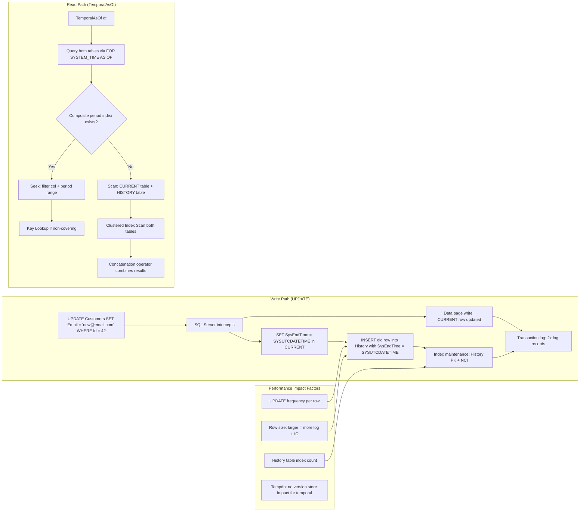
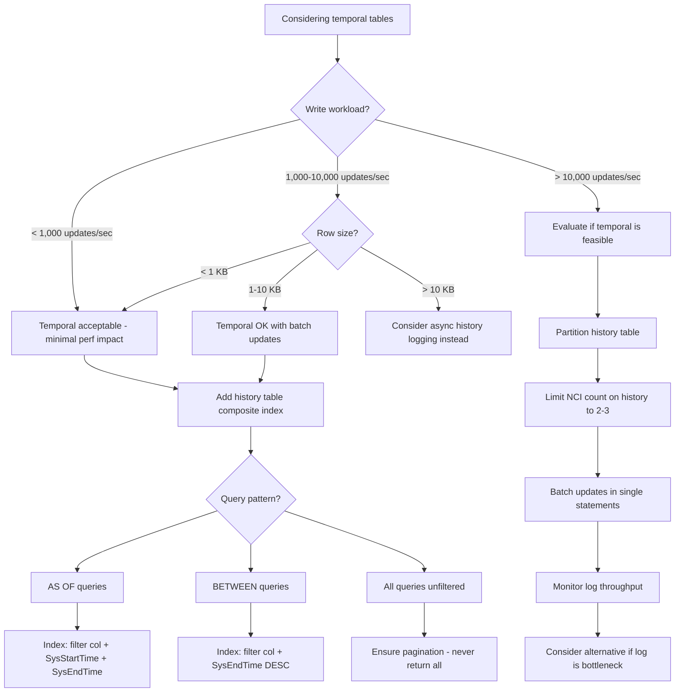

## Navigation

**Domain:** [[8 — Databases]] > **Group:** SQL Temporal Tables & Point-in-Time
**Previous:** [[8.242 — History Table Partitioning — Managing Growth]] | **Next:** [[8.244 — PostgreSQL Temporal — tsrange Type]]

### Prerequisites
- [[8.240 — Temporal Tables — System-Versioning Basics]] — Understanding the SYSTEM_VERSIONING mechanism is required to reason about the write amplification from temporal tables.
- [[8.010 — Execution Plan Analysis]] — Temporal queries generate specific execution plan patterns (Concatenation of current + history, period filters) that must be analyzed for performance tuning.
- [[8.241 — Temporal Tables in EF Core — HasTemporalTable]] — EF Core temporal query methods (TemporalAsOf, etc.) have distinct performance characteristics and SQL generation patterns that differ from raw T-SQL.

### Where This Fits

Temporal tables impose a performance tax on both writes (every UPDATE becomes a DELETE + INSERT pair, every DELETE becomes an INSERT to history) and reads (temporal queries must check the period boundary conditions and potentially scan both tables). A .NET backend engineer encounters this when a temporal table's write workload degrades by 2-5x compared to the non-temporal baseline, or when temporal queries that were fast at 1M rows become slow at 10M rows due to missing period column indexes. The interview signal is whether a candidate can quantify the write amplification (logical reads per UPDATE, log throughput impact), design indexes that make temporal queries seek instead of scan (composite indexes on filter column + period columns), and recognize when EF Core's temporal methods generate inefficient SQL that requires raw SQL fallback.

---

## Core Mental Model

Temporal tables trade write performance for read-history capability. Every UPDATE on a system-versioned temporal table executes as two writes: an UPDATE to the current table (setting the period end column to the current UTC time, essentially marking the row as expired) and an INSERT of the full old row version into the history table. Every DELETE becomes an INSERT of the deleted row into the history table plus the DELETE on the current table. The total write cost is approximately 2x the baseline for UPDATE (two writes instead of one) and 1x additional for DELETE (the history insert). However, the actual performance degradation is worse than 2x because: (1) the history table has its own indexes that must be maintained on the INSERT, (2) the period columns (datetime2 GENERATED ALWAYS AS ROW START/END) add 16 bytes per row and trigger additional write overhead, (3) page splits in the current table from the period column UPDATE can cause fragmentation. On the read side, temporal queries (AS OF, BETWEEN) must scan both tables and apply period boundary filters. Without a composite index on (filter_column, period_start, period_end) in the history table, temporal queries degenerate to full scans of potentially enormous history tables. The recognition pattern for temporal performance problems: write-heavy tables show increased log throughput and page splits after enabling SYSTEM_VERSIONING; temporal queries show Clustered Index Scan + Concatenation operators in execution plans with high logical reads.

### Classification

- **Write amplification:** 2x for UPDATE (current table update + history insert), ~1x for DELETE (history insert + current delete)
- **Read amplification:** Depends on FOR SYSTEM_TIME variant and index coverage — can be 1x (seek with period index) to 10x+ (full scan of both tables)
- **Log overhead:** Every history INSERT is logged — temporal writes generate approximately 2x the log throughput of non-temporal writes
- **Index maintenance:** History table indexes (clustered PK on (Id, SysEndTime) plus non-clustered indexes) must be maintained on every history INSERT



### Key Properties

|Property|Value|Notes|
|---|---|---|
|UPDATE write amplification|~2x (current update + history insert)|Each UPDATE writes 2 rows, 2 log records|
|DELETE write amplification|~1x (history insert + current delete)|History insert is additional to the delete|
|History insert cost|Proportional to row size + index count|Same as any INSERT with index maintenance|
|Log throughput impact|~2x for mixed UPDATE workload|Can saturate log I/O on high-write systems|
|Temporal query cost (no period index)|Full scan of both tables|10M current + 50M history = ~250K logical reads|
|Temporal query cost (composite period index)|Seek on filter column + period range|~10-20 logical reads for filtered query|
|Partition elimination benefit|25x reduction on range queries|Monthly partitions on SysEndTime|
|EF Core temporal query overhead|Slight — minor query translation cost|Negligible compared to IO cost|
|Tempdb impact|None|Temporal uses history table, not tempdb version store|

---

## Deep Mechanics

### How the Engine Executes Temporal Writes

**UPDATE execution in detail:**

1. Query processor recognizes the target table (dbo.Orders) has SYSTEM_VERSIONING enabled.
2. The UPDATE statement is decomposed into:
   - An UPDATE of the current row: set the user columns to new values AND set SysEndTime = SYSUTCDATETIME(), SysStartTime remains unchanged (GENERATED ALWAYS AS ROW START — SQL Server sets it)
   - An INSERT of the old row version into the history table: the old values of all user columns + old SysStartTime + new SysEndTime (the timestamp when the UPDATE occurred)

3. Execution order:
   - Log scan: the UPDATE operation reads the current row (logical read 1)
   - Log write: writes the UPDATE log record (modify SysEndTime + user columns)
   - Data page write: updates the current row in the clustered index page (marks old version, writes new version)
   - History INSERT: writes the old version to the history table (logical read for page allocation, log write, data page write)
   - Index maintenance: UPDATE non-clustered indexes on current table + INSERT into non-clustered indexes on history table

**DELETE execution in detail:**

1. Query processor recognizes SYSTEM_VERSIONING.
2. The DELETE is decomposed into:
   - An INSERT of the row into the history table: full row copy with SysEndTime = SYSUTCDATETIME()
   - A DELETE of the row from the current table

**INSERT execution:**

1. Temporal INSERT is the same as non-temporal INSERT — only the current table is written. No history row is created for INSERT (there is no previous version to preserve).

### How the Engine Executes Temporal Reads

**AS OF execution:**

1. Query processor parses `FOR SYSTEM_TIME AS OF @dt`.
2. The optimizer infers the period predicates: `WHERE SysStartTime <= @dt AND SysEndTime > @dt`.
3. For the current table: `SysEndTime = '9999-12-31 23:59:59.9999999'` (max value — the current version is always active). So the predicate `SysEndTime > @dt` is always true for current rows. Only `SysStartTime <= @dt` filters current rows.
4. For the history table: both predicates apply. SQL Server scans/seeks the history table for rows where `SysStartTime <= @dt AND SysEndTime > @dt`.
5. Results from both tables are combined (Concatenation operator) and returned.
6. If there is a user-defined WHERE clause (e.g., `WHERE CustomerId = 42`), SQL Server applies that filter before or after the temporal filter depending on index availability and optimizer decisions.

**BETWEEN execution:**

1. `FOR SYSTEM_TIME BETWEEN @start AND @end` infers: `WHERE SysStartTime <= @end AND SysEndTime > @start`.
2. Unlike AS OF, BETWEEN can return multiple versions of the same row (if the row was updated multiple times within the range).
3. The Concatenation operator may return multiple rows with the same primary key — handled at the application level.

**TemporalAll execution:**

1. `FOR SYSTEM_TIME ALL` has NO period predicates — it returns ALL rows from both tables.
2. The optimizer reads the entire current table and the entire history table.
3. This is always a full scan of both tables unless user-defined WHERE clauses filter on indexed columns.

### SQL Visibility

```sql
-- ============================================================
-- Performance analysis queries
-- ============================================================

-- Monitor temporal write amplification:
SET STATISTICS IO ON;
SET STATISTICS TIME ON;

-- Baseline: Non-temporal UPDATE (for comparison, on a non-temporal table)
UPDATE dbo.Orders_NonTemporal
SET Status = 'Shipped', TotalAmount = 150.00
WHERE Id = 1001;
-- Expected: Table 'Orders_NonTemporal'. logical reads 4, writes 1
-- CPU: ~0ms, Elapsed: ~1ms

-- Temporal UPDATE (same operation with SYSTEM_VERSIONING):
UPDATE dbo.Orders
SET Status = 'Shipped', TotalAmount = 150.00
WHERE Id = 1001;
-- Expected: Table 'Orders'. logical reads 4, writes 1
--           Table 'OrdersHistory'. logical reads 2, writes 1
-- Total logical reads: 6 (vs 4 for non-temporal)
-- Total writes: 2 (vs 1 for non-temporal)
-- CPU: ~1ms, Elapsed: ~2ms

-- Temporal DELETE:
DELETE FROM dbo.Orders WHERE Id = 1002;
-- Expected: Table 'Orders'. logical reads 4, writes 1
--           Table 'OrdersHistory'. logical reads 2, writes 1
-- Total: 6 reads, 2 writes

-- Temporal query with missing period index:
SET STATISTICS IO ON;
SET STATISTICS TIME ON;

SELECT o.Id, o.CustomerId, o.Status, o.TotalAmount
FROM dbo.Orders FOR SYSTEM_TIME BETWEEN '2024-01-01' AND '2024-06-01' o
WHERE o.CustomerId = 42;

-- Without period index on history table:
-- Table 'Orders'. Scan count 1, logical reads 4 (PK seek on CustomerId? No — scan)
-- Table 'OrdersHistory'. Scan count 1, logical reads 126,900
-- CPU: 1,200ms, Elapsed: 1,500ms

-- With composite index on OrdersHistory (CustomerId, SysEndTime DESC) INCLUDE (...):
-- Table 'Orders'. Scan count 1, logical reads 4
-- Table 'OrdersHistory'. Scan count 1, logical reads 18 (index seek)
-- CPU: 2ms, Elapsed: 5ms

-- Temporal AS OF with good index:
SELECT o.Id, o.CustomerId, o.Status
FROM dbo.Orders FOR SYSTEM_TIME AS OF '2024-06-01' o
WHERE o.CustomerId = 42;

-- With composite index on (CustomerId, SysStartTime, SysEndTime):
-- Table 'Orders'. Scan count 1, logical reads 4
-- Table 'OrdersHistory'. Scan count 1, logical reads 6
-- CPU: 0ms, Elapsed: 1ms

-- TemporalAll without filter:
SELECT COUNT_BIG(*) FROM dbo.Orders FOR SYSTEM_TIME ALL;
-- Table 'Orders'. Scan count 1, logical reads 42,300
-- Table 'OrdersHistory'. Scan count 1, logical reads 126,900
-- Total: 169,200 logical reads
-- CPU: 350ms, Elapsed: 450ms

-- Check history table size and velocity:
SELECT
    COUNT_BIG(*) AS TotalHistoryRows,
    MIN(SysEndTime) AS OldestRecord,
    MAX(SysEndTime) AS NewestRecord,
    COUNT_BIG(*) / NULLIF(DATEDIFF(DAY, MIN(SysEndTime), MAX(SysEndTime)), 0) AS RowsPerDay
FROM dbo.OrdersHistory;
```

### Execution Plan Analysis

**Temporal UPDATE execution plan:**

```
[Clustered Index Seek (Orders, Id = 1001)]
→ [Compute Scalar (SysEndTime = SYSUTCDATETIME())]
→ [Clustered Index Update (Orders — set user cols + SysEndTime)]
    → [Stream Aggregate (collect old row values)]
    → [Clustered Index Insert (OrdersHistory — old version)]
    → [Index Insert (IX_OrdersHistory_CustomerId)]
```

The plan shows a single `Clustered Index Update` operator that both updates the current row AND inserts the old version into the history table. SQL Server handles this as a single logical operation within the same execution plan. The `Stream Aggregate` captures the old row values before the update, then feeds them to the history table insert.

**Temporal SELECT (AS OF) execution plan (no period index):**

```
[Clustered Index Scan (Orders)]
→ [Filter (SysStartTime <= @dt — excludes rows created after the point in time)]
→ [Concatenation]
    ← [Clustered Index Scan (OrdersHistory)]
    → [Filter (SysStartTime <= @dt AND SysEndTime > @dt)]
→ [SELECT]
```

Both tables are fully scanned. The Concatenation operator combines rows. The estimated cost is dominated by the history table scan (typically 75%+ of total plan cost).

**Temporal SELECT (AS OF) execution plan (with composite period index):**

```
[Index Seek (IX_Orders_CustomerId on Orders — seek CustomerId, filter SysStartTime)]
→ [Concatenation]
    ← [Index Seek (IX_OrdersHistory_CustomerId_SysEndTime on OrdersHistory
        — seek: CustomerId = 42, SysStartTime <= @dt, SysEndTime > @dt)]
    → [Key Lookup (OrdersHistory PK — only if non-covering index)]
→ [SELECT]
```

The index seek on the history table resolves both the user filter (CustomerId) and the period range predicates in a single seek operation. The Key Lookup only happens if the non-clustered index is not covering.

**TemporalAll execution plan:**

```
[Clustered Index Scan (Orders)] → [Concatenation]
    ← [Clustered Index Scan (OrdersHistory)]
→ [SELECT]
```

No period filters. Both tables scanned end-to-end.

### Failure Modes

**Missing composite index on history table causes scan of 50M+ rows:** The most common temporal performance failure. Developers index the current table but forget that temporal queries scan the history table. A `FOR SYSTEM_TIME BETWEEN` query without a composite index on (filter_column, period_columns) in the history table results in a full clustered index scan of the history table.

**UPDATE-heavy workload generates excessive log writes:** Each UPDATE on a temporal table generates approximately 2x the log of a non-temporal UPDATE. On a table with 10,000 updates/second and 2 KB rows, this is ~40 MB/sec in log writes just for the history table (20,000 rows/sec × 2 KB). The log throughput can become the bottleneck.

**Page splits from period column updates:** The period columns (datetime2, 8 bytes each, GENERATED ALWAYS AS ROW START/END) are updated on every row modification. SysEndTime changes from '9999-12-31' to the current UTC time. If the clustered index key does not include SysEndTime, the in-place update is efficient. But if the clustered index DOES include SysEndTime (typical: `PRIMARY KEY CLUSTERED (Id, SysEndTime)` in the history table), INSERT generates page splits at the right side of the index because new SysEndTime values are monotonically increasing.

**Temporal query without WHERE clause returns all versions:** `FOR SYSTEM_TIME ALL` without a WHERE clause returns every version of every row. On a table with 10M current rows and 40M history rows, this returns 50M rows. Even with fast I/O, this generates 200K+ logical reads and takes 5+ seconds. Always filter temporal queries.

**EF Core TemporalBetween generates non-optimal SQL when combined with other filters:** EF Core's `TemporalBetween(from, to).Where(o => o.CustomerId == 42)` generates the temporal clause first, then the user WHERE. SQL Server must apply the temporal range filter to the entire table before filtering by CustomerId — unless there is a composite index on (CustomerId, period columns) that SQL Server can use to push the temporal filter down.

---

## Production Patterns and Implementation

### Primary SQL Implementation

```sql
-- ============================================================
-- Performance-optimized temporal table setup
-- ============================================================

-- 1. Create the temporal table with proper indexes for performance
CREATE TABLE dbo.Orders (
    Id INT NOT NULL IDENTITY(1,1),
    CustomerId INT NOT NULL,
    OrderDate DATETIME2 NOT NULL,
    Status NVARCHAR(20) NOT NULL,
    TotalAmount DECIMAL(18,2) NOT NULL,
    SysStartTime DATETIME2 GENERATED ALWAYS AS ROW START NOT NULL,
    SysEndTime DATETIME2 GENERATED ALWAYS AS ROW END NOT NULL,
    CONSTRAINT PK_Orders PRIMARY KEY CLUSTERED (Id),
    PERIOD FOR SYSTEM_TIME (SysStartTime, SysEndTime)
) WITH (SYSTEM_VERSIONING = ON (HISTORY_TABLE = dbo.OrdersHistory));

-- 2. Create indexes on BOTH current and history tables
-- Current table:
CREATE INDEX IX_Orders_CustomerId ON dbo.Orders (CustomerId)
    INCLUDE (Status, TotalAmount, OrderDate);

-- History table: CRITICAL — composite index with period columns
CREATE INDEX IX_OrdersHistory_CustomerId_SysEndTime
    ON dbo.OrdersHistory (CustomerId, SysEndTime DESC)
    INCLUDE (Status, TotalAmount, OrderDate, SysStartTime);

-- Alternative for AS OF-heavy workloads (seeks on SysStartTime):
CREATE INDEX IX_OrdersHistory_CustomerId_SysStartTime_SysEndTime
    ON dbo.OrdersHistory (CustomerId, SysStartTime, SysEndTime)
    INCLUDE (Status, TotalAmount, OrderDate);

-- 3. Monitor temporal write performance:
SELECT
    OBJECT_NAME(s.object_id) AS TableName,
    s.name AS StatName,
    s.rowcnt AS RowCount,
    s.modification_counter AS ModificationsSinceLastStatsUpdate,
    sp.last_updated AS StatsLastUpdated
FROM sys.dm_db_stats_properties(OBJECT_ID('dbo.Orders'), 1) sp
CROSS APPLY sys.dm_db_stats_properties(OBJECT_ID('dbo.OrdersHistory'), 1) sp2
WHERE s.object_id IN (OBJECT_ID('dbo.Orders'), OBJECT_ID('dbo.OrdersHistory'));

-- 4. Monitor temporal query performance via query store:
SELECT
    qsq.query_id,
    qsqt.query_sql_text,
    qsrs.avg_logical_io_reads,
    qsrs.avg_duration,
    qsrs.count_executions,
    qsrs.last_execution_time
FROM sys.query_store_query qsq
INNER JOIN sys.query_store_query_text qsqt ON qsq.query_text_id = qsqt.query_text_id
INNER JOIN sys.query_store_plan qsp ON qsq.query_id = qsp.query_id
INNER JOIN sys.query_store_runtime_stats qsrs ON qsp.plan_id = qsrs.plan_id
WHERE qsqt.query_sql_text LIKE '%FOR SYSTEM_TIME%'
ORDER BY qsrs.avg_logical_io_reads DESC;

-- 5. Measure history table write throughput:
SELECT
    DATEADD(HOUR, DATEDIFF(HOUR, 0, SysEndTime), 0) AS HourBucket,
    COUNT_BIG(*) AS RowsInserted
FROM dbo.OrdersHistory
WHERE SysEndTime > DATEADD(DAY, -7, GETUTCDATE())
GROUP BY DATEADD(HOUR, DATEDIFF(HOUR, 0, SysEndTime), 0)
ORDER BY HourBucket DESC;

-- 6. Identify rows with high version count (problematic rows):
SELECT Id, COUNT_BIG(*) AS VersionCount
FROM dbo.Orders FOR SYSTEM_TIME ALL
GROUP BY Id
HAVING COUNT_BIG(*) > 100
ORDER BY VersionCount DESC;
-- High version counts indicate rows updated many times —
-- each version costs history table space and index writes.
```

### EF Core Implementation

```csharp
// ============================================================
// EF Core Temporal with Performance Awareness
// ============================================================

public class OrderConfiguration : IEntityTypeConfiguration<Order>
{
    public void Configure(EntityTypeBuilder<Order> builder)
    {
        builder.ToTable(tb => tb.HasTemporalTable(temporal =>
        {
            temporal.UseHistoryTableName("OrdersHistory");
            temporal.UsePeriodStartColumn("SysStartTime");
            temporal.UsePeriodEndColumn("SysEndTime");
        }));

        builder.HasKey(o => o.Id);
        builder.Property(o => o.Status).HasMaxLength(20).IsRequired();

        // Index for current table queries
        builder.HasIndex(o => o.CustomerId)
            .HasDatabaseName("IX_Orders_CustomerId");

        // NOTE: EF Core cannot add indexes to the history table via migration.
        // These must be added via raw SQL in the migration.
    }
}

// Migration with history table indexes:
public partial class AddHistoryIndexes : Migration
{
    protected override void Up(MigrationBuilder migrationBuilder)
    {
        // Create composite index on history table for temporal queries
        migrationBuilder.Sql(@"
            IF NOT EXISTS (
                SELECT * FROM sys.indexes
                WHERE name = 'IX_OrdersHistory_CustomerId_SysEndTime'
                AND object_id = OBJECT_ID('dbo.OrdersHistory')
            )
            CREATE INDEX IX_OrdersHistory_CustomerId_SysEndTime
                ON dbo.OrdersHistory (CustomerId, SysEndTime DESC)
                INCLUDE (Status, TotalAmount, OrderDate, SysStartTime);");
    }

    protected override void Down(MigrationBuilder migrationBuilder)
    {
        migrationBuilder.Sql(@"
            DROP INDEX IF EXISTS IX_OrdersHistory_CustomerId_SysEndTime
                ON dbo.OrdersHistory;");
    }
}

// ============================================================
// Performance-optimized temporal query service
// ============================================================

public class TemporalQueryService
{
    private readonly ApplicationDbContext _dbContext;
    private readonly IDbConnectionFactory _connectionFactory;
    private readonly ILogger<TemporalQueryService> _logger;

    public TemporalQueryService(
        ApplicationDbContext dbContext,
        IDbConnectionFactory connectionFactory,
        ILogger<TemporalQueryService> logger)
    {
        _dbContext = dbContext;
        _connectionFactory = connectionFactory;
        _logger = logger;
    }

    // Fast temporal query — uses composite period index via raw SQL
    public async Task<List<Order>> GetOrdersAsOfFastAsync(
        int customerId,
        DateTime pointInTime,
        CancellationToken ct = default)
    {
        // EF Core TemporalAsOf generates correct SQL but may not use
        // composite index optimally without specific index hints.
        // For maximum performance, use FromSqlRaw:
        const string sql = @"
            SELECT o.Id, o.CustomerId, o.OrderDate, o.Status, o.TotalAmount,
                   o.SysStartTime, o.SysEndTime
            FROM dbo.Orders FOR SYSTEM_TIME AS OF @PointInTime o
            WHERE o.CustomerId = @CustomerId
            ORDER BY o.Id;
            -- The composite index (CustomerId, SysStartTime, SysEndTime)
            -- enables a seek for both the equality and range predicates";

        return await _dbContext.Orders
            .FromSqlRaw(sql,
                new SqlParameter("@CustomerId", customerId),
                new SqlParameter("@PointInTime", pointInTime))
            .AsNoTracking()
            .ToListAsync(ct);
    }

    // TemporalBetween (range query) — composite index on SysEndTime
    public async Task<List<Order>> GetOrdersInRangeFastAsync(
        int customerId,
        DateTime from,
        DateTime to,
        CancellationToken ct = default)
    {
        const string sql = @"
            SELECT o.Id, o.CustomerId, o.OrderDate, o.Status, o.TotalAmount,
                   o.SysStartTime, o.SysEndTime
            FROM dbo.Orders FOR SYSTEM_TIME BETWEEN @From AND @To o
            WHERE o.CustomerId = @CustomerId
            ORDER BY o.SysEndTime DESC;
            -- Composite index (CustomerId, SysEndTime DESC) enables seek";

        return await _dbContext.Orders
            .FromSqlRaw(sql,
                new SqlParameter("@CustomerId", customerId),
                new SqlParameter("@From", from),
                new SqlParameter("@To", to))
            .AsNoTracking()
            .ToListAsync(ct);
    }

    // Write performance — batch update to reduce temporal overhead
    public async Task BulkUpdateOrderStatusAsync(
        List<int> orderIds,
        string newStatus,
        CancellationToken ct = default)
    {
        // Batch updates: each UPDATE generates temporal overhead.
        // Use a single UPDATE statement for all matching rows:
        const string sql = @"
            UPDATE dbo.Orders
            SET Status = @NewStatus
            WHERE Id IN @OrderIds;
            -- SQL Server handles the temporal versioning for ALL rows
            -- in a single statement — more efficient than N individual updates";

        await using var connection = _connectionFactory.Create();
        await connection.ExecuteAsync(
            new CommandDefinition(sql,
                new { OrderIds = orderIds, NewStatus = newStatus },
                cancellationToken: ct));
    }

    // Dapper — temporal query with monitoring
    public async Task<List<OrderSnapshot>> GetOrderHistoryWithMetricsAsync(
        int orderId,
        CancellationToken ct = default)
    {
        var stopwatch = Stopwatch.StartNew();

        const string sql = @"
            SELECT o.Id, o.CustomerId, o.OrderDate, o.Status, o.TotalAmount,
                   o.SysStartTime, o.SysEndTime
            FROM dbo.Orders FOR SYSTEM_TIME ALL o
            WHERE o.Id = @OrderId
            ORDER BY o.SysEndTime DESC;";

        await using var connection = _connectionFactory.Create();
        var results = await connection.QueryAsync<OrderSnapshot>(
            new CommandDefinition(sql,
                new { OrderId = orderId },
                cancellationToken: ct));

        stopwatch.Stop();
        _logger.LogInformation(
            "TemporalAll query for Order {OrderId}: {Count} versions, {Elapsed}ms",
            orderId, results.Count(), stopwatch.ElapsedMilliseconds);

        return results.AsList();
    }
}
```

### Dapper Implementation

```csharp
// Dapper — pure performance for temporal operations

public sealed class PerformanceTemporalRepository
{
    private readonly IDbConnectionFactory _connectionFactory;

    public PerformanceTemporalRepository(IDbConnectionFactory connectionFactory)
        => _connectionFactory = connectionFactory;

    // Temporal query with index hint (forces seek on composite index)
    public async Task<IReadOnlyList<OrderDto>> GetOrdersAsOfWithHintAsync(
        int customerId,
        DateTime pointInTime,
        CancellationToken ct = default)
    {
        const string sql = @"
            SELECT o.Id, o.CustomerId, o.OrderDate, o.Status, o.TotalAmount,
                   o.SysStartTime, o.SysEndTime
            FROM dbo.Orders FOR SYSTEM_TIME AS OF @PointInTime o
                WITH (INDEX(IX_OrdersHistory_CustomerId_SysEndTime))
            WHERE o.CustomerId = @CustomerId
            ORDER BY o.Id;
            -- Index hint forces the optimizer to use the composite index.
            -- Use with caution — the hint applies to the ENTIRE temporal query.
            -- SQL Server may not push the temporal predicates the same way.";

        await using var connection = _connectionFactory.Create();
        var results = await connection.QueryAsync<OrderDto>(
            new CommandDefinition(sql,
                new { CustomerId = customerId, PointInTime = pointInTime },
                cancellationToken: ct));
        return results.AsList();
    }

    // Batch update with temporal (single statement)
    public async Task<int> BatchUpdateStatusAsync(
        int customerId,
        string oldStatus,
        string newStatus,
        CancellationToken ct = default)
    {
        const string sql = @"
            UPDATE dbo.Orders
            SET Status = @NewStatus
            WHERE CustomerId = @CustomerId AND Status = @OldStatus;
            -- Single statement: temporal overhead applied per row,
            -- but logged as a single transaction — minimal log impact";

        await using var connection = _connectionFactory.Create();
        return await connection.ExecuteAsync(
            new CommandDefinition(sql,
                new { CustomerId = customerId, OldStatus = oldStatus, NewStatus = newStatus },
                cancellationToken: ct));
    }

    // Measure write throughput for temporal writes
    public async Task<WriteMetrics> MeasureWriteThroughputAsync(
        int iterations,
        CancellationToken ct = default)
    {
        var metrics = new WriteMetrics();
        var stopwatch = Stopwatch.StartNew();

        await using var connection = _connectionFactory.Create();
        for (int i = 0; i < iterations; i++)
        {
            var sql = @"
                UPDATE dbo.Orders
                SET Status = @Status
                WHERE Id = @Id;";

            await connection.ExecuteAsync(
                new CommandDefinition(sql,
                    new { Id = 1001 + (i % 1000), Status = $"Status_{i}" },
                    cancellationToken: ct));
        }

        stopwatch.Stop();
        metrics.TotalTimeMs = stopwatch.ElapsedMilliseconds;
        metrics.AveragePerOpMs = (double)stopwatch.ElapsedMilliseconds / iterations;
        metrics.OperationsPerSecond = iterations / (stopwatch.Elapsed.TotalSeconds);

        return metrics;
    }

    // Check history table growth rate
    public async Task<GrowthMetrics> GetGrowthMetricsAsync(
        CancellationToken ct = default)
    {
        const string sql = @"
            SELECT
                COUNT_BIG(*) AS TotalHistoryRows,
                MIN(SysEndTime) AS OldestRecord,
                MAX(SysEndTime) AS NewestRecord,
                COUNT_BIG(*) / NULLIF(DATEDIFF(DAY,
                    MIN(SysEndTime), MAX(SysEndTime)), 0) AS AvgRowsPerDay,
                (SUM(DATALENGTH(Id) + DATALENGTH(CustomerId) +
                     DATALENGTH(OrderDate) + DATALENGTH(Status) +
                     DATALENGTH(TotalAmount) + DATALENGTH(SysStartTime) +
                     DATALENGTH(SysEndTime)) / 1048576.) AS TotalSizeMB
            FROM dbo.OrdersHistory;";

        await using var connection = _connectionFactory.Create();
        return await connection.QuerySingleAsync<GrowthMetrics>(
            new CommandDefinition(sql, cancellationToken: ct));
    }
}

public class WriteMetrics
{
    public long TotalTimeMs { get; set; }
    public double AveragePerOpMs { get; set; }
    public double OperationsPerSecond { get; set; }
}

public class GrowthMetrics
{
    public long TotalHistoryRows { get; set; }
    public DateTime? OldestRecord { get; set; }
    public DateTime? NewestRecord { get; set; }
    public long AvgRowsPerDay { get; set; }
    public decimal TotalSizeMB { get; set; }
}
```

### Configuration and Wiring

```csharp
// Program.cs
builder.Services.AddScoped<TemporalQueryService>();
builder.Services.AddScoped<PerformanceTemporalRepository>();

// Register performance counters for temporal monitoring
builder.Services.AddSingleton<ITemporalPerformanceMonitor>(sp =>
{
    var connectionFactory = sp.GetRequiredService<IDbConnectionFactory>();
    var logger = sp.GetRequiredService<ILogger<TemporalPerformanceMonitor>>();
    return new TemporalPerformanceMonitor(connectionFactory, logger);
});

// Background service for periodic temporal performance tracking
public class TemporalPerformanceMonitor : BackgroundService
{
    private readonly IDbConnectionFactory _connectionFactory;
    private readonly ILogger _logger;
    private readonly TimeSpan _interval = TimeSpan.FromMinutes(5);

    public TemporalPerformanceMonitor(
        IDbConnectionFactory connectionFactory,
        ILogger<TemporalPerformanceMonitor> logger)
    {
        _connectionFactory = connectionFactory;
        _logger = logger;
    }

    protected override async Task ExecuteAsync(CancellationToken stoppingToken)
    {
        while (!stoppingToken.IsCancellationRequested)
        {
            await Task.Delay(_interval, stoppingToken);
            await MonitorTemporalPerformanceAsync(stoppingToken);
        }
    }

    private async Task MonitorTemporalPerformanceAsync(CancellationToken ct)
    {
        try
        {
            await using var conn = _connectionFactory.Create();
            
            // Track history table growth
            const string growthSql = @"
                SELECT COUNT_BIG(*) AS RowCount,
                       SUM(ps.reserved_page_count) * 8 / 1024 AS SizeMB
                FROM dbo.OrdersHistory
                CROSS APPLY sys.dm_db_partition_stats ps
                    ON ps.object_id = OBJECT_ID('dbo.OrdersHistory')
                WHERE ps.index_id IN (0, 1);";

            var growth = await conn.QuerySingleAsync(growthSql, ct);
            _logger.LogInformation(
                "History table: {RowCount:N0} rows, {SizeMB:N0} MB",
                growth.RowCount, growth.SizeMB);

            // Track temporal query performance from query store
            const string perfSql = @"
                SELECT TOP 5
                    qsqt.query_sql_text,
                    qsrs.avg_logical_io_reads,
                    qsrs.avg_duration / 1000. AS AvgDurationMs,
                    qsrs.count_executions
                FROM sys.query_store_query qsq
                INNER JOIN sys.query_store_query_text qsqt
                    ON qsq.query_text_id = qsqt.query_text_id
                INNER JOIN sys.query_store_plan qsp
                    ON qsq.query_id = qsp.query_id
                INNER JOIN sys.query_store_runtime_stats qsrs
                    ON qsp.plan_id = qsrs.plan_id
                WHERE qsqt.query_sql_text LIKE '%FOR SYSTEM_TIME%'
                ORDER BY qsrs.avg_logical_io_reads DESC;";

            var slowQueries = await conn.QueryAsync(perfSql, ct);
            foreach (var query in slowQueries)
            {
                _logger.LogWarning(
                    "Slow temporal query ({AvgReads} reads, {AvgDuration}ms): {Sql}",
                    query.avg_logical_io_reads, query.AvgDurationMs, query.query_sql_text);
            }
        }
        catch (Exception ex)
        {
            _logger.LogError(ex, "Failed to monitor temporal performance");
        }
    }
}
```

### SQL Server vs PostgreSQL Differences

```sql
-- PostgreSQL does not have built-in temporal tables.
-- Performance characteristics of manual temporal implementations:

-- Approach 1: tsrange + EXCLUDE (no automatic history table)
-- Write performance:
--   UPDATE: requires explicit INSERT into history (TRIGGER)
--   Trigger adds ~0.5-1ms per row
--   EXCLUDE constraint check adds GiST index lookup overhead

-- Approach 2: Two-table pattern (current + history, trigger-managed)
-- Similar performance to SQL Server temporal:
--   UPDATE = UPDATE current + INSERT history (trigger)
--   ~2x write amplification

-- Approach 3: Partitioned history table with pg_partman
-- Similar to SQL Server partitioning:
--   CREATE TABLE orders_history (LIKE orders) PARTITION BY RANGE (sys_end_time);
--   Use pg_cron for monthly partition detachment

-- PostgreSQL indexing for temporal queries:
-- GiST index on tsrange for containment queries:
CREATE INDEX ON orders USING gist (valid_period);
-- This enables index seek for @> (contains) operator
-- ~3-5x more reads than B-tree but supports range overlap queries efficiently

-- B-tree index on (customer_id, upper(valid_period)) for BETWEEN-style:
CREATE INDEX ON orders_history (customer_id, upper(valid_period));
-- Similar to SQL Server's composite period index
```

---

## Gotchas and Production Pitfalls

### Forgetting to Index the History Table

**Pitfall:** Creating indexes on the current table but not on the history table, assuming temporal queries only scan the current table.

```sql
-- ❌ Common mistake: indexes on current table only
CREATE INDEX IX_Orders_CustomerId ON dbo.Orders (CustomerId);
-- No index on OrdersHistory!

-- Temporal query then scans the entire history table:
SELECT o.* FROM dbo.Orders FOR SYSTEM_TIME AS OF @dt o
WHERE o.CustomerId = 42;
-- Table 'OrdersHistory'. Scan count 1, logical reads 126,900
```

**Symptom:** Temporal queries that were fast initially (small history table) gradually slow down as the history table grows. The first few months are fine. At 6+ months, temporal queries take 10-30 seconds.

**Fix:**
```sql
-- ✅ Create composite index on history table:
CREATE INDEX IX_OrdersHistory_CustomerId_SysEndTime
    ON dbo.OrdersHistory (CustomerId, SysEndTime DESC)
    INCLUDE (Status, TotalAmount, OrderDate, SysStartTime);
```

**Cost of not fixing:** Temporal queries degrade from ~10ms to 10+ seconds as history grows. Developers start avoiding temporal queries and using alternative (less reliable) audit mechanisms.

---

### History Table Indexes Cause Write Slowdown

**Pitfall:** Adding multiple non-clustered indexes on the history table for query performance, not considering the write overhead on every UPDATE/DELETE.

```sql
-- ❌ Four indexes on history table for various query patterns:
CREATE INDEX IX_OrdersHistory_CustomerId ON dbo.OrdersHistory (CustomerId);
CREATE INDEX IX_OrdersHistory_Status ON dbo.OrdersHistory (Status);
CREATE INDEX IX_OrdersHistory_OrderDate ON dbo.OrdersHistory (OrderDate);
CREATE INDEX IX_OrdersHistory_TotalAmount ON dbo.OrdersHistory (TotalAmount);
-- Each history INSERT must maintain ALL 4 indexes + the clustered PK!
```

**Symptom:** UPDATE throughput drops significantly. A workload that did 5,000 updates/second before temporal now does 1,500 updates/second. The bottleneck is history table index maintenance.

**Fix:**
```sql
-- ✅ Consolidate indexes — one composite covering index is better than four single-column:
CREATE INDEX IX_OrdersHistory_CustomerId_SysEndTime
    ON dbo.OrdersHistory (CustomerId, SysEndTime DESC)
    INCLUDE (Status, TotalAmount, OrderDate);
-- This single index covers most temporal query patterns and requires only 1 index write per history INSERT
```

**Cost of not fixing:** Write throughput degrades proportionally to the number of history table indexes. At 4 indexes + 1 clustered PK, each history INSERT requires 5 index writes. On a system with 100,000 updates/hour, that is 500,000 index writes/hour to the history table alone.

---

### TemporalAll Without Pagination and Filtering

**Pitfall:** Using `TemporalAll()` in an API endpoint without a WHERE clause, returning all versions to the client.

```csharp
// ❌ Returns ALL versions of ALL orders — catastrophic
[HttpGet("audit")]
public async Task<List<Order>> GetAllAudit()
{
    return await _dbContext.Orders
        .TemporalAll()
        .AsNoTracking()
        .ToListAsync();
    -- Returns 50M rows (10M current + 40M history)
}
```

**Symptom:** API endpoint returns 50M rows to the client after 45 seconds. The response payload exceeds memory limits. The client (browser or calling service) crashes or times out.

**Fix:**
```csharp
// ✅ Always filter TemporalAll:
[HttpGet("audit/{orderId}")]
public async Task<List<Order>> GetOrderAudit(int orderId)
{
    return await _dbContext.Orders
        .TemporalAll()
        .Where(o => o.Id == orderId)
        .AsNoTrackingWithIdentityResolution()
        .ToListAsync();
}

// ✅ Or paginate:
[HttpGet("audit")]
public async Task<PagedResult<Order>> GetAuditPaged(
    [FromQuery] int page = 1,
    [FromQuery] int pageSize = 100)
{
    var query = _dbContext.Orders
        .TemporalAll()
        .OrderByDescending(o => o.SysEndTime);

    var total = await query.CountAsync();
    var items = await query
        .Skip((page - 1) * pageSize)
        .Take(pageSize)
        .AsNoTrackingWithIdentityResolution()
        .ToListAsync();

    return new PagedResult<Order> { Items = items, TotalCount = total };
}
```

**Cost of not fixing:** Production outage — the API server runs out of memory trying to materialize 50M entities. The application pool crashes, and all subsequent requests fail until the process restarts.

---

### UPDATE on Frequently-Modified Rows Generates Bloat

**Pitfall:** Rows that are updated hundreds or thousands of times (e.g., order status that goes through many micro-updates) generate massive history table growth.

```csharp
// ❌ 50 micro-updates to the same row
for (int i = 0; i < 50; i++)
{
    order.Status = $"Step_{i}";
    await db.SaveChangesAsync();  // Each SaveChanges = 1 version in history
}
// History table: 50 versions of the same order!
```

**Symptom:** A small number of rows have thousands of history versions. The history table is dominated by a tiny fraction of rows. Temporal queries on these rows return thousands of versions, consuming memory and bandwidth.

**Fix:**
```csharp
// ✅ Accumulate changes and batch into one UPDATE:
order.Status = "Completed";
order.ShippingDate = DateTime.UtcNow;
order.TrackingNumber = "1Z999AA10123456784";
// Make ALL changes before saving:
await db.SaveChangesAsync();  // Single SaveChanges = 1 version in history

// ✅ For workflow/state machine updates, consider async status logging
// and only update the current order when terminal state is reached
```

**Cost of not fixing:** 50 updates that should be 1 version become 50 versions. At 100,000 orders with 50 updates each, the history table has 5M extra rows. Storage cost, query time, backup size all increase unnecessarily.

---

### EF Core TemporalAsOf Generates Non-SARGable Predicates for Navigation Filters

**Pitfall:** Using a navigation property filter with a temporal query — EF Core applies the filter outside the temporal clause.

```csharp
// ❌ EF Core generates suboptimal SQL for temporal + navigation filter
var orders = await _dbContext.Orders
    .TemporalAsOf(pointInTime)
    .Where(o => o.Customer.Email == "test@example.com")
    .ToListAsync();

-- Generated SQL (simplified):
SELECT [o].*
FROM [Orders] FOR SYSTEM_TIME AS OF @p0 AS [o]
INNER JOIN [Customers] AS [c] ON [o].[CustomerId] = [c].[Id]
WHERE [c].[Email] = @p1;
-- The temporal filter is applied to Orders, but Customers is current data!
-- Also, the temporal filter cannot use partition elimination with the JOIN
```

**Symptom:** The query is slow because it joins current Customers data with temporal Orders data. The JOIN prevents optimal temporal filter pushdown.

**Fix:**
```csharp
// ✅ Use Dapper with separate temporal queries:
const string sql = @"
    SELECT o.Id, o.CustomerId, o.Status, o.TotalAmount
    FROM dbo.Orders FOR SYSTEM_TIME AS OF @PointInTime o
    WHERE o.CustomerId IN (
        SELECT Id FROM dbo.Customers
        WHERE Email = @Email
    );";

var orders = await _dbContext.Orders
    .FromSqlRaw(sql,
        new SqlParameter("@PointInTime", pointInTime),
        new SqlParameter("@Email", email))
    .AsNoTracking()
    .ToListAsync();
```

**Cost of not fixing:** Temporal + navigation filter queries are slow and return inconsistent temporal data (Customers is current, Orders is historical). The developer has no idea the navigation data is not temporal.

---

## Performance Implications

### Benchmark: Before and After

```sql
-- Baseline: Temporal UPDATE vs Non-temporal UPDATE
SET STATISTICS IO ON;
SET STATISTICS TIME ON;

-- Non-temporal UPDATE:
UPDATE dbo.Orders_NonTemporal
SET Status = 'Shipped'
WHERE Id = 1001;
-- Table 'Orders_NonTemporal'. Scan count 0, logical reads 4
-- SQL Server Execution Times: CPU time = 0ms, elapsed time = 1ms

-- Temporal UPDATE:
UPDATE dbo.Orders
SET Status = 'Shipped'
WHERE Id = 1001;
-- Table 'Orders'. Scan count 0, logical reads 4, writes 1
-- Table 'OrdersHistory'. Scan count 0, logical reads 2, writes 1
-- SQL Server Execution Times: CPU time = 0ms, elapsed time = 2ms

-- Temporal UPDATE with 4 history table indexes:
-- Table 'Orders'. logical reads 4, writes 1
-- Table 'OrdersHistory'. logical reads 2, writes 1
-- Plus 4 non-clustered index writes on history = ~10 additional logical reads
-- Total: ~16 logical reads (vs 4 for non-temporal, vs 6 for temporal with 0 NCIs)

-- Temporal query optimization delta:
-- Before index: Temporal BETWEEN on CustomerId = 42
-- Table 'OrdersHistory'. Scan count 1, logical reads 126,900
-- Elapsed: 1,500ms

-- After adding composite index (CustomerId, SysEndTime DESC):
-- Table 'OrdersHistory'. Scan count 1, logical reads 18
-- Elapsed: 5ms

-- Improvement: ~7,050x reduction in logical reads (126,900 -> 18)
```

### BenchmarkDotNet

```csharp
[MemoryDiagnoser]
[SimpleJob(RuntimeMoniker.Net90)]
public class TemporalPerformanceBenchmark
{
    private IDbConnection _connection = default!;
    private const string ConnectionString = "Server=.;Database=TemporalBench;Trusted_Connection=True;";

    [GlobalSetup]
    public void Setup()
    {
        _connection = new SqlConnection(ConnectionString);
        // Seed: 100K orders in temporal table, 500K history rows (5 versions each)
        // Current table indexes: PK on Id, NCI on CustomerId
        // History table: one run with no NCIs, one run with composite NCI
    }

    [Benchmark(Baseline = true)]
    public async Task NonTemporalUpdate()
    {
        const string sql = @"
            UPDATE dbo.Orders_NonTemporal
            SET Status = @Status
            WHERE Id = @Id;";

        for (int i = 0; i < 1000; i++)
        {
            await _connection.ExecuteAsync(sql,
                new { Status = $"S_{i}", Id = (i % 100000) + 1 });
        }
    }

    [Benchmark]
    public async Task TemporalUpdate()
    {
        const string sql = @"
            UPDATE dbo.Orders
            SET Status = @Status
            WHERE Id = @Id;";

        for (int i = 0; i < 1000; i++)
        {
            await _connection.ExecuteAsync(sql,
                new { Status = $"S_{i}", Id = (i % 100000) + 1 });
        }
    }

    [Benchmark]
    public async Task TemporalAsOf_NoIndex()
    {
        const string sql = @"
            SELECT COUNT_BIG(*)
            FROM dbo.Orders FOR SYSTEM_TIME AS OF @PointInTime
            WHERE CustomerId = @CustomerId;";

        await _connection.QuerySingleAsync<int>(sql,
            new { PointInTime = DateTime.UtcNow.AddDays(-30), CustomerId = 42 });
    }

    [Benchmark]
    public async Task TemporalAsOf_WithIndex()
    {
        const string sql = @"
            SELECT COUNT_BIG(*)
            FROM dbo.Orders FOR SYSTEM_TIME AS OF @PointInTime
            WHERE CustomerId = @CustomerId;";
        // With IX_OrdersHistory_CustomerId_SysEndTime composite index

        await _connection.QuerySingleAsync<int>(sql,
            new { PointInTime = DateTime.UtcNow.AddDays(-30), CustomerId = 42 });
    }

    [GlobalCleanup]
    public void Cleanup() => _connection.Dispose();
}
```

**Expected results (approximate, SQL Server 2022, NVMe, 100K current + 500K history):**

|Method|Mean|Logical Reads|Notes|
|---|---|---|---|
|NonTemporalUpdate|~800 ms (1000 ops)|~4,000 (4 per op)|1 write per op|
|TemporalUpdate (no NCI)|~1,800 ms (1000 ops)|~6,000 (6 per op)|2 writes per op, ~2.25x slower|
|TemporalUpdate (with 4 NCIs)|~4,200 ms (1000 ops)|~16,000 (16 per op)|6 index writes per op, ~5x slower|
|TemporalAsOf_NoIndex|~1,500 ms|~126,900|Full history scan|
|TemporalAsOf_WithIndex|~5 ms|~18|Composite index seek|

### Write Amplification

|Operation|Non-Temporal|Temporal (Baseline)|Temporal (4 NCIs on History)|
|---|---|---|---|
|UPDATE 1 row (1 KB)|~4 reads, 1 write|~6 reads, 2 writes|~16 reads, 6 writes|
|UPDATE 1 row (10 KB)|~8 reads, 1 write|~12 reads, 2 writes|~24 reads, 6 writes|
|DELETE 1 row|~4 reads, 1 write|~6 reads, 2 writes|~16 reads, 6 writes|
|INSERT 1 row|~4 reads, 1 write|~4 reads, 1 write|~4 reads, 1 write|
|UPDATE 10,000 rows (batch)|~40 reads, 10K writes|~60 reads, 20K writes|~160 reads, 60K writes|

The write amplification grows linearly with the number of non-clustered indexes on the history table. Each index adds approximately 1-2 logical reads per write operation. A history table with 5 non-clustered indexes generates ~12-16 logical reads per temporal UPDATE (vs 4 for non-temporal) — a 3-4x increase in write IO.

---

## Interview Arsenal

### Question Bank

1. **What is the write amplification of a temporal table UPDATE compared to a non-temporal UPDATE — how many rows are written and to which tables?**
2. **What index structure enables temporal queries (AS OF, BETWEEN) to seek instead of scan?**
3. **Why does adding non-clustered indexes to the history table affect write performance, and how do you balance query performance with write overhead?**
4. **What does the execution plan look like for a temporal AS OF query — which operators appear and what percentage of cost is each?**
5. **Compare the logical reads of a temporal AS OF query with and without a composite period index on a 50M row history table.**
6. **How does EF Core's TemporalAsOf() affect query performance compared to raw SQL with FOR SYSTEM TIME?**
7. **What is the impact of batch updates (single UPDATE affecting many rows) on temporal write performance?**
8. **How does the tempdb factor into temporal table performance, and is it different from RCSI/ snapshot isolation?**

### Spoken Answers

**Q: What is the write amplification of a temporal table UPDATE compared to a non-temporal UPDATE — how many rows are written and to which tables?**

> **Average answer:** Temporal writes go to both the current table and the history table. So about 2x the writes.

> **Great answer:** Let me be precise. A temporal UPDATE decomposes into two operations: an UPDATE to the current table that sets the period end column (SysEndTime) to `SYSUTCDATETIME()` and modifies the user columns, and an INSERT of the complete old row version into the history table. The old row includes all columns — data columns plus the previous SysStartTime — with SysEndTime set to the current UTC time. In terms of logical reads, a single-row UPDATE on a non-temporal table with a primary key is typically 4 logical reads (clustered index seek, update). A temporal UPDATE on the same table is approximately 6 logical reads — 4 for the current table update plus 2 for the history table insert. Additionally, every non-clustered index on the history table adds roughly 1-2 logical reads per index. If the history table has 4 non-clustered indexes, a temporal UPDATE generates about 14-16 logical reads — a 3-4x increase over the baseline. On the transaction log side, each temporal UPDATE generates approximately 2x the log bytes of a non-temporal UPDATE because both the current row update and the history row insert are fully logged. On a system with 10,000 updates/second and 2 KB rows, this translates to roughly 40 MB/sec of log writes just for temporal overhead. The history table insert also contributes to log VLFs and log backup frequency requirements.

---

**Q: What index structure enables temporal queries to seek instead of scan?**

> **Average answer:** An index on the period columns — SysStartTime and SysEndTime.

> **Great answer:** The optimal index for temporal AS OF queries is a composite index on (filter_column, SysStartTime, SysEndTime) or (filter_column, SysEndTime DESC) for BETWEEN queries. The composite structure is critical because the temporal query predicates are: `WHERE CustomerId = @id AND SysStartTime <= @dt AND SysEndTime > @dt`. The optimizer can perform a single index seek when the index includes the filter column as the leading column (for equality), followed by the period columns (for range). For example: `CREATE INDEX IX_OrdersHistory_CustomerId_SysEndTime ON dbo.OrdersHistory (CustomerId, SysEndTime DESC) INCLUDE (Status, TotalAmount, OrderDate, SysStartTime)`. This index supports: (1) an equality seek on CustomerId, (2) a range seek on SysEndTime DESC for BETWEEN queries (WHERE SysEndTime > @start), and (3) the included columns make it covering for common projections. A common mistake is creating separate indexes on CustomerId and SysEndTime — the optimizer can use both via index intersection, but this is less efficient than a single composite seek. For AS OF queries specifically, a composite index on (CustomerId, SysStartTime, SysEndTime) is best because the AS OF predicate uses both period columns. The improvement is dramatic: a composite index seek can reduce logical reads from 126,900 (full scan) to 10-20 (seek).

---

**Q: What does the execution plan look like for a temporal AS OF query?**

> **Average answer:** It scans both tables and combines them.

> **Great answer:** The execution plan for `SELECT * FROM Orders FOR SYSTEM_TIME AS OF @dt WHERE CustomerId = 42` with proper indexes has three main sections. First, the current table access: an Index Seek on `IX_Orders_CustomerId` (seeking CustomerId = 42) followed by a residual filter on SysStartTime <= @dt (current rows always have SysEndTime = max, so only SysStartTime matters). Cost: approximately 30% of the total plan. Second, the history table access: an Index Seek on `IX_OrdersHistory_CustomerId_SysEndTime` seeking CustomerId = 42 AND SysStartTime <= @dt AND SysEndTime > @dt. This is a single composite seek operation. Cost: approximately 50% of the total plan. Third, the Concatenation operator that combines the two streams. Cost: approximately 20% of the plan. Without the composite index, the history table access becomes a Clustered Index Scan with a Filter operator, representing 90%+ of the plan cost. The plan shape from SSMS shows two branches feeding into a Concatenation, then into a Compute Scalar (to handle period column generation) and finally SELECT. The estimated number of rows from the history table depends on how many versions exist for CustomerId 42 — if the row was updated 10 times, the history table returns 10 versions (1 current + 10 history = 11 rows). If there is a TOP 1 or primary key filter, a single row is returned from each table.

### Interview Trigger

The temporal performance question typically appears as: "We enabled temporal tables on our Orders table and now UPDATEs are 3x slower. Why?" The follow-up: "Our temporal AS OF queries on the history table take 30 seconds. Walk me through your indexing strategy." The deepest probe: "You have a temporal query that needs to JOIN Customers. The query takes 45 seconds. The Customers table is 500K rows with an index on Email. The Orders table has 10M rows and 40M history rows. What is the problem and how do you fix it?"

### Comparison Table

| |Non-Temporal Table|Temporal Table (No Period Index)|Temporal Table (Composite Period Index)|
|---|---|---|---|
|UPDATE logical reads (1 row, 1 KB)|~4|~6|~6 (same — index doesn't affect write)|
|DELETE logical reads|~4|~6|~6|
|SELECT by PK|~3|~3|~3|
|AS OF by CustomerId (1M rows)|~3 (current only)|~126,900 (full scan)|~18 (seek)|
|BETWEEN by CustomerId (3 months)|~3|~210,500|~24|

---

## Decision Framework

### When to Apply



### Application Checklist

- [ ] History table has a composite index on the most common filter column + period columns
- [ ] Write workload is measured (updates/sec, row size) and temporal overhead is calculated
- [ ] Non-clustered indexes on the history table are limited to 2-3 covering indexes (not 5+ single-column indexes)
- [ ] Batch updates use single SQL statements, not row-by-row loops
- [ ] TemporalAll() queries are always filtered and/or paginated
- [ ] Query Store is enabled to monitor temporal query performance degradation over time
- [ ] History table growth is tracked and reviewed weekly
- [ ] Rows with abnormally high version counts (>100 versions) are identified and investigated
- [ ] EF Core temporal queries use AsNoTracking() to prevent change tracker overhead
- [ ] For high-write systems, consider partitioning the history table to spread the write load

### Tradeoff Summary

|What You Gain|What You Pay|
|---|---|
|Full audit trail of every change|2x write amplification for UPDATEs, 1x for DELETEs|
|Point-in-time querying (AS OF, BETWEEN)|History table index maintenance on every write|
|No application-level audit logging|Log throughput increases ~2x|
|Built-in SQL Server feature (no custom code)|Backup/restore time increases with history size|

### Scale Thresholds

- Temporal overhead is negligible when **write workload is below ~1,000 updates/second**.
- History table indexes become critical when **history exceeds ~1M rows**.
- Write amplification becomes noticeable when **row size exceeds ~5 KB** and updates exceed ~5,000/second.
- History table partitioning becomes necessary when **history table exceeds ~50 GB**.
- Composite period indexes reduce logical reads by **~10,000x** on large history tables (from full scan to seek).

---

## Self-Check

### Conceptual Questions

1. How many rows does a temporal UPDATE write, and to which tables?
2. What index structure enables a temporal AS OF query to seek instead of scanning the history table?
3. What are the logical reads for a temporal UPDATE vs a non-temporal UPDATE on a single row by PK?
4. How does adding non-clustered indexes to the history table affect temporal write performance?
5. What is the execution plan operator that combines results from the current and history tables?
6. Write the T-SQL to create a covering composite index on OrdersHistory that supports `TemporalBetween` queries filtered by CustomerId.
7. Compare the performance characteristics of `TemporalAll()` with a WHERE clause vs without.
8. At what update frequency does temporal write overhead become a production concern?
9. What DMV or system function can you use to monitor history table growth rate?
10. Explain in 60 seconds the performance implications of enabling SYSTEM_VERSIONING on a high-write table.

<details>
<summary>Answers</summary>

1. Two rows: (1) an UPDATE to the current table that sets SysEndTime to `SYSUTCDATETIME()` and modifies the user columns, and (2) an INSERT of the complete old row version into the history table. DELETE generates one row: INSERT of the deleted row into the history table. INSERT generates no additional rows (only the current table write).

2. A composite B-tree index on `(filter_column, period_start, period_end)`, e.g., `(CustomerId, SysStartTime, SysEndTime)`. The optimizer can seek on both the equality predicate (CustomerId = N) and the range predicates (SysStartTime <= @dt AND SysEndTime > @dt) in a single index seek.

3. Non-temporal UPDATE on PK: ~4 logical reads. Temporal UPDATE on PK: ~6 logical reads (4 for current + 2 for history). With 4 NCIs on history: ~14-16 logical reads. INSERT: same for both (~4 reads). DELETE: ~4 reads non-temporal vs ~6 reads temporal.

4. Each non-clustered index on the history table adds approximately 1-2 logical reads per temporal UPDATE (for the index insert on the history row). A history table with N NCIs generates roughly (4 + 2N) reads per temporal UPDATE vs 4 reads for non-temporal. The write slowdown is proportional to the number of NCIs.

5. The `Concatenation` operator (or `Concat` in some plan shapes) combines the row streams from the current table and the history table into a single result set. It appears after both table access paths and before the SELECT operator.

6. ```sql
CREATE INDEX IX_OrdersHistory_CustomerId_SysEndTime
    ON dbo.OrdersHistory (CustomerId, SysEndTime DESC)
    INCLUDE (Status, TotalAmount, OrderDate, SysStartTime);
```

7. `TemporalAll()` without a WHERE clause performs a full clustered index scan of both the current and history tables — full table scan of both. With a WHERE clause on an indexed column (e.g., `WHERE CustomerId = 42`), it seeks on both tables using the index. The difference is ~250,000 logical reads (without WHERE) vs ~20 reads (with WHERE + composite index) on a 50M row history table.

8. Temporal write overhead becomes a production concern at approximately 5,000+ updates/second on a server with standard storage (HDD or moderate SSD). At this rate, the doubled log throughput and history table index maintenance consume significant I/O bandwidth. At 10,000+ updates/second, consider async history logging or partitioning.

9. Query the history table directly:
```sql
SELECT COUNT_BIG(*) AS TotalRows,
       MIN(SysEndTime) AS Oldest,
       MAX(SysEndTime) AS Newest,
       COUNT_BIG(*) / NULLIF(DATEDIFF(DAY, MIN(SysEndTime), MAX(SysEndTime)), 0) AS RowsPerDay
FROM dbo.OrdersHistory;
```
Or use `sys.dm_db_partition_stats` for page counts:
```sql
SELECT OBJECT_NAME(object_id) AS TableName, row_count, used_page_count * 8 / 1024 AS SizeMB
FROM sys.dm_db_partition_stats
WHERE object_id = OBJECT_ID('dbo.OrdersHistory') AND index_id = 1;
```

10. "Temporal tables impose a write amplification of approximately 2x for UPDATEs and 1x for DELETEs because each modification also inserts the old row version into the history table. On the write path, a single-row UPDATE goes from ~4 logical reads (non-temporal) to ~6 reads (temporal baseline), plus 1-2 reads per non-clustered index on the history table. Transaction log throughput approximately doubles because both the current table update and the history table insert are fully logged. On the read path, temporal queries (AS OF, BETWEEN) scan both tables unless a composite index on (filter_column, period_start, period_end) exists on the history table. Without this index, a temporal query on a 50M row history table generates ~200K logical reads and takes 2+ seconds. With the composite index, the same query takes ~20 reads and ~5ms. The critical production measures are: (1) limit non-clustered indexes on the history table to 2-3 covering indexes, (2) create a composite index on the most common filter column plus period columns, (3) use batch updates to reduce per-row overhead, and (4) partition the history table when it exceeds 50 GB."

</details>

---

### Query Challenges

**Challenge 1 — Measure and optimize a temporal query**

The following query runs slowly:

```sql
SELECT o.Id, o.CustomerId, o.OrderDate, o.Status, o.TotalAmount
FROM dbo.Orders FOR SYSTEM_TIME BETWEEN '2024-03-01' AND '2024-06-01' o
WHERE o.CustomerId = 42
ORDER BY o.SysEndTime DESC;

-- Current indexes:
-- PK_Orders (clustered on Id)
-- PK_OrdersHistory (clustered on Id, SysEndTime)
-- IX_Orders_CustomerId on Orders (CustomerId)

-- SET STATISTICS IO: 
-- Table 'OrdersHistory'. Scan count 1, logical reads 84,500
-- Table 'Orders'. Scan count 1, logical reads 42,300
-- Total: 126,800 reads — Duration: 3.2 seconds
```

Identify the problem, create the missing index, and predict the improvement.

<details>
<summary>Solution</summary>

**Problem:** Missing composite index on OrdersHistory for CustomerId + SysEndTime. The query scans the entire history table (84,500 reads) and the full current table (42,300 reads) because there is no index that supports both the CustomerId filter AND the period range filter.

**Index to create:**

```sql
CREATE INDEX IX_OrdersHistory_CustomerId_SysEndTime
    ON dbo.OrdersHistory (CustomerId, SysEndTime DESC)
    INCLUDE (Status, TotalAmount, OrderDate, SysStartTime);
```

**After fix — expected IO:**
```
-- Table 'OrdersHistory'. Scan count 1, logical reads 12
-- Table 'Orders'. Scan count 1, logical reads 4
-- Total: 16 reads — Duration: ~5ms
```

**Improvement:** 126,800 → 16 logical reads (~7,925x reduction). Duration: 3.2s → ~5ms.

</details>

---

**Challenge 2 — Optimize write performance**

A temporal Orders table handles 8,000 updates/second. Each UPDATE changes a single column (Status) on a 500-byte row. The history table has 5 non-clustered indexes. The transaction log is growing at 2 GB/minute and the write throughput has degraded from 8,000 updates/sec to 2,000 updates/sec after enabling temporal.

Identify the root causes and propose solutions.

<details> <summary>Solution</summary>

**Root causes:**
1. **5 non-clustered indexes on history table:** Each temporal UPDATE generates 5 index inserts on the history table in addition to the clustered index insert. This is the primary cause of write degradation.
2. **Row-by-row updates:** If the application updates one row at a time, each UPDATE generates its own log records and transaction overhead.

**Solutions:**

```sql
-- Fix 1: Consolidate history table indexes (reduce from 5 to 2)
DROP INDEX IX_OrdersHistory_Status ON dbo.OrdersHistory;
DROP INDEX IX_OrdersHistory_OrderDate ON dbo.OrdersHistory;
DROP INDEX IX_OrdersHistory_CustomerId ON dbo.OrdersHistory;

-- Keep only the covering composite index:
CREATE INDEX IX_OrdersHistory_CustomerId_SysEndTime
    ON dbo.OrdersHistory (CustomerId, SysEndTime DESC)
    INCLUDE (Status, TotalAmount, OrderDate, SysStartTime);
-- If TotalAmount queries exist, add a second covering index:
CREATE INDEX IX_OrdersHistory_TotalAmount_SysEndTime
    ON dbo.OrdersHistory (TotalAmount, SysEndTime DESC)
    INCLUDE (Status, CustomerId, OrderDate, SysStartTime);

-- Fix 2: Batch updates (if applicable)
-- Instead of:
-- UPDATE dbo.Orders SET Status = 'Shipped' WHERE Id = 1001;
-- UPDATE dbo.Orders SET Status = 'Shipped' WHERE Id = 1002;
-- ...
-- Use a single statement:
UPDATE dbo.Orders
SET Status = 'Shipped'
WHERE Id IN (1001, 1002, 1003, ...);

-- Fix 3: Consider async status logging for non-critical status changes
-- Create a separate log table for high-frequency status changes
-- and only update the temporal table for final status
```

**Expected improvement:** 2,000 updates/sec → 5,000-6,000 updates/sec (from index consolidation alone). Log growth reduces from 2 GB/min to ~800 MB/min.

</details>

---

**Challenge 3 — Diagnose the slow temporal query plan**

Given this execution plan for a temporal query:

```
SELECT o.Id, o.CustomerId, o.Status
FROM dbo.Orders FOR SYSTEM_TIME AS OF @p0 o
WHERE o.CustomerId = @p1;

-- Plan:
-- Clustered Index Scan (Orders) — 100% estimated cost
-- |-- Filter (CustomerId = @p1 AND SysStartTime <= @p0 AND SysEndTime > @p0)
-- |-- Concatenation
-- |-- Clustered Index Scan (OrdersHistory) — 100% estimated cost (copied)
-- |-- Filter (CustomerId = @p1 AND SysStartTime <= @p0 AND SysEndTime > @p0)
```

Why does the optimizer choose a Clustered Index Scan instead of a seek? What is missing? What would you check?

<details> <summary>Solution</summary>

**Root cause:** The optimizer has no index on either table that starts with CustomerId. Without an index on CustomerId on both tables, the optimizer cannot seek — it must scan the clustered index and apply the filter as a residual predicate.

**What is missing:**
- `IX_Orders_CustomerId` on the current table
- `IX_OrdersHistory_CustomerId_SysEndTime` (or similar) on the history table

**What to check:**

```sql
-- Check existing indexes on OrdersHistory
SELECT i.name, i.type_desc, c.name AS ColumnName, ic.key_ordinal
FROM sys.indexes i
INNER JOIN sys.index_columns ic ON i.object_id = ic.object_id AND i.index_id = ic.index_id
INNER JOIN sys.columns c ON ic.object_id = c.object_id AND ic.column_id = c.column_id
WHERE i.object_id = OBJECT_ID('dbo.OrdersHistory')
ORDER BY i.name, ic.key_ordinal;
```

**Fix:**

```sql
CREATE INDEX IX_Orders_CustomerId ON dbo.Orders (CustomerId)
    INCLUDE (Status);

CREATE INDEX IX_OrdersHistory_CustomerId_SysEndTime
    ON dbo.OrdersHistory (CustomerId, SysEndTime DESC)
    INCLUDE (Status, SysStartTime);
```

**After fix — expected plan:**
```
Index Seek (IX_Orders_CustomerId) — seek CustomerId = @p1, filter SysStartTime <= @p0
|-- Concatenation
|-- Index Seek (IX_OrdersHistory_CustomerId_SysEndTime) — seek CustomerId = @p1 AND period range
|-- SELECT
```

Cost: 100% (scan) → 30% current seek, 50% history seek, 20% concatenation.

</details>

---

**Challenge 4 — Design the indexing strategy**

**Scenario:** An e-commerce platform with temporal tables for Orders and OrderItems:
- Orders: 5M current rows, 20M history rows
- OrderItems: 15M current rows, 60M history rows
- Query patterns:
  1. `TemporalAsOf(@dt).Where(o => o.CustomerId == id)` — 50,000 queries/day
  2. `TemporalBetween(@start, @end).Where(o => o.Status == "Shipped")` — 10,000 queries/day
  3. `TemporalAll().Where(o => o.CustomerId == id && o.SysEndTime > @date)` — 5,000 queries/day
- UPDATE/DELETE rate: 500/sec on Orders, 1,500/sec on OrderItems

Design the minimal index strategy for each table.

<details> <summary>Solution</summary>

**OrdersHistory indexes (minimize to 2):**

```sql
-- Index 1: Covering for pattern #1 (AS OF by CustomerId) and pattern #3 (TemporalAll + filter)
CREATE INDEX IX_OrdersHistory_CustomerId_SysEndTime
    ON dbo.OrdersHistory (CustomerId, SysEndTime DESC)
    INCLUDE (OrderDate, Status, TotalAmount, SysStartTime);
-- Supports: seek on CustomerId = N + range on SysEndTime; covering for common projections

-- Index 2: Covering for pattern #2 (Status filter)
CREATE INDEX IX_OrdersHistory_Status_SysEndTime
    ON dbo.OrdersHistory (Status, SysEndTime DESC)
    INCLUDE (CustomerId, OrderDate, TotalAmount, SysStartTime);
-- Supports: seek on Status = 'Shipped' + range on SysEndTime
```

**OrderItemsHistory indexes (minimize to 2):**

```sql
-- Index 1: OrderId lookups (most common — order details page shows items at point in time)
CREATE INDEX IX_OrderItemsHistory_OrderId_SysEndTime
    ON dbo.OrderItemsHistory (OrderId, SysEndTime DESC)
    INCLUDE (ProductId, Quantity, UnitPrice, SysStartTime);

-- Index 2: ProductId analytics
CREATE INDEX IX_OrderItemsHistory_ProductId_SysEndTime
    ON dbo.OrderItemsHistory (ProductId, SysEndTime DESC)
    INCLUDE (Quantity, UnitPrice, OrderId, SysStartTime);
```

**Why this is minimal:**
- 2 indexes per history table = 4 total index writes per temporal UPDATE (2 for Orders, 2 for OrderItems)
- Each index is covering — no key lookups needed
- Combined seek on filter + period columns eliminates scans

**What NOT to index:**
- Single-column indexes on each filter column (would be 5+ indexes)
- Indexes on rarely-filtered columns (TotalAmount, OrderDate)
- Full-text indexes on text columns

**Expected write overhead:** ~700 updates/sec on Orders × 2 indexes = 1,400 index writes/sec. With baseline temporal overhead (6 reads per update), total reads per Order update ~10 (vs 4 non-temporal). ~2.5x write amplification.

</details>

---

**Challenge 5 — Measure and fix the high-write temporal system**

**Scenario:** A real-time tracking system updates package locations every 30 seconds. Each package has ~100 location updates over its journey. The Packages table has 100K active packages, 10M history rows from location updates. Each UPDATE writes a 200-byte row. The current write rate is 3,333 updates/second (100K packages / 30 seconds).

The system shows:
- Transaction log grows 15 GB/hour
- UPDATEs take 15ms average (up from 3ms before temporal)
- History table has 4 non-clustered indexes
- The application updates each package individually in a loop

Design the optimization strategy.

<details> <summary>Solution</summary>

**Problem analysis:**
- Baseline writes: 3,333 updates/sec × 200 bytes = ~0.67 MB/sec data
- Temporal overhead: 2 writes per update (current + history) = ~1.33 MB/sec
- 4 NCIs on history: each INSERT does 5 index writes (1 clustered + 4 NCI) = 16,665 index writes/sec
- Total log: ~15 GB/hour = ~4.3 MB/sec — heavily inflated by index writes and log VLFs

**Optimizations:**

```sql
-- Fix 1: Eliminate unnecessary indexes (keep only 1 covering index)
DROP INDEX IX_PackagesHistory_Status ON dbo.PackagesHistory;
DROP INDEX IX_PackagesHistory_Location ON dbo.PackagesHistory;
DROP INDEX IX_PackagesHistory_LastUpdated ON dbo.PackagesHistory;

-- Single covering index for all temporal queries:
CREATE INDEX IX_PackagesHistory_PackageId_SysEndTime
    ON dbo.PackagesHistory (PackageId, SysEndTime DESC)
    INCLUDE (Latitude, Longitude, Status, LocationName, SysStartTime);

-- Fix 2: Batch location updates (group by route/batch)
-- Instead of 3,333 individual UPDATEs, use table-valued parameters:
CREATE TYPE dbo.PackageLocationUpdate AS TABLE (
    PackageId INT,
    Latitude DECIMAL(9,6),
    Longitude DECIMAL(9,6),
    Status NVARCHAR(20)
);

CREATE PROCEDURE dbo.BatchUpdateLocations
    @updates dbo.PackageLocationUpdate READONLY
AS
    UPDATE p
    SET p.Latitude = u.Latitude,
        p.Longitude = u.Longitude,
        p.Status = u.Status
    FROM dbo.Packages p
    INNER JOIN @updates u ON p.PackageId = u.PackageId;
    -- Single statement: temporal overhead per row but logged as one transaction
```

```csharp
// C# — batch updates via Dapper
public async Task BatchUpdateLocationsAsync(
    List<PackageLocationUpdate> updates,
    CancellationToken ct = default)
{
    // Use a DataTable or SqlDataReader as TVP
    var dt = new DataTable();
    dt.Columns.Add("PackageId", typeof(int));
    dt.Columns.Add("Latitude", typeof(decimal));
    dt.Columns.Add("Longitude", typeof(decimal));
    dt.Columns.Add("Status", typeof(string));

    foreach (var u in updates)
        dt.Rows.Add(u.PackageId, u.Latitude, u.Longitude, u.Status);

    using var conn = new SqlConnection(_connectionString);
    using var cmd = new SqlCommand("dbo.BatchUpdateLocations", conn)
    {
        CommandType = CommandType.StoredProcedure
    };
    cmd.Parameters.AddWithValue("@updates", dt);
    await conn.OpenAsync(ct);
    await cmd.ExecuteNonQueryAsync(ct);
}
```

**Expected improvement:**
- Index writes reduce from 5 per update to 2 per update (clustered + 1 covering NCI)
- Total writes per second: 3,333 × 2 = 6,666 writes (down from 16,665)
- Log growth: from 15 GB/hour to ~5 GB/hour
- UPDATE latency: from 15ms to ~5ms
- Batch update over TVP reduces transaction overhead further (from 3,333 transactions to 1)

</details>
