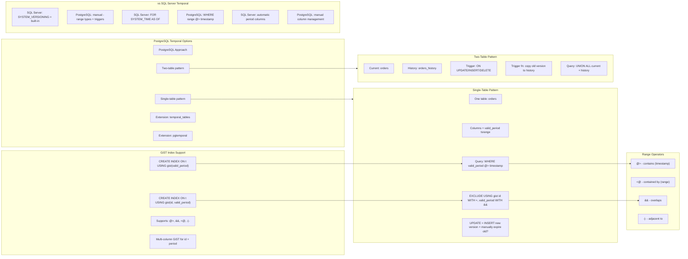

## Navigation

**Domain:** [[8 — Databases]] > **Group:** SQL Temporal Tables & Point-in-Time
**Previous:** [[8.243 — Temporal Tables — Performance Implications]] | **Next:** [[8.245 — Temporal Tables — Limitations and Gotchas]]

### Prerequisites
- [[8.240 — Temporal Tables — System-Versioning Basics]] — Understanding the SQL Server temporal table concept (SYSTEM_VERSIONING, period columns) provides the baseline for comparing PostgreSQL's manual temporal approach.
- [[8.100 — PostgreSQL Architecture and Data Types]] — Range types (tsrange, tstzrange) are native PostgreSQL data types with specialized operators and GiST index support that form the foundation of temporal data modeling.
- [[8.245 — Temporal Tables — Limitations and Gotchas]] — PostgreSQL temporal implementations lack the guardrails of SQL Server's built-in SYSTEM_VERSIONING, introducing specific failure modes around overlapping ranges, trigger correctness, and constraint enforcement.

### Where This Fits

PostgreSQL does not have built-in temporal tables (system-versioning) like SQL Server. Instead, temporal data modeling relies on range types (tsrange/tstzrange), exclusion constraints (EXCLUDE USING gist), triggers, and careful schema design. A .NET backend engineer encounters this when building audit-trail or point-in-time querying features on PostgreSQL — the absence of a built-in feature means the engineer must implement temporal behavior manually using range types and triggers, or use extensions like temporal_tables or the newer pgtemporal. The interview signal is whether a candidate understands the range type operator semantics (@>, <@, &&, -|-), can design exclusion constraints to prevent overlapping time periods, knows how GiST indexes accelerate temporal queries on range columns, understands the tradeoffs of trigger-based temporal logging (write overhead, trigger complexity), and can choose between the two-table pattern (current + history with trigger) and the single-table pattern (current row + tsrange for valid time).

---

## Core Mental Model

PostgreSQL temporal data modeling uses range types as the foundation. A `tsrange` (timestamp range) or `tstzrange` (timestamp with time zone range) stores a time interval as a single column with an upper and lower bound. The invariant is: a row represents a fact that was valid during `[lower(valid_period), upper(valid_period))` — a half-open interval where the start is inclusive and the end is exclusive. Range operators enable temporal queries: `@>` (contains — does this range contain this timestamp?), `<@` (is this range contained within?), `&&` (overlaps — do two ranges intersect?), `-|-` (is this range immediately adjacent to?). An `EXCLUDE USING gist` constraint enforces non-overlapping ranges per entity: overlapping ranges are rejected at the constraint level, ensuring temporal integrity (a row cannot have two valid versions at the same time). The two common patterns are: (1) single-table pattern — the table stores current and historical data together, with a tsrange column and an exclusion constraint preventing overlapping ranges per PK; (2) two-table pattern — a current table (always latest version) and a history table (all previous versions), managed by a trigger on UPDATE/DELETE. The single-table pattern is simpler but requires temporal queries to always filter by the range containment operator; the two-table pattern mirrors SQL Server's approach but places the temporal logic in a trigger function. The recognition pattern for PostgreSQL temporal: tables with `tsrange` columns and GiST exclusion constraints, `SELECT ... WHERE range @> timestamp` queries, trigger functions named `save_history()` or similar, and absence of `SYSTEM_VERSIONING` syntax.

### Classification

- **PostgreSQL feature:** Range types (tsrange/tstzrange), GiST indexes, EXCLUDE constraints, trigger functions
- **Temporal patterns:** Single-table (tsrange + EXCLUDE) or two-table (current + history + trigger)
- **Range operators:** `@>` contains, `<@` contained by, `&&` overlaps, `-|-` adjacent, `<<` strictly left of, `>>` strictly right of
- **Index type:** GiST (Generalized Search Tree) — enables range operator index support (B-tree cannot index range overlap)
- **EF Core / Npgsql:** No HasTemporalTable() equivalent — manual mapping with NpgsqlRange and OnModelCreating configuration



### Key Properties

|Property|Single-Table Pattern (tsrange)|Two-Table Pattern (Trigger)|SQL Server SYSTEM_VERSIONING|
|---|---|---|---|
|Automatic history|No — manual INSERT/UPDATE|Yes — trigger function|Yes — built-in|
|Temporal query syntax|`WHERE range @> timestamp`|`SELECT ... WHERE sys_end > @t` via UNION|`FOR SYSTEM_TIME AS OF @dt`|
|Overlap prevention|EXCLUDE USING gist constraint|Application logic or unique partial index|Built-in period columns|
|Write overhead|Same as regular INSERT/UPDATE|~2x (trigger inserts to history)|~2x (current update + history insert)|
|Index support|GiST on range column|B-tree on period columns|B-tree on period columns|
|EF Core support|Manual NpgsqlRange mapping|Manual with shadow properties|HasTemporalTable() fluent API|
|Row version tracking|Version column + range|Two period columns (sys_start, sys_end)|Two GENERATED ALWAYS period columns|
|Schema complexity|Low (one table)|Medium (two tables + trigger)|Low (one configuration call)|

---

## Deep Mechanics

### How PostgreSQL Executes Temporal Operations

**Single-Table Pattern with tsrange:**

1. **Schema creation:** The table has a `valid_period tsrange` column. An EXCLUDE constraint using GiST ensures no two rows for the same entity (same id) have overlapping periods.

2. **INSERT (new entity):** The INSERT includes a `valid_period` that covers from the current time to `infinity` (or a sentinel maximum timestamp): `INSERT INTO orders (...) VALUES (id, ..., '[2024-06-01,)')`. The `,` after the comma means no upper bound (infinity). The exclusion constraint passes because no existing row has the same id with overlapping period.

3. **UPDATE (existing entity):** The application must explicitly perform two operations:
   - UPDATE the existing row to close its valid_period: `UPDATE orders SET valid_period = tstzrange(lower(valid_period), now()) WHERE id = 42 AND upper(valid_period) = 'infinity'`
   - INSERT the new version: `INSERT INTO orders (id, ..., valid_period) VALUES (42, ..., tstzrange(now(), null))` — null upper bound means infinity
   - Both operations must be in a single transaction to prevent race conditions.

4. **DELETE:** Optionally close the valid_period instead of physically deleting: `UPDATE orders SET valid_period = tstzrange(lower(valid_period), now()) WHERE id = 42`. Or physically DELETE if no point-in-time querying is needed.

5. **Temporal AS OF query:** `SELECT * FROM orders WHERE id = 42 AND valid_period @> '2024-03-15'::timestamptz`. The `@>` operator checks if the timestamp is contained within the range. With a GiST index on valid_period (or a multi-column GiST on (id, valid_period)), this is an index seek.

6. **Temporal range query (BETWEEN equivalent):** `SELECT * FROM orders WHERE valid_period && tstzrange('2024-01-01', '2024-06-01')`. The `&&` overlap operator returns all versions that overlap the query period.

**Two-Table Pattern with Trigger:**

1. **Schema creation:** Current table (same as regular table) + history table (same columns + period columns) + trigger function.

2. **Trigger function:** A BEFORE UPDATE or DELETE trigger captures the old row and inserts it into the history table before the current row is modified. The trigger function is:
   ```sql
   CREATE OR REPLACE FUNCTION save_order_history()
   RETURNS TRIGGER AS $$
   BEGIN
       INSERT INTO orders_history (id, customer_id, status, total_amount, sys_start, sys_end)
       VALUES (OLD.id, OLD.customer_id, OLD.status, OLD.total_amount,
               OLD.sys_start, now());
       RETURN NEW;
   END;
   $$ LANGUAGE plpgsql;
   ```

3. **UPDATE:** The trigger fires before the UPDATE: captures OLD row, inserts into history with `sys_end = now()`, then the UPDATE changes the current row. The current row's `sys_start` remains unchanged (it was set at INSERT time).

4. **Temporal AS OF:** `SELECT ... FROM orders WHERE ...` (current rows only) + `SELECT ... FROM orders_history WHERE sys_start <= @dt AND sys_end > @dt AND ...` — combine with UNION ALL if querying both.

### PostgreSQL Range Type Details

```sql
-- Range types for temporal data:
-- tsrange: timestamp without time zone
-- tstzrange: timestamp with time zone (preferred for production)
-- daterange: date-only range

-- Range constructor:
tstzrange('2024-01-01', '2024-06-01', '[)')
-- [ = inclusive lower bound, ) = exclusive upper bound (default)
-- Lower bound inclusive, upper bound exclusive is the standard for temporal data

-- Special values:
tstzrange('2024-01-01', NULL)    -- NULL upper bound = infinity (no end)
tstzrange(NULL, '2024-06-01')    -- NULL lower bound = -infinity (no start)
tstzrange('2024-01-01', 'infinity')  -- Explicit infinity upper bound

-- Accessing range bounds:
lower(valid_period)  -- Start of range
upper(valid_period)  -- End of range (can be NULL for infinity)
isempty(valid_period) -- Is the range empty?
lower_inc(valid_period) -- Is lower bound inclusive?
upper_inc(valid_period) -- Is upper bound inclusive?
```

### SQL Visibility

```sql
-- ============================================================
-- Single-Table Pattern Implementation
-- ============================================================

CREATE EXTENSION IF NOT EXISTS btree_gist;
-- Required for multi-column GiST index with scalar + range columns

CREATE TABLE orders (
    id INTEGER GENERATED BY DEFAULT AS IDENTITY,
    customer_id INTEGER NOT NULL,
    order_date TIMESTAMPTZ NOT NULL,
    status TEXT NOT NULL DEFAULT 'pending',
    total_amount NUMERIC(18,2) NOT NULL DEFAULT 0,
    valid_period TSTZRANGE NOT NULL DEFAULT tstzrange(now(), NULL, '[)'),
    -- Exclusion constraint: no overlapping periods per order id
    EXCLUDE USING gist (
        id WITH =,           -- same id
        valid_period WITH &&  -- overlapping periods
    )
);

-- GiST index on valid_period for range queries
CREATE INDEX idx_orders_valid_period ON orders USING gist (valid_period);

-- Multi-column GiST index for id + period queries
CREATE INDEX idx_orders_id_valid_period ON orders USING gist (id, valid_period);

-- B-tree index on customer_id for equality queries
CREATE INDEX idx_orders_customer_id ON orders USING btree (customer_id);

-- Query patterns:

-- 1. AS OF — what did order 42 look like on March 15, 2024?
SELECT id, customer_id, status, total_amount, valid_period
FROM orders
WHERE id = 42
  AND valid_period @> '2024-03-15 12:00:00+00'::timestamptz;
-- Uses GiST index: seek on id + period containment

-- 2. BETWEEN — all versions active in Q1 2024
SELECT id, customer_id, status, total_amount, valid_period
FROM orders
WHERE valid_period && tstzrange('2024-01-01', '2024-04-01', '[)');
-- Returns all versions that overlap Q1 2024
-- Uses GiST index: range overlap scan

-- 3. Current versions (valid_period has no end)
SELECT id, customer_id, status, total_amount
FROM orders
WHERE upper_inf(valid_period);  -- upper_inf = upper bound is infinity (NULL or 'infinity')
-- Or: WHERE upper(valid_period) IS NULL

-- 4. Update an order (expire old version, insert new)
BEGIN;
    -- Close the current version
    UPDATE orders
    SET valid_period = tstzrange(lower(valid_period), now(), '[)')
    WHERE id = 42
      AND upper_inf(valid_period);

    -- Insert the new version
    INSERT INTO orders (id, customer_id, order_date, status, total_amount, valid_period)
    VALUES (42, 5, '2024-01-15', 'shipped', 150.00,
            tstzrange(now(), NULL, '[)'));
COMMIT;
-- The EXCLUDE constraint prevents concurrent overlapping range inserts

-- 5. DELETE with soft-delete (close the range without inserting new)
UPDATE orders
SET valid_period = tstzrange(lower(valid_period), now(), '[)')
WHERE id = 42
  AND upper_inf(valid_period);

-- ============================================================
-- Two-Table Pattern Implementation (Trigger-Based)
-- ============================================================

-- Current table (no range type — uses period columns like SQL Server)
CREATE TABLE orders_current (
    id INTEGER GENERATED BY DEFAULT AS IDENTITY,
    customer_id INTEGER NOT NULL,
    order_date TIMESTAMPTZ NOT NULL,
    status TEXT NOT NULL DEFAULT 'pending',
    total_amount NUMERIC(18,2) NOT NULL DEFAULT 0,
    sys_start TIMESTAMPTZ NOT NULL DEFAULT now(),
    PRIMARY KEY (id)
);

-- History table (same columns + sys_end)
CREATE TABLE orders_history (
    id INTEGER NOT NULL,
    customer_id INTEGER NOT NULL,
    order_date TIMESTAMPTZ NOT NULL,
    status TEXT NOT NULL,
    total_amount NUMERIC(18,2) NOT NULL DEFAULT 0,
    sys_start TIMESTAMPTZ NOT NULL,
    sys_end TIMESTAMPTZ NOT NULL DEFAULT now(),
    -- Period columns: sys_start (when was this version valid from), sys_end (when was it superseded)
    PRIMARY KEY (id, sys_end)
);

-- Indexes on history table
CREATE INDEX idx_orders_history_id_sys_end
    ON orders_history (id, sys_end DESC);
CREATE INDEX idx_orders_history_customer_id
    ON orders_history (customer_id, sys_end DESC);

-- Trigger function
CREATE OR REPLACE FUNCTION save_order_history()
RETURNS TRIGGER AS $$
BEGIN
    IF TG_OP = 'UPDATE' OR TG_OP = 'DELETE' THEN
        -- Insert old version with sys_end = now()
        INSERT INTO orders_history (
            id, customer_id, order_date, status, total_amount,
            sys_start, sys_end
        ) VALUES (
            OLD.id, OLD.customer_id, OLD.order_date, OLD.status,
            OLD.total_amount, OLD.sys_start, now()
        );
    END IF;

    IF TG_OP = 'UPDATE' THEN
        -- Set new sys_start for current row
        NEW.sys_start = now();
        RETURN NEW;
    ELSIF TG_OP = 'DELETE' THEN
        RETURN OLD;
    END IF;

    RETURN NULL; -- Should not reach here for INSERT
END;
$$ LANGUAGE plpgsql;

CREATE TRIGGER trg_orders_history
    BEFORE UPDATE OR DELETE ON orders_current
    FOR EACH ROW
    EXECUTE FUNCTION save_order_history();

-- Temporal queries (two-table pattern):
-- AS OF:
SELECT * FROM orders_current WHERE id = 42 AND sys_start <= '2024-03-15'
UNION ALL
SELECT * FROM orders_history
WHERE id = 42 AND sys_start <= '2024-03-15' AND sys_end > '2024-03-15';

-- All versions:
SELECT * FROM orders_current WHERE id = 42
UNION ALL
SELECT * FROM orders_history WHERE id = 42
ORDER BY sys_start DESC;
```

### Execution Plan Analysis

**Single-table AS OF query with GiST index:**

```sql
EXPLAIN (ANALYZE, BUFFERS)
SELECT id, customer_id, status, total_amount
FROM orders
WHERE id = 42
  AND valid_period @> '2024-03-15 12:00:00+00'::timestamptz;
```

```
Expected plan (with GiST index on (id, valid_period)):
Index Scan using idx_orders_id_valid_period on orders
    Index Cond: (id = 42) AND (valid_period @> '2024-03-15 12:00:00+00'::timestamptz)
    Buffers: shared hit = 4
    Planning Time: 0.15ms
    Execution Time: 0.35ms
```

The GiST index supports both the equality condition on `id` and the range containment on `valid_period` in a single index scan. PostgreSQL's GiST implementation can combine scalar equality (id = 42) with range containment (@>) in a multi-column GiST index.

**Without GiST index:**

```
Seq Scan on orders
    Filter: (id = 42) AND (valid_period @> '2024-03-15 12:00:00+00'::timestamptz)
    Rows Removed by Filter: 100000
    Buffers: shared hit = 42000  -- Full table scan
    Execution Time: 250ms
```

**Two-table temporal query (UNION ALL):**

```sql
EXPLAIN (ANALYZE, BUFFERS)
SELECT * FROM orders_current WHERE id = 42 AND sys_start <= '2024-03-15'
UNION ALL
SELECT * FROM orders_history
WHERE id = 42 AND sys_start <= '2024-03-15' AND sys_end > '2024-03-15';
```

```
Append
    -> Index Scan using orders_current_pkey on orders_current
        Index Cond: (id = 42)
        Filter: (sys_start <= '2024-03-15'::timestamptz)
        Buffers: shared hit = 3
    -> Index Scan using idx_orders_history_id_sys_end on orders_history
        Index Cond: (id = 42)
        Filter: (sys_start <= '2024-03-15'::timestamptz' AND sys_end > '2024-03-15'::timestamptz)
        Buffers: shared hit = 4
    Execution Time: 0.8ms
```

The `Append` operator combines both scans. Each uses an index seek on id followed by a residual filter on the period columns.

### Cost Visibility

```sql
SET track_io_timing = ON;

-- Single-table tsrange approach:
-- AS OF query (with GiST index):
EXPLAIN (ANALYZE, BUFFERS, TIMING)
SELECT * FROM orders
WHERE id = 42 AND valid_period @> '2024-03-15'::timestamptz;
-- Buffers: shared hit=4
-- Execution Time: 0.35ms

-- Range query (Q1 overlap):
EXPLAIN (ANALYZE, BUFFERS, TIMING)
SELECT * FROM orders
WHERE valid_period && tstzrange('2024-01-01', '2024-04-01', '[)')
  AND customer_id = 5;
-- Without multi-column index: Seq Scan on orders (42000 buffers)
-- With GiST on (customer_id, valid_period): Index Scan (4 buffers)

-- UPDATE (expire + insert):
BEGIN;
EXPLAIN (ANALYZE, BUFFERS)
UPDATE orders
SET valid_period = tstzrange(lower(valid_period), now(), '[)')
WHERE id = 42 AND upper_inf(valid_period);

INSERT INTO orders (id, customer_id, order_date, status, total_amount, valid_period)
VALUES (42, 5, '2024-01-15', 'shipped', 150.00, tstzrange(now(), NULL, '[)'));
COMMIT;
-- UPDATE: Index Scan (4 buffers) + Update (2 buffers)
-- INSERT: 3 buffers
-- EXCLUDE constraint check: ~2 buffers
-- Total: ~11 buffers for the temporal UPDATE

-- Same operation without temporal (regular UPDATE):
EXPLAIN (ANALYZE, BUFFERS)
UPDATE orders_regular
SET status = 'shipped'
WHERE id = 42;
-- Index Scan (3 buffers) + Update (2 buffers) = ~5 buffers
-- Temporal overhead: ~6 additional buffers per UPDATE
```

### Failure Modes

**Exclusion constraint violation on concurrent UPDATE:** If two transactions simultaneously try to UPDATE the same row (one expires, one inserts), the EXCLUDE constraint can cause a serialization error or deadlock. The GiST exclusion constraint check must verify no overlapping range for the same id. Heavy concurrency on the same entity leads to constraint violation retries.

```sql
-- Transaction 1:
BEGIN;
UPDATE orders SET valid_period = tstzrange(lower(valid_period), now())
WHERE id = 42 AND upper_inf(valid_period);
-- holds row lock on id=42

-- Transaction 2 (concurrent):
BEGIN;
UPDATE orders SET valid_period = tstzrange(lower(valid_period), now())
WHERE id = 42 AND upper_inf(valid_period);
-- Blocks on row lock held by T1

-- After T1 commits, T2's WHERE condition finds no matching row
-- (upper_inf(valid_period) is now false because T1 closed it)
-- T2 updates 0 rows — silent failure
```

**GiST index bloat from frequent UPDATEs:** The single-table pattern requires UPDATEs to close the range (which modifies the valid_period column in-place), then INSERTs for new versions. The GiST index on valid_period becomes bloated over time because UPDATEs to the range column generate dead tuples in the GiST index. Regular `REINDEX` or `VACUUM` is required.

**Missing trigger causes lost history:** In the two-table pattern, if the trigger is accidentally disabled (e.g., during migration, data load), history rows are silently lost. There is no built-in guard like SQL Server's "cannot modify history" error.

**tsrange without time zone ambiguity:** Using `tsrange` (without time zone) for temporal data across different time zones causes off-by-N-hour errors. Always use `tstzrange` (with time zone) for production temporal data.

**No built-in FOR SYSTEM_TIME syntax:** PostgreSQL has no `FOR SYSTEM_TIME AS OF` syntax. Temporal queries must explicitly write range containment conditions. ORMs cannot automatically generate temporal filters without manual query configuration.

---

## Production Patterns and Implementation

### Primary SQL Implementation

```sql
-- ============================================================
-- Production-Ready Single-Table Temporal Pattern
-- ============================================================

-- Required extension for multi-column GiST exclusion
CREATE EXTENSION IF NOT EXISTS btree_gist;

-- Temporal table for orders
CREATE TABLE orders (
    id INTEGER GENERATED BY DEFAULT AS IDENTITY,
    customer_id INTEGER NOT NULL,
    order_date TIMESTAMPTZ NOT NULL DEFAULT now(),
    status TEXT NOT NULL DEFAULT 'pending',
    total_amount NUMERIC(18,2) NOT NULL DEFAULT 0.00,
    created_by INTEGER,
    updated_by INTEGER,
    version INTEGER NOT NULL DEFAULT 1,
    valid_period TSTZRANGE NOT NULL DEFAULT tstzrange(now(), NULL, '[)'),
    CHECK (NOT isempty(valid_period)),
    EXCLUDE USING gist (
        id WITH =,
        valid_period WITH &&
    )
);

-- Indexes
CREATE INDEX idx_orders_customer_id ON orders USING btree (customer_id);
CREATE INDEX idx_orders_valid_period ON orders USING gist (valid_period);
CREATE INDEX idx_orders_id_valid_period ON orders USING gist (id, valid_period);

-- Function: update order with temporal versioning
CREATE OR REPLACE FUNCTION update_order(
    p_id INTEGER,
    p_status TEXT DEFAULT NULL,
    p_total_amount NUMERIC(18,2) DEFAULT NULL,
    p_updated_by INTEGER DEFAULT NULL
)
RETURNS TABLE(
    id INTEGER,
    customer_id INTEGER,
    status TEXT,
    total_amount NUMERIC(18,2),
    version INTEGER,
    valid_period TSTZRANGE
) AS $$
DECLARE
    v_now TIMESTAMPTZ := now();
    v_current RECORD;
BEGIN
    -- Lock the current active row to prevent concurrent updates
    SELECT * INTO v_current
    FROM orders
    WHERE id = p_id AND upper_inf(valid_period)
    FOR UPDATE;

    IF NOT FOUND THEN
        RAISE EXCEPTION 'Order % not found or has been updated concurrently', p_id;
    END IF;

    -- Close the current version's valid period
    UPDATE orders
    SET valid_period = tstzrange(lower(valid_period), v_now, '[)')
    WHERE id = p_id AND upper_inf(valid_period);

    -- Insert new version
    INSERT INTO orders (
        id, customer_id, order_date, status, total_amount,
        created_by, updated_by, version, valid_period
    )
    VALUES (
        p_id, v_current.customer_id, v_current.order_date,
        COALESCE(p_status, v_current.status),
        COALESCE(p_total_amount, v_current.total_amount),
        v_current.created_by, p_updated_by,
        v_current.version + 1,
        tstzrange(v_now, NULL, '[)')
    )
    RETURNING id, customer_id, status, total_amount, version, valid_period
    INTO v_current;

    RETURN QUERY SELECT v_current.id, v_current.customer_id,
                        v_current.status, v_current.total_amount,
                        v_current.version, v_current.valid_period;
END;
$$ LANGUAGE plpgsql;

-- Query patterns:

-- AS OF — point-in-time
SELECT * FROM orders
WHERE id = 42
  AND valid_period @> '2024-03-15 12:00:00+00'::timestamptz;

-- BETWEEN — range of activity
SELECT * FROM orders
WHERE id = 42
  AND valid_period && tstzrange('2024-01-01', '2024-06-01', '[)');

-- All versions (including current)
SELECT id, customer_id, status, total_amount, lower(valid_period) AS valid_from,
       upper(valid_period) AS valid_to
FROM orders
WHERE id = 42
ORDER BY lower(valid_period) DESC;

-- Current row only
SELECT * FROM orders WHERE id = 42 AND upper_inf(valid_period);

-- Version count per order
SELECT id, COUNT(*) AS version_count
FROM orders
GROUP BY id
HAVING COUNT(*) > 50
ORDER BY version_count DESC;

-- ============================================================
-- Production-Ready Two-Table Pattern (Trigger-Based)
-- ============================================================

-- Current table
CREATE TABLE orders_current (
    id INTEGER GENERATED BY DEFAULT AS IDENTITY,
    customer_id INTEGER NOT NULL,
    order_date TIMESTAMPTZ NOT NULL DEFAULT now(),
    status TEXT NOT NULL DEFAULT 'pending',
    total_amount NUMERIC(18,2) NOT NULL DEFAULT 0.00,
    created_at TIMESTAMPTZ NOT NULL DEFAULT now(),
    updated_at TIMESTAMPTZ NOT NULL DEFAULT now(),
    version INTEGER NOT NULL DEFAULT 1,
    PRIMARY KEY (id)
);

-- History table
CREATE TABLE orders_history (
    id INTEGER NOT NULL,
    customer_id INTEGER NOT NULL,
    order_date TIMESTAMPTZ NOT NULL,
    status TEXT NOT NULL,
    total_amount NUMERIC(18,2) NOT NULL DEFAULT 0.00,
    version INTEGER NOT NULL,
    sys_start TIMESTAMPTZ NOT NULL,
    sys_end TIMESTAMPTZ NOT NULL DEFAULT now(),
    PRIMARY KEY (id, sys_end)
);

CREATE INDEX idx_orders_history_id_sys_end
    ON orders_history (id, sys_end DESC);
CREATE INDEX idx_orders_history_customer_id
    ON orders_history (customer_id, sys_end DESC);
CREATE INDEX idx_orders_history_sys_end
    ON orders_history (sys_end DESC);

-- Trigger function
CREATE OR REPLACE FUNCTION fn_save_orders_history()
RETURNS TRIGGER AS $$
BEGIN
    IF TG_OP = 'UPDATE' OR TG_OP = 'DELETE' THEN
        INSERT INTO orders_history (
            id, customer_id, order_date, status, total_amount,
            version, sys_start, sys_end
        ) VALUES (
            OLD.id, OLD.customer_id, OLD.order_date, OLD.status,
            OLD.total_amount, OLD.version, OLD.updated_at, now()
        );
    END IF;

    IF TG_OP = 'UPDATE' THEN
        NEW.version = OLD.version + 1;
        NEW.updated_at = now();
        RETURN NEW;
    ELSIF TG_OP = 'DELETE' THEN
        RETURN OLD;
    END IF;

    RETURN NULL;
END;
$$ LANGUAGE plpgsql;

CREATE TRIGGER trg_orders_history
    BEFORE UPDATE OR DELETE ON orders_current
    FOR EACH ROW
    EXECUTE FUNCTION fn_save_orders_history();

-- Temporal queries (two-table):
-- AS OF
SELECT * FROM orders_current WHERE id = 42 AND updated_at <= '2024-03-15'
UNION ALL
SELECT * FROM orders_history
WHERE id = 42 AND sys_start <= '2024-03-15' AND sys_end > '2024-03-15';

-- Create a view for easier querying
CREATE VIEW orders_with_history AS
    SELECT id, customer_id, order_date, status, total_amount,
           created_at AS sys_start,
           'infinity'::TIMESTAMPTZ AS sys_end,
           TRUE AS is_current
    FROM orders_current
UNION ALL
    SELECT id, customer_id, order_date, status, total_amount,
           sys_start, sys_end, FALSE AS is_current
    FROM orders_history;
```

### EF Core (Npgsql) Implementation

```csharp
// ============================================================
// EF Core with Npgsql — Temporal via Single-Table tsrange
// ============================================================

// Install: Npgsql.EntityFrameworkCore.PostgreSQL

// Entity
public class Order
{
    public int Id { get; set; }
    public int CustomerId { get; set; }
    public DateTime OrderDate { get; set; }
    public string Status { get; set; } = string.Empty;
    public decimal TotalAmount { get; set; }
    public int Version { get; set; }
    public NpgsqlRange<DateTime> ValidPeriod { get; set; }
}

// DbContext
public class ApplicationDbContext : DbContext
{
    public DbSet<Order> Orders => Set<Order>();

    protected override void OnModelCreating(ModelBuilder modelBuilder)
    {
        modelBuilder.Entity<Order>(entity =>
        {
            entity.ToTable("orders");
            entity.HasKey(o => new { o.Id, o.ValidPeriod });

            entity.Property(o => o.Status).HasColumnType("text").IsRequired();
            entity.Property(o => o.TotalAmount).HasPrecision(18, 2);
            entity.Property(o => o.Version).HasDefaultValue(1);

            // Map NpgsqlRange<DateTime> to tstzrange
            entity.Property(o => o.ValidPeriod)
                .HasColumnType("tstzrange")
                .IsRequired();

            // Indexes
            entity.HasIndex(o => o.CustomerId)
                .HasDatabaseName("idx_orders_customer_id");

            // GiST index on valid_period
            entity.HasIndex(o => o.ValidPeriod)
                .HasDatabaseName("idx_orders_valid_period")
                .HasMethod("gist");
        });
    }
}

// ============================================================
// Temporal Query Service
// ============================================================

public class TemporalOrderService
{
    private readonly ApplicationDbContext _dbContext;

    public TemporalOrderService(ApplicationDbContext dbContext)
        => _dbContext = dbContext;

    // AS OF query — uses range containment
    public async Task<Order?> GetOrderAsOfAsync(
        int orderId,
        DateTime pointInTime,
        CancellationToken ct = default)
    {
        // EF Core cannot translate NpgsqlRange @> operator directly in LINQ.
        // Use FromSqlRaw for temporal queries:
        const string sql = @"
            SELECT id, customer_id, order_date, status, total_amount,
                   version, valid_period
            FROM orders
            WHERE id = @Id
              AND valid_period @> @PointInTime::timestamptz
            LIMIT 1;";

        return await _dbContext.Orders
            .FromSqlRaw(sql,
                new NpgsqlParameter("@Id", orderId),
                new NpgsqlParameter("@PointInTime", pointInTime))
            .AsNoTracking()
            .FirstOrDefaultAsync(ct);
    }

    // Range query — uses overlap operator
    public async Task<List<Order>> GetOrdersInRangeAsync(
        int customerId,
        DateTime from,
        DateTime to,
        CancellationToken ct = default)
    {
        const string sql = @"
            SELECT o.id, o.customer_id, o.order_date, o.status,
                   o.total_amount, o.version, o.valid_period
            FROM orders o
            WHERE o.customer_id = @CustomerId
              AND o.valid_period && tstzrange(@From, @To, '[)')
            ORDER BY lower(o.valid_period) DESC;";

        return await _dbContext.Orders
            .FromSqlRaw(sql,
                new NpgsqlParameter("@CustomerId", customerId),
                new NpgsqlParameter("@From", from),
                new NpgsqlParameter("@To", to))
            .AsNoTracking()
            .ToListAsync(ct);
    }

    // Current version
    public async Task<Order?> GetCurrentOrderAsync(
        int orderId,
        CancellationToken ct = default)
    {
        return await _dbContext.Orders
            .FromSqlRaw(@"
                SELECT id, customer_id, order_date, status, total_amount,
                       version, valid_period
                FROM orders
                WHERE id = @Id AND upper_inf(valid_period)
                LIMIT 1;",
                new NpgsqlParameter("@Id", orderId))
            .AsNoTracking()
            .FirstOrDefaultAsync(ct);
    }

    // Update with temporal versioning (using stored procedure)
    public async Task<Order> UpdateOrderAsync(
        int orderId,
        string newStatus,
        decimal? newTotalAmount,
        CancellationToken ct = default)
    {
        const string sql = @"
            SELECT * FROM update_order(
                p_id => @Id,
                p_status => @Status,
                p_total_amount => @TotalAmount
            );";

        return await _dbContext.Orders
            .FromSqlRaw(sql,
                new NpgsqlParameter("@Id", orderId),
                new NpgsqlParameter("@Status", newStatus),
                new NpgsqlParameter("@TotalAmount", newTotalAmount ?? (object)DBNull.Value))
            .FirstAsync(ct);
    }

    // All versions of an order
    public async Task<List<Order>> GetAllVersionsAsync(
        int orderId,
        CancellationToken ct = default)
    {
        const string sql = @"
            SELECT id, customer_id, order_date, status, total_amount,
                   version, valid_period
            FROM orders
            WHERE id = @Id
            ORDER BY lower(valid_period) DESC;";

        return await _dbContext.Orders
            .FromSqlRaw(sql,
                new NpgsqlParameter("@Id", orderId))
            .AsNoTracking()
            .ToListAsync(ct);
    }
}
```

### Dapper Implementation

```csharp
// Dapper — full control over PostgreSQL temporal queries

public sealed class TemporalRepository
{
    private readonly IDbConnectionFactory _connectionFactory;

    public TemporalRepository(IDbConnectionFactory connectionFactory)
        => _connectionFactory = connectionFactory;

    // AS OF query
    public async Task<OrderDto?> GetOrderAsOfAsync(
        int orderId,
        DateTime pointInTime,
        CancellationToken ct = default)
    {
        const string sql = @"
            SELECT id, customer_id, order_date, status, total_amount,
                   version, lower(valid_period) AS valid_from,
                   upper(valid_period) AS valid_to
            FROM orders
            WHERE id = @Id
              AND valid_period @> @PointInTime::timestamptz
            LIMIT 1;";

        await using var conn = _connectionFactory.Create();
        return await conn.QuerySingleOrDefaultAsync<OrderDto>(
            new CommandDefinition(sql,
                new { Id = orderId, PointInTime = pointInTime },
                cancellationToken: ct));
    }

    // Overlap query
    public async Task<IReadOnlyList<OrderDto>> GetOverlappingOrdersAsync(
        DateTime from, DateTime to,
        CancellationToken ct = default)
    {
        const string sql = @"
            SELECT id, customer_id, order_date, status, total_amount,
                   version, lower(valid_period) AS valid_from,
                   upper(valid_period) AS valid_to
            FROM orders
            WHERE valid_period && tstzrange(@From, @To, '[)')
            ORDER BY lower(valid_period);";

        await using var conn = _connectionFactory.Create();
        var results = await conn.QueryAsync<OrderDto>(
            new CommandDefinition(sql,
                new { From = from, To = to },
                cancellationToken: ct));
        return results.AsList();
    }

    // Temporal UPDATE using the stored procedure
    public async Task<OrderDto> UpdateOrderTemporalAsync(
        int orderId,
        string? status,
        decimal? totalAmount,
        CancellationToken ct = default)
    {
        const string sql = @"
            SELECT * FROM update_order(
                p_id => @Id,
                p_status => @Status,
                p_total_amount => @TotalAmount
            );";

        await using var conn = _connectionFactory.Create();
        return await conn.QuerySingleAsync<OrderDto>(
            new CommandDefinition(sql,
                new { Id = orderId, Status = status, TotalAmount = totalAmount },
                cancellationToken: ct));
    }

    // Version count
    public async Task<int> GetVersionCountAsync(
        int orderId,
        CancellationToken ct = default)
    {
        const string sql = @"
            SELECT COUNT(*) FROM orders
            WHERE id = @Id;";

        await using var conn = _connectionFactory.Create();
        return await conn.QuerySingleAsync<int>(
            new CommandDefinition(sql,
                new { Id = orderId },
                cancellationToken: ct));
    }

    // Check GiST index bloat
    public async Task<double> GetGiSTBloatAsync(CancellationToken ct = default)
    {
        const string sql = @"
            SELECT (pg_relation_size(reltoastrelid) * 100.0 /
                    NULLIF(pg_relation_size(reltoastrelid) +
                           pg_relation_size(oid), 0)) AS bloat_pct
            FROM pg_class
            WHERE relname = 'idx_orders_valid_period';";

        await using var conn = _connectionFactory.Create();
        var bloat = await conn.QuerySingleOrDefaultAsync<double?>(sql, ct);
        return bloat ?? 0;
    }
}

public class OrderDto
{
    public int Id { get; set; }
    public int CustomerId { get; set; }
    public DateTime OrderDate { get; set; }
    public string Status { get; set; } = string.Empty;
    public decimal TotalAmount { get; set; }
    public int Version { get; set; }
    public DateTime? ValidFrom { get; set; }
    public DateTime? ValidTo { get; set; }
}
```

### Configuration and Wiring

```csharp
// Program.cs
builder.Services.AddDbContext<ApplicationDbContext>(options =>
    options.UseNpgsql(
        builder.Configuration.GetConnectionString("PostgresConnection"),
        npgsqlOptions =>
        {
            npgsqlOptions.EnableRetryOnFailure(3);
            npgsqlOptions.UseQuerySplittingBehavior(QuerySplittingBehavior.SplitQuery);
        })
    .EnableDetailedErrors(builder.Environment.IsDevelopment())
    .EnableSensitiveDataLogging(builder.Environment.IsDevelopment()));

// Register temporal services
builder.Services.AddScoped<TemporalOrderService>();
builder.Services.AddScoped<TemporalRepository>();

// Migration: ensure btree_gist extension exists
// In your DbContext's OnModelCreating or in an initial migration:
// migrationBuilder.Sql("CREATE EXTENSION IF NOT EXISTS btree_gist;");
```

### SQL Server vs PostgreSQL Differences

```sql
-- ============================================================
-- Direct Comparison: SQL Server vs PostgreSQL Temporal
-- ============================================================

-- SQL Server (built-in):
CREATE TABLE dbo.Orders (
    Id INT PRIMARY KEY,
    CustomerId INT,
    Status NVARCHAR(20),
    SysStartTime DATETIME2 GENERATED ALWAYS AS ROW START NOT NULL,
    SysEndTime DATETIME2 GENERATED ALWAYS AS ROW END NOT NULL,
    PERIOD FOR SYSTEM_TIME (SysStartTime, SysEndTime)
) WITH (SYSTEM_VERSIONING = ON (HISTORY_TABLE = dbo.OrdersHistory));

-- Temporal query:
SELECT * FROM dbo.Orders FOR SYSTEM_TIME AS OF @dt WHERE CustomerId = 42;

-- PostgreSQL single-table (manual):
CREATE TABLE orders (
    id INTEGER PRIMARY KEY,
    customer_id INTEGER,
    status TEXT,
    valid_period TSTZRANGE NOT NULL DEFAULT tstzrange(now(), NULL, '[)'),
    EXCLUDE USING gist (id WITH =, valid_period WITH &&)
);

-- Temporal query:
SELECT * FROM orders WHERE id = 42 AND valid_period @> @dt::timestamptz;

-- Key differences:

-- 1. History management
-- SQL Server: Automatic — every UPDATE/DELETE moves old version to history table
-- PostgreSQL: Manual — must explicitly UPDATE to close range, INSERT new version

-- 2. Period columns
-- SQL Server: GENERATED ALWAYS AS ROW START/END — can't be modified
-- PostgreSQL: Regular columns — can be modified (risks temporal integrity)

-- 3. Overlap prevention
-- SQL Server: Period columns + system-versioning guarantee no overlap
-- PostgreSQL: EXCLUDE constraint with GiST (requires btree_gist extension)

-- 4. Query syntax
-- SQL Server: FOR SYSTEM_TIME AS OF, BETWEEN, FROM TO, CONTAINED IN, ALL
-- PostgreSQL: Range operators (@>, &&, etc.) — no special syntax

-- 5. Temporal DML
-- SQL Server: Cannot INSERT/UPDATE/DELETE history table (error 13561)
-- PostgreSQL: Can modify any row (no built-in protection)

-- 6. Performance
-- SQL Server: Write overhead ~2x, read with period index ~seek
-- PostgreSQL: Write overhead depends on pattern, GiST index for range queries
```

---

## Gotchas and Production Pitfalls

### Missing btree_gist Extension Causes Multi-Column GiST to Fail

**Pitfall:** Creating a multi-column GiST index or EXCLUDE constraint with a scalar column (integer id) and a range column without the btree_gist extension.

```sql
-- ❌ This fails if btree_gist is not installed:
CREATE TABLE orders (
    id INTEGER,
    valid_period TSTZRANGE,
    EXCLUDE USING gist (id WITH =, valid_period WITH &&)
    -- ERROR: data type integer has no default operator class for access method "gist"
);
```

**Symptom:** `ERROR: data type integer has no default operator class for access method "gist"`. PostgreSQL's GiST access method does not natively support integer columns — it needs the btree_gist extension.

**Fix:**
```sql
-- ✅ Install btree_gist first:
CREATE EXTENSION IF NOT EXISTS btree_gist;

-- Then create the table or constraint:
CREATE TABLE orders (
    id INTEGER,
    valid_period TSTZRANGE,
    EXCLUDE USING gist (id WITH =, valid_period WITH &&)
);
```

**Cost of not fixing:** The schema migration fails. Developers might remove the EXCLUDE constraint entirely, losing temporal integrity and allowing overlapping versions.

---

### GiST Index Bloat from Frequent Updates

**Pitfall:** The single-table pattern requires UPDATEing the valid_period column to close a range, then INSERTing a new version. Each UPDATE creates a dead tuple in the GiST index (because GiST indexes are not updated in-place — they append new index entries and rely on vacuum to clean up dead entries).

```sql
-- Each UPDATE to close a range generates GiST index bloat:
UPDATE orders SET valid_period = tstzrange(lower(valid_period), now())
WHERE id = 42 AND upper_inf(valid_period);
-- GiST index: OLD valid_period entry remains as dead tuple
```

**Symptom:** GiST index size grows over time. Queries slow down because the GiST index has many dead index entries that must be scanned during range operations. Index scan time increases from 0.3ms to 3-5ms over months of heavy updates.

**Fix:**
```sql
-- ✅ Regular GiST index maintenance:
-- Reindex (rebuilds the entire index — blocks writes):
REINDEX INDEX idx_orders_valid_period;

-- Or concurrent reindex (PostgreSQL 12+):
REINDEX INDEX CONCURRENTLY idx_orders_valid_period;

-- Configure aggressive autovacuum for high-update tables:
ALTER TABLE orders SET (autovacuum_vacuum_scale_factor = 0.01,
                        autovacuum_vacuum_threshold = 1000,
                        autovacuum_analyze_scale_factor = 0.01);
```

**Cost of not fixing:** Temporal queries that were sub-millisecond take 10ms+. The application times out under load. Emergency REINDEX during business hours causes brief blocking.

---

### Race Condition in Concurrent Temporal UPDATEs

**Pitfall:** Two concurrent transactions both try to update the same row. Both find the same `WHERE upper_inf(valid_period)` row. Both try to close the range and insert a new version. One succeeds, the other violates the EXCLUDE constraint.

```sql
-- Transaction 1:
BEGIN;
UPDATE orders SET valid_period = tstzrange(lower(valid_period), now())
WHERE id = 42 AND upper_inf(valid_period);
-- Locks row

-- Transaction 2 (concurrent):
BEGIN;
UPDATE orders SET valid_period = tstzrange(lower(valid_period), now())
WHERE id = 42 AND upper_inf(valid_period);
-- BLOCKS on row lock held by T1

-- T1 commits:
INSERT INTO orders (...) VALUES (42, current_values, tstzrange(now(), NULL));
COMMIT;

-- T2's UPDATE completes (0 rows affected — upper_inf is now false)
-- T2's INSERT proceeds without conflict? No — EXCLUDE constraint sees
-- T1's new version has overlapping range with T2's attempt.
-- T2 gets: ERROR: conflicting key value violates exclusion constraint
```

**Symptom:** Application gets constraint violation exceptions under concurrency. The error message includes `tstzrange` values that seem correct. Developers may retry the transaction with backoff, but the retry also fails because the first transaction committed.

**Fix:**
```sql
-- ✅ Use SERIALIZABLE isolation level with retry logic:
BEGIN ISOLATION LEVEL SERIALIZABLE;
SELECT * FROM orders WHERE id = 42 AND upper_inf(valid_period) FOR UPDATE;
-- ... temporal UPDATE + INSERT ...
COMMIT;

-- ✅ Or use a stored procedure with explicit retry handling:
CREATE OR REPLACE FUNCTION update_order_safe(...)
RETURNS ... AS $$
BEGIN
    LOOP
        BEGIN
            -- Temporal UPDATE + INSERT here
            -- If successful, EXIT loop
            EXIT;
        EXCEPTION WHEN exclusion_violation THEN
            -- Retry: close the range again (now a new version exists)
            -- and re-attempt
            CONTINUE;
        END;
    END LOOP;
END;
$$ LANGUAGE plpgsql;
```

**Cost of not fixing:** High-concurrency updates to the same order (e.g., a hot order being processed by multiple workflows) cause persistent failures. The application's temporal updates are unreliable under load.

---

### Trigger-Based Pattern Loses History on Trigger Failure

**Pitfall:** In the two-table trigger pattern, if the trigger function raises an exception, the entire transaction rolls back — the UPDATE is rolled back and no history is lost. However, if the trigger is accidentally disabled or the history table is unavailable (e.g., misconfigured replication), the UPDATE succeeds but the history row is NOT created.

```sql
-- ❌ Trigger accidentally disabled:
ALTER TABLE orders_current DISABLE TRIGGER trg_orders_history;

-- UPDATE succeeds:
UPDATE orders_current SET status = 'shipped' WHERE id = 42;
-- No history row! The old version is overwritten with no audit trail.

-- ❌ History table schema change without updating trigger:
ALTER TABLE orders_history DROP COLUMN location;
-- Trigger now fails because the INSERT statement references 'location'
-- Future UPDATEs ROLL BACK with error
```

**Symptom:** UPDATEs start failing with `ERROR: column "location" of relation "orders_history" does not exist`. Or worse — UPDATEs succeed silently with no history written because the trigger was disabled for maintenance and never re-enabled.

**Fix:**
```sql
-- ✅ Monitor trigger status:
SELECT tgname, tgenabled
FROM pg_trigger
WHERE tgrelid = 'orders_current'::regclass;
-- tgenabled = 'O' means enabled; 'D' means disabled

-- ✅ Use event triggers or monitoring to alert on disabled temporal triggers:
CREATE OR REPLACE FUNCTION check_temporal_triggers()
RETURNS EVENT_TRIGGER AS $$
BEGIN
    IF EXISTS (
        SELECT 1 FROM pg_trigger
        WHERE tgrelid = 'orders_current'::regclass
          AND tgname = 'trg_orders_history'
          AND tgenabled = 'D'
    ) THEN
        RAISE WARNING 'Temporal trigger trg_orders_history is disabled on orders_current!';
    END IF;
END;
$$ LANGUAGE plpgsql;

-- ✅ For schema changes, always update the trigger function AND the history table:
BEGIN;
    ALTER TABLE orders_history ADD COLUMN location TEXT;
    CREATE OR REPLACE FUNCTION fn_save_orders_history() ... (updated to include location);
COMMIT;
```

**Cost of not fixing:** Silent data loss — months of order updates with no history recorded. Compliance audit fails because the system cannot show who changed what.

---

### tsrange vs tstzrange Time Zone Confusion

**Pitfall:** Using `tsrange` (without time zone) for temporal data when the application or database operates across time zones. The range bounds are stored without time zone information, leading to misinterpretation.

```sql
-- ❌ Using tsrange (no time zone):
CREATE TABLE orders (
    valid_period TSRANGE NOT NULL
);

-- Application sends: '2024-03-15 12:00:00 EST' (UTC-5)
-- PostgreSQL stores: '2024-03-15 12:00:00' (discards time zone)
-- Another application in UTC queries AS OF '2024-03-15 17:00:00' — MISSES the row!
```

**Symptom:** Temporal queries return incorrect results depending on the client's time zone. Users in different time zones see different versions of data. Debugging is extremely difficult because the stored values look correct but are interpreted differently.

**Fix:**
```sql
-- ✅ Always use tstzrange (with time zone):
CREATE TABLE orders (
    valid_period TSTZRANGE NOT NULL DEFAULT tstzrange(now(), NULL, '[)')
);

-- ✅ Store valid period in UTC:
INSERT INTO orders (valid_period)
VALUES (tstzrange('2024-03-15 12:00:00+00', NULL, '[)'));

-- ✅ Query in UTC:
SELECT * FROM orders
WHERE valid_period @> '2024-03-15 12:00:00+00'::timestamptz;

-- ✅ Set application time zone to UTC:
-- In Npgsql connection string: Timezone=UTC
-- In EF Core: options.UseNpgsql(connectionString, o => o.SetPostgresVersion(14, 0));
```

**Cost of not fixing:** Temporal queries are unreliable in multi-time-zone applications. The audit trail shows wrong data for specific points in time. Compliance auditors discover the issue and require manual data verification.

---

## Performance Implications

### Benchmark: Before and After

```sql
-- Baseline: Single-table temporal without GiST index
EXPLAIN (ANALYZE, BUFFERS)
SELECT * FROM orders
WHERE id = 42 AND valid_period @> '2024-03-15'::timestamptz;
-- Seq Scan on orders (rows=100000, buffers=42000)
-- Execution Time: 215ms

-- Optimized: With GiST index on (id, valid_period)
EXPLAIN (ANALYZE, BUFFERS)
SELECT * FROM orders
WHERE id = 42 AND valid_period @> '2024-03-15'::timestamptz;
-- Index Scan using idx_orders_id_valid_period (buffers=4)
-- Execution Time: 0.35ms

-- Range query without GiST:
EXPLAIN (ANALYZE, BUFFERS)
SELECT * FROM orders
WHERE valid_period && tstzrange('2024-01-01', '2024-04-01', '[)');
-- Seq Scan (buffers=42000) — 215ms

-- Range query with GiST:
-- Index Scan using idx_orders_valid_period — depends on selectivity
-- If 5% of rows overlap: ~buffers=2100, Execution Time: ~15ms
```

**Improvement (AS OF query):** 42,000 buffers → 4 buffers (~10,500x). 215ms → 0.35ms (~614x).

### BenchmarkDotNet

```csharp
[MemoryDiagnoser]
[SimpleJob(RuntimeMoniker.Net90)]
public class PostgresTemporalBenchmark
{
    private IDbConnection _connection = default!;
    private const string ConnectionString = "Host=localhost;Database=TemporalBench;Username=test";

    [GlobalSetup]
    public void Setup()
    {
        _connection = new NpgsqlConnection(ConnectionString);
        // Seed: 100K orders with 3 versions each (300K rows)
        // GiST index on (id, valid_period)
    }

    [Benchmark(Baseline = true)]
    public async Task<OrderDto?> TemporalAsOf()
    {
        const string sql = @"
            SELECT id, customer_id, status, total_amount,
                   lower(valid_period) AS valid_from,
                   upper(valid_period) AS valid_to
            FROM orders
            WHERE id = @Id AND valid_period @> @PointInTime::timestamptz
            LIMIT 1;";

        await using var conn = new NpgsqlConnection(ConnectionString);
        return await conn.QuerySingleOrDefaultAsync<OrderDto>(sql,
            new { Id = 42, PointInTime = DateTime.UtcNow.AddDays(-30) });
    }

    [Benchmark]
    public async Task<List<OrderDto>> TemporalRange()
    {
        const string sql = @"
            SELECT id, customer_id, status, total_amount,
                   lower(valid_period) AS valid_from,
                   upper(valid_period) AS valid_to
            FROM orders
            WHERE valid_period && tstzrange(@From, @To, '[)')
            ORDER BY lower(valid_period);";

        await using var conn = new NpgsqlConnection(ConnectionString);
        var results = await conn.QueryAsync<OrderDto>(sql,
            new { From = DateTime.UtcNow.AddMonths(-3), To = DateTime.UtcNow });
        return results.AsList();
    }

    [Benchmark]
    public async Task TemporalUpdate()
    {
        await using var conn = new NpgsqlConnection(ConnectionString);
        await conn.OpenAsync();

        using var tx = await conn.BeginTransactionAsync();

        // Close current version
        await conn.ExecuteAsync(@"
            UPDATE orders SET valid_period = tstzrange(lower(valid_period), now())
            WHERE id = @Id AND upper_inf(valid_period);",
            new { Id = 42 });

        // Insert new version
        await conn.ExecuteAsync(@"
            INSERT INTO orders (id, customer_id, order_date, status, total_amount, valid_period)
            VALUES (42, 5, @Date, 'shipped', 150.00, tstzrange(now(), NULL, '[)'));",
            new { Date = DateTime.UtcNow.AddDays(-60) });

        await tx.CommitAsync();
    }

    [Benchmark]
    public async Task NonTemporalUpdate()
    {
        const string sql = @"
            UPDATE orders_regular SET status = 'shipped'
            WHERE id = @Id;";

        await using var conn = new NpgsqlConnection(ConnectionString);
        await conn.ExecuteAsync(sql, new { Id = 42 });
    }
}
```

**Expected results (approximate, PostgreSQL 15, NVMe, 300K rows):**

|Method|Mean|Buffers|Notes|
|---|---|---|---|
|TemporalAsOf (GiST index)|~0.4 ms|~4|Index seek on id + range containment|
|TemporalRange (GiST index)|~15 ms|~2,100|GiST range scan with selectivity|
|TemporalUpdate (single-table)|~3 ms|~11|UPDATE + INSERT + EXCLUDE check|
|NonTemporalUpdate|~1 ms|~5|Simple UPDATE without versioning|

### Write Amplification

|Operation|Non-Temporal PostgreSQL|Single-Table Temporal|Two-Table Temporal (Trigger)|
|---|---|---|---|
|INSERT 1 row|~3 buffers|~3 buffers|~3 buffers|
|UPDATE 1 row (non-key)|~5 buffers|~11 buffers (UPDATE + INSERT)|~9 buffers (UPDATE + trigger insert)|
|DELETE 1 row|~3 buffers|~5 buffers (soft close range)|~6 buffers (DELETE + trigger insert)|
|Bulk UPDATE 1000 rows|~500 buffers|~2,000 buffers|~1,800 buffers|

The single-table temporal UPDATE generates approximately 2x the buffers of a non-temporal UPDATE (11 vs 5), plus the EXCLUDE constraint GiST check adds ~2-3 buffers.

---

## Interview Arsenal

### Question Bank

1. **What are the two main approaches for implementing temporal data in PostgreSQL, and how do they differ?**
2. **How does the tsrange/tstzrange data type work, and what range operators does PostgreSQL provide for temporal queries?**
3. **What is an EXCLUDE constraint and how does it prevent overlapping temporal ranges?**
4. **How do you perform a point-in-time (AS OF) query in PostgreSQL without FOR SYSTEM_TIME?**
5. **Compare PostgreSQL single-table temporal (tsrange + EXCLUDE) with SQL Server SYSTEM_VERSIONING temporal tables.**
6. **What is the performance characteristic of GiST indexes on tsrange columns for temporal queries?**
7. **How would you implement temporal queries in EF Core with Npgsql, given that HasTemporalTable() is not available?**
8. **What are the failure modes of trigger-based temporal history logging in PostgreSQL?**

### Spoken Answers

**Q: What are the two main approaches for implementing temporal data in PostgreSQL, and how do they differ?**

> **Average answer:** You can use a tsrange column or trigger-based history tables. tsrange is simpler, triggers are more like SQL Server.

> **Great answer:** The two main approaches are the single-table pattern and the two-table trigger-based pattern. The single-table pattern stores all versions of a row in one table with a `tstzrange` column representing the valid time period. An `EXCLUDE USING gist (id WITH =, valid_period WITH &&)` constraint prevents overlapping time periods for the same entity — this is the temporal integrity guarantee. The table grows to include all historical versions, and temporal queries use range operators: `@>` for point-in-time containment, `&&` for period overlap. The tradeoff is that every UPDATE is actually an UPDATE (to close the range) plus an INSERT (for the new version), and the GiST index on the range column requires periodic maintenance to combat bloat. The two-table pattern uses a current table (latest version only) and a history table (all previous versions) with a `BEFORE UPDATE OR DELETE` trigger that copies the old version into the history table before modifying the current row. This mirrors SQL Server's approach more closely: the current table stays small, the history table grows, and temporal queries use `UNION ALL` between the two. The tradeoff is trigger complexity and the risk of trigger failure causing silent history loss. I generally prefer the single-table pattern for moderate-size tables (under 10M versions) because the querying is cleaner with range operators, and the EXCLUDE constraint provides strong temporal integrity guarantees. For larger tables, the two-table pattern with separate indexing strategies on each table is more practical.

---

**Q: How do you perform a point-in-time (AS OF) query in PostgreSQL without FOR SYSTEM_TIME?**

> **Average answer:** You use the range containment operator: WHERE range @> timestamp.

> **Great answer:** The point-in-time query depends on the pattern. For the single-table pattern with `tstzrange`, the query is: `SELECT * FROM orders WHERE id = 42 AND valid_period @> '2024-03-15 12:00:00+00'::timestamptz`. The `@>` operator returns true if the timestamp is contained within the range (lower bound inclusive, upper bound exclusive). With a multi-column GiST index on `(id, valid_period)`, this performs a single index seek combining both the equality condition on id and the range containment on valid_period — typically 2-5 buffers and under 1ms. For the two-table trigger pattern, the query is: `SELECT * FROM orders_current WHERE id = 42 AND updated_at <= @dt UNION ALL SELECT * FROM orders_history WHERE id = 42 AND sys_start <= @dt AND sys_end > @dt`. The `UNION ALL` combines current and historical versions. Each branch uses a B-tree index seek on id, followed by a filter on the period columns. This pattern is slightly more complex in the query but uses standard B-tree indexes (which don't bloat like GiST). The critical difference from SQL Server's `FOR SYSTEM_TIME AS OF` is that PostgreSQL has no special syntax — you write the range condition yourself. This means the ORM cannot automatically add temporal filters — they must be explicitly included in every temporal query.

---

**Q: Compare PostgreSQL single-table temporal (tsrange + EXCLUDE) with SQL Server SYSTEM_VERSIONING temporal tables.**

> **Average answer:** SQL Server has built-in support. PostgreSQL requires manual implementation.

> **Great answer:** Let me compare them across five dimensions. First, automation: SQL Server's SYSTEM_VERSIONING automatically moves old row versions to the history table on every UPDATE and DELETE — zero application code. PostgreSQL requires explicit logic: the single-table pattern uses application code to close ranges and insert new versions, while the two-table pattern uses a trigger function. Second, temporal integrity: SQL Server prevents modification of history rows entirely (error 13561). PostgreSQL has no such protection — any row can be modified, and the EXCLUDE constraint only prevents overlapping ranges, not out-of-sequence modifications. Third, query syntax: SQL Server has five dedicated `FOR SYSTEM_TIME` clauses (AS OF, BETWEEN, FROM TO, CONTAINED IN, ALL). PostgreSQL uses range operators that require explicit WHERE conditions. Fourth, indexing: SQL Server uses standard B-tree indexes on period columns. PostgreSQL uses GiST indexes on range columns, which support the `@>` and `&&` operators natively but are subject to bloat and require more maintenance than B-tree. Fifth, concurrency: SQL Server's temporal writes are handled in the engine — the period column updates and history inserts are atomic. PostgreSQL's single-table pattern requires explicit row locking (`SELECT ... FOR UPDATE`) and has race conditions under concurrent updates that must be handled with retry logic. In summary, SQL Server's temporal tables are a mature, automated feature suitable for compliance-critical systems with minimal application changes. PostgreSQL temporal requires careful design, testing, and operational discipline to achieve the same guarantees. The choice often depends on whether the organization is willing to invest in the custom implementation effort versus using SQL Server's built-in capability.

### Interview Trigger

The PostgreSQL temporal question typically appears as: "PostgreSQL doesn't have SQL Server's temporal tables. How would you implement point-in-time querying for an orders table?" The follow-up: "What happens when two concurrent transactions update the same order in your tsrange design?" The deepest probe: "Your temporal single-table query is slowing down over time. The GiST index has grown to 10x its original size. What is happening and how do you fix it?"

### Comparison Table

| |PostgreSQL (Single-Table tsrange)|PostgreSQL (Two-Table Trigger)|SQL Server SYSTEM_VERSIONING|
|---|---|---|---|
|Automation|None — manual UPDATE + INSERT|Trigger-based|Built-in, automatic|
|Temporal integrity|EXCLUDE constraint|Trigger correctness|Engine-enforced (error 13561)|
|Query syntax|`WHERE range @> timestamp`|`UNION ALL + period filters`|`FOR SYSTEM_TIME AS OF @dt`|
|Index type|GiST (on range column)|B-tree (on period columns)|B-tree (on period columns)|
|Write overhead|~2x (UPDATE + INSERT)|~2x (current + trigger insert)|~2x (current + history insert)|
|Concurrency safety|Requires explicit locking + retry|Trigger handles it (atomic)|Engine handles it atomically|
|Index maintenance|GiST bloat — requires REINDEX|Standard B-tree — minimal|Standard B-tree — minimal|
|ORM support (EF Core)|Manual FromSqlRaw|Manual FromSqlRaw|HasTemporalTable fluent API|

---

## Decision Framework

### When to Apply

```mermaid
flowchart TD
    A[Need temporal/audit in PostgreSQL] --> B{Table size?}
    B -->|< 1M versions| C[Single-table tsrange pattern]
    B -->|1M - 10M versions| D{Update frequency?}
    B -->|> 10M versions| E[Two-table trigger pattern]
    D -->|< 1000 updates/day| C
    D -->|>= 1000 updates/day| E
    C --> F[Create tstzrange column]
    C --> G[Add EXCLUDE USING gist]
    C --> H[Add GiST index on (id, valid_period)]
    C --> I[Install btree_gist extension]
    C --> J[Implement stored procedure for temporal UPDATE]
    E --> K[Create current table + history table]
    E --> L[Write trigger function]
    E --> M[Create B-tree indexes on history period columns]
    E --> N[Create UNION ALL view for unified querying]
    F --> O{Need EF Core integration?}
    O -->|Yes| P[Use FromSqlRaw for temporal queries]
    O -->|No - Dapper| Q[Full SQL control]
    P --> R[Map NpgsqlRange in entity]
    Q --> S[Write range operator queries]
```

### Application Checklist

- [ ] btree_gist extension is installed (required for multi-column GiST exclusion constraints)
- [ ] For single-table pattern: `EXCLUDE USING gist (id WITH =, valid_period WITH &&)` is defined
- [ ] For single-table pattern: GiST index on `(id, valid_period)` or `(customer_id, valid_period)` exists
- [ ] For two-table pattern: trigger function is tested with INSERT, UPDATE, DELETE
- [ ] For two-table pattern: trigger monitoring is in place (alert if trigger is disabled)
- [ ] tstzrange is used (not tsrange) for time zone safety
- [ ] All temporal UPDATEs are wrapped in transactions with proper locking (`FOR UPDATE`)
- [ ] GiST index bloat is monitored (regular REINDEX or autovacuum tuning)
- [ ] Concurrency retry logic is implemented for temporal UPDATEs under high contention
- [ ] EF Core temporal queries use FromSqlRaw — Npgsql has no LINQ support for range operators

### Tradeoff Summary

|What You Gain (Single-Table)|What You Pay|
|---|---|
|Simple schema — one table|GiST index bloat from frequent range modifications|
|Range operators for intuitive temporal queries|EXCLUDE constraint overhead on every INSERT|
|No trigger complexity|Race conditions under concurrent UPDATEs|
|Every version in one place (easy to query)|Manual range close + open for every UPDATE|

### Scale Thresholds

- Single-table pattern is practical up to **~10M versions** — beyond that, GiST index bloat and query performance become concerns.
- Two-table trigger pattern is recommended for **> 10M history rows** or **> 5,000 updates/day**.
- GiST index REINDEX is needed approximately every **1M modifications** on the table (depending on UPDATE frequency).
- EXCLUDE constraint overhead is negligible below **~1,000 inserts/second** — above that, the GiST constraint check adds ~1-2ms per INSERT.

---

## Self-Check

### Conceptual Questions

1. What PostgreSQL data type stores a time interval with inclusive lower and exclusive upper bounds?
2. What range operator checks if a timestamp is contained within a tsrange?
3. What is an EXCLUDE constraint and what operator class enforces non-overlapping temporal ranges?
4. What PostgreSQL extension is required for multi-column GiST exclusion constraints on scalar + range columns?
5. Write a PostgreSQL equivalent of SQL Server's `SELECT * FROM Orders FOR SYSTEM_TIME AS OF '2024-01-01' WHERE CustomerId = 42`.
6. What is GiST index bloat and why does the single-table temporal pattern cause it?
7. Compare the write amplification of the single-table pattern vs the two-table trigger pattern.
8. How would you implement temporal queries in EF Core with Npgsql?
9. What happens when two concurrent transactions both try to update the same row in the single-table temporal pattern?
10. Explain in 60 seconds how to implement temporal versioning in PostgreSQL.

<details>
<summary>Answers</summary>

1. `tstzrange` (or `tsrange` but `tstzrange` is preferred for time zone correctness). The default constructor `tstzrange(start, end, '[)')` creates a range with inclusive lower bound and exclusive upper bound.

2. `@>` (the "contains" operator). `range @> timestamp` returns true if the timestamp is within the range. Example: `tstzrange('2024-01-01', '2024-06-01') @> '2024-03-15'::timestamptz` returns true.

3. `EXCLUDE USING gist (id WITH =, valid_period WITH &&)`. This creates a GiST exclusion constraint that prevents any two rows with the same `id` from having overlapping `valid_period` ranges. The GiST access method supports the `&&` (overlaps) operator for range types.

4. `btree_gist`. This extension adds GiST operator classes for scalar types (integer, text, etc.), enabling multi-column GiST indexes and exclusion constraints that combine scalar equality (`id WITH =`) with range overlap (`valid_period WITH &&`).

5. ```sql
-- Single-table pattern:
SELECT * FROM orders
WHERE customer_id = 42
  AND valid_period @> '2024-01-01'::timestamptz;

-- Two-table pattern:
SELECT * FROM orders_current WHERE customer_id = 42 AND updated_at <= '2024-01-01'
UNION ALL
SELECT * FROM orders_history
WHERE customer_id = 42 AND sys_start <= '2024-01-01' AND sys_end > '2024-01-01';
```

6. GiST index bloat occurs when index entries for modified or deleted rows are not immediately removed from the index. In the single-table temporal pattern, every UPDATE to close a `valid_period` range modifies the range column, creating a new GiST index entry for the updated range. The old GiST entry becomes a dead tuple. Without aggressive autovacuum or periodic `REINDEX`, the GiST index grows to many times its logical size, slowing down range queries and increasing memory usage.

7. Single-table: each UPDATE = 1 UPDATE (close range) + 1 INSERT (new version) = ~11 buffers (including EXCLUDE check). Two-table: each UPDATE = 1 UPDATE (current) + trigger-based INSERT (history) = ~9 buffers (including trigger overhead). The single-table pattern has slightly more overhead due to the EXCLUDE constraint GiST check.

8. EF Core with Npgsql does not support `HasTemporalTable()` and cannot translate range operators (`@>`, `&&`) directly in LINQ. Temporal queries must use `FromSqlRaw` with explicit SQL. The `NpgsqlRange<T>` type can be mapped as a property for reading range values, but filtering on it requires raw SQL.

9. Both transactions initially see the same row (where `upper_inf(valid_period) = true`) and try to close its range and insert a new version. The first transaction acquires a row lock and succeeds. The second transaction's `UPDATE` affects 0 rows (the range was already closed) and its `INSERT` violates the EXCLUDE constraint (the first transaction's new version overlaps). The second transaction fails with `ERROR: conflicting key value violates exclusion constraint`. Solutions: use `SELECT ... FOR UPDATE` to serialize access, use retry logic in a stored procedure, or use the two-table pattern where the trigger handles this atomically.

10. "PostgreSQL does not have built-in temporal tables like SQL Server. For point-in-time querying, use either the single-table or two-table pattern. The single-table pattern stores all versions in one table with a `tstzrange` column that marks the valid time period. An `EXCLUDE USING gist (id WITH =, valid_period WITH &&)` constraint prevents overlapping ranges. Temporal queries use the `@>` operator for point-in-time and `&&` for range overlap. A GiST index on `(id, valid_period)` supports seeks. Updates require two statements in a transaction: close the old range by setting its upper bound to `now()`, then insert the new version with an open range. The two-table pattern uses a current table, a history table, and a trigger that copies old versions to history before modification. Temporal queries `UNION ALL` both tables with period filters. The key operational difference from SQL Server: PostgreSQL requires explicit range management, periodic GiST index maintenance to combat bloat, and retry logic for concurrent updates. Always use `tstzrange` (with time zone), not `tsrange`."

</details>

---

### Query Challenges

**Challenge 1 — Implement a temporal AS OF query in PostgreSQL**

Given the single-table pattern with `tstzrange`:
- Table: `orders (id, customer_id, status, total_amount, valid_period TSTZRANGE)`
- GiST index: `(id, valid_period)`

Write a query that shows the order status for order 42 as it was on March 15, 2024 at 12:00 UTC. Then write the equivalent query for the two-table pattern.

<details>
<summary>Solution</summary>

```sql
-- Single-table pattern:
SELECT id, customer_id, status, total_amount,
       lower(valid_period) AS valid_from,
       upper(valid_period) AS valid_to
FROM orders
WHERE id = 42
  AND valid_period @> '2024-03-15 12:00:00+00'::timestamptz;

-- Two-table pattern:
SELECT id, customer_id, status, total_amount,
       updated_at AS valid_from,
       'infinity'::timestamptz AS valid_to
FROM orders_current
WHERE id = 42 AND updated_at <= '2024-03-15 12:00:00+00'::timestamptz
UNION ALL
SELECT id, customer_id, status, total_amount,
       sys_start AS valid_from,
       sys_end AS valid_to
FROM orders_history
WHERE id = 42
  AND sys_start <= '2024-03-15 12:00:00+00'::timestamptz
  AND sys_end > '2024-03-15 12:00:00+00'::timestamptz;

-- Expected plan (single-table):
-- Index Scan using idx_orders_id_valid_period
--   Index Cond: (id = 42) AND (valid_period @> '2024-03-15 12:00:00+00'::timestamptz)
-- Buffers: shared hit=4
```

</details>

---

**Challenge 2 — Fix the EXCLUDE constraint violation**

```sql
-- Concurrent updates cause this error:
-- ERROR:  conflicting key value violates exclusion constraint "orders_id_valid_period_excl"
-- DETAIL:  Key (id, valid_period)=(42, ["2024-06-25 10:00:00+00",)) conflicts
--   with existing key (id, valid_period)=(42, ["2024-06-25 10:00:00+00",)).

-- Current update code (simplified):
-- Transaction 1:
UPDATE orders SET valid_period = tstzrange(lower(valid_period), now())
WHERE id = 42 AND upper_inf(valid_period);
INSERT INTO orders (...) VALUES (42, ..., tstzrange(now(), NULL, '[)'));

-- Transaction 2 (same code, concurrent):
UPDATE orders SET valid_period = tstzrange(lower(valid_period), now())
WHERE id = 42 AND upper_inf(valid_period);
INSERT INTO orders (...) VALUES (42, ..., tstzrange(now(), NULL, '[)));
```

Why does this error occur and how do you fix it?

<details> <summary>Solution</summary>

**Root cause:** Both transactions execute at nearly the same time. Transaction 1 closes the old range and inserts a new version with `valid_period = tstzrange(now(), NULL)`. Transaction 2's UPDATE finds 0 rows (because Transaction 1 already closed the range — `upper_inf(valid_period)` is now false). So Transaction 2 skips the UPDATE and directly tries the INSERT with `valid_period = tstzrange(now(), NULL)` — but now() is the same as Transaction 1's now() (or very close), and the EXCLUDE constraint sees two rows with id=42 and overlapping valid_periods: one from T1, one from T2.

**Fix:**

```sql
-- Option 1: Use SERIALIZABLE isolation with retry
BEGIN ISOLATION LEVEL SERIALIZABLE;
    -- Both transactions will see the same initial state
    -- One succeeds, the other gets serialization failure and retries
    UPDATE orders SET valid_period = tstzrange(lower(valid_period), now())
    WHERE id = 42 AND upper_inf(valid_period);
    INSERT INTO orders (...) VALUES (42, ..., tstzrange(now(), NULL, '[)'));
COMMIT;

-- Option 2: Use SELECT FOR UPDATE to explicitly lock
BEGIN;
    SELECT id FROM orders
    WHERE id = 42 AND upper_inf(valid_period)
    FOR UPDATE;  -- Locks the row — T2 blocks here until T1 commits

    UPDATE orders SET valid_period = tstzrange(lower(valid_period), now())
    WHERE id = 42 AND upper_inf(valid_period);
    INSERT INTO orders (...) VALUES (42, ..., tstzrange(now(), NULL, '[)'));
COMMIT;

-- Option 3: Use the stored procedure with retry loop
CREATE OR REPLACE FUNCTION update_order_safe(...)
RETURNS ... AS $$
BEGIN
    LOOP
        BEGIN
            -- Temporal UPDATE + INSERT
            EXIT;
        EXCEPTION WHEN exclusion_violation THEN
            -- The other transaction committed first
            -- Retry: UPDATE will find the new version and close it
            CONTINUE;
        END;
    END LOOP;
END;
$$ LANGUAGE plpgsql;
```

**Prevention:** All temporal updates should use `SELECT ... FOR UPDATE` on the current version before modifying it. This serializes access and prevents the race condition.

</details>

---

**Challenge 3 — Design the PostgreSQL temporal strategy**

**Scenario:** A content management system with PostgreSQL tracks article revisions. Each article (100K articles) is updated ~50 times (5M versions total). Queries must support:
- View current version of an article (95% of queries — fast)
- View article as it existed on a specific date (4% of queries)
- Compare all versions between two dates (1% of queries)
- EF Core 9, Npgsql

Design the schema, indexes, and query strategy. Choose between single-table and two-table patterns.

<details> <summary>Solution</summary>

**Recommendation: Two-table trigger pattern** (5M versions, 100K articles — GiST bloat would be significant with single-table)

```sql
-- Current table
CREATE TABLE articles_current (
    id INTEGER GENERATED BY DEFAULT AS IDENTITY,
    title TEXT NOT NULL,
    body TEXT NOT NULL,
    author_id INTEGER NOT NULL,
    status TEXT NOT NULL DEFAULT 'draft',
    version INTEGER NOT NULL DEFAULT 1,
    created_at TIMESTAMPTZ NOT NULL DEFAULT now(),
    updated_at TIMESTAMPTZ NOT NULL DEFAULT now(),
    PRIMARY KEY (id)
);

-- History table
CREATE TABLE articles_history (
    id INTEGER NOT NULL,
    title TEXT NOT NULL,
    body TEXT NOT NULL,
    author_id INTEGER NOT NULL,
    status TEXT NOT NULL,
    version INTEGER NOT NULL,
    sys_start TIMESTAMPTZ NOT NULL,
    sys_end TIMESTAMPTZ NOT NULL DEFAULT now(),
    PRIMARY KEY (id, sys_end)
);

-- Indexes
CREATE INDEX idx_articles_history_id_sys_end
    ON articles_history (id, sys_end DESC);
CREATE INDEX idx_articles_history_author_id
    ON articles_history (author_id, sys_end DESC);

-- Trigger
CREATE OR REPLACE FUNCTION fn_save_article_history()
RETURNS TRIGGER AS $$
BEGIN
    INSERT INTO articles_history
        (id, title, body, author_id, status, version, sys_start, sys_end)
    VALUES (OLD.id, OLD.title, OLD.body, OLD.author_id,
            OLD.status, OLD.version, OLD.updated_at, now());
    NEW.version = OLD.version + 1;
    NEW.updated_at = now();
    RETURN NEW;
END;
$$ LANGUAGE plpgsql;

CREATE TRIGGER trg_articles_history
    BEFORE UPDATE OR DELETE ON articles_current
    FOR EACH ROW EXECUTE FUNCTION fn_save_article_history();

-- Current version query (fast — no history scan):
SELECT * FROM articles_current WHERE id = 42;

-- AS OF query:
SELECT * FROM articles_current WHERE id = 42 AND updated_at <= @dt
UNION ALL
SELECT * FROM articles_history
WHERE id = 42 AND sys_start <= @dt AND sys_end > @dt
ORDER BY sys_start DESC LIMIT 1;

-- Version comparison:
SELECT * FROM articles_current WHERE id = 42 AND updated_at BETWEEN @start AND @end
UNION ALL
SELECT * FROM articles_history
WHERE id = 42 AND sys_start >= @start AND sys_end <= @end
ORDER BY sys_start;
```

**EF Core:**

```csharp
public class Article
{
    public int Id { get; set; }
    public string Title { get; set; } = string.Empty;
    public string Body { get; set; } = string.Empty;
    public int AuthorId { get; set; }
    public string Status { get; set; } = string.Empty;
    public int Version { get; set; }
    public DateTime CreatedAt { get; set; }
    public DateTime UpdatedAt { get; set; }
}

// Use FromSqlRaw for temporal queries:
public async Task<Article?> GetArticleAsOfAsync(
    int articleId, DateTime pointInTime, CancellationToken ct = default)
{
    const string sql = @"
        SELECT * FROM articles_current WHERE id = @Id AND updated_at <= @Dt
        UNION ALL
        SELECT * FROM articles_history
        WHERE id = @Id AND sys_start <= @Dt AND sys_end > @Dt
        ORDER BY sys_start DESC LIMIT 1;";

    return await _dbContext.Articles
        .FromSqlRaw(sql,
            new NpgsqlParameter("@Id", articleId),
            new NpgsqlParameter("@Dt", pointInTime))
        .AsNoTracking()
        .FirstOrDefaultAsync(ct);
}
```

**Key decisions:**
- Two-table pattern preferred because 5M versions would cause significant GiST bloat
- Current table queries (95%) are fast — single B-tree PK seek
- History table indexed on (id, sys_end DESC) for AS OF seek
- Trigger handles versioning automatically — application code is simple (regular UPDATEs)

</details>

---

**Challenge 4 — Diagnose the slow temporal query**

```sql
-- A temporal query on the single-table pattern takes 8 seconds:
SELECT id, customer_id, status, total_amount
FROM orders
WHERE customer_id = 42
  AND valid_period @> '2024-03-15'::timestamptz;

-- EXPLAIN (ANALYZE, BUFFERS):
-- Seq Scan on orders
--   Filter: (valid_period @> '2024-03-15 00:00:00'::timestamptz) AND (customer_id = 42)
--   Rows Removed by Filter: 500000
--   Buffers: shared read=42000
--   Execution Time: 8200ms
```

Identify the root cause and provide three possible fixes.

<details> <summary>Solution</summary>

**Root cause:** The query performs a sequential scan. The GiST index on `(id, valid_period)` cannot be used because the filter is on `customer_id`, not `id`. There is no index starting with `customer_id`.

**Fix 1:** Create a GiST index on `(customer_id, valid_period)`:
```sql
CREATE INDEX idx_orders_customer_valid_period
    ON orders USING gist (customer_id, valid_period);
```
This supports `customer_id = 42` (with btree_gist) AND `valid_period @> timestamp` in a single GiST seek.

**Fix 2:** Create a B-tree index on `customer_id` and a GiST index on `valid_period`:
```sql
CREATE INDEX idx_orders_customer_id ON orders USING btree (customer_id);
CREATE INDEX idx_orders_valid_period ON orders USING gist (valid_period);
-- PostgreSQL can use both indexes via bitmap AND, but this is less efficient
-- than a single multi-column GiST index.
```

**Fix 3:** Add a B-tree index on `customer_id` and use a subquery:
```sql
CREATE INDEX idx_orders_customer_id ON orders USING btree (customer_id);

-- Rewrite query to force index usage:
SELECT o.id, o.customer_id, o.status, o.total_amount
FROM orders o
WHERE o.customer_id = 42
  AND o.valid_period @> '2024-03-15'::timestamptz;
```

**Expected improvement:** 42,000 buffers (Seq Scan, 8.2s) → ~8 buffers (Index Scan, ~1ms) with the multi-column GiST index.

</details>

---

**Challenge 5 — Implement temporal in a microservice with EF Core**

**Scenario:** A shipping microservice tracks package locations. Each package has location updates every 30 seconds. The service uses:
- PostgreSQL 15, EF Core 9, Npgsql
- 50K active packages, 5M location history records per day
- Query: current location (millions of lookups/day), location history for last 24 hours (10K lookups/day)

Design the complete solution: schema, indexes, EF Core entities, query methods, and Dapper fallback for high-throughput queries.

<details> <summary>Solution</summary>

```sql
-- Single-table pattern (high INSERT rate, all data is temporal)
CREATE TABLE package_locations (
    package_id INTEGER NOT NULL,
    latitude DECIMAL(9,6) NOT NULL,
    longitude DECIMAL(9,6) NOT NULL,
    status TEXT NOT NULL,
    recorded_at TIMESTAMPTZ NOT NULL DEFAULT now(),
    valid_period TSTZRANGE NOT NULL DEFAULT tstzrange(now(), NULL, '[)'),
    EXCLUDE USING gist (
        package_id WITH =,
        valid_period WITH &&
    )
);

-- Indexes
CREATE INDEX idx_pkg_loc_package_id ON package_locations USING btree (package_id);
CREATE INDEX idx_pkg_loc_valid_period ON package_locations USING gist (valid_period);
CREATE INDEX idx_pkg_loc_pkg_period ON package_locations USING gist (package_id, valid_period);

-- Current location (most recent)
CREATE VIEW current_locations AS
SELECT DISTINCT ON (package_id) package_id, latitude, longitude, status, recorded_at
FROM package_locations
WHERE upper_inf(valid_period)
ORDER BY package_id, recorded_at DESC;

-- Partition by month for retention (pg_partman or manual):
-- CREATE TABLE package_locations_2024_06 (...) INHERITS (package_locations);
-- Or use range partitioning:
CREATE TABLE package_locations (
    package_id INTEGER NOT NULL,
    latitude DECIMAL(9,6) NOT NULL,
    longitude DECIMAL(9,6) NOT NULL,
    status TEXT NOT NULL,
    recorded_at TIMESTAMPTZ NOT NULL DEFAULT now(),
    valid_period TSTZRANGE NOT NULL DEFAULT tstzrange(now(), NULL, '[)'),
    EXCLUDE USING gist (package_id WITH =, valid_period WITH &&)
) PARTITION BY RANGE (recorded_at);
```

```csharp
// EF Core entity
public class PackageLocation
{
    public int PackageId { get; set; }
    public decimal Latitude { get; set; }
    public decimal Longitude { get; set; }
    public string Status { get; set; } = string.Empty;
    public DateTime RecordedAt { get; set; }
    public NpgsqlRange<DateTime> ValidPeriod { get; set; }
}

// Repository — Dapper for high-throughput inserts
public sealed class PackageLocationRepository
{
    private readonly IDbConnectionFactory _factory;

    // Batch insert locations (10K+/second)
    public async Task BulkInsertLocationsAsync(
        List<PackageLocation> locations,
        CancellationToken ct = default)
    {
        using var conn = _factory.Create();
        await conn.OpenAsync(ct);
        using var writer = conn.BeginBinaryImport(@"
            COPY package_locations (package_id, latitude, longitude, status, recorded_at, valid_period)
            FROM STDIN (FORMAT BINARY)");

        foreach (var loc in locations)
        {
            await writer.StartRowAsync(ct);
            await writer.WriteAsync(loc.PackageId, ct);
            await writer.WriteAsync(loc.Latitude, ct);
            await writer.WriteAsync(loc.Longitude, ct);
            await writer.WriteAsync(loc.Status, ct);
            await writer.WriteAsync(loc.RecordedAt, ct);
            await writer.WriteAsync(
                new NpgsqlRange<DateTime>(loc.RecordedAt, DateTime.MaxValue, RangeFlags.InclusiveLower),
                ct);
        }
        await writer.CompleteAsync(ct);
    }

    // Current location query (millions/day)
    public async Task<PackageLocation?> GetCurrentLocationAsync(
        int packageId, CancellationToken ct = default)
    {
        const string sql = @"
            SELECT package_id, latitude, longitude, status, recorded_at, valid_period
            FROM package_locations
            WHERE package_id = @Id AND upper_inf(valid_period)
            ORDER BY recorded_at DESC
            LIMIT 1;";

        await using var conn = _factory.Create();
        return await conn.QuerySingleOrDefaultAsync<PackageLocation>(
            new CommandDefinition(sql, new { Id = packageId }, cancellationToken: ct));
    }

    // History for last 24 hours
    public async Task<IReadOnlyList<PackageLocation>> GetRecentHistoryAsync(
        int packageId, int hours, CancellationToken ct = default)
    {
        const string sql = @"
            SELECT package_id, latitude, longitude, status, recorded_at, valid_period
            FROM package_locations
            WHERE package_id = @Id
              AND recorded_at > now() - make_interval(hours => @Hours)
            ORDER BY recorded_at DESC;";

        await using var conn = _factory.Create();
        var results = await conn.QueryAsync<PackageLocation>(
            new CommandDefinition(sql,
                new { Id = packageId, Hours = hours },
                cancellationToken: ct));
        return results.AsList();
    }
}
```

**Key decisions:**
- Single-table: high INSERT volume, no "current" vs "history" distinction
- COPY for bulk inserts (100K+ rows/second)
- GiST index on (package_id, valid_period) for location history queries
- Current location via `DISTINCT ON + upper_inf(valid_period)` — sub-millisecond via B-tree on package_id
- Partition by month for retention (delete old partitions by detach/drop)

</details>
