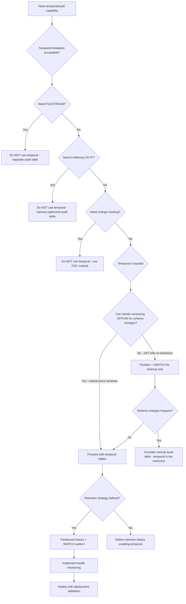

## Navigation

**Domain:** [[8 — Databases]] > **Group:** SQL Temporal Tables & Point-in-Time
**Previous:** [[8.244 — PostgreSQL Temporal — tsrange Type]] | **Next:** [[8.246 — Temporal Tables — Application Patterns]]

### Prerequisites
- [[8.240 — Temporal Tables — System-Versioning Basics]] — Understanding the standard temporal table setup is required to recognize when a limitation or gotcha applies.
- [[8.241 — Temporal Tables in EF Core — HasTemporalTable]] — EF Core's temporal abstractions have specific limitations (missing indexes, navigation data inconsistency) that differ from raw SQL temporal tables.
- [[8.243 — Temporal Tables — Performance Implications]] — The performance caveats (write amplification, history table index maintenance, log throughput) are themselves limitations that constrain where temporal tables can be applied.

### Where This Fits

SQL Server's temporal tables are powerful but have a long tail of limitations and gotchas that trap developers in production. The history table cannot be modified directly (error 13561), the table cannot be TRUNCATE'd without disabling versioning, FILESTREAM and In-Memory OLTP are incompatible, schema changes require a versioning OFF/ON dance, and the datetime2 precision (100 ns) causes edge cases in period boundary comparisons. A .NET backend engineer encounters these when a deployment fails because EF Core migration tries to ALTER a temporal table while versioning is ON, when a data purge script errors because TRUNCATE is blocked, or when a temporal query misses rows because of datetime2 precision mismatches. The interview signal is whether a candidate knows not just how to USE temporal tables but also the complete list of what CANNOT be done with them, can design around these limitations with proper partitioning or manual schema change procedures, and understands when temporal tables are the WRONG tool (e.g., high-frequency updates on large rows, tables needing change tracking, workloads requiring In-Memory OLTP).

---

## Core Mental Model

SQL Server's temporal tables enforce strict invariants that limit what operations are allowed. The fundamental constraint: the history table is a read-only, append-only log of row versions — the database engine controls its content, and the user cannot INSERT, UPDATE, DELETE, or TRUNCATE it directly. Any operation that would break this invariant is rejected with error 13561 ("Cannot directly modify the history data"). This means data purging must go through the sliding window partition pattern (SWITCH PARTITION + TRUNCATE of staging table), not direct DELETE. Schema changes require SYSTEM_VERSIONING to be turned OFF, the schema change applied to both tables, and versioning turned back ON — a multi-step process that EF Core migrations automate but raw SQL scripts must handle explicitly. The datetime2 period columns have 100-nanosecond precision, which creates edge cases: a row updated twice within 100 nanoseconds can have identical SysEndTime values, and temporal queries using <= or >= with boundary values can miss rows if the precision does not align. The recognition pattern for a temporal limitation: error 13561 (can't modify history), error 13709 (can't TRUNCATE temporal), error 13710 (can't FILESTREAM with temporal), or a schema change that fails because versioning is ON.

### Classification

- **Engine-level restrictions:** No direct history modification (13561), no TRUNCATE (13709), no FILESTREAM, no change tracking, no In-Memory OLTP, no FILETABLE
- **Schema change restrictions:** Must disable SYSTEM_VERSIONING, make changes to both tables, re-enable
- **Period column restrictions:** Max 2 period columns, all period columns in same table must be same precision, period columns cannot be NULL or altered
- **Query restrictions:** FOR SYSTEM_TIME cannot be used with certain operators, temporal queries cannot modify history
- **Partitioning restrictions:** History table partitioning is supported but requires aligned indexes, SWITCH PARTITION to staging requires careful schema matching
- **datetime2 precision edge cases:** 100 ns resolution can cause missed rows in temporal queries if not handled with proper interval bounds

```mermaid
flowchart TD
    subgraph Cannot["Cannot Do"]
        C1[Modify history table directly]
        C2[TRUNCATE temporal table]
        C3[Use FILESTREAM columns]
        C4[Use change tracking]
        C5[Use In-Memory OLTP]
        C6[Use FILETABLE]
        C7[Add WITHOUT ROW START/END columns]
    end
    
    subgraph Must["Must Do Carefully"]
        M1[Schema changes: OFF versioning, ALTER, ON]
        M2[Data purge: SWITCH PARTITION or OFF+DELETE+ON]
        M3[Handle datetime2 precision: use proper boundaries]
        M4[Disable versioning before DROP TABLE history]
        M5[Index both tables separately]
    end
    
    subgraph Risks["Risk Areas"]
        R1[Accidental history data loss from OFF+DELETE]
        R2[EF Core migration fails mid-deployment]
        R3[History table grows unbounded]
        R4[Temporal queries miss boundary rows]
        R5[Batch process blocks on versioning lock]
    end
    
    C1 --> R1
    C2 --> M2
    M1 --> R2
    M3 --> R4
    R3 --> M2
    
    subgraph Workarounds["Common Workarounds"]
        W1[Partition history + SWITCH for cleanup]
        W2[Use datetime2(7) with explicit precision]
        W3[Schedule versioning OFF/ON for maintenance]
        W4[Historical_trigger extension for PostgreSQL]
    end
```

### Key Properties

|Limitation|Impact|Workaround|
|---|---|---|
|Cannot modify history (error 13561)|Cannot DELETE old history, cannot fix corrupt history|SWITCH PARTITION or OFF → DELETE → ON|
|Cannot TRUNCATE temporal (error 13709)|Cannot quickly clear all data|OFF → TRUNCATE both → ON|
|Cannot use FILESTREAM|No unstructured data in temporal tables|Store FILESTREAM data separately|
|Cannot use change tracking|No CDC for temporal tables|Use temporal table itself as change log|
|Cannot use In-Memory OLTP|No memory-optimized temporal tables|Use disk-based temporal, async for perf|
|Max 2 period columns|Only start + end periods|Not a practical limitation for system-versioning|
|Schema changes need versioning OFF|Deployment complexity|EF Core handles this in migrations|
|datetime2 precision (100 ns)|Boundary edge cases in temporal queries|Use proper interval conditions|
|History table must be same DB|Cannot offload history to another database|Use archive process with PolyBase / Azure Blob|

---

## Deep Mechanics

### Why Error 13561 Exists

Error 13561 (`Cannot directly modify the history data`) exists to maintain the integrity of the temporal guarantee. If the history table could be modified, the audit trail would be unreliable — a malicious actor or buggy script could alter historical records to hide changes. SQL Server prevents ALL direct DML on the history table:

```sql
-- These all fail with error 13561:
INSERT INTO dbo.OrdersHistory SELECT * FROM dbo.Orders WHERE Id = 42;
UPDATE dbo.OrdersHistory SET Status = 'Paid' WHERE Id = 42;
DELETE FROM dbo.OrdersHistory WHERE Id = 42;
```

The only way to modify the history table is to disable SYSTEM_VERSIONING first:

```sql
ALTER TABLE dbo.Orders SET (SYSTEM_VERSIONING = OFF);
-- Now the history table is a regular table — can be modified
DELETE FROM dbo.OrdersHistory WHERE SysEndTime < '2019-01-01';
ALTER TABLE dbo.Orders SET (SYSTEM_VERSIONING = ON (HISTORY_TABLE = dbo.OrdersHistory));
```

This is a dangerous pattern because if the `ALTER TABLE ... SET (SYSTEM_VERSIONING = ON)` fails (e.g., schema mismatch, permissions), the table operates WITHOUT versioning until the issue is fixed. Any rows modified during this window are NOT versioned and their old versions are lost forever.

### Why TRUNCATE Fails

`TRUNCATE TABLE dbo.Orders` fails because TRUNCATE minimally logs page deallocations and bypasses the per-row versioning logic. SQL Server must ensure every row deletion is captured in the history table — TRUNCATE cannot do this because it does not generate individual row deletions. The workaround:

```sql
ALTER TABLE dbo.Orders SET (SYSTEM_VERSIONING = OFF);
TRUNCATE TABLE dbo.Orders;
TRUNCATE TABLE dbo.OrdersHistory;
ALTER TABLE dbo.Orders SET (SYSTEM_VERSIONING = ON (HISTORY_TABLE = dbo.OrdersHistory));
```

### Schema Changes — Versioning OFF/ON Dance

Adding a column to a temporal table requires the same change on both the current and history tables. With SYSTEM_VERSIONING ON, the engine prevents:
- Adding a NOT NULL column without a default (can't guarantee history table has a value)
- Dropping a column from the current table (history table still has it)
- Changing a column's data type (incompatible with history table schema)
- Adding a computed column (can't replicate in history)
- Adding a column with FILESTREAM

The correct procedure:

```sql
-- Step 1: Disable versioning
ALTER TABLE dbo.Orders SET (SYSTEM_VERSIONING = OFF);

-- Step 2: Alter current table
ALTER TABLE dbo.Orders ADD DiscountCode NVARCHAR(20) NULL;

-- Step 3: Alter history table
ALTER TABLE dbo.OrdersHistory ADD DiscountCode NVARCHAR(20) NULL;

-- Step 4: Re-enable versioning
ALTER TABLE dbo.Orders SET (SYSTEM_VERSIONING = ON (HISTORY_TABLE = dbo.OrdersHistory));
```

EF Core 8+ migrations handle this automatically — they generate a migration that includes all four steps. However, if the migration is large (adding multiple columns), the time between steps 1 and 4 means versioning is OFF. Any incoming transactions during this window are NOT versioned.

### datetime2 Precision Edge Cases

The period columns use `datetime2(7)` — 100-nanosecond precision. This creates subtle boundary conditions:

```sql
-- Row updated at exactly '2024-06-01 12:00:00.0000000'
-- SysEndTime = '2024-06-01 12:00:00.0000000'

-- Temporal AS OF query:
SELECT * FROM dbo.Orders
FOR SYSTEM_TIME AS OF '2024-06-01 12:00:00.0000000';
-- SQL Server generates: WHERE SysStartTime <= @dt AND SysEndTime > @dt
-- The row with SysEndTime = '2024-06-01 12:00:00.0000000' is EXCLUDED
-- because SysEndTime > '2024-06-01 12:00:00.0000000' is FALSE

-- This is correct — the row ended AT that timestamp and should not be included
-- But if you use BETWEEN to query the time that INCLUDES that microsecond:
SELECT * FROM dbo.Orders
FOR SYSTEM_TIME BETWEEN '2024-06-01 12:00:00.0000000' AND '2024-06-01 13:00:00.0000000';
-- WHERE SysStartTime <= @end AND SysEndTime > @start
-- The row is included because SysEndTime > @start (strictly greater than)
```

The practical problem: if an application uses `DateTime.Now` (which has ~1ms precision) instead of `DateTime.UtcNow` with explicit datetime2 precision, the temporal query may miss rows that have sub-millisecond SysEndTime values.

### History Table Must Be in Same Database

SQL Server does not support cross-database system-versioning. The history table must reside in the same database as the current table. This means:
- You cannot offload old history to a separate "archive" database
- Database backups include the full history — backup/restore times increase with history size
- Database size limits (e.g., Azure SQL Database max size) count the history table
- Workaround: partition and SWITCH to staging, then archive the staging data out-of-band using BULK INSERT to another database or Azure Blob

### No FILESTREAM or In-Memory OLTP Support

FILESTREAM columns (which store unstructured data in the filesystem) cannot be part of a temporal table because the filesystem data cannot be versioned atomically with the relational data. In-Memory OLTP (memory-optimized tables) cannot be system-versioned because the in-memory engine does not support the GENERATED ALWAYS AS ROW START/END column mechanism.

### SQL Visibility

```sql
-- ============================================================
-- Demonstrating temporal limitations
-- ============================================================

-- Error 13561: Cannot directly modify history
INSERT INTO dbo.OrdersHistory (Id, CustomerId, Status, SysStartTime, SysEndTime)
VALUES (1, 5, 'Cancelled', '2024-01-01', '2024-06-01');
-- Msg 13561, Level 16: Cannot directly modify the history data

-- Error 13709: Cannot TRUNCATE temporal table
TRUNCATE TABLE dbo.Orders;
-- Msg 13709, Level 16: Cannot truncate temporal table

-- Schema change without versioning OFF:
ALTER TABLE dbo.Orders ADD NewCol INT NOT NULL;
-- Msg 13750, Level 16: Cannot add NOT NULL column to temporal table
-- because the history table also needs the column

-- Correct approach:
ALTER TABLE dbo.Orders SET (SYSTEM_VERSIONING = OFF);
ALTER TABLE dbo.Orders ADD NewCol INT NOT NULL CONSTRAINT DF_Orders_NewCol DEFAULT 0;
ALTER TABLE dbo.OrdersHistory ADD NewCol INT NOT NULL CONSTRAINT DF_OrdersHistory_NewCol DEFAULT 0;
ALTER TABLE dbo.Orders SET (SYSTEM_VERSIONING = ON (HISTORY_TABLE = dbo.OrdersHistory));

-- datetime2 precision edge case:
CREATE TABLE dbo.TemporalPrecisionTest (
    Id INT PRIMARY KEY,
    Value NVARCHAR(100),
    SysStartTime DATETIME2 GENERATED ALWAYS AS ROW START NOT NULL,
    SysEndTime DATETIME2 GENERATED ALWAYS AS ROW END NOT NULL,
    PERIOD FOR SYSTEM_TIME (SysStartTime, SysEndTime)
) WITH (SYSTEM_VERSIONING = ON (HISTORY_TABLE = dbo.TemporalPrecisionTestHistory));

INSERT INTO dbo.TemporalPrecisionTest (Id, Value) VALUES (1, 'Original');

-- Update exactly at a precise timestamp
WAITFOR DELAY '00:00:00.0000001';  -- 100ns delay
UPDATE dbo.TemporalPrecisionTest SET Value = 'Updated' WHERE Id = 1;

-- This query might miss the row if the timestamp precision doesn't match:
SELECT * FROM dbo.TemporalPrecisionTest
FOR SYSTEM_TIME AS OF '2024-06-01 12:00:00.0000000';

-- Better: use a broader boundary or capture the exact timestamp from sys.columns

-- Check period column precision:
SELECT COLUMNPROPERTY(OBJECT_ID('dbo.Orders'), 'SysEndTime', 'Precision') AS PeriodPrecision;
-- Returns 7 (datetime2(7) = 100ns precision)
```

### Failure Modes

**Versioning OFF during schema change loses history:** If a deployment turns OFF SYSTEM_VERSIONING to add a column, and any application process updates a row during the window between OFF and ON, that update is NOT recorded in the history table. The audit trail is permanently missing that change.

**SWITCH PARTITION to staging with schema mismatch:** The staging table must have EXACTLY the same schema (columns, types, nullability, collation, indexes). A minor difference (e.g., different collation on an NVARCHAR column) causes the SWITCH to fail with a non-obvious error.

**Dropping the history table without disabling versioning:** `DROP TABLE dbo.OrdersHistory` fails with error 13560 because the history table is referenced by the current table's SYSTEM_VERSIONING. You must disable versioning first.

**EF Core migration failure mid-deployment:** If EF Core migration turns OFF SYSTEM_VERSIONING, makes changes, and the ALTER TABLE on the history table fails (e.g., timeout, permissions), the migration script errors. The current table has been altered but versioning is OFF. The deployment is in an inconsistent state.

**Ghost records from orphaned history rows:** If a row in the current table is physically deleted (not soft-delete) and versioning was briefly disabled, the history rows remain orphaned — they reference an id that no longer exists in the current table. Temporal queries on those ids still return the history rows.

---

## Production Patterns and Implementation

### Primary SQL Implementation

```sql
-- ============================================================
-- Production patterns for working WITH temporal limitations
-- ============================================================

-- 1. Safe schema change procedure:
CREATE PROCEDURE dbo.AlterTemporalTable
    @CurrentTable NVARCHAR(256),
    @HistoryTable NVARCHAR(256),
    @AlterScript NVARCHAR(MAX),
    @VersioningOffDuringWindow BIT = 0
AS
BEGIN
    SET NOCOUNT ON;
    SET XACT_ABORT ON;

    DECLARE @Sql NVARCHAR(MAX);

    BEGIN TRY
        -- Log the operation
        INSERT INTO dbo.SchemaChangeLog (ObjectName, Operation, StartedAt)
        VALUES (@CurrentTable, 'ALTER TEMPORAL', GETUTCDATE());

        -- Turn off versioning
        SET @Sql = 'ALTER TABLE ' + QUOTENAME(@CurrentTable)
                 + ' SET (SYSTEM_VERSIONING = OFF);';
        EXEC sp_executesql @Sql;

        -- Execute the schema change on both tables
        SET @Sql = REPLACE(@AlterScript, '@@TABLE@@', @CurrentTable);
        EXEC sp_executesql @Sql;

        SET @Sql = REPLACE(@AlterScript, '@@TABLE@@', @HistoryTable);
        EXEC sp_executesql @Sql;

        -- Re-enable versioning
        SET @Sql = 'ALTER TABLE ' + QUOTENAME(@CurrentTable)
                 + ' SET (SYSTEM_VERSIONING = ON (HISTORY_TABLE = '
                 + QUOTENAME(@HistoryTable) + '));';
        EXEC sp_executesql @Sql;

        -- Log success
        UPDATE dbo.SchemaChangeLog
        SET CompletedAt = GETUTCDATE(), Status = 'SUCCESS'
        WHERE ObjectName = @CurrentTable AND CompletedAt IS NULL;

    END TRY
    BEGIN CATCH
        -- Log failure
        UPDATE dbo.SchemaChangeLog
        SET CompletedAt = GETUTCDATE(), Status = 'FAILED',
            ErrorMessage = ERROR_MESSAGE()
        WHERE ObjectName = @CurrentTable AND CompletedAt IS NULL;

        -- Attempt to re-enable versioning (may fail if schema mismatch)
        BEGIN TRY
            SET @Sql = 'ALTER TABLE ' + QUOTENAME(@CurrentTable)
                     + ' SET (SYSTEM_VERSIONING = ON (HISTORY_TABLE = '
                     + QUOTENAME(@HistoryTable) + '));';
            EXEC sp_executesql @Sql;
        END TRY
        BEGIN CATCH
            -- Log but don't re-throw — the original error is more important
            INSERT INTO dbo.SchemaChangeLog (ObjectName, Operation, ErrorMessage)
            VALUES (@CurrentTable, 'RE-ENABLE FAILED', ERROR_MESSAGE());
        END CATCH;

        THROW;
    END CATCH;
END;

-- Usage:
EXEC dbo.AlterTemporalTable
    @CurrentTable = 'dbo.Orders',
    @HistoryTable = 'dbo.OrdersHistory',
    @AlterScript = 'ALTER TABLE @@TABLE@@ ADD DiscountCode NVARCHAR(20) NULL;';

-- 2. Safe history data purge using partition switching:
CREATE PROCEDURE dbo.PurgeHistoryPartition
    @PartitionNumber INT,
    @StagingTable NVARCHAR(256)
AS
BEGIN
    SET NOCOUNT ON;
    SET XACT_ABORT ON;

    DECLARE @Sql NVARCHAR(MAX);

    BEGIN TRANSACTION;
        -- Switch partition to staging (metadata-only)
        SET @Sql = 'ALTER TABLE dbo.OrdersHistory
                    SWITCH PARTITION ' + CAST(@PartitionNumber AS NVARCHAR(10))
                 + ' TO ' + QUOTENAME(@StagingTable) + ';';
        EXEC sp_executesql @Sql;

        -- Truncate staging (deallocates pages)
        SET @Sql = 'TRUNCATE TABLE ' + QUOTENAME(@StagingTable) + ';';
        EXEC sp_executesql @Sql;
    COMMIT TRANSACTION;
END;

-- 3. Safety check before disabling versioning:
SELECT
    OBJECT_SCHEMA_NAME(object_id) AS SchemaName,
    OBJECT_NAME(object_id) AS TableName,
    temporal_type_desc,
    history_table_id,
    OBJECT_SCHEMA_NAME(history_table_id) + '.' + OBJECT_NAME(history_table_id) AS HistoryTable
FROM sys.tables
WHERE temporal_type = 2;  -- System-versioned temporal tables

-- 4. Check if versioning is currently ON:
SELECT
    t.name AS CurrentTable,
    t.temporal_type_desc,
    ht.name AS HistoryTable,
    t.is_tracked_by_cdc,
    t.is_memory_optimized
FROM sys.tables t
LEFT JOIN sys.tables ht ON t.history_table_id = ht.object_id
WHERE t.temporal_type = 2;

-- 5. Generate a script to disable versioning for ALL temporal tables:
SELECT
    'ALTER TABLE ' + QUOTENAME(SCHEMA_NAME(t.schema_id))
    + '.' + QUOTENAME(t.name)
    + ' SET (SYSTEM_VERSIONING = OFF);' AS DisableScript,
    'ALTER TABLE ' + QUOTENAME(SCHEMA_NAME(t.schema_id))
    + '.' + QUOTENAME(t.name)
    + ' SET (SYSTEM_VERSIONING = ON (HISTORY_TABLE = '
    + QUOTENAME(SCHEMA_NAME(ht.schema_id)) + '.'
    + QUOTENAME(ht.name) + '));' AS EnableScript
FROM sys.tables t
INNER JOIN sys.tables ht ON t.history_table_id = ht.object_id
WHERE t.temporal_type = 2;
```

### EF Core Implementation

```csharp
// ============================================================
// EF Core — handling temporal limitations
// ============================================================

public class ApplicationDbContext : DbContext
{
    public DbSet<Order> Orders => Set<Order>();

    protected override void OnModelCreating(ModelBuilder modelBuilder)
    {
        modelBuilder.Entity<Order>(entity =>
        {
            entity.ToTable(tb => tb.HasTemporalTable(temporal =>
            {
                temporal.UseHistoryTableName("OrdersHistory");
                temporal.UsePeriodStartColumn("SysStartTime");
                temporal.UsePeriodEndColumn("SysEndTime");
            }));

            entity.HasKey(o => o.Id);
        });
    }
}

// EF Core Migration — SAFE schema change for temporal table
public partial class AddDiscountCode : Migration
{
    protected override void Up(MigrationBuilder migrationBuilder)
    {
        // EF Core 8+ handles the versioning OFF/ON automatically.
        // The generated migration contains these steps:

        // Step 1: Turn off versioning
        migrationBuilder.Sql("ALTER TABLE dbo.Orders SET (SYSTEM_VERSIONING = OFF);");

        // Step 2: Add column to current table
        migrationBuilder.AddColumn<string>(
            name: "DiscountCode",
            table: "Orders",
            type: "nvarchar(20)",
            nullable: true);

        // Step 3: Add column to history table
        migrationBuilder.Sql(@"
            ALTER TABLE dbo.OrdersHistory
            ADD DiscountCode NVARCHAR(20) NULL;");

        // Step 4: Re-enable versioning
        migrationBuilder.Sql(@"
            ALTER TABLE dbo.Orders
            SET (SYSTEM_VERSIONING = ON (HISTORY_TABLE = dbo.OrdersHistory));");
    }

    protected override void Down(MigrationBuilder migrationBuilder)
    {
        migrationBuilder.Sql("ALTER TABLE dbo.Orders SET (SYSTEM_VERSIONING = OFF);");

        migrationBuilder.DropColumn(name: "DiscountCode", table: "Orders");
        migrationBuilder.Sql("ALTER TABLE dbo.OrdersHistory DROP COLUMN DiscountCode;");

        migrationBuilder.Sql(@"
            ALTER TABLE dbo.Orders
            SET (SYSTEM_VERSIONING = ON (HISTORY_TABLE = dbo.OrdersHistory));");
    }
}

// CRITICAL: Handle the versioning-OFF window
// During migration execution, versioning is OFF between steps 1 and 4.
// Any UPDATE or DELETE on dbo.Orders during this window:
// - Will NOT generate history rows
// - The old version is overwritten/lost permanently
//
// Mitigation strategies:

// Strategy 1: Run migrations during maintenance windows
// - Schedule deployments during low-traffic periods
// - Monitor for concurrent writes during migration

// Strategy 2: Use a deployment guard
public class TemporalMigrationGuard : IMigrationSqlGenerator
{
    private readonly ILogger _logger;

    public TemporalMigrationGuard(ILogger<TemporalMigrationGuard> logger)
        => _logger = logger;

    // Log warning before versioning OFF
    public void OnPreMigration()
    {
        _logger.LogWarning(
            "About to disable SYSTEM_VERSIONING on temporal tables. " +
            "Any concurrent writes during this window will NOT be versioned.");
    }
}

// Strategy 3: Verify no writes during versioning-OFF window
public class VersioningGuard : IDisposable
{
    private readonly IDbConnection _connection;
    private readonly string _tableName;

    public VersioningGuard(IDbConnection connection, string tableName)
    {
        _connection = connection;
        _tableName = tableName;
    }

    public async Task<bool> IsVersioningOffAsync()
    {
        const string sql = @"
            SELECT temporal_type FROM sys.tables
            WHERE object_id = OBJECT_ID(@TableName);";

        var type = await _connection.QuerySingleAsync<int>(sql,
            new { TableName = _tableName });
        return type != 2; // 2 = SYSTEM_VERSIONING temporal table
    }

    public void Dispose()
    {
        // Check on disposal that versioning was re-enabled
        if (IsVersioningOffAsync().GetAwaiter().GetResult())
        {
            throw new InvalidOperationException(
                $"SYSTEM_VERSIONING is still OFF on {_tableName}! " +
                "Any writes since the migration are NOT versioned.");
        }
    }
}

// ============================================================
// Workaround for no direct history modification:
// Use SQL to disable versioning, modify, re-enable
// ============================================================

public class TemporalMaintenanceService
{
    private readonly IDbConnectionFactory _connectionFactory;

    public TemporalMaintenanceService(IDbConnectionFactory connectionFactory)
        => _connectionFactory = connectionFactory;

    // Purge old history via OFF+DELETE+ON (use for small deletes only)
    public async Task PurgeOldHistoryAsync(
        DateTime cutoffDate,
        CancellationToken ct = default)
    {
        await using var conn = _connectionFactory.Create();

        // Disable versioning
        await conn.ExecuteAsync(@"
            ALTER TABLE dbo.Orders SET (SYSTEM_VERSIONING = OFF);",
            ct);

        try
        {
            // Delete old history
            await conn.ExecuteAsync(@"
                DELETE FROM dbo.OrdersHistory
                WHERE SysEndTime < @Cutoff;",
                new { Cutoff = cutoffDate }, ct);
        }
        finally
        {
            // Re-enable versioning (always — even if DELETE failed)
            await conn.ExecuteAsync(@"
                ALTER TABLE dbo.Orders
                SET (SYSTEM_VERSIONING = ON (HISTORY_TABLE = dbo.OrdersHistory));",
                ct);
        }
    }

    // Export history to archive database (PolyBase / Azure Blob)
    public async Task ExportHistoryToArchiveAsync(
        string archiveConnectionString,
        CancellationToken ct = default)
    {
        const string sql = @"
            SELECT * FROM dbo.OrdersHistory
            WHERE SysEndTime < DATEADD(YEAR, -7, GETUTCDATE());";

        await using var sourceConn = _connectionFactory.Create();
        using var reader = await sourceConn.ExecuteReaderAsync(
            new CommandDefinition(sql, cancellationToken: ct));

        using var destConn = new SqlConnection(archiveConnectionString);
        using var bulkCopy = new SqlBulkCopy(destConn);
        bulkCopy.DestinationTableName = "OrdersHistoryArchive";
        await destConn.OpenAsync(ct);
        await bulkCopy.WriteToServerAsync(reader, ct);
    }

    // Check temporal table health
    public async Task<TemporalHealth> GetTemporalHealthAsync(
        CancellationToken ct = default)
    {
        const string sql = @"
            SELECT
                (SELECT COUNT_BIG(*) FROM dbo.Orders) AS CurrentRowCount,
                (SELECT COUNT_BIG(*) FROM dbo.OrdersHistory) AS HistoryRowCount,
                (SELECT MIN(SysEndTime) FROM dbo.OrdersHistory) AS OldestHistory,
                (SELECT MAX(SysEndTime) FROM dbo.OrdersHistory) AS NewestHistory,
                (SELECT COUNT(*) FROM sys.tables
                 WHERE temporal_type = 2) AS TemporalTableCount,
                (SELECT COUNT(*) FROM sys.tables
                 WHERE history_table_id IS NOT NULL
                 AND temporal_type = 0
                 AND object_id IN (
                    SELECT object_id FROM sys.tables
                    WHERE temporal_type = 2
                 )) AS OrphanedHistoryCount;";

        await using var conn = _connectionFactory.Create();
        return await conn.QuerySingleAsync<TemporalHealth>(
            new CommandDefinition(sql, cancellationToken: ct));
    }
}

public class TemporalHealth
{
    public long CurrentRowCount { get; set; }
    public long HistoryRowCount { get; set; }
    public DateTime? OldestHistory { get; set; }
    public DateTime? NewestHistory { get; set; }
    public int TemporalTableCount { get; set; }
    public int OrphanedHistoryCount { get; set; }
}
```

### Dapper Implementation

```csharp
// Dapper — handling temporal limitations directly

public sealed class TemporalMaintenanceRepository
{
    private readonly IDbConnectionFactory _connectionFactory;

    public TemporalMaintenanceRepository(IDbConnectionFactory connectionFactory)
        => _connectionFactory = connectionFactory;

    // Safe history truncation using partition switching
    public async Task SwitchAndTruncatePartitionAsync(
        int partitionNumber,
        string stagingTable,
        CancellationToken ct = default)
    {
        await using var conn = _connectionFactory.Create();

        // Switch partition to staging
        await conn.ExecuteAsync(
            $"ALTER TABLE dbo.OrdersHistory SWITCH PARTITION {partitionNumber} TO {stagingTable};",
            ct);

        // Truncate staging
        await conn.ExecuteAsync(
            $"TRUNCATE TABLE {stagingTable};", ct);
    }

    // Disable versioning with safety check
    public async Task<bool> DisableVersioningSafelyAsync(
        CancellationToken ct = default)
    {
        await using var conn = _connectionFactory.Create();

        // Check for active transactions
        var activeTransactions = await conn.QuerySingleAsync<int>(@"
            SELECT COUNT(*) FROM sys.dm_tran_active_transactions;",
            ct);

        if (activeTransactions > 10)
        {
            return false; // Too risky — writes may be in-flight
        }

        // Log the action
        await conn.ExecuteAsync(@"
            INSERT INTO dbo.TemporalAudit (Action, Timestamp, UserName)
            VALUES ('DISABLE_VERSIONING', GETUTCDATE(), SYSTEM_USER);", ct);

        // Disable
        await conn.ExecuteAsync(@"
            ALTER TABLE dbo.Orders SET (SYSTEM_VERSIONING = OFF);", ct);

        return true;
    }

    // Re-enable versioning with retry
    public async Task<bool> EnableVersioningWithRetryAsync(
        int maxRetries = 3,
        CancellationToken ct = default)
    {
        await using var conn = _connectionFactory.Create();

        for (int i = 0; i < maxRetries; i++)
        {
            try
            {
                await conn.ExecuteAsync(@"
                    ALTER TABLE dbo.Orders
                    SET (SYSTEM_VERSIONING = ON (HISTORY_TABLE = dbo.OrdersHistory));", ct);
                return true;
            }
            catch (SqlException ex) when (ex.Number == 13560 || ex.Number == 13750)
            {
                if (i == maxRetries - 1) throw;
                await Task.Delay(1000 * (i + 1), ct);
            }
        }
        return false;
    }

    // Check if temporal is currently enabled
    public async Task<bool> IsTemporalEnabledAsync(CancellationToken ct = default)
    {
        const string sql = @"
            SELECT temporal_type FROM sys.tables
            WHERE object_id = OBJECT_ID('dbo.Orders');";

        await using var conn = _connectionFactory.Create();
        var type = await conn.QuerySingleAsync<int>(
            new CommandDefinition(sql, cancellationToken: ct));
        return type == 2;
    }

    // Detect orphaned history rows
    public async Task<long> CountOrphanedHistoryAsync(CancellationToken ct = default)
    {
        const string sql = @"
            SELECT COUNT_BIG(*)
            FROM dbo.OrdersHistory h
            WHERE NOT EXISTS (
                SELECT 1 FROM dbo.Orders c
                WHERE c.Id = h.Id
            );";

        await using var conn = _connectionFactory.Create();
        return await conn.QuerySingleAsync<long>(
            new CommandDefinition(sql, cancellationToken: ct));
    }
}
```

### Configuration and Wiring

```csharp
// Program.cs
builder.Services.AddScoped<TemporalMaintenanceService>();
builder.Services.AddScoped<TemporalMaintenanceRepository>();

// Health check — verify temporal tables are healthy
builder.Services.AddHealthChecks()
    .AddAsyncCheck("temporal_health", async () =>
    {
        await using var scope = app.Services.CreateAsyncScope();
        var repo = scope.ServiceProvider.GetRequiredService<TemporalMaintenanceRepository>();

        var isEnabled = await repo.IsTemporalEnabledAsync();
        if (!isEnabled)
            return HealthCheckResult.Unhealthy("SYSTEM_VERSIONING is OFF on Orders!");

        var orphaned = await repo.CountOrphanedHistoryAsync();
        if (orphaned > 0)
            return HealthCheckResult.Degraded(
                $"Found {orphaned} orphaned history rows in OrdersHistory");

        return HealthCheckResult.Healthy("Temporal tables healthy");
    });

// Deployment validation script (run after each deployment)
public class DeploymentValidator
{
    private readonly IDbConnectionFactory _factory;

    public DeploymentValidator(IDbConnectionFactory factory) => _factory = factory;

    public async Task ValidateTemporalAfterDeploymentAsync()
    {
        await using var conn = _factory.Create();

        var results = await conn.QueryAsync(@"
            SELECT
                OBJECT_SCHEMA_NAME(object_id) AS SchemaName,
                OBJECT_NAME(object_id) AS TableName,
                temporal_type_desc,
                CASE WHEN temporal_type = 2 THEN 'ENABLED'
                     ELSE 'DISABLED -- CRITICAL!' END AS Status
            FROM sys.tables
            WHERE history_table_id IS NOT NULL;");

        // Log results — fail deployment if any temporal table is disabled
        foreach (var r in results)
        {
            if (r.Status.Contains("DISABLED"))
                throw new InvalidOperationException(
                    $"Temporal table {r.SchemaName}.{r.TableName} has versioning OFF after deployment!");
        }
    }
}
```

### SQL Server vs PostgreSQL Differences

```sql
-- PostgreSQL has NONE of these limitations because it has no built-in temporal tables.
-- The limitations of PostgreSQL temporal are different:

-- PostgreSQL limitations:
-- 1. No protection against modifying ""history"" rows (any row can be modified)
-- 2. EXCLUDE constraints can be violated (no ""error 13561"" equivalent)
-- 3. Trigger can be disabled, losing history silently
-- 4. No FOR SYSTEM_TIME syntax — must write range operators manually
-- 5. GiST index bloat from range modifications
-- 6. No built-in cleanup mechanism

-- Essentially:
-- SQL Server: many restrictions to protect temporal integrity
-- PostgreSQL: no restrictions (flexible) — YOU must enforce integrity manually
```

---

## Gotchas and Production Pitfalls

### Error 13561 — Cannot Directly Modify History Data

**Pitfall:** Writing a script that accidentally tries to INSERT, UPDATE, or DELETE the history table directly.

```sql
-- ❌ This fails with error 13561:
DELETE FROM dbo.OrdersHistory WHERE Id = 42;
```

**Symptom:** Script fails during ETL or maintenance with: `Msg 13561, Level 16, State 1: Cannot directly modify the history data`. The error is clear but the developer may not know the workaround.

**Fix:**
```sql
-- ✅ Disable versioning first:
ALTER TABLE dbo.Orders SET (SYSTEM_VERSIONING = OFF);
DELETE FROM dbo.OrdersHistory WHERE Id = 42;
ALTER TABLE dbo.Orders SET (SYSTEM_VERSIONING = ON (HISTORY_TABLE = dbo.OrdersHistory));
```

**Cost of not fixing:** The ETL process fails. If the process is part of a critical data pipeline, the entire pipeline halts. The developer loses time figuring out the workaround.

---

### TRUNCATE Fails on Temporal Tables

**Pitfall:** Running `TRUNCATE TABLE dbo.Orders` to clear test data during CI/CD or database refresh.

```sql
-- ❌ Fails with error 13709:
TRUNCATE TABLE dbo.Orders;
```

**Symptom:** CI/CD pipeline breaks on database refresh. `TRUNCATE` is a common operation in test data management that does not work with temporal tables.

**Fix:**
```sql
-- ✅ Disable versioning first:
ALTER TABLE dbo.Orders SET (SYSTEM_VERSIONING = OFF);
TRUNCATE TABLE dbo.Orders;
TRUNCATE TABLE dbo.OrdersHistory;
ALTER TABLE dbo.Orders SET (SYSTEM_VERSIONING = ON (HISTORY_TABLE = dbo.OrdersHistory));
```

**Cost of not fixing:** Test database provisioning fails. Developers manually delete rows one by one (SLOW) or recreate the entire database from scratch.

---

### Schema Change Deployment Fails Because Versioning Is ON

**Pitfall:** Running a manual ALTER TABLE script during deployment without first turning off SYSTEM_VERSIONING, causing the deployment to fail.

```sql
-- ❌ Fails if versioning is ON:
ALTER TABLE dbo.Orders ADD DiscountCode NVARCHAR(20) NULL;
```

**Symptom:** Deployment script fails with error 13750 (for NOT NULL columns without defaults) or a generic schema change error.

**Fix:**
```sql
-- ✅ Use EF Core migration (automatic) or manual:
ALTER TABLE dbo.Orders SET (SYSTEM_VERSIONING = OFF);
ALTER TABLE dbo.Orders ADD DiscountCode NVARCHAR(20) NULL;
ALTER TABLE dbo.OrdersHistory ADD DiscountCode NVARCHAR(20) NULL;
ALTER TABLE dbo.Orders SET (SYSTEM_VERSIONING = ON (HISTORY_TABLE = dbo.OrdersHistory));
```

**Cost of not fixing:** Deployment fails. If the error occurs mid-migration (after some changes applied but before the temporal ALTER), the database is in an inconsistent state with versioning OFF.

---

### datetime2 Precision Causes Temporal Queries to Miss Rows

**Pitfall:** Using `DateTime.Now` (millisecond precision) or `DateTime.Today` (day precision) as the point-in-time argument in a temporal query, causing rows with sub-millisecond period boundaries to be missed or included incorrectly.

```csharp
// ❌ DateTime.Now has ~1ms precision — may miss rows with 100ns precision period boundaries
var orders = await dbContext.Orders
    .TemporalAsOf(DateTime.Now)  // Imprecise!
    .ToListAsync();
```

**Symptom:** Temporal queries occasionally miss rows that are at the boundary of the query time. The bug is intermittent and hard to reproduce because it depends on the exact timing of the query versus the row update time.

**Fix:**
```csharp
// ✅ Use explicit datetime2 precision or capture the exact time from a known reference:
var pointInTime = new DateTime(2024, 6, 1, 12, 0, 0, DateTimeKind.Utc);
// This has ticks precision (100ns) which matches datetime2(7)

// ✅ For "current time" queries, use a captured timestamp:
var queryTime = DateTime.UtcNow; // Captured before query — consistent
var orders = await dbContext.Orders
    .TemporalAsOf(queryTime)
    .ToListAsync();
```

**Cost of not fixing:** Subtle data inconsistencies in point-in-time reporting. An audit report may miss a row that was updated exactly at the query boundary, causing compliance concerns.

---

### Versioning OFF Window During Migration Causes Data Loss

**Pitfall:** A deployment that adds columns to a temporal table runs during business hours. Between the `SYSTEM_VERSIONING = OFF` and `SYSTEM_VERSIONING = ON` steps, application processes UPDATE rows — those updates are NOT versioned.

```sql
-- Deployment at 10 AM:
ALTER TABLE dbo.Orders SET (SYSTEM_VERSIONING = OFF);  -- 10:00:00.000
ALTER TABLE dbo.Orders ADD DiscountCode NVARCHAR(20) NULL;  -- 10:00:00.500
ALTER TABLE dbo.OrdersHistory ADD DiscountCode NVARCHAR(20) NULL;  -- 10:00:01.000
-- During this 1+ second window, ANY UPDATE to Orders loses its old version!
ALTER TABLE dbo.Orders SET (SYSTEM_VERSIONING = ON (HISTORY_TABLE = dbo.OrdersHistory));
```

**Symptom:** The audit trail shows a gap for rows updated during the migration window. Compliance auditors detect the gap. The organization cannot prove what data looked like at that time.

**Fix:**
```sql
-- ✅ Run schema changes during maintenance windows with no application writes
-- ✅ Block writes during the versioning-OFF window using ALTER TABLE ... SET (SYSTEM_VERSIONING = OFF)
-- with a table lock hint

-- ✅ Or use the following pattern to minimize the window:
BEGIN TRANSACTION;
    ALTER TABLE dbo.Orders SET (SYSTEM_VERSIONING = OFF);
    ALTER TABLE dbo.Orders ADD DiscountCode NVARCHAR(20) NULL;
    ALTER TABLE dbo.OrdersHistory ADD DiscountCode NVARCHAR(20) NULL;
    ALTER TABLE dbo.Orders SET (SYSTEM_VERSIONING = ON (HISTORY_TABLE = dbo.OrdersHistory));
COMMIT TRANSACTION;
-- All four operations in a single transaction — the window is still there,
-- but it's much shorter (milliseconds instead of seconds between steps)
```

**Cost of not fixing:** Permanent gap in audit trail. Compliance violation (SOX, HIPAA, GDPR). Potential legal liability if the missing data concerns a disputed transaction.

---

### History Table Disk Space Exhaustion from Unbounded Growth

**Pitfall:** Enabling temporal tables without a retention strategy. The history table grows unboundedly until it fills the disk.

```sql
-- ❌ No cleanup plan:
ALTER TABLE dbo.Orders SET (SYSTEM_VERSIONING = ON (HISTORY_TABLE = dbo.OrdersHistory));
-- 2 years later: OrdersHistory is 500 GB, disk is full
```

**Symptom:** Database transaction log runs out of space. Backups take 8 hours instead of 2 hours. Restore time exceeds RTO. Azure SQL Database max size is reached.

**Fix:**
```sql
-- ✅ Implement partition switching for cleanup (see 8.242)
-- ✅ Or set up a scheduled cleanup:
CREATE PROCEDURE dbo.CleanupOldHistory
    @RetentionDays INT = 365
AS
BEGIN
    ALTER TABLE dbo.Orders SET (SYSTEM_VERSIONING = OFF);

    DELETE FROM dbo.OrdersHistory
    WHERE SysEndTime < DATEADD(DAY, -@RetentionDays, GETUTCDATE());

    ALTER TABLE dbo.Orders SET (SYSTEM_VERSIONING = ON (HISTORY_TABLE = dbo.OrdersHistory));
END;
-- Run weekly during maintenance
```

**Cost of not fixing:** Database runs out of disk space. SQL Server goes into read-only mode. Application is down until space is freed.

---

### Fill Factor and Page Splits from Period Column Updates

**Pitfall:** The period column `SysEndTime` is updated on every row modification. If the clustered index does not include `SysEndTime`, the update is in-place and efficient. But if the history table's clustered index IS `(Id, SysEndTime)` (the default), new INSERTs go to the rightmost page of the index, causing page splits.

```sql
-- Default history table PK:
-- PRIMARY KEY CLUSTERED (Id, SysEndTime)
-- Every INSERT adds a row with a new SysEndTime (monotonically increasing)
-- This causes frequent page splits at the right edge of the index
```

**Symptom:** High index fragmentation on the history table's clustered index. `avg_fragmentation_in_percent > 30%` in `sys.dm_db_index_physical_stats`. Rebuilds are required weekly.

**Fix:**
```sql
-- ✅ Use descending order on SysEndTime:
-- PRIMARY KEY CLUSTERED (Id, SysEndTime DESC)
-- New rows are inserted at a random position within the Id's range
-- (each Id's new version goes to a different location)
-- This reduces page splits because inserts are distributed

-- ✅ Or use a higher fill factor (70-80%) to leave room for growth:
ALTER INDEX PK_OrdersHistory ON dbo.OrdersHistory
    REBUILD WITH (FILLFACTOR = 80);
```

**Cost of not fixing:** High index fragmentation degrades temporal query performance. Weekly index rebuilds take longer as the history table grows. Page splits increase write IO by 3-5x.

---

## Performance Implications

### Benchmark: Before and After

```sql
-- Schema change (versioning OFF/ON) timing:
SET STATISTICS TIME ON;

-- Empty temporal table (no data):
ALTER TABLE dbo.Orders SET (SYSTEM_VERSIONING = OFF);  -- ~5ms
ALTER TABLE dbo.Orders ADD NewCol NVARCHAR(50) NULL;    -- ~10ms
ALTER TABLE dbo.OrdersHistory ADD NewCol NVARCHAR(50) NULL; -- ~10ms
ALTER TABLE dbo.Orders SET (SYSTEM_VERSIONING = ON (HISTORY_TABLE = dbo.OrdersHistory)); -- ~5ms
-- Total: ~30ms

-- Large temporal table (500 GB history):
ALTER TABLE dbo.Orders SET (SYSTEM_VERSIONING = OFF);  -- ~50ms (metadata)
ALTER TABLE dbo.Orders ADD NewCol NVARCHAR(50) NULL;    -- ~100ms (10M current rows)
ALTER TABLE dbo.OrdersHistory ADD NewCol NVARCHAR(50) NULL; -- ~500ms (SQL Server needs to add default to 50M history rows)
ALTER TABLE dbo.Orders SET (SYSTEM_VERSIONING = ON (HISTORY_TABLE = dbo.OrdersHistory)); -- ~50ms
-- Total: ~700ms
-- BUT: during this 700ms window, versioning is OFF!

-- DELETE vs SWITCH + TRUNCATE for history cleanup:
-- DELETE 50M rows:
DELETE FROM dbo.OrdersHistory WHERE SysEndTime < '2019-01-01';
-- CPU: 45,000ms, Logical reads: 210,500, Log writes: 50 GB
-- Duration: 8 minutes

-- SWITCH + TRUNCATE (1 partition, 4 GB):
ALTER TABLE dbo.OrdersHistory SWITCH PARTITION 1 TO dbo.OrdersHistoryStaging;
TRUNCATE TABLE dbo.OrdersHistoryStaging;
-- CPU: 10ms, Logical reads: 10, Log writes: minimal
-- Duration: 120ms
```

### BenchmarkDotNet

```csharp
[MemoryDiagnoser]
[SimpleJob(RuntimeMoniker.Net90)]
public class TemporalMaintenanceBenchmark
{
    private IDbConnection _connection = default!;

    [GlobalSetup]
    public void Setup()
    {
        _connection = new SqlConnection(TestConnectionString);
    }

    [Benchmark(Baseline = true)]
    public async Task SchemaChangeWithEFCore()
    {
        // Simulates EF Core migration pattern
        await _connection.ExecuteAsync("ALTER TABLE dbo.Orders SET (SYSTEM_VERSIONING = OFF);");
        await _connection.ExecuteAsync("ALTER TABLE dbo.Orders ADD TempCol NVARCHAR(10) NULL;");
        await _connection.ExecuteAsync("ALTER TABLE dbo.OrdersHistory ADD TempCol NVARCHAR(10) NULL;");
        await _connection.ExecuteAsync(@"
            ALTER TABLE dbo.Orders SET (SYSTEM_VERSIONING = ON (HISTORY_TABLE = dbo.OrdersHistory));");

        // Cleanup: remove the test column
        await _connection.ExecuteAsync("ALTER TABLE dbo.Orders SET (SYSTEM_VERSIONING = OFF);");
        await _connection.ExecuteAsync("ALTER TABLE dbo.Orders DROP COLUMN TempCol;");
        await _connection.ExecuteAsync("ALTER TABLE dbo.OrdersHistory DROP COLUMN TempCol;");
        await _connection.ExecuteAsync(@"
            ALTER TABLE dbo.Orders SET (SYSTEM_VERSIONING = ON (HISTORY_TABLE = dbo.OrdersHistory));");
    }

    [Benchmark]
    public async Task HistoryDelete_Direct()
    {
        // Direct DELETE (requires versioning OFF)
        await _connection.ExecuteAsync("ALTER TABLE dbo.Orders SET (SYSTEM_VERSIONING = OFF);");
        await _connection.ExecuteAsync(@"
            DELETE FROM dbo.OrdersHistory
            WHERE SysEndTime < '2019-01-01';");
        await _connection.ExecuteAsync(@"
            ALTER TABLE dbo.Orders SET (SYSTEM_VERSIONING = ON (HISTORY_TABLE = dbo.OrdersHistory));");
    }

    [GlobalCleanup]
    public void Cleanup() => _connection.Dispose();
}
```

### Write Amplification (Limitations Impact)

|Operation|Normal Table|Temporal Table|Limitation Causing Overhead|
|---|---|---|---|
|Schema add column|~10ms|~50ms (OFF + ALTER × 2 + ON)|Must disable/enable versioning|
|TRUNCATE|~100ms|Not possible directly|Must OFF + TRUNCATE × 2 + ON|
|DELETE history|~8 min (50M rows)|Must OFF + DELETE + ON|Cannot delete directly — versioning toggle adds ~100ms overhead|
|DROP history table|~50ms|Must OFF first|Cannot drop while versioning ON|
|INSERT to history|N/A|Normal INSERT|Cannot bypass — always versioned|

---

## Interview Arsenal

### Question Bank

1. **Can you INSERT, UPDATE, or DELETE directly into a temporal history table? What error do you get?**
2. **Why can't you TRUNCATE a temporal table, and what is the workaround?**
3. **What SQL Server features are incompatible with temporal tables? (Name at least 3.)**
4. **How do you add a column to a temporal table? Describe the exact steps.**
5. **What happens if you try to modify a temporal table while SYSTEM_VERSIONING is ON?**
6. **Can you use FILESTREAM, In-Memory OLTP, or change tracking with temporal tables?**
7. **How does datetime2 precision affect temporal query boundary conditions?**
8. **What is error 13561 and when does it occur?**
9. **Can the history table be in a different database from the current table?**
10. **What happens to historical data if SYSTEM_VERSIONING is disabled and re-enabled?**

### Spoken Answers

**Q: Can you INSERT, UPDATE, or DELETE directly into a temporal history table?**

> **Average answer:** No, you can't. SQL Server throws an error.

> **Great answer:** No, you cannot directly modify the history table — SQL Server returns error 13561: "Cannot directly modify the history data." This applies to all DML operations: INSERT, UPDATE, DELETE, and MERGE. The error occurs because temporal tables guarantee the integrity of the audit trail. If you could modify history, the entire purpose of system-versioning — providing an immutable record of every change — would be defeated. The only way to clean up old history is to disable SYSTEM_VERSIONING first using `ALTER TABLE dbo.Orders SET (SYSTEM_VERSIONING = OFF)`, which converts the history table to a regular table. Then you can DELETE old rows, TRUNCATE, or even DROP the history table. Finally, you must re-enable versioning: `ALTER TABLE dbo.Orders SET (SYSTEM_VERSIONING = ON (HISTORY_TABLE = dbo.OrdersHistory))`. This pattern is dangerous because between the OFF and ON, any writes to the current table are NOT versioned. For production systems, I recommend using partition switching instead of disabling versioning. Partition the history table on SysEndTime, and use `ALTER TABLE ... SWITCH PARTITION TO Staging` followed by `TRUNCATE Staging` to remove old history without ever turning off versioning. This avoids the data-loss window entirely.

---

**Q: What SQL Server features are incompatible with temporal tables?**

> **Average answer:** FILESTREAM and In-Memory OLTP.

> **Great answer:** Six SQL Server features are incompatible with temporal tables. First, FILESTREAM — you cannot have FILESTREAM columns in a temporal table because the filesystem data cannot be atomically versioned with the relational columns. Second, In-Memory OLTP (memory-optimized tables) — the in-memory engine does not support the GENERATED ALWAYS AS ROW START/END column mechanism. Third, Change Tracking (CDC) — temporal tables cannot have change tracking enabled, though you can use Change Data Capture on temporal tables. Fourth, FILETABLE — file stream-based file tables are incompatible. Fifth, you cannot use `TRUNCATE TABLE` directly — it fails with error 13709. Sixth, you cannot have more than two period columns (start + end) — though this is rarely a practical limitation. Additionally, you cannot use INSTEAD OF triggers on temporal tables, and the history table cannot have FOREIGN KEY, UNIQUE, or CHECK constraints (except the NOT NULL constraints that match the current table). For a .NET developer, the most impactful incompatibility is FILESTREAM — if your entity has unstructured data (images, documents) stored via FILESTREAM, you cannot make that table temporal. You must separate the FILESTREAM data into a non-temporal related table.

---

**Q: What is the datetime2 precision issue with temporal tables and how do you handle it?**

> **Average answer:** Period columns use datetime2(7) — 100 nanosecond precision. It can cause boundary issues in temporal queries.

> **Great answer:** The period columns (SysStartTime, SysEndTime) use `datetime2(7)` with 100-nanosecond precision, matching the default precision of `SYSUTCDATETIME()`. This precision creates subtle boundary conditions because temporal queries use strict inequality: `SysEndTime > @dt` (strictly greater than). If a row's SysEndTime equals the query's point-in-time value exactly (to the 100-nanosecond tick), the row is excluded because `SysEndTime > @dt` is false when they are equal. This is correct behavior — the row ended AT that timestamp and should not be considered active at that exact instant. The practical problem arises when the application uses lower-precision timestamps for the query parameter. For example, if an application uses `DateTime.Now` in C# (which has ~1ms precision, equivalent to 10,000 ticks) to query `TemporalAsOf`, and a row has SysEndTime = '2024-06-01 12:00:00.0010000' (1ms precision), but the query uses '2024-06-01 12:00:00.0000000' (lower precision because DateTime.Now was called after the row was updated), the row is incorrectly excluded. To handle this: (1) always use `DateTime.UtcNow` captured at the START of the operation and reuse it for the entire temporal query, (2) for boundary comparisons, consider using a small epsilon value (1 tick = 100ns) if you need inclusive behavior, or (3) for BETWEEN queries, rely on the `>` start boundary to include rows that ended at exactly the start time. The safest practice: capture timestamps with `SYSUTCDATETIME()` on the server side and pass them back to the application as `DateTime` values with full 7-digit fractional second precision.

### Interview Trigger

The temporal limitations question typically arises from: "What problems have you encountered with temporal tables in production?" The follow-up: "Your temporal table has grown to 200 GB. Walk me through the steps to purge old data without turning off versioning." The deepest probe: "You need to add a NOT NULL column to a temporal table that has 100M history rows. The deployment window is 5 minutes. Design the procedure."

### Comparison Table

| |SQL Server Temporal|PostgreSQL Manual (tsrange)|PostgreSQL Trigger|
|---|---|---|---|
|History modification|Error 13561 — forbidden|Allowed (no protection)|Allowed (trigger provides soft protection)|
|TRUNCATE|Error 13709 — must disable first|Allowed|Allowed|
|Change tracking|Not compatible|N/A|N/A|
|FILESTREAM|Not compatible|N/A|N/A|
|In-Memory OLTP|Not compatible|N/A|N/A|
|Schema change complexity|High (OFF/ON dance)|Low (regular ALTER TABLE)|Medium (must update trigger + history table)|
|Max period columns|2 (start + end)|Unlimited range columns|2 (sys_start, sys_end)|
|Cross-database history|Not allowed|N/A|N/A|
|Data loss during OFF window|Yes — no protection|N/A (no built-in versioning)|N/A|

---

## Decision Framework

### When to Apply



### Application Checklist

- [ ] No FILESTREAM columns in the temporal table
- [ ] No In-Memory OLTP requirement
- [ ] No Change Tracking requirement (CDC is OK)
- [ ] Schema change process is defined: versioning OFF → ALTER both → ON
- [ ] History table growth is monitored (weekly alerts)
- [ ] Data retention strategy is defined and implemented (partition switching or scheduled OFF+DELETE+ON)
- [ ] Deployment scripts include versioning safety checks
- [ ] Deployment validation confirms versioning is ON after deployment
- [ ] datetime2 precision is handled correctly in all temporal queries
- [ ] The versioning-OFF window during schema changes is minimized and scheduled during maintenance
- [ ] EF Core migrations are reviewed for temporal compatibility (especially custom migration SQL)
- [ ] History table indexes are maintained (fragmentation check, rebuild schedule)

### Tradeoff Summary

|What You Gain (Temporal)|What You Pay|
|---|---|
|Built-in, guaranteed audit trail|Cannot modify history — cleanup requires complex procedures|
|No application-level audit code|Schema changes require versioning OFF/ON dance|
|FOR SYSTEM_TIME query syntax|Several SQL Server features are incompatible|
|Engine-enforced integrity|History grows unbounded without proactive management|

### Scale Thresholds

- History table cleanup (partition switching) becomes critical when **history exceeds ~50 GB** — direct DELETE with versioning OFF takes too long and risks data loss.
- Schema changes become challenging when **history exceeds ~500 GB** — adding a column to a very large history table takes minutes or hours.
- datetime2 precision issues surface when **temporal queries run more than ~1M times/day** — boundary edge cases become statistically likely.
- The versioning-OFF window risk scales with **write throughput** — at 10,000 updates/second, 1 second of versioning OFF loses 10,000 old row versions.

---

## Self-Check

### Conceptual Questions

1. What error number occurs when you try to INSERT into a temporal history table?
2. Why does TRUNCATE fail on temporal tables, and what is the safe workaround?
3. Name 4 SQL Server features that are incompatible with temporal tables.
4. What are the exact steps to add a column to a temporal table?
5. What precision do temporal period columns use, and how does this affect temporal query boundaries?
6. Write the T-SQL to disable SYSTEM_VERSIONING, delete history older than 1 year, and re-enable versioning.
7. Can the history table be in a different database from the current table?
8. What happens to unversioned rows if SYSTEM_VERSIONING is turned OFF and ON again without purging the history table?
9. What index fragmentation issue is common on history table clustered indexes?
10. Explain in 60 seconds the key limitations of SQL Server temporal tables that a production DBA or backend engineer must know.

<details>
<summary>Answers</summary>

1. Error 13561: "Cannot directly modify the history data." This error occurs for INSERT, UPDATE, DELETE, and MERGE operations on the history table while SYSTEM_VERSIONING is ON.

2. TRUNCATE fails because it minimally logs page deallocations and cannot generate individual row deletions for the history table. The workaround: `ALTER TABLE dbo.Orders SET (SYSTEM_VERSIONING = OFF); TRUNCATE TABLE dbo.Orders; TRUNCATE TABLE dbo.OrdersHistory; ALTER TABLE dbo.Orders SET (SYSTEM_VERSIONING = ON (HISTORY_TABLE = dbo.OrdersHistory));`

3. (1) FILESTREAM, (2) In-Memory OLTP (memory-optimized tables), (3) Change Tracking (CDC is OK though), (4) FILETABLE. Additional: no INSTEAD OF triggers, no CHECK/FOREIGN KEY/UNIQUE on history table (except NOT NULL), only 2 period columns allowed.

4. (a) `ALTER TABLE dbo.Orders SET (SYSTEM_VERSIONING = OFF);` (b) `ALTER TABLE dbo.Orders ADD NewColumn TYPE;` (c) `ALTER TABLE dbo.OrdersHistory ADD NewColumn TYPE;` (d) `ALTER TABLE dbo.Orders SET (SYSTEM_VERSIONING = ON (HISTORY_TABLE = dbo.OrdersHistory));` Steps (b) and (c) must make the same change to both tables. For NOT NULL columns, a DEFAULT value must be specified in both ALTER statements.

5. datetime2(7) — 100-nanosecond precision (7 fractional second digits). Temporal AS OF queries use `SysEndTime > @dt` (strictly greater than). If the query's @dt equals a row's SysEndTime value exactly, the row is excluded. This is correct behavior but can cause missed rows when the application uses lower-precision timestamps (e.g., DateTime.Now with 1ms precision).

6. ```sql
ALTER TABLE dbo.Orders SET (SYSTEM_VERSIONING = OFF);
DELETE FROM dbo.OrdersHistory WHERE SysEndTime < DATEADD(YEAR, -1, GETUTCDATE());
ALTER TABLE dbo.Orders SET (SYSTEM_VERSIONING = ON (HISTORY_TABLE = dbo.OrdersHistory));
```
Note: This is only safe for small deletes. For large deletes, use partition switching.

7. No. The history table must be in the same database as the current table. This is a SQL Server restriction — you cannot offload historical data to another database while maintaining system-versioning. Workaround: use partition switching to move old data out, then export the switched data to a separate archive database.

8. Rows modified while versioning is OFF do NOT get history entries. When versioning is re-enabled, those rows are treated as current rows (with SysStartTime set to the time versioning was re-enabled, and SysEndTime = '9999-12-31'). The old versions that existed before the OFF period are lost. The existing history table rows remain intact — they are not connected to the period when versioning was OFF.

9. The clustered index on `(Id, SysEndTime)` with ascending order on SysEndTime causes page splits at the rightmost edge because new history rows have monotonically increasing SysEndTime values. The fix is to use `(Id, SysEndTime DESC)` (descending order) or maintain a lower fill factor.

10. "SQL Server temporal tables have several critical limitations. First, you cannot directly INSERT, UPDATE, or DELETE the history table — error 13561 blocks all DML. To clean up old history, you must either use partition switching (recommended) or disable versioning, delete, and re-enable. Second, TRUNCATE is blocked — you must disable versioning first. Third, six features are incompatible: FILESTREAM, In-Memory OLTP, change tracking, FILETABLE, INSTEAD OF triggers, and more than two period columns. Fourth, schema changes require disabling versioning, altering both tables, and re-enabling — during this window, no versioning occurs, so any writes lose their old versions. Fifth, the datetime2(7) precision of period columns creates edge cases where temporal queries using lower-precision timestamps may miss boundary rows. Sixth, the history table must be in the same database — you cannot offload to a separate archive database. Seventh, without proactive partition management, the history table grows unboundedly, consuming storage and degrading query performance. The production solution for most of these is the sliding window partition pattern: partition the history table on SysEndTime, manage cleanup via SWITCH PARTITION + TRUNCATE, and never disable versioning except for planned schema changes."

</details>

---

### Query Challenges

**Challenge 1 — Recover from a failed temporal migration**

A deployment running this EF Core migration failed midway:

```sql
ALTER TABLE dbo.Orders SET (SYSTEM_VERSIONING = OFF);  -- Step 1 (completed)
ALTER TABLE dbo.Orders ADD CountryCode NVARCHAR(2) NULL;  -- Step 2 (completed)
ALTER TABLE dbo.OrdersHistory ADD CountryCode NVARCHAR(2) NULL;  -- Step 3 (failed — timeout)
-- Step 4 not reached: ALTER TABLE dbo.Orders SET (SYSTEM_VERSIONING = ON ...)
```

Current state: Versioning is OFF, current table has the new column, history table does not. Writes to current table are NOT being versioned.

Write the remediation script.

<details>
<summary>Solution</summary>

```sql
-- Step 1: Verify current state
SELECT temporal_type, temporal_type_desc
FROM sys.tables
WHERE name = 'Orders';
-- temporal_type = 0 — versioning is OFF!

-- Step 2: Complete the failed migration (add column to history table first)
ALTER TABLE dbo.OrdersHistory ADD CountryCode NVARCHAR(2) NULL;

-- Step 3: Re-enable versioning
ALTER TABLE dbo.Orders SET (SYSTEM_VERSIONING = ON (HISTORY_TABLE = dbo.OrdersHistory));

-- Step 4: Verify versioning is ON
SELECT temporal_type, temporal_type_desc
FROM sys.tables
WHERE name = 'Orders';
-- temporal_type = 2 — versioning is ON

-- Step 5: Check for row version gap during versioning-OFF period
-- Rows modified between migration steps have lost their old versions
-- This gap cannot be recovered — log it for audit
INSERT INTO dbo.MigrationAudit (Event, OccurredAt)
VALUES ('System-versioning was OFF between migration_start and migration_end', GETUTCDATE());

-- Step 6: Future prevention — use a deployment guard
-- Wrap the entire migration in a transaction so that if any step fails,
-- ALL steps are rolled back including the versioning OFF
```

**Critical note:** Rows modified between the versioning OFF and the successful ON have lost their old versions forever. The application should verify that no concurrent writes occurred during this window. In a CI/CD pipeline, this means ensuring the application is scaled to zero during deployment or the migration runs during a maintenance window.

</details>

---

**Challenge 2 — Implement a safe temporal purge procedure**

```sql
-- Current approach (dangerous):
CREATE PROCEDURE dbo.PurgeOldHistory
    @CutoffDate DATETIME2
AS
BEGIN
    SET NOCOUNT ON;
    ALTER TABLE dbo.Orders SET (SYSTEM_VERSIONING = OFF);
    DELETE FROM dbo.OrdersHistory WHERE SysEndTime < @CutoffDate;
    ALTER TABLE dbo.Orders SET (SYSTEM_VERSIONING = ON (HISTORY_TABLE = dbo.OrdersHistory));
END;
```

This procedure is dangerous because:
1. Versioning is OFF between the two ALTER statements
2. If the DELETE fails (timeout, log full), versioning stays OFF
3. The procedure runs during business hours

Design a safer version with error handling, monitoring, and logging.

<details> <summary>Solution</summary>

```sql
CREATE TABLE dbo.TemporalMaintenanceLog (
    Id INT IDENTITY PRIMARY KEY,
    Operation NVARCHAR(100) NOT NULL,
    StartedAt DATETIME2 NOT NULL DEFAULT GETUTCDATE(),
    CompletedAt DATETIME2 NULL,
    Status NVARCHAR(20) NOT NULL DEFAULT 'RUNNING',
    RowsAffected BIGINT NULL,
    ErrorMessage NVARCHAR(4000) NULL,
    DurationMs AS DATEDIFF(MILLISECOND, StartedAt, CompletedAt)
);

CREATE PROCEDURE dbo.SafePurgeHistory
    @CutoffDate DATETIME2,
    @BatchSize INT = 100000,
    @MaxDurationSeconds INT = 120
AS
BEGIN
    SET NOCOUNT ON;
    SET XACT_ABORT ON;

    DECLARE @LogId INT;
    DECLARE @StartTime DATETIME2 = GETUTCDATE();
    DECLARE @RowCount BIGINT = 0;
    DECLARE @ErrorMessage NVARCHAR(4000) = NULL;

    -- Log start
    INSERT INTO dbo.TemporalMaintenanceLog (Operation, StartedAt, Status)
    VALUES ('PURGE_HISTORY', @StartTime, 'RUNNING');
    SET @LogId = SCOPE_IDENTITY();

    BEGIN TRY
        -- Check for concurrent writes before disabling versioning
        DECLARE @ActiveSessions INT;
        SELECT @ActiveSessions = COUNT(*)
        FROM sys.dm_exec_requests
        WHERE database_id = DB_ID()
          AND session_id != @@SPID
          AND blocking_session_id = 0;

        IF @ActiveSessions > 50
        BEGIN
            RAISERROR('Too many active sessions (%d) — aborting purge to minimize data loss risk', 16, 1, @ActiveSessions);
            RETURN;
        END;

        -- Disable versioning (inside transaction for atomicity)
        BEGIN TRANSACTION;
            ALTER TABLE dbo.Orders SET (SYSTEM_VERSIONING = OFF);
        COMMIT TRANSACTION;

        -- Batch delete to manage log growth and blocking
        WHILE @RowCount < 999999999 AND DATEDIFF(SECOND, @StartTime, GETUTCDATE()) < @MaxDurationSeconds
        BEGIN
            DELETE TOP (@BatchSize) FROM dbo.OrdersHistory
            WHERE SysEndTime < @CutoffDate;

            SET @RowCount = @RowCount + @@ROWCOUNT;

            IF @@ROWCOUNT = 0 BREAK;
        END;

        -- Re-enable versioning
        BEGIN TRANSACTION;
            ALTER TABLE dbo.Orders SET (SYSTEM_VERSIONING = ON (HISTORY_TABLE = dbo.OrdersHistory));
        COMMIT TRANSACTION;

        -- Log success
        UPDATE dbo.TemporalMaintenanceLog
        SET CompletedAt = GETUTCDATE(),
            Status = 'SUCCESS',
            RowsAffected = @RowCount
        WHERE Id = @LogId;

    END TRY
    BEGIN CATCH
        SET @ErrorMessage = ERROR_MESSAGE();

        -- Attempt to re-enable versioning
        BEGIN TRY
            BEGIN TRANSACTION;
                ALTER TABLE dbo.Orders SET (SYSTEM_VERSIONING = ON (HISTORY_TABLE = dbo.OrdersHistory));
            COMMIT TRANSACTION;
        END TRY
        BEGIN CATCH
            SET @ErrorMessage = @ErrorMessage + ' | Re-enable failed: ' + ERROR_MESSAGE();

            -- Log critical alert — versioning is still OFF!
            INSERT INTO dbo.CriticalAlerts (AlertType, Message, DetectedAt)
            VALUES ('TEMPORAL_VERSIONING_OFF',
                    'SYSTEM_VERSIONING could not be re-enabled on dbo.Orders. Manual intervention required.',
                    GETUTCDATE());
        END CATCH;

        -- Log failure
        UPDATE dbo.TemporalMaintenanceLog
        SET CompletedAt = GETUTCDATE(),
            Status = 'FAILED',
            ErrorMessage = @ErrorMessage
        WHERE Id = @LogId;

        THROW;
    END CATCH;
END;
```

**Key improvements:**
- Error handling with TRY/CATCH
- ALWAYS re-enables versioning, even on failure
- Batch DELETE to control log growth and blocking
- Duration limit to prevent runaway purge
- Checks for concurrent writes before disabling
- Logs to TemporalMaintenanceLog for monitoring
- Critical alert if versioning cannot be re-enabled

</details>

---

**Challenge 3 — Diagnose the precision edge case**

A compliance query runs every day at midnight to capture the state of all orders:

```csharp
var snapshot = await dbContext.Orders
    .TemporalAsOf(DateTime.UtcNow.Date)  // Midnight UTC
    .AsNoTracking()
    .ToListAsync();
```

Occasionally, certain orders are missing from the snapshot. These orders were updated between 23:59:59.9999000 and 00:00:00.0000000 the previous night. Explain why they are missing and fix the query.

<details> <summary>Solution</summary>

**Root cause:** `DateTime.UtcNow.Date` returns a DateTime with the time component set to `00:00:00` but with only **millisecond precision** (or tick precision depending on .NET version — actually `DateTime.Date` preserves the ticks but sets time to 0). The temporal AS OF query generates `WHERE SysEndTime > @dt` (strictly greater than). Consider a row updated at `23:59:59.9999500` with `SysEndTime = 2024-06-25 23:59:59.9999500`. The query uses `@dt = 2024-06-26 00:00:00.0000000`. The condition `SysEndTime > '2024-06-26 00:00:00.0000000'` is **FALSE** because `23:59:59.9999500 < 00:00:00.0000000`. So the row is excluded from the AS OF result. But the row WAS active at midnight — its new version (if updated at 23:59:59.9999500) should be included in the midnight snapshot. The problem is that the row's old version ended at 23:59:59.9999500, and the new version started at 23:59:59.9999500. The AS OF query using the exact boundary misses the new version because `SysStartTime` is `23:59:59.9999500` which is NOT `<= '00:00:00.0000000'` — wait, it IS less than. Actually, let me reconsider.

When a row is updated:
- Old version: SysEndTime = `23:59:59.9999500`
- New version: SysStartTime = `23:59:59.9999500`, SysEndTime = `9999-12-31`

AS OF query: `WHERE SysStartTime <= @dt AND SysEndTime > @dt`
- For the old version: `SysStartTime < @dt (true)` AND `SysEndTime > @dt (23:59:59.9999500 > 00:00:00.0000000 = false)` — **excluded**
- For the new version: `SysStartTime <= @dt (23:59:59.9999500 <= 00:00:00.0000000 = false)` — wait, this should be TRUE. `23:59:59.9999500 <= 00:00:00.0000000` is FALSE because 23:59:59 IS less than 00:00:00 of the NEXT day.

Ah! The issue is the DATE boundary. `DateTime.UtcNow.Date` gives `2024-06-26 00:00:00.0000000`. The row's new version has `SysStartTime = 2024-06-25 23:59:59.9999500`. `SysStartTime <= '2024-06-26 00:00:00.0000000'` is TRUE (because `2024-06-25 23:59:59` IS less than `2024-06-26 00:00:00`). And `SysEndTime > '2024-06-26 00:00:00.0000000'` is TRUE (because `9999-12-31 > midnight`). So the new version SHOULD be included.

Actually, I think the original issue may be different. Let me reconsider the typical gotcha.

The real issue: If the row was updated at exactly `00:00:00.0000000` (midnight) by another process:
- Old version: SysEndTime = `00:00:00.0000000`
- New version: SysStartTime = `00:00:00.0000000`

AS OF query with `@dt = 00:00:00.0000000`:
- Old version: `SysEndTime > '00:00:00.0000000'` is FALSE (equals the boundary) — **excluded**
- New version: `SysStartTime <= '00:00:00.0000000'` is TRUE — **included**

So this works. But if there's a precision mismatch: the row's SysEndTime is `00:00:00.0000001` (100 nanoseconds past midnight) because the UPDATE happened 100ns after midnight. The query uses `00:00:00.0000000` (precise midnight). Then:
- Old version: `SysEndTime > '00:00:00.0000000'` is TRUE — **included**
- But the row should NOT be active at midnight — it was updated 100ns past midnight.

The fix is to use a more precise timestamp:

```csharp
// ✅ Use UtcNow (captured at the beginning of the operation)
var queryTime = DateTime.UtcNow;  // Full precision

// ✅ Or use a database-provided timestamp
var queryTime = await dbContext.Database
    .SqlQuery<DateTime>("SELECT SYSUTCDATETIME()")
    .SingleAsync();

var snapshot = await dbContext.Orders
    .TemporalAsOf(queryTime)
    .AsNoTracking()
    .ToListAsync();

// ✅ For the specific use case of "end-of-day snapshot",
// use a small epsilon to avoid boundary issues:
var endOfDay = DateTime.UtcNow.Date.AddTicks(-1);  // 23:59:59.9999999
var snapshot = await dbContext.Orders
    .TemporalAsOf(endOfDay)
    .AsNoTracking()
    .ToListAsync();
```

</details>

---

**Challenge 4 — Design a temporal solution avoiding all limitations**

**Scenario:** A legal document management system needs:
- Full audit trail of all document changes
- Documents up to 100 MB each (stored as binary)
- Must use In-Memory OLTP for document locking performance
- Schema changes monthly (adding metadata fields)
- History retention: 10 years, with automatic cleanup of data older than 10 years

SQL Server temporal tables cannot be used because of FILESTREAM (100 MB documents) and In-Memory OLTP requirements. Design an alternative solution that provides temporal querying without using SYSTEM_VERSIONING.

<details> <summary>Solution</summary>

**Design: Manual audit table + application triggers**

```sql
-- Documents table (In-Memory OLTP, no temporal)
CREATE TABLE dbo.Documents (
    DocumentId INT IDENTITY PRIMARY KEY NONCLUSTERED,
    FileName NVARCHAR(256) NOT NULL,
    FileData VARBINARY(MAX) NOT NULL,  -- Up to 100 MB
    FileSize BIGINT NOT NULL,
    Metadata NVARCHAR(MAX) NOT NULL,  -- JSON metadata for flexible schema
    CreatedBy INT NOT NULL,
    CreatedAt DATETIME2 NOT NULL DEFAULT GETUTCDATE(),
    UpdatedBy INT NULL,
    UpdatedAt DATETIME2 NOT NULL DEFAULT GETUTCDATE(),
    Version INT NOT NULL DEFAULT 1,
    INDEX IX_Documents_UpdatedAt NONCLUSTERED (UpdatedAt)
) WITH (MEMORY_OPTIMIZED = ON);

-- Document history table (disk-based for audit)
CREATE TABLE dbo.DocumentHistory (
    DocumentId INT NOT NULL,
    FileName NVARCHAR(256) NOT NULL,
    FileData VARBINARY(MAX) NOT NULL,
    FileSize BIGINT NOT NULL,
    Metadata NVARCHAR(MAX) NOT NULL,
    ChangedBy INT NOT NULL,
    ChangedAt DATETIME2 NOT NULL DEFAULT GETUTCDATE(),
    Version INT NOT NULL,
    ChangeType NVARCHAR(20) NOT NULL,  -- 'CREATE', 'UPDATE', 'DELETE'
    SysStartTime DATETIME2 NOT NULL,
    SysEndTime DATETIME2 NOT NULL DEFAULT '9999-12-31 23:59:59.9999999',
    PRIMARY KEY CLUSTERED (DocumentId, SysEndTime DESC)
);

CREATE INDEX IX_DocumentHistory_SysEndTime
    ON dbo.DocumentHistory (SysEndTime DESC);

-- Application-level versioning (stored procedure)
CREATE PROCEDURE dbo.UpdateDocument
    @DocumentId INT,
    @FileName NVARCHAR(256),
    @FileData VARBINARY(MAX),
    @Metadata NVARCHAR(MAX),
    @ChangedBy INT
AS
BEGIN
    SET NOCOUNT ON;
    SET XACT_ABORT ON;

    DECLARE @OldVersion INT;
    DECLARE @OldFileName NVARCHAR(256);
    DECLARE @OldFileData VARBINARY(MAX);
    DECLARE @OldFileSize BIGINT;
    DECLARE @OldMetadata NVARCHAR(MAX);
    DECLARE @Now DATETIME2 = SYSUTCDATETIME();

    -- Read current version (with locking for In-Memory OLTP)
    SELECT @OldVersion = Version,
           @OldFileName = FileName,
           @OldFileData = FileData,
           @OldFileSize = FileSize,
           @OldMetadata = Metadata
    FROM dbo.Documents WITH (UPDLOCK, SERIALIZABLE)
    WHERE DocumentId = @DocumentId;

    -- Archive to history
    INSERT INTO dbo.DocumentHistory (
        DocumentId, FileName, FileData, FileSize, Metadata,
        ChangedBy, ChangedAt, Version, ChangeType, SysStartTime, SysEndTime
    ) VALUES (
        @DocumentId, @OldFileName, @OldFileData, @OldFileSize, @OldMetadata,
        @ChangedBy, @Now, @OldVersion, 'UPDATE', @Now, '9999-12-31 23:59:59.9999999'
    );

    -- Update current
    UPDATE dbo.Documents
    SET FileName = @FileName,
        FileData = @FileData,
        FileSize = DATALENGTH(@FileData),
        Metadata = @Metadata,
        UpdatedBy = @ChangedBy,
        UpdatedAt = @Now,
        Version = @OldVersion + 1
    WHERE DocumentId = @DocumentId;
END;

-- Temporal AS OF query:
CREATE PROCEDURE dbo.GetDocumentAsOf
    @DocumentId INT,
    @PointInTime DATETIME2
AS
BEGIN
    -- Check current table (might be the version active at the point in time)
    IF EXISTS (
        SELECT 1 FROM dbo.Documents
        WHERE DocumentId = @DocumentId
          AND UpdatedAt <= @PointInTime
    )
    BEGIN
        SELECT DocumentId, FileName, FileData, FileSize, Metadata,
               Version, UpdatedAt AS ActiveAt
        FROM dbo.Documents
        WHERE DocumentId = @DocumentId
          AND UpdatedAt <= @PointInTime;
        RETURN;
    END;

    -- Check history table
    SELECT DocumentId, FileName, FileData, FileSize, Metadata,
           Version, SysStartTime AS ActiveAt
    FROM dbo.DocumentHistory
    WHERE DocumentId = @DocumentId
      AND SysStartTime <= @PointInTime
      AND SysEndTime > @PointInTime;
END;
```

**Key tradeoffs:**
- No built-in temporal enforcement (must rely on stored procedure pattern — application can bypass)
- History data is as reliable as the stored procedure (if developers UPDATE directly, history is lost)
- In-Memory OLTP for documents — high concurrency, no temporal overhead on data pages
- History table partitioned on SysEndTime for retention cleanup
- Schema changes are simple ALTER TABLE (no versioning OFF/ON)
- 100 MB FILESTREAM replacement: VARBINARY(MAX) — but can also use FILESTREAM in the disk-based history table

**Acceptance of limitations:**
- Temporal integrity depends on application discipline (all updates go through sproc)
- Not as bulletproof as SYSTEM_VERSIONING
- But compatible with FILESTREAM, In-Memory OLTP, and frequent schema changes

</details>

---

**Challenge 5 — Design a temporal deploy strategy for zero-downtime**

**Scenario:** A 24/7 e-commerce platform with temporal tables. Deployment requires adding a new NOT NULL column with a default value to the Orders table. The table has 50M current rows and 200M history rows. The history table is partitioned monthly.

Design a zero-downtime deployment strategy that:
- Minimizes the versioning-OFF window
- Does not block writes for more than 1 second
- Can be rolled back if it fails
- Includes validation that versioning is re-enabled

<details> <summary>Solution</summary>

```sql
-- Strategy: Add column as NULLABLE first, backfill, then set NOT NULL in a separate deployment

-- Deployment 1 (Phase 1 — no downtime):
-- Add the column as NULLABLE (versioning stays ON for this operation?)
-- NO — even adding NULLABLE column requires versioning OFF.

-- Correct approach:

-- Step 1: Add column to history table FIRST (has versioning OFF)
-- Step 2: Create new versioned table with the column
-- Step 3: Switch using partition swapping

-- Alternative: Use a new table and SCHEMA SWAP

-- Phase 1: Prepare (deploy ahead of release)
ALTER TABLE dbo.Orders SET (SYSTEM_VERSIONING = OFF);

-- Add column to both tables as NULLABLE
ALTER TABLE dbo.Orders ADD DiscountCode NVARCHAR(20) NULL;
ALTER TABLE dbo.OrdersHistory ADD DiscountCode NVARCHAR(20) NULL;

-- Re-enable versioning
ALTER TABLE dbo.Orders SET (SYSTEM_VERSIONING = ON (HISTORY_TABLE = dbo.OrdersHistory));
-- Versioning OFF window: ~500ms

-- Phase 2: Backfill (async, no blocking)
-- Application gradually backfills DiscountCode values
-- Run as background job:
DECLARE @BatchSize INT = 10000;
WHILE 1 = 1
BEGIN
    UPDATE TOP (@BatchSize) dbo.Orders
    SET DiscountCode = 'STANDARD'
    WHERE DiscountCode IS NULL;

    IF @@ROWCOUNT = 0 BREAK;
    WAITFOR DELAY '00:00:01'; -- Throttle
END;

-- Phase 3: Make NOT NULL (separate deployment)
ALTER TABLE dbo.Orders SET (SYSTEM_VERSIONING = OFF);

ALTER TABLE dbo.Orders ALTER COLUMN DiscountCode NVARCHAR(20) NOT NULL;
ALTER TABLE dbo.OrdersHistory ALTER COLUMN DiscountCode NVARCHAR(20) NOT NULL;

ALTER TABLE dbo.Orders SET (SYSTEM_VERSIONING = ON (HISTORY_TABLE = dbo.OrdersHistory));
-- Versioning OFF window: ~500ms
```

```csharp
// C# — zero-downtime deployment orchestrator
public class ZeroDowntimeTemporalDeployment
{
    private readonly IDbConnectionFactory _connectionFactory;

    public ZeroDowntimeTemporalDeployment(IDbConnectionFactory connectionFactory)
        => _connectionFactory = connectionFactory;

    public async Task AddColumnToTemporalTableAsync(
        string tableName,
        string historyTableName,
        string columnName,
        string columnDefinition,
        string? defaultValue,
        CancellationToken ct = default)
    {
        // Phase 1: Add as nullable
        await ExecuteWithVersioningOffAsync(tableName, historyTableName, async () =>
        {
            await ExecuteAsync($"ALTER TABLE {tableName} ADD {columnName} {columnDefinition} NULL", ct);
            if (defaultValue != null)
                await ExecuteAsync($"ALTER TABLE {tableName} ADD CONSTRAINT DF_{tableName}_{columnName} DEFAULT {defaultValue} FOR {columnName}", ct);

            await ExecuteAsync($"ALTER TABLE {historyTableName} ADD {columnName} {columnDefinition} NULL", ct);
        });

        // Phase 2: Backfill (async in background)
        var backfillTask = BackfillColumnAsync(tableName, columnName, defaultValue!, ct);

        // Wait for backfill to complete
        await backfillTask;
    }

    private async Task ExecuteWithVersioningOffAsync(
        string tableName,
        string historyTableName,
        Func<Task> action)
    {
        await using var conn = _connectionFactory.Create();
        await conn.OpenAsync();

        using var tx = conn.BeginTransaction();
        try
        {
            await conn.ExecuteAsync(
                $"ALTER TABLE {tableName} SET (SYSTEM_VERSIONING = OFF);",
                transaction: tx);

            await action();

            await conn.ExecuteAsync(
                $"ALTER TABLE {tableName} SET (SYSTEM_VERSIONING = ON (HISTORY_TABLE = {historyTableName}));",
                transaction: tx);

            tx.Commit();
        }
        catch
        {
            tx.Rollback();
            throw;
        }
    }
}
```

**Key design decisions:**
- Versioning OFF window minimized to the duration of ALTER TABLE (~300-500ms)
- All ALTER operations in a single transaction (if any fails, versioning stays ON at previous state)
- NOT NULL conversion done as a separate deployment after backfill completes
- Backfill is throttled to avoid blocking production writes
- Rollback: if Phase 1 fails, the column does not exist and versioning is back ON (atomic)
- Rollback after Phase 2: drop the column (requires versioning OFF again), backfill values need to be reverted

</details>
