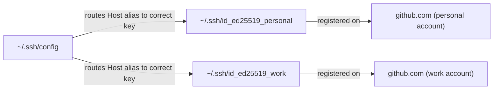

---

id: "9.020" title: "SSH Keys for Git — Setup and Multiple Identities" domain: "Production Engineering" domain_id: 9 group: "Git Fundamentals" tags: [production-engineering, devops, dotnet, hands-on] priority: 2 prerequisites:

- "[[9.001 — Git Init, Clone, and Remote Basics]]" related:
- "[[9.012 — Git Remote Management — Multiple Remotes]]"
- "[[9.019 — Git Config — Global, Local, and System Scope]]"
- "[[9.089 — SSH — Config Files and Connection Shortcuts]]"
- "[[7.917 — Trunk-Based Development]]" created: 2026-06-26

---

## Navigation

**Domain:** [[9 — Production Engineering]] > **Group:** Git Fundamentals **Previous:** [[9.019 — Git Config — Global, Local, and System Scope]] | **Next:** [[9.021 — Git Hooks — pre-commit and pre-push Basics]]

### Prerequisites

- [[9.001 — Git Init, Clone, and Remote Basics]] — you need to understand what a remote URL is before configuring how you authenticate against it

### Where This Fits

You just got a new laptop, or you're setting up a brand-new machine for a contractor role, and `git clone git@github.com:contoso/OrderService.git` immediately fails with `Permission denied (publickey)`. Or worse — you maintain both a personal GitHub account and a work GitHub account, and every push from your side project keeps showing up authored under your work identity because both remotes are quietly using the same default SSH key. This note is the one-time setup that makes every future `git push`/`git clone` over SSH just work, including when you need two separate identities on one machine.

---

## What You're Doing and Why

SSH key authentication lets Git push/pull over `git@host:org/repo.git` URLs without typing a password or token on every operation — you generate a public/private key pair once, register the public half with GitHub (or Azure DevOps/GitLab), and SSH handles the rest automatically. Multiple identities (e.g., personal vs. work GitHub accounts) require a named key per identity plus an SSH config file that maps specific hostnames to specific keys, because SSH otherwise tries your default key (`~/.ssh/id_ed25519` or `~/.ssh/id_rsa`) for every host. See [[9.019 — Git Config — Global, Local, and System Scope]] for the equivalent problem on the Git identity (name/email) side, which is a separate but related concern.

### Mental Model

Think of an SSH key pair as a lock-and-key set where you keep the key (private key, never shared) and hand out copies of the lock (public key, safe to paste anywhere) to every service you want to authenticate against. Multiple identities means having multiple distinct lock-and-key sets, and an SSH config file is the instruction sheet that says "when connecting to `github-work`, use _this_ key; when connecting to `github-personal`, use _that_ one."



### Command / Tool Quick Reference

|Command / Action|What It Does|When You Reach for It|
|---|---|---|
|`ssh-keygen -t ed25519 -C "<comment>"`|Generates a new Ed25519 key pair|Setting up a new identity or new machine|
|`ssh-add <path>`|Loads a private key into the running ssh-agent|Making a key usable without re-typing its passphrase every time|
|`ssh-add -l`|Lists keys currently loaded into the agent|Confirming which key SSH will actually offer|
|`ssh -T git@github.com`|Tests authentication against GitHub without cloning anything|Verifying a key works before relying on it|
|`cat ~/.ssh/id_ed25519.pub`|Prints the public key to copy into GitHub settings|Registering a new key with a Git host|
|`git config user.email "<email>"`|Sets which identity (name/email) commits use — separate from SSH auth|Pairing the right author identity with the right SSH key per repo|
|`ssh -G git@<host-alias>`|Shows the resolved SSH config for a given alias without connecting|Debugging which key/identity an alias actually resolves to|

---

## Step-by-Step Walkthrough

### The Scenario

You're setting up a brand-new laptop to work on `OrderService`, hosted on GitHub under the `contoso` org. You've never generated an SSH key on this machine before, and `git clone git@github.com:contoso/OrderService.git` currently fails outright.

### Full Walkthrough

```bash
$ git clone git@github.com:contoso/OrderService.git
Cloning into 'OrderService'...
git@github.com: Permission denied (publickey).
fatal: Could not read from remote repository.
```

_No key exists yet on this machine, so GitHub has nothing to authenticate against — this is expected, not a bug._

```bash
$ ssh-keygen -t ed25519 -C "dev@contoso.com"
Generating public/private ed25519 key pair.
Enter file in which to save the key (/home/dev/.ssh/id_ed25519):
Enter passphrase (empty for no passphrase):
Enter same passphrase again:
Your identification has been saved in /home/dev/.ssh/id_ed25519
Your public key has been saved in /home/dev/.ssh/id_ed25519.pub
The key fingerprint is:
SHA256:k3J9pL2xQv8N4rT1mY7sW6hB0cD5eF9gH2iJ4kL6mNo dev@contoso.com
```

_`-t ed25519` chooses the modern, fast, secure key type — `-C` adds a comment so the key is identifiable later in GitHub's UI._

```bash
$ eval "$(ssh-agent -s)"
Agent pid 4821
$ ssh-add ~/.ssh/id_ed25519
Identity added: /home/dev/.ssh/id_ed25519 (dev@contoso.com)
```

_Starts the agent and loads the key so the passphrase is only needed once per session, not on every Git operation._

```bash
$ cat ~/.ssh/id_ed25519.pub
ssh-ed25519 AAAAC3NzaC1lZDI1NTE5AAAAIGx1Z2... dev@contoso.com
```

_Copy this entire line — paste it into GitHub under Settings → SSH and GPG keys → New SSH key._

```bash
$ ssh -T git@github.com
Hi devuser! You've successfully authenticated, but GitHub does not provide shell access.
```

_This message — including "does not provide shell access" — is the expected success response, not an error._

```bash
$ git clone git@github.com:contoso/OrderService.git
Cloning into 'OrderService'...
remote: Enumerating objects: 142, done.
Receiving objects: 100% (142/142), done.
```

_Clone now succeeds using the registered key._

### What Could Go Wrong Mid-Walkthrough

If you generate the key but skip `ssh-add`, the clone may still prompt for the key's passphrase on every single operation, or fail entirely on some Git GUI tools that don't prompt interactively:

```bash
$ git clone git@github.com:contoso/OrderService.git
Cloning into 'OrderService'...
Enter passphrase for key '/home/dev/.ssh/id_ed25519':
```

This isn't broken — but it's annoying enough that most engineers add `ssh-add` to their shell startup, or use their OS keychain integration (`ssh-add --apple-use-keychain` on macOS) so the agent loads the key automatically every session.

---

## Production Scenario

### Realistic Context

You contribute to `PaymentGateway` under your `contoso` work GitHub account and also maintain a personal open-source project under a separate personal GitHub account — both on the same laptop. Right now both use the same default SSH key, which means your personal commits sometimes get pushed using credentials tied to your work identity, and a security review just flagged this as a separation-of-identity risk that needs fixing before your next audit.

### Full Implementation / Resolution

```bash
$ ssh-keygen -t ed25519 -C "personal@example.com" -f ~/.ssh/id_ed25519_personal
Generating public/private ed25519 key pair.
Your identification has been saved in /home/dev/.ssh/id_ed25519_personal
Your public key has been saved in /home/dev/.ssh/id_ed25519_personal.pub
```

```
# ~/.ssh/config
Host github-work
    HostName github.com
    User git
    IdentityFile ~/.ssh/id_ed25519
    IdentitiesOnly yes

Host github-personal
    HostName github.com
    User git
    IdentityFile ~/.ssh/id_ed25519_personal
    IdentitiesOnly yes
```

```bash
$ ssh-add ~/.ssh/id_ed25519
$ ssh-add ~/.ssh/id_ed25519_personal
$ ssh-add -l
256 SHA256:k3J9pL2xQv8N4rT1mY7sW6hB0cD5eF9gH2iJ4kL6mNo dev@contoso.com (ED25519)
256 SHA256:a8B2cD4eF6gH8iJ0kL2mN4oP6qR8sT0uV2wX4yZ6aB8 personal@example.com (ED25519)
```

```bash
# Existing PaymentGateway clone keeps using the default github.com alias — no change needed
$ git remote -v
origin  git@github.com:contoso/PaymentGateway.git (fetch)

# Personal project's remote is repointed to the new alias
$ cd ~/projects/my-oss-tool
$ git remote set-url origin git@github-personal:myusername/my-oss-tool.git
$ git remote -v
origin  git@github-personal:myusername/my-oss-tool.git (fetch)
```

### Verifying It Worked

```bash
$ ssh -T git@github-personal
Hi myusername! You've successfully authenticated, but GitHub does not provide shell access.

$ ssh -T git@github.com
Hi devuser! You've successfully authenticated, but GitHub does not provide shell access.
```

Both aliases authenticating as the _correct, distinct_ GitHub usernames — not the same one twice — confirms the two identities are now fully separated rather than silently sharing a key.

---

## Gotchas and Troubleshooting

### "Permission denied (publickey)."

**Root cause:** No SSH key is registered with the Git host for the key currently offered, or the agent isn't holding the key at all.

```bash
$ git clone git@github.com:contoso/OrderService.git
Cloning into 'OrderService'...
git@github.com: Permission denied (publickey).
fatal: Could not read from remote repository.
```

**Fix:**

```bash
$ ssh-add -l
$ # if empty or wrong key, load the correct one:
$ ssh-add ~/.ssh/id_ed25519
$ ssh -T git@github.com
```

**Prevention:** Run `ssh -T git@github.com` right after any new machine setup, before you actually need to clone something under time pressure.

### "@@@@@@@@@@@@@@@@@@@@@@@@@@@@@@@@@@@@@@@@@@@@@@@@@@@@@@@@@@@ WARNING: UNPROTECTED PRIVATE KEY FILE!"

**Root cause:** The private key file's permissions are too open (e.g., world-readable), which SSH refuses to use for security reasons.

```bash
$ ssh -T git@github.com
@@@@@@@@@@@@@@@@@@@@@@@@@@@@@@@@@@@@@@@@@@@@@@@@@@@@@@@@@@@
@         WARNING: UNPROTECTED PRIVATE KEY FILE!          @
@@@@@@@@@@@@@@@@@@@@@@@@@@@@@@@@@@@@@@@@@@@@@@@@@@@@@@@@@@@
Permissions 0644 for '/home/dev/.ssh/id_ed25519' are too open.
```

**Fix:**

```bash
$ chmod 600 ~/.ssh/id_ed25519
```

**Prevention:** Set `umask` correctly before generating keys, or just always run `chmod 600` on any private key immediately after `ssh-keygen` as a reflex.

### Wrong GitHub identity used despite having two keys configured correctly

**Root cause:** The remote URL still points at the bare `github.com` host instead of the custom SSH config alias (`github-personal`), so SSH falls back to trying keys in default order rather than the one mapped to that alias.

```bash
$ git remote -v
origin  git@github.com:myusername/my-oss-tool.git (fetch)
$ git push
# pushes successfully, but authored/authenticated as the wrong account
```

**Fix:**

```bash
$ git remote set-url origin git@github-personal:myusername/my-oss-tool.git
```

**Prevention:** Whenever adding a second identity, immediately audit every existing remote with `git remote -v` across all repos that should use the non-default identity — the SSH config alone does nothing until remotes actually reference it.

### "Could not open a connection to your authentication agent."

**Root cause:** `ssh-add` was run without an `ssh-agent` process running in the current shell session — common after a fresh terminal restart or on a new shell that didn't inherit the agent's environment variables.

```bash
$ ssh-add ~/.ssh/id_ed25519
Could not open a connection to your authentication agent.
```

**Fix:**

```bash
$ eval "$(ssh-agent -s)"
Agent pid 5512
$ ssh-add ~/.ssh/id_ed25519
```

**Prevention:** Add the `eval "$(ssh-agent -s)"` startup line to `.bashrc`/`.zshrc` (with a check to avoid spawning duplicate agents), or rely on OS-level agent integration like macOS Keychain or Windows' built-in `ssh-agent` service.

---

## Speed and Efficiency

### Aliases and Shortcuts

```bash
# ~/.bashrc or ~/.zshrc — auto-start ssh-agent only if one isn't already running
if [ -z "$SSH_AUTH_SOCK" ]; then
    eval "$(ssh-agent -s)" > /dev/null
fi

alias ghkeys='ssh-add -l'
alias ghtest='ssh -T git@github.com'
```

### Automation Opportunity

```bash
#!/usr/bin/env bash
# scripts/setup-ssh-identity.sh — generates a key, prints the public key, and adds it to the agent in one step
set -euo pipefail
EMAIL="$1"
KEY_NAME="${2:-id_ed25519}"
KEY_PATH="$HOME/.ssh/$KEY_NAME"

ssh-keygen -t ed25519 -C "$EMAIL" -f "$KEY_PATH"
chmod 600 "$KEY_PATH"
ssh-add "$KEY_PATH"
echo "Public key — paste this into your Git host's SSH key settings:"
cat "$KEY_PATH.pub"
```

### Keyboard / CLI Efficiency Notes

- `ssh -G git@<alias>` (capital G) prints the fully resolved config without connecting — the fastest way to debug which `IdentityFile` an alias actually points to.
- `IdentitiesOnly yes` in `~/.ssh/config` is easy to forget but critical for multi-identity setups — without it, SSH may still try other loaded keys first and authenticate as the wrong account even with the alias correctly set.
- `ssh-add -D` clears all keys from the agent in one shot when you need to force a clean re-test of which key actually gets offered.

---

## Interview Arsenal

### Question Bank

1. Walk me through setting up SSH authentication for Git on a brand-new machine, from nothing to a successful clone.
2. You get `Permission denied (publickey)` on a machine that's worked fine before — what do you check, in order?
3. How do you maintain two separate GitHub identities (work and personal) on one laptop without commits or pushes crossing over?
4. Tell me about a time SSH key setup (or misconfiguration) caused a real problem for you or a teammate.
5. How do you make onboarding a new developer's SSH setup faster and less error-prone?
6. What's the difference between registering a public key with GitHub and loading a private key into `ssh-agent` — why are both steps necessary?

### Spoken Answers

**Q: Walk me through setting up SSH authentication for Git on a brand-new machine, from nothing to a successful clone.**

> **Average answer:** "Run `ssh-keygen`, copy the public key into GitHub, then clone." Gets the broad shape right but skips the agent step and the verification step.

> **Great answer:** Generates the key with `ssh-keygen -t ed25519 -C "<email>"`, explains briefly why Ed25519 over older RSA (faster, smaller, equally secure for this purpose), starts the agent and loads the private key with `ssh-add`, copies the _public_ key (`.pub` file) into the Git host's settings, and — critically — verifies with `ssh -T git@github.com` before attempting an actual clone, so any auth problem surfaces with a clear message instead of a confusing clone failure.

**Q: How do you maintain two separate GitHub identities (work and personal) on one laptop without commits or pushes crossing over?**

> **Average answer:** "Use two different SSH keys." True but incomplete — doesn't explain how SSH knows which key to use for which repo.

> **Great answer:** Explains that two keys alone aren't enough — SSH needs an `~/.ssh/config` with named `Host` aliases (e.g., `github-work`, `github-personal`), each mapped to a specific `IdentityFile`, and critically `IdentitiesOnly yes` so SSH doesn't fall back to trying other loaded keys. Then explains that every remote URL for personal repos must be repointed to use the alias (`git@github-personal:...`) instead of the bare `github.com` host, since the alias does nothing until something actually references it.

**Q: Tell me about a time SSH key setup (or misconfiguration) caused a real problem for you or a teammate.**

> **Average answer:** "Someone's key didn't work and we had to regenerate it." No real diagnostic detail.

> **Great answer:** Describes a specific case — e.g., a security review flagging that personal and work commits were authenticating under the same key, or a new hire stuck for half a day because `ssh-add` silently failed with no running agent and no error visible in their GUI Git client. Names the specific diagnostic step that found it (`ssh-add -l` showing nothing, or `ssh -G` revealing the wrong `IdentityFile` resolved) and the fix.

### War Story Prompt

A contractor's onboarding stalled for an afternoon because their Git GUI client silently failed to clone `OrderService` with no useful error shown — only running the clone directly from a terminal revealed `Permission denied (publickey)`, and from there `ssh-add -l` showed the agent held zero keys, since their setup script generated the key but never loaded it into the agent before the first clone attempt.

---

## Decision Framework

### When to Reach for This

- [ ] Setting up Git on a new machine for the first time
- [ ] `Permission denied (publickey)` on any `git clone`/`push`/`pull` over SSH
- [ ] You need two or more separate Git identities (work/personal, multiple client orgs) cleanly separated on one machine

### When NOT To

- [ ] Working in an environment that mandates HTTPS + personal access tokens (some locked-down corporate networks block SSH outbound entirely) — use token-based auth instead
- [ ] A single one-off clone of a public repo with no push access needed — plain HTTPS clone requires no key setup at all
- [ ] CI/CD pipelines, generally — those typically use OIDC or service-connection-based auth rather than a developer's personal SSH key (see [[9.231 — Setting Up OIDC for Azure Login]])

### Tool Comparison

||SSH Key Auth|HTTPS + Personal Access Token|
|---|---|---|
|Speed|No prompt after initial agent load|May prompt depending on credential helper/token expiry|
|Safety/reversibility|Revoke by removing the public key from the host's settings|Revoke by deleting/expiring the token|
|When it's the right call|Daily local dev work, multiple identities on one machine|Networks that block SSH outbound, quick one-off auth|

---

## Self-Check

### Conceptual Questions

1. What's the difference between the public and private half of an SSH key pair, and which one ever leaves your machine?
2. After generating a key with `ssh-keygen`, what two more steps are needed before a `git clone` over SSH will actually succeed?
3. Which SSH config option prevents SSH from falling back to other loaded keys when a specific alias should use only one?
4. You see `Permission denied (publickey)` on a machine that worked yesterday — what's the first command you run to check?
5. What's the safer alternative to manually repointing every personal repo's remote one at a time after adding a second identity?
6. What should you NOT forget to do to a newly generated private key file before SSH will trust it on most systems?
7. Which Domain 9 note covers the separate-but-related concern of setting the right commit author name/email per repo?

<details> <summary>Answers</summary>

1. The private key must never leave your machine and proves your identity; the public key is safe to share and gets registered with the Git host (GitHub, Azure DevOps, etc.) to verify that proof.
2. Loading the private key into `ssh-agent` (`ssh-add`) and registering the public key with the Git host's SSH key settings.
3. `IdentitiesOnly yes`.
4. `ssh-add -l` to check whether the agent is holding any keys at all, and which ones.
5. There isn't a true shortcut for the remote repointing itself, but auditing all repos at once with a quick loop over `git remote -v` across your projects directory catches stragglers faster than checking one at a time as problems surface.
6. Run `chmod 600` on the private key file — overly open permissions cause SSH to refuse to use it.
7. [[9.019 — Git Config — Global, Local, and System Scope]].

</details>

---

### Hands-On Drills

**Drill 1 — Do it from a clean state**

Starting from a brand-new machine with no SSH keys at all, set up authentication for GitHub and successfully clone `NotificationWorker` over SSH.

<details> <summary>Solution</summary>

```bash
$ ssh-keygen -t ed25519 -C "dev@contoso.com"
$ eval "$(ssh-agent -s)"
$ ssh-add ~/.ssh/id_ed25519
$ cat ~/.ssh/id_ed25519.pub
# paste into GitHub → Settings → SSH and GPG keys → New SSH key
$ ssh -T git@github.com
Hi devuser! You've successfully authenticated, but GitHub does not provide shell access.
$ git clone git@github.com:contoso/NotificationWorker.git
Cloning into 'NotificationWorker'...
```

</details>

---

**Drill 2 — Fix the broken thing**

```bash
$ ssh -T git@github.com
@@@@@@@@@@@@@@@@@@@@@@@@@@@@@@@@@@@@@@@@@@@@@@@@@@@@@@@@@@@
@         WARNING: UNPROTECTED PRIVATE KEY FILE!          @
@@@@@@@@@@@@@@@@@@@@@@@@@@@@@@@@@@@@@@@@@@@@@@@@@@@@@@@@@@@
Permissions 0644 for '/home/dev/.ssh/id_ed25519' are too open.
```

<details> <summary>Solution</summary>

**Diagnosis:** The private key's file permissions allow other users on the system to read it, so SSH refuses to use it as a security precaution.

```bash
$ chmod 600 ~/.ssh/id_ed25519
$ ssh -T git@github.com
Hi devuser! You've successfully authenticated, but GitHub does not provide shell access.
```

</details>

---

**Drill 3 — Under time pressure**

You're on a borrowed laptop minutes before an on-call handoff and need to clone `InventoryApi` to apply an urgent hotfix, but this machine has never been set up with your SSH key. Walk through exactly what you'd type, fastest path first.

<details> <summary>Solution</summary>

```bash
$ ssh-keygen -t ed25519 -C "oncall-temp@contoso.com"
# generates a throwaway key fast — no need to reuse your primary machine's key
$ eval "$(ssh-agent -s)" && ssh-add ~/.ssh/id_ed25519
# starts the agent and loads the key in one breath, since this is a fresh shell with no agent running
$ cat ~/.ssh/id_ed25519.pub
# paste directly into GitHub settings — fastest possible registration under time pressure
$ ssh -T git@github.com
# 5-second sanity check before attempting the real clone, cheaper than a failed clone with a confusing error mid-incident
$ git clone git@github.com:contoso/InventoryApi.git
```

</details>