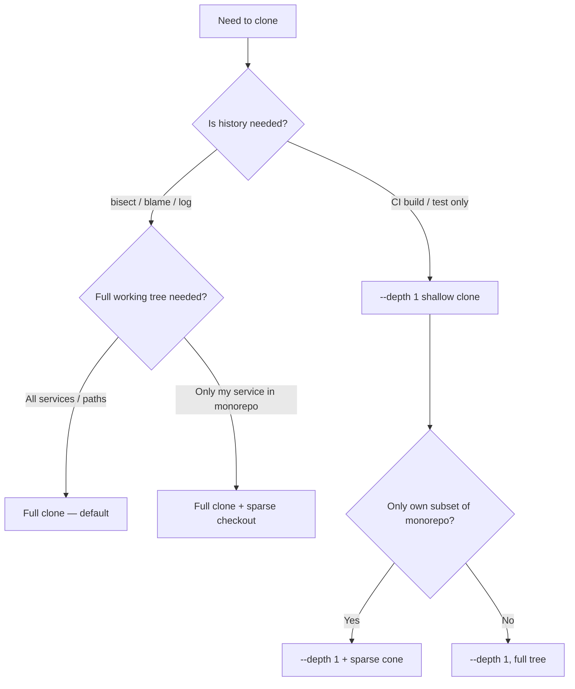

## Navigation

**Domain:** [[9 — Production Engineering]] > **Group:** Git Fundamentals **Previous:** [[9.021 — Git Hooks — pre-commit and pre-push Basics]] | **Next:** [[9.023 — Git LFS — Large File Storage Setup]]

### Prerequisites

- [[9.001 — Git Init, Clone, and Remote Basics]] — understands what `git clone` does, what a remote is, and what the full clone model looks like
- [[9.008 — Git Push and Pull — Tracking Branches]] — understands tracking branches and `origin/*` refs

### Where This Fits

You're writing a GitHub Actions workflow and the `git checkout` step takes 45 seconds on a repo with 8 years of history. Or you're onboarding to a monorepo that contains 14 services and you only own `PaymentGateway/` — cloning the full 2 GB tree just to run a single service is wasteful. These are the moments that call for shallow clones or sparse checkout: not as day-to-day developer habits, but as targeted techniques when normal `git clone` becomes a practical bottleneck.

---

## What You're Doing and Why

`git clone` by default fetches the entire object database — every commit, tree, blob, and tag since the repo's first commit. For most developer workflows on typical-sized repos this is fine and preferable, because full history enables `git log`, `git bisect`, and `git blame`. Shallow clones and sparse checkout are **not replacements for full clones** — they are scalpels for specific situations: CI pipelines where history is irrelevant, monorepos where you own a single service directory, or environments where bandwidth and disk space are genuinely constrained.

A **shallow clone** (`--depth N`) fetches only the last N commits of history. The working tree is fully populated but history is truncated. Git marks the boundary with a "grafted" commit — commands like `git log` work for the visible window but `git bisect` and `git blame` may give incomplete results.

A **sparse checkout** fetches the full object database but only materialises (checks out to disk) a subset of the directory tree. You get full history but a thin working tree. This is the right tool for a monorepo where you need `git blame` and `git log` to work correctly.

The two techniques are **combinable**: a CI pipeline that only builds `PaymentGateway/` and needs neither history nor other services uses both — `--depth 1` and a sparse cone for `PaymentGateway/`.

### Mental Model

Think of the full clone as a warehouse that receives every pallet ever shipped and stores them all. A shallow clone is a warehouse that only accepts the last 5 shipments and shreds anything older. Sparse checkout is a full warehouse where your dock door only opens to one aisle — everything else is on shelves but you don't carry it to the floor.



### Command / Tool Quick Reference

|Command / Action|What It Does|When You Reach for It|
|---|---|---|
|`git clone --depth 1 <url>`|Shallow clone — last commit only|CI pipelines where history is irrelevant|
|`git clone --depth 1 --branch main <url>`|Shallow clone of a specific branch|CI: skip fetching all remote branch tips|
|`git fetch --unshallow`|Convert a shallow clone to full|You later need `git log` / `git bisect` on that clone|
|`git clone --no-checkout <url>`|Clone without materialising working tree|First step before setting up sparse checkout|
|`git sparse-checkout init --cone`|Enable cone mode sparse checkout|Monorepo: pick directories, not file patterns|
|`git sparse-checkout set <path>`|Add a directory to the materialised set|Add `PaymentGateway/` to a sparse checkout|
|`git sparse-checkout list`|Show currently materialised directories|Audit what's checked out|
|`git sparse-checkout disable`|Revert to full working tree|Done with sparse work, need whole tree|
|`git clone --filter=blob:none`|Partial clone — skip blobs until needed|Bandwidth-constrained; blobs fetched on demand|
|`git clone --filter=tree:0`|Blobless + treeless partial clone|Extremely large repos; use with care|

---

## Step-by-Step Walkthrough

### The Scenario

The InterVision monorepo lives at `git@github.com:intervision/platform.git`. It contains 11 services (`OrderService/`, `PaymentGateway/`, `InventoryApi/`, `NotificationWorker/`, plus 7 others), shared libraries, infrastructure Bicep files, and 6 years of history totalling 1.4 GB. Tarek Saleh is setting up a local environment to work exclusively on `PaymentGateway/`. A full clone takes 4 minutes on the office network and lands 1.2 GB on disk. He wants a working tree with only `PaymentGateway/` and the shared `libs/` directory.

### Full Walkthrough

```bash
# Step 1: Clone without materialising the working tree.
# --filter=blob:none fetches commits and trees immediately but defers blob
# download until a blob is actually accessed — keeps clone fast and thin.
$ git clone --filter=blob:none --no-checkout git@github.com:intervision/platform.git
Cloning into 'platform'...
remote: Enumerating objects: 48291, done.
remote: Counting objects: 100% (48291/48291), done.
remote: Compressing objects: 100% (12044/12044), done.
remote: Total 48291 (delta 31002), reused 48107 (delta 30844), pack-reused 0
Receiving objects: 100% (48291/48291), 87.34 MiB | 9.21 MiB/s, done.
Resolving deltas: 100% (31002/31002), done.

$ cd platform

# Step 2: Enable cone mode sparse checkout before the first checkout.
# Cone mode is dramatically faster than pattern mode for large trees because
# it only matches full directories — no glob evaluation per file.
$ git sparse-checkout init --cone
hint: Sparse checkout leaves worktree in a broken state unless git checkout
hint: is run first.

# Step 3: Declare which directories to materialise.
# Always include the repo root files (README, .editorconfig, global.json, etc.)
# — cone mode gives you those for free. Subdirectories are additive.
$ git sparse-checkout set PaymentGateway libs

# Step 4: Check out the default branch. This is where files land on disk.
$ git checkout main
Branch 'main' set up to track 'origin/main'.
Already on 'main'

# Step 5: Confirm only the declared paths are present.
$ ls
PaymentGateway/   libs/   README.md   .editorconfig   global.json   Directory.Packages.props

# Step 6: Verify sparse-checkout configuration.
$ git sparse-checkout list
PaymentGateway
libs
```

Full history is intact — `git log`, `git blame`, and `git bisect` all work correctly against the complete commit graph. Blobs for files outside `PaymentGateway/` and `libs/` are fetched on demand if you ever run `git sparse-checkout disable` or add a new path.

### What Could Go Wrong Mid-Walkthrough

**If you initialise sparse checkout AFTER an existing checkout:**

```bash
# Working tree already fully materialised. Running init --cone at this point
# will not remove existing files — you must run git checkout again.
$ git sparse-checkout init --cone
$ git sparse-checkout set PaymentGateway libs
$ git checkout main         # re-materialise: now other dirs disappear from disk
```

**If you forget --no-checkout on the clone:**

The clone materialises the full working tree before sparse checkout is configured. You then run `git sparse-checkout init --cone` + `git sparse-checkout set` + `git checkout main` to trim it down — this works, but you've already paid the full disk I/O cost.

---

## Production Scenario

### Realistic Context

The InterVision GitHub Actions CI pipeline runs on every push to `main` and every PR targeting it. The pipeline only builds and tests `PaymentGateway/` — it runs `dotnet build PaymentGateway/PaymentGateway.sln` and `dotnet test PaymentGateway/PaymentGateway.Tests/`. A full clone of the monorepo takes 47 seconds per run. With 80 CI runs per day, that is over an hour of cumulative runner-time wasted fetching 13 services that the pipeline never touches. The fix: a depth-1 partial clone plus sparse checkout scoped to `PaymentGateway/` and `libs/`.

### Full Implementation / Resolution

```yaml
# .github/workflows/payment-gateway-ci.yml
name: PaymentGateway CI

on:
  push:
    branches: [main]
    paths:
      - 'PaymentGateway/**'
      - 'libs/**'
  pull_request:
    branches: [main]
    paths:
      - 'PaymentGateway/**'
      - 'libs/**'

jobs:
  build-and-test:
    runs-on: ubuntu-latest

    steps:
      # actions/checkout supports sparse-checkout natively since v4.
      # sparse-checkout-cone-mode: true uses the fast directory-matching mode.
      - name: Checkout PaymentGateway and shared libs only
        uses: actions/checkout@v4
        with:
          # Fetch only the last commit — no history needed for a build/test run.
          fetch-depth: 1
          # Enable sparse checkout.
          sparse-checkout: |
            PaymentGateway
            libs
          sparse-checkout-cone-mode: true

      - name: Setup .NET
        uses: actions/setup-dotnet@v4
        with:
          dotnet-version: '8.0.x'
          # Cache NuGet packages keyed to PaymentGateway's lock file.
          cache: true
          cache-dependency-path: PaymentGateway/packages.lock.json

      - name: Restore
        run: dotnet restore PaymentGateway/PaymentGateway.sln --locked-mode

      - name: Build
        run: dotnet build PaymentGateway/PaymentGateway.sln --no-restore -c Release

      - name: Test
        run: >
          dotnet test PaymentGateway/PaymentGateway.Tests/PaymentGateway.Tests.csproj
          --no-build -c Release
          --logger "trx;LogFileName=test-results.trx"
          --results-directory ./TestResults

      - name: Upload test results
        if: always()
        uses: actions/upload-artifact@v4
        with:
          name: test-results
          path: TestResults/*.trx
```

```bash
# Equivalent manual commands — what actions/checkout is doing under the hood:
$ git clone --filter=blob:none --no-checkout --depth 1 \
    git@github.com:intervision/platform.git
$ cd platform
$ git sparse-checkout init --cone
$ git sparse-checkout set PaymentGateway libs
$ git checkout main
```

### Verifying It Worked

```bash
# After the checkout step completes, confirm the working tree is scoped:
$ ls $GITHUB_WORKSPACE
PaymentGateway/  libs/  README.md  .editorconfig  global.json  Directory.Packages.props

# Confirm no other service directories are present:
$ ls $GITHUB_WORKSPACE | grep -v 'PaymentGateway\|libs\|README\|\.editorconfig\|global\.json\|Directory'
# (empty — no output means only declared paths exist)

# In GitHub Actions UI: the "Checkout PaymentGateway and shared libs only" step
# should show a duration of 3–5 seconds instead of the former 47 seconds.
# The Actions job summary will show the step timing breakdown per step.
```

---

## Gotchas and Troubleshooting

### "fatal: reference is not a tree: origin/main"

**Root cause:** You ran `git checkout main` on a shallow clone after the remote's `main` tip moved forward (e.g., in a long-running CI job). The shallow ref is now behind and the commit Git tries to check out is unknown locally.

```bash
# Triggered by:
$ git clone --depth 1 git@github.com:intervision/platform.git
# ... time passes, remote advances ...
$ cd platform && git checkout main    # fails if --no-checkout was used
```

**Fix:**

```bash
$ git fetch --depth 1 origin main
$ git checkout main
```

**Prevention:** In CI, use `actions/checkout` rather than raw `git` commands — it handles ref fetching robustly. For manual shallow clones, always fetch immediately before checkout.

---

### "error: Sparse checkout leaves worktree in a broken state"

**Root cause:** You ran `git sparse-checkout init --cone` on a repo that already has a materialised working tree with uncommitted changes. Git refuses to remove files that have local modifications.

```bash
$ git sparse-checkout init --cone
error: Sparse checkout leaves worktree in a broken state
hint: You need to run 'git checkout' to update your working tree.
```

**Fix:**

```bash
# Stash or commit your changes first, then reinitialise:
$ git stash
$ git sparse-checkout init --cone
$ git sparse-checkout set PaymentGateway libs
$ git checkout main
$ git stash pop
```

**Prevention:** Configure sparse checkout immediately after `--no-checkout` clone, before any files are materialised.

---

### "git blame: no such path 'OrderService/RefundHandler.cs' in HEAD"

**Root cause:** You're in a sparse-checkout repo and you tried to `git blame` a file whose path is not materialised on disk. Sparse checkout does not prevent you from running Git commands against paths that exist in the index but not on disk — it just fails with a misleading path error.

```bash
$ git blame OrderService/RefundHandler.cs
fatal: no such path 'OrderService/RefundHandler.cs' in HEAD
```

**Fix:**

```bash
# Either add OrderService to the materialised set:
$ git sparse-checkout add OrderService

# Or blame via the object database directly without checking out the file:
$ git show HEAD:OrderService/RefundHandler.cs | head -40
```

**Prevention:** Use `git sparse-checkout list` to remember which paths are active before running history commands against paths you haven't checked out.

---

### "shallow update not allowed" on git push

**Root cause:** You made commits in a shallow clone and tried to push. The remote's receive-pack hook (common in enterprise GitHub setups with signed-commit requirements) rejects pushes from a shallow history because it can't verify the complete parent chain for commit signing validation.

```bash
$ git push origin feature/payment-fix
error: Server does not allow request for unadvertised object
fatal: shallow file has changed since we read it
error: failed to push some refspecs to 'git@github.com:intervision/platform.git'
```

**Fix:**

```bash
$ git fetch --unshallow
$ git push origin feature/payment-fix
```

**Prevention:** Never commit to shallow clones intended for development work. Shallow clones are for read-only CI operations. Developer workstations should always use full clones.

---

### `git log` stops at the shallow boundary with "(grafted)" note

**Root cause:** The shallow clone's history terminates at the graft point — the oldest fetched commit has an artificial parent marker. `git log` shows everything up to that point and then stops.

```bash
$ git log --oneline
4a3f9c2 fix: prevent double refund
b91e2a1 feat: add refund idempotency key
* (grafted)
```

**Fix:**

```bash
# Deepen by N more commits without going fully unshallow:
$ git fetch --deepen=50

# Or convert to full clone:
$ git fetch --unshallow
```

**Prevention:** If the workflow ever needs `git log` for more than the last N commits (e.g., changelog generation, version calculation with GitVersion), use `--unshallow` or set `fetch-depth: 0` in `actions/checkout`.

---

## Speed and Efficiency

### Aliases and Shortcuts

```bash
# ~/.gitconfig additions for sparse-checkout workflows

[alias]
  # Show what's currently materialised in a sparse checkout
  sparse-list = sparse-checkout list

  # Quickly add a directory to a sparse checkout without re-running full init
  sparse-add  = sparse-checkout add

  # Show all directories in the repo regardless of sparse state
  # (useful to discover paths you might want to add)
  ls-dirs     = "!git ls-tree --name-only HEAD"

  # One-liner: unshallow the current clone
  unshallow   = fetch --unshallow
```

### Automation Opportunity

```bash
#!/usr/bin/env bash
# scripts/sparse-clone.sh
# Usage: ./scripts/sparse-clone.sh <service-dir> [extra-dir ...]
# Example: ./scripts/sparse-clone.sh PaymentGateway libs shared-contracts
#
# Clones the InterVision monorepo with only the specified directories
# materialised. Suitable for setting up a focused developer workspace
# without downloading 1.4 GB of unrelated service code.

set -euo pipefail

REPO_URL="git@github.com:intervision/platform.git"
CLONE_DIR="platform"
DIRS=("$@")

if [[ ${#DIRS[@]} -eq 0 ]]; then
  echo "Usage: $0 <directory> [additional directories ...]" >&2
  exit 1
fi

echo "→ Cloning (partial, no checkout)..."
git clone --filter=blob:none --no-checkout "$REPO_URL" "$CLONE_DIR"
cd "$CLONE_DIR"

echo "→ Initialising cone-mode sparse checkout..."
git sparse-checkout init --cone

echo "→ Setting materialised directories: ${DIRS[*]}"
git sparse-checkout set "${DIRS[@]}"

echo "→ Checking out main..."
git checkout main

echo ""
echo "✓ Sparse clone complete. Materialised paths:"
git sparse-checkout list
echo ""
echo "Working directory: $(pwd)"
du -sh .
```

### Keyboard / CLI Efficiency Notes

- `git sparse-checkout add <path>` is incremental — you don't need to re-list all existing paths. It appends to the cone, not replaces it.
- `git ls-tree --name-only HEAD` lists all top-level directories in the repo even in a sparse checkout — use this to discover service names before adding them.
- In `actions/checkout@v4`, `fetch-depth: 0` + `sparse-checkout` is a valid combination if you need full history but a narrow working tree. The checkout action handles the sequencing correctly.
- `git clone --filter=blob:none` (partial clone, blobless) is almost always preferable to `--depth 1` for developer machines because it gives full history cheaply — blobs are fetched on demand. Reserve `--depth 1` for CI runners where history is truly irrelevant.

---

## Interview Arsenal

### Question Bank

1. Walk me through exactly what commands you'd run to set up a sparse checkout of a monorepo so you only see the `PaymentGateway/` directory.
2. You're in a shallow clone and `git log` only shows 3 commits. How do you get the full history without re-cloning?
3. What's the difference between a shallow clone (`--depth 1`) and a partial clone (`--filter=blob:none`)? When would you pick one over the other?
4. A developer committed on a `--depth 1` clone and can't push. What went wrong and how do you fix it?
5. You set up sparse checkout but `git blame OrderService/RefundHandler.cs` returns "no such path." What's happening?
6. Sparse checkout vs Git LFS — both deal with large repo problems. How do you decide which to reach for?
7. Your CI pipeline uses `fetch-depth: 1` in `actions/checkout`. GitVersion is now calculating wrong version numbers. What's the root cause and fix?

### Spoken Answers

**Q: Walk me through exactly what commands you'd run to set up a sparse checkout.**

> **Average answer:** "You use `git sparse-checkout init` and then `git sparse-checkout set` with the path you want." Gets the commands right but doesn't mention cone mode, doesn't explain why `--no-checkout` matters on the clone, and can't explain what `--filter=blob:none` adds.

> **Great answer:** "I'd clone with `--filter=blob:none --no-checkout` first — `--filter=blob:none` keeps the full commit graph but defers blob downloads, which means `git log` and `git blame` work correctly without downloading every file. `--no-checkout` skips materialising the working tree until after sparse checkout is configured, so I'm not doing a full checkout followed by a trim. Then I run `git sparse-checkout init --cone` — cone mode is important because it matches whole directories using prefix rules rather than glob patterns, which makes it dramatically faster on large trees. Then `git sparse-checkout set PaymentGateway libs` to declare what I want, and finally `git checkout main` to materialise those paths. If I ever need a path I didn't include, I use `git sparse-checkout add <path>` — it's incremental."

---

**Q: What's the difference between `--depth 1` and `--filter=blob:none`?**

> **Average answer:** "Depth 1 gets you just the latest commit. Filter gets you history without all the file contents." Technically correct, but can't explain the practical tradeoffs or when to use each.

> **Great answer:** "They solve different dimensions of the 'big repo' problem. `--depth 1` truncates history — you get the most recent commit and nothing older. Commands like `git log`, `git bisect`, and GitVersion all break or give wrong results because the history isn't there. It's the right call for a read-only CI pipeline that only needs to build and test the current commit. `--filter=blob:none` is a partial clone — you get the full commit and tree graph immediately, but the actual file contents (blobs) are fetched on demand when you access them. This means `git log` and `git blame` work perfectly because commits and trees are present, but you save bandwidth and disk space because blobs you never access are never downloaded. For a developer machine, I'd choose `--filter=blob:none` almost always. For a CI runner that's discarded after one use, `--depth 1` is faster. You can combine both."

---

**Q: A developer pushed from a shallow clone and hit "shallow update not allowed." Walk me through what you'd tell them to do.**

> **Average answer:** "They need to unshallow the clone first with `git fetch --unshallow`." Correct but incomplete — doesn't explain why this happens or how to prevent it.

> **Great answer:** "The root cause is that some remotes — especially enterprise GitHub with signed-commit enforcement or commit-hook validation — need to verify the complete parent chain to validate commits. A shallow clone terminates the history at a graft point, so the remote can't trace back through all parents and rejects the push. The fix is `git fetch --unshallow` to convert the clone to full history, then push normally. The prevention is: shallow clones should only ever be used for read-only CI operations. If a developer is working in a repo — creating branches, committing, pushing — they should always start from a full clone. I'd add a pre-push hook that checks `git rev-parse --is-shallow-repository` and aborts with a helpful message if someone accidentally tries to push from a shallow clone."

---

### War Story Prompt

The InterVision platform monorepo adopted GitVersion for automated semantic versioning in the CI pipeline. Yasmine Morsi configured `actions/checkout` with `fetch-depth: 1` to keep builds fast — it had worked fine for months. When the team shipped a hotfix that required a pre-release tag on a branch, GitVersion started outputting `0.0.1-UNKNOWN` instead of the correct `2.14.1-beta.1`. The shallow clone's grafted commit had none of the annotated tags GitVersion depends on for calculating the current version, and because `--depth 1` fetches only the latest commit rather than the tag-reachable graph, the tags simply weren't there. The fix was setting `fetch-depth: 0` in the checkout step — which downloads full history — and accepting the extra 12 seconds per run as the cost of correct versioning. The lesson: `fetch-depth: 1` is a performance optimisation, not a free lunch; any tool that reasons about commit graph distance or tag reachability breaks silently under a shallow clone.

---

## Decision Framework

### When to Reach for This

- [ ] You're writing a CI pipeline that only needs to build and test the current commit — not produce changelogs, run `git bisect`, or calculate versions from tags
- [ ] You're working in a monorepo and only own one or two service directories; full checkout is wasting gigabytes of unrelated code on your dev machine
- [ ] Clone time is a measured bottleneck (> 30 seconds for a CI step that should complete in seconds)
- [ ] Bandwidth is genuinely constrained (CI runners on metered connections, developer onboarding over slow VPN)
- [ ] You need to browse a large repo's structure or run history commands without downloading every file (`--filter=blob:none` partial clone)

### When NOT To

- [ ] You need `git bisect`, GitVersion, changelog generation, or any tool that traverses commit ancestry — `--depth 1` will break all of these silently
- [ ] You're setting up a developer workstation where occasional debugging (`git log -S`, `git blame`, `git stash`) is expected — the "savings" from a shallow clone become friction
- [ ] The repo is already small (< 100 MB total, < 5 seconds to clone) — the added complexity of sparse checkout or shallow clones is not worth the maintenance overhead
- [ ] Your team is not experienced with Git internals — a confused `git fetch --unshallow` at the wrong moment can cause hours of lost time

### Tool Comparison

||Shallow Clone (`--depth N`)|Partial Clone (`--filter=blob:none`)|Sparse Checkout|
|---|---|---|---|
|What it limits|History depth|Blob objects (file contents)|Working tree paths on disk|
|Full commit graph?|✗ — truncated at graft point|✓ — all commits and trees|✓ — all commits and trees|
|`git log` / `git blame`|✗ — limited to visible window|✓ — works fully|✓ — works fully|
|GitVersion / changelog tools|✗ — breaks or gives wrong output|✓|✓|
|Best for|Read-only CI pipelines|Developer machines, browsing large repos|Monorepos — scoped developer workspaces|
|Combinable?|✓ — can combine with sparse checkout|✓ — can combine with sparse checkout|✓ — combines with either|
|Reversible?|`git fetch --unshallow`|Already full; nothing to undo|`git sparse-checkout disable`|

---

## Self-Check

### Conceptual Questions

1. What does `git clone --depth 1` omit from the local repository compared to a full clone?
2. You run `git log --oneline` in a shallow clone and see `* (grafted)` at the bottom. What does this mean and what command makes it go away?
3. What is the difference between cone mode (`--cone`) and pattern mode in sparse checkout, and why does cone mode perform better on large repos?
4. You run `git sparse-checkout set PaymentGateway libs` but the `OrderService/` directory is still on disk. What's happening and what command removes it?
5. What flag on `git clone` gives you full commit history but defers downloading file contents until they are actually accessed?
6. A CI pipeline uses `--depth 1` and the GitVersion task outputs `0.0.1-UNKNOWN`. What is the root cause?
7. How does `--filter=blob:none` interact with `git sparse-checkout`? Can you combine them, and what does each one do independently?

<details> <summary>Answers</summary>

1. `--depth 1` omits all commits except the most recent one (on the specified branch). All tree objects and blobs for the current commit are present, but the parent commit chain is truncated at a synthetic "graft" commit. Tags, other branches' history, and `git log` beyond the single visible commit are unavailable.
    
2. The `(grafted)` annotation marks the shallow boundary — the synthetic root commit where history has been cut. It means `git log` cannot go further back than this point. `git fetch --unshallow` removes the graft and downloads the full commit graph, making the annotation disappear.
    
3. Cone mode restricts materialised paths to whole directories using simple prefix matching (`PaymentGateway/**`). Pattern mode supports arbitrary glob patterns per file. Cone mode is faster because Git can evaluate directory boundaries in O(depth) time rather than matching every file path against every pattern — critical for repos with hundreds of thousands of files.
    
4. Sparse checkout only affects newly checked-out files — it does not retroactively remove files already on disk unless you run `git checkout` again after changing the sparse set. Running `git checkout main` (or `git read-tree -mu HEAD`) after `git sparse-checkout set PaymentGateway libs` will materialise only the declared paths and remove everything else from the working tree (non-sparse files are removed from disk but remain in the index/object store).
    
5. `git clone --filter=blob:none` — the "blobless partial clone." It downloads all commit and tree objects immediately (giving you full history) but downloads blob objects (file contents) only when a command accesses them for the first time.
    
6. GitVersion calculates semantic versions by traversing the commit graph to find the nearest annotated version tag and counting commits since it. A `--depth 1` clone has no visible history beyond the current commit, so GitVersion cannot find any tags in the ancestry chain and falls back to `0.0.1-UNKNOWN`. Fix: set `fetch-depth: 0` in `actions/checkout` to restore full history (or `fetch-depth: 50` if you know tags are always within 50 commits).
    
7. They are fully combinable and orthogonal. `--filter=blob:none` operates at the object transfer layer — it controls which objects are fetched from the remote. Sparse checkout operates at the working-tree layer — it controls which paths are written to disk. Combining them gives you full commit graph (for `git log` / `git blame` correctness), no blob downloads for paths you've never accessed, and only your declared directories on disk. In a CI pipeline for a monorepo: `git clone --filter=blob:none --no-checkout` + `git sparse-checkout init --cone` + `git sparse-checkout set PaymentGateway` achieves all three benefits simultaneously.
    

</details>

---

### Hands-On Drills

**Drill 1 — Do it from a clean state**

Starting from a fresh terminal with no existing clone, set up a sparse checkout of `https://github.com/dotnet/aspnetcore` that materialises only the `src/Mvc/` directory. Confirm the directory is present and that `git log --oneline -5` works correctly (showing real commit messages, not a grafted boundary).

<details> <summary>Solution</summary>

```bash
$ git clone --filter=blob:none --no-checkout https://github.com/dotnet/aspnetcore
Cloning into 'aspnetcore'...
remote: Enumerating objects: 1104822, done.
remote: Counting objects: 100% (1104822/1104822), done.
...
Receiving objects: 100% (1104822/1104822), 512.34 MiB | 8.14 MiB/s, done.

$ cd aspnetcore

$ git sparse-checkout init --cone

$ git sparse-checkout set src/Mvc

$ git checkout main
Branch 'main' set up to track 'origin/main'.
Switched to branch 'main'

# Verify only src/Mvc is present (plus repo root files):
$ ls
src/   README.md   .editorconfig   ...
$ ls src/
Mvc/

# Verify full history — no (grafted) marker:
$ git log --oneline -5
a8b2c41 Merge pull request #58291 from dotnet/merges/release/9.0
3f1e209 Fix model binding for nullable reference types
b4a0c87 Update Mvc.Core for 9.0 RTM
...
# Full commit graph is present; no shallow boundary.
```

</details>

---

**Drill 2 — Fix the broken thing**

```bash
# You inherit this CI pipeline step. It's producing wrong version numbers:
- name: Checkout
  uses: actions/checkout@v4
  with:
    fetch-depth: 1

- name: Calculate version
  run: |
    dotnet tool install --global GitVersion.Tool
    dotnet gitversion /output buildserver
# Output: GitVersion outputs "0.0.1-UNKNOWN" instead of "2.14.1-beta.3"
```

<details> <summary>Solution</summary>

**Diagnosis:** `fetch-depth: 1` creates a shallow clone. GitVersion traverses commit ancestry to find the nearest annotated version tag. With only 1 commit visible, no tags are reachable and GitVersion cannot calculate a version.

```yaml
# Fix: change fetch-depth to 0 (full history) or a depth large enough
# to reach the most recent version tag. Full history is the safe choice.

- name: Checkout
  uses: actions/checkout@v4
  with:
    fetch-depth: 0      # ← was 1; now fetches complete history

- name: Calculate version
  run: |
    dotnet tool install --global GitVersion.Tool
    dotnet gitversion /output buildserver
# Output: NuGetVersionV2=2.14.1-beta.3
```

If build time is a concern and version tags are always within the last 200 commits:

```yaml
    fetch-depth: 200    # bounded depth; faster than 0, deep enough for tags
```

</details>

---

**Drill 3 — Under time pressure**

A new engineer joins the InterVision team and messages you: "My clone is still running after 20 minutes, it says 900 MB remaining. I only need to work on `NotificationWorker/` today. How do I abort and get something useful fast?" Production is not down, but standup is in 10 minutes and they need a working environment. Walk through exactly what you type.

<details> <summary>Solution</summary>

```bash
# Step 1: Abort the in-progress clone (Ctrl+C in their terminal)
^C

# Step 2: Remove the partial clone directory
$ rm -rf platform

# Step 3: Start a fresh partial clone — no checkout, blobless
# This fetches commit+tree metadata only, skipping blobs entirely.
# On the InterVision repo (1.4 GB full) this completes in ~30 seconds.
$ git clone --filter=blob:none --no-checkout \
    git@github.com:intervision/platform.git
Cloning into 'platform'...
...
Receiving objects: 100% (48291/48291), 87.34 MiB | 9.21 MiB/s, done.

$ cd platform

# Step 4: Configure sparse checkout before materialising anything
$ git sparse-checkout init --cone

# Step 5: Declare only NotificationWorker and shared libs
$ git sparse-checkout set NotificationWorker libs

# Step 6: Check out — only those two directories land on disk
$ git checkout main
Branch 'main' set up to track 'origin/main'.
Switched to branch 'main'

# Step 7: Verify — should complete in under 2 minutes total
$ ls
NotificationWorker/  libs/  README.md  .editorconfig  global.json
$ du -sh .
143M    .   # vs 1.4 GB for a full clone

# They can now open the project and run:
$ dotnet build NotificationWorker/NotificationWorker.sln
```

Why each step is safe under time pressure: the `--filter=blob:none` step is the heavy network operation but it only downloads metadata (~87 MB), not the full repo. The `--no-checkout` + sparse init sequence takes under 5 seconds. `git checkout main` materialises only the declared paths — also fast. Full history is preserved so `git log`, `git blame`, and future `git push` all work normally.

</details>